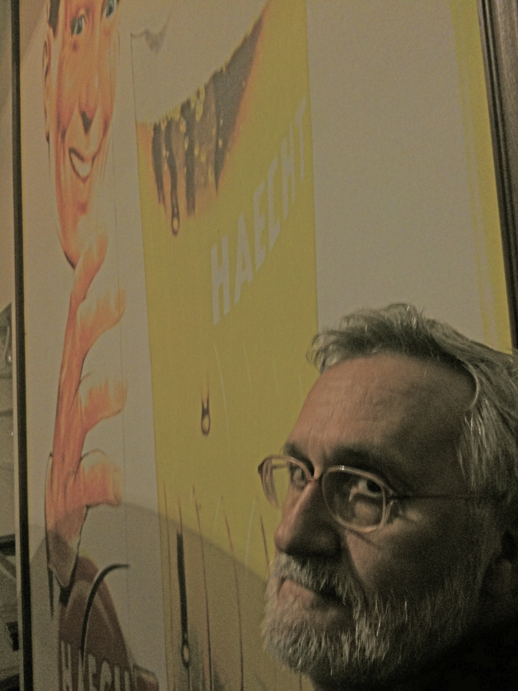

::: {#page .hfeed .site}
[Saltar al
contenido](../../../../../index.html?p=870#content){.skip-link
.screen-reader-text}

::: {#sidebar .sidebar}
::: {.site-branding}
[{.custom-logo
width="248" height="248" sizes="(max-width: 248px) 100vw, 248px"
srcset="../../../../../wp-content/uploads/2016/04/cropped-Manneken_Pis_Blog_Bruselas_Ricardo_Imbern-248.jpg 248w, ../../../../../wp-content/uploads/2016/04/cropped-Manneken_Pis_Blog_Bruselas_Ricardo_Imbern-248-150x150.jpg 150w"}](../../../../../index.html){.custom-logo-link}

[Blog Bruselas en español](../../../../../index.html)

El blog-guía escrito por españoles en Bruselas para los hispanoparlantes
que viven aquí y para los turistas que aprovechan los vuelos baratos
para descubrir el chocolate, la cerveza, la Grand Place y tantas otras
cosas buenas.

Menú y widgets
:::

::: {#secondary .secondary}
::: {#widget-area .widget-area role="complementary"}
Blog Bruselas es {#blog-bruselas-es .widget-title}
----------------

::: {.textwidget}
Un **blog en español escrito en Bruselas** por unos enamorados de la
capital de Bélgica, corazón mágico de Europa. Una ciudad pequeña y
grande, llena de gente, comida, eventos y rincones encantadores; para
descubrir y disfrutar sin dejarse aguar la fiesta por el tiempo (no es
tan malo).

Para quienes pasan por Bruselas, porque vienen de visita, de turismo o
tienen la suerte de vivir aquí. Sí quieres conocer más que los hoteles
en Bruselas, aprovecha los vuelos baratos y **vive la ciudad**.

Blog Bruselas es el bebé de [Ramón Suárez](http://www.ramonsuarez.com),
bruseleño convencido desde 2003.
:::

Espacios de trabajo compartido {#espacios-de-trabajo-compartido .widget-title}
------------------------------

::: {.textwidget}
[Betacowork Coworking Bruselas](http://www.betacowork.com) [Mapa de
espacios de coworking en Bélgica](http://coworkingbelgium.com)
:::

Último vídeo {#último-vídeo .widget-title}
------------

Asociados con Hispagenda, la guía digital de los españoles en Bélgica {#asociados-con-hispagenda-la-guía-digital-de-los-españoles-en-bélgica .widget-title}
---------------------------------------------------------------------

::: {.textwidget}
[{.attachment-medium
width="250" height="100"}](http://www.hispagenda.com)
:::

Más sobre Bruselas en otros idiomas {#más-sobre-bruselas-en-otros-idiomas .widget-title}
-----------------------------------

::: {.textwidget}
[Agenda.be](http://www.agenda.be) FR NL\
[Bruxelles Blog](http://www.bxlblog.be/) FR\
[Eventos para emprendedores y freelance en
Bruselas](http://www.betacowork.com/events/)\
[The Network
Brussels](http://groups.yahoo.com/group/TheNetworkBrussels/) EN\
[What\'s up in Belgium](http://www.whatsupin.be/) EN
:::

Más sobre Bélgica en Español {#más-sobre-bélgica-en-español .widget-title}
----------------------------

::: {.textwidget}
[Spaniards en Bélgica](http://www.spaniards.es/paises/belgica)
:::
:::
:::
:::

::: {#content .site-content}
::: {#primary .content-area}
::: {#main .site-main role="main"}
Visitantes Bruselienses {#visitantes-bruselienses .entry-title}
=======================

::: {.entry-content}
El escritor gallego [Xavier Alcalá](http://xavieralcala.org/) lleva
varios años viniendo a Bruselas con bastante frecuencia y por largas
temporadas. Hombre curtido en mil batallas es además un contador de
historias irreverente y sin complejos. Tan pronto como llega y, sin
tiempo para que digas nada, ya te está contando una historia. La de ayer
fue la vida de un emigrante gallego en Venezuela que acababa de visitar
en la aldea de Teilán (Lugo). Propietario de un burdel en Caracas,
asciende a Inspector de Seguridad del Estado pues el director visitaba
con frecuencia su establecimiento....luego conoce a [Henri
Charrière](http://es.wikipedia.org/wiki/Henri_Charri%C3%A8re) (autor de
Papillon) que venia de escaparse de la Isla del Diablo donde cumplía
condena....No sigo, simplemente os pongo una foto por si acaso os
cruzais con él. Si teneis tiempo, paraos a charlar un rato pues seguro
que os sorprende.

{.alignnone
.size-full .wp-image-871 width="477" height="637"
sizes="(max-width: 477px) 100vw, 477px"
srcset="../../../../../wp-content/uploads/2009/11/IMG_0006.JPG 1536w, ../../../../../wp-content/uploads/2009/11/IMG_0006-112x150.jpg 112w, ../../../../../wp-content/uploads/2009/11/IMG_0006-225x300.jpg 225w, ../../../../../wp-content/uploads/2009/11/IMG_0006-768x1024.jpg 768w"}

::: {.yarpp-related .yarpp-related-none}
Parece que no hay ningún artículo relacionado en Blog Bruselas
:::
:::

::: {.author-info}
Publicado por {#publicado-por .author-heading}
-------------

::: {.author-avatar}
{.avatar
.avatar-56 .photo width="56" height="56"
srcset="http://2.gravatar.com/avatar/2b02ff76fdfd0b21c2d44cbc7c363ac5?s=112&d=blank&r=pg 2x"}
:::

::: {.author-description}
### Manuel Pueyo {#manuel-pueyo .author-title}

Manuel Pueyo. Licenciado en Derecho. Ha trabajado en comunicación web
para las instituciones europeas en empresas como Tipik o Scholz &
Friends. En paralelo, se lia organizando eventos y fiestas así como
diversos proyectos de cooperación cultural internacional. Mas
información en www.oole.eu. [Ver todas las entradas de Manuel
Pueyo](../../../../author/easysun/index.html){.author-link}
:::
:::

[[Publicado el
]{.screen-reader-text}[24/11/200924/11/2009](../../../../../index.html?p=870)]{.posted-on}[[[Autor
]{.screen-reader-text}[Manuel
Pueyo](../../../../author/easysun/index.html){.url .fn .n}]{.author
.vcard}]{.byline}[[Categorías
]{.screen-reader-text}[Artes](../../../../category/artes/index.html),
[Entrevistas](../../../../category/entrevistas/index.html)]{.cat-links}[[Etiquetas
]{.screen-reader-text}[alcala](../../../../tag/alcala/index.html),
[charriere](../../../../tag/charriere/index.html),
[escritor](../../../../tag/escritor/index.html),
[henri](../../../../tag/henri/index.html),
[venezuela](../../../../tag/venezuela/index.html),
[xavier](../../../../tag/xavier/index.html)]{.tags-links}

::: {#disqus_thread}
::: {#dsq-content}
-   ::: {#dsq-comment-985}
    ::: {#dsq-comment-header-985 .dsq-comment-header}
    [Mone Fernandez]{#dsq-author-user-985}
    :::

    ::: {#dsq-comment-body-985 .dsq-comment-body}
    ::: {#dsq-comment-message-985 .dsq-comment-message}
    Me ha encantado tanto la foto como el comentario, su final me ha
    parecido de lo más original.
    :::
    :::
    :::

-   ::: {#dsq-comment-986}
    ::: {#dsq-comment-header-986 .dsq-comment-header}
    [Manuel Pueyo](http://www.oole.eu){#dsq-author-user-986}
    :::

    ::: {#dsq-comment-body-986 .dsq-comment-body}
    ::: {#dsq-comment-message-986 .dsq-comment-message}
    un beso mamá
    :::
    :::
    :::

-   ::: {#dsq-comment-987}
    ::: {#dsq-comment-header-987 .dsq-comment-header}
    [Cantabro](http://alquilarpisosuances.blogspot.com){#dsq-author-user-987}
    :::

    ::: {#dsq-comment-body-987 .dsq-comment-body}
    ::: {#dsq-comment-message-987 .dsq-comment-message}
    Pero seguro que para conocer a toda esa gente hay que viajar
    muuuucho, para ello tener dinero y, muy importante, tiempo.
    :::
    :::
    :::

-   ::: {#dsq-comment-988}
    ::: {#dsq-comment-header-988 .dsq-comment-header}
    [manuel]{#dsq-author-user-988}
    :::

    ::: {#dsq-comment-body-988 .dsq-comment-body}
    ::: {#dsq-comment-message-988 .dsq-comment-message}
    o dormir poco. que no es mi caso 🙂
    :::
    :::
    :::
:::
:::

Navegación de entradas {#navegación-de-entradas .screen-reader-text}
----------------------

::: {.nav-links}
::: {.nav-previous}
[[Anterior]{.meta-nav aria-hidden="true"} [Entrada
anterior:]{.screen-reader-text} [Nuevos
medios]{.post-title}](../../../../../index.html?p=868)
:::

::: {.nav-next}
[[Siguiente]{.meta-nav aria-hidden="true"} [Entrada
siguiente:]{.screen-reader-text} [Street Art en
Beursschowburg]{.post-title}](../../../../../index.html?p=883)
:::
:::
:::
:::
:::

::: {.site-info}
[Creado con WordPress](https://es.wordpress.org/)
:::
:::
