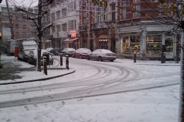
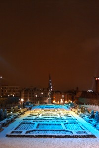
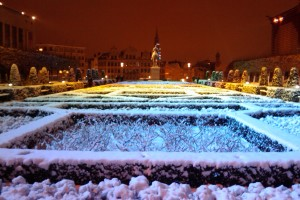

::: {#page .hfeed .site}
[Saltar al
contenido](../../../../../index.html?p=1049#content){.skip-link
.screen-reader-text}

::: {#sidebar .sidebar}
::: {.site-branding}
[{.custom-logo
width="248" height="248" sizes="(max-width: 248px) 100vw, 248px"
srcset="../../../../../wp-content/uploads/2016/04/cropped-Manneken_Pis_Blog_Bruselas_Ricardo_Imbern-248.jpg 248w, ../../../../../wp-content/uploads/2016/04/cropped-Manneken_Pis_Blog_Bruselas_Ricardo_Imbern-248-150x150.jpg 150w"}](../../../../../index.html){.custom-logo-link}

[Blog Bruselas en español](../../../../../index.html)

El blog-guía escrito por españoles en Bruselas para los hispanoparlantes
que viven aquí y para los turistas que aprovechan los vuelos baratos
para descubrir el chocolate, la cerveza, la Grand Place y tantas otras
cosas buenas.

Menú y widgets
:::

::: {#secondary .secondary}
::: {#widget-area .widget-area role="complementary"}
Blog Bruselas es {#blog-bruselas-es .widget-title}
----------------

::: {.textwidget}
Un **blog en español escrito en Bruselas** por unos enamorados de la
capital de Bélgica, corazón mágico de Europa. Una ciudad pequeña y
grande, llena de gente, comida, eventos y rincones encantadores; para
descubrir y disfrutar sin dejarse aguar la fiesta por el tiempo (no es
tan malo).

Para quienes pasan por Bruselas, porque vienen de visita, de turismo o
tienen la suerte de vivir aquí. Sí quieres conocer más que los hoteles
en Bruselas, aprovecha los vuelos baratos y **vive la ciudad**.

Blog Bruselas es el bebé de [Ramón Suárez](http://www.ramonsuarez.com),
bruseleño convencido desde 2003.
:::

Espacios de trabajo compartido {#espacios-de-trabajo-compartido .widget-title}
------------------------------

::: {.textwidget}
[Betacowork Coworking Bruselas](http://www.betacowork.com) [Mapa de
espacios de coworking en Bélgica](http://coworkingbelgium.com)
:::

Último vídeo {#último-vídeo .widget-title}
------------

Asociados con Hispagenda, la guía digital de los españoles en Bélgica {#asociados-con-hispagenda-la-guía-digital-de-los-españoles-en-bélgica .widget-title}
---------------------------------------------------------------------

::: {.textwidget}
[{.attachment-medium
width="250" height="100"}](http://www.hispagenda.com)
:::

Más sobre Bruselas en otros idiomas {#más-sobre-bruselas-en-otros-idiomas .widget-title}
-----------------------------------

::: {.textwidget}
[Agenda.be](http://www.agenda.be) FR NL\
[Bruxelles Blog](http://www.bxlblog.be/) FR\
[Eventos para emprendedores y freelance en
Bruselas](http://www.betacowork.com/events/)\
[The Network
Brussels](http://groups.yahoo.com/group/TheNetworkBrussels/) EN\
[What\'s up in Belgium](http://www.whatsupin.be/) EN
:::

Más sobre Bélgica en Español {#más-sobre-bélgica-en-español .widget-title}
----------------------------

::: {.textwidget}
[Spaniards en Bélgica](http://www.spaniards.es/paises/belgica)
:::
:::
:::
:::

::: {#content .site-content}
::: {#primary .content-area}
::: {#main .site-main role="main"}
Nieve en Bruselas {#nieve-en-bruselas .entry-title}
=================

::: {.entry-content}
Está cayendo una **nevada de las gordas en Bruselas**. ¿Que os parece si
relanzamos el **meme Nieve en Bruselas** como hicimos [a principios de
este
año](http://www.blogbruselas.com/2009/01/nieve-en-bruselas.html "Nieve en Bruselas 2008")?
Carlos ha comenzado a subir fotos de la [primera
nevada](http://www.flickr.com/photos/woppercyb/4200137593/ "Fotos de nieve en Bruselas, por Carlos, alias Woper")
de estas navidades y yo voy a hacer lo mismo aquí:

[{.aligncenter
.size-medium .wp-image-1052 width="300" height="200"
sizes="(max-width: 300px) 100vw, 300px"
srcset="../../../../../wp-content/uploads/2009/12/Esta_nevando_en_bruselas-300x200.jpg 300w, ../../../../../wp-content/uploads/2009/12/Esta_nevando_en_bruselas-150x100.jpg 150w, ../../../../../wp-content/uploads/2009/12/Esta_nevando_en_bruselas-1024x682.jpg 1024w"}](../../../../../wp-content/uploads/2009/12/Esta_nevando_en_bruselas.jpg)

[{.aligncenter
.size-medium .wp-image-1051 width="200" height="300"
sizes="(max-width: 200px) 100vw, 200px"
srcset="../../../../../wp-content/uploads/2009/12/arbol_nevado_ulb_bruselas-200x300.jpg 200w, ../../../../../wp-content/uploads/2009/12/arbol_nevado_ulb_bruselas-100x150.jpg 100w, ../../../../../wp-content/uploads/2009/12/arbol_nevado_ulb_bruselas-682x1024.jpg 682w, ../../../../../wp-content/uploads/2009/12/arbol_nevado_ulb_bruselas.jpg 1344w"}](../../../../../wp-content/uploads/2009/12/arbol_nevado_ulb_bruselas.jpg)

[{.aligncenter
.size-medium .wp-image-1054 width="300" height="225"
sizes="(max-width: 300px) 100vw, 300px"
srcset="../../../../../wp-content/uploads/2009/12/Nevando_patio_atras_tejados_Bruselas-300x225.jpg 300w, ../../../../../wp-content/uploads/2009/12/Nevando_patio_atras_tejados_Bruselas-150x112.jpg 150w, ../../../../../wp-content/uploads/2009/12/Nevando_patio_atras_tejados_Bruselas-1024x768.jpg 1024w"}](../../../../../wp-content/uploads/2009/12/Nevando_patio_atras_tejados_Bruselas.JPG)

[{.aligncenter
.size-medium .wp-image-1053 width="200" height="300"
sizes="(max-width: 200px) 100vw, 200px"
srcset="../../../../../wp-content/uploads/2009/12/Mont_des_arts_noche_de_nieve_y_color-200x300.jpg 200w, ../../../../../wp-content/uploads/2009/12/Mont_des_arts_noche_de_nieve_y_color-100x150.jpg 100w, ../../../../../wp-content/uploads/2009/12/Mont_des_arts_noche_de_nieve_y_color-682x1024.jpg 682w, ../../../../../wp-content/uploads/2009/12/Mont_des_arts_noche_de_nieve_y_color.jpg 1344w"}](../../../../../wp-content/uploads/2009/12/Mont_des_arts_noche_de_nieve_y_color.jpg)

[{.aligncenter
.size-medium .wp-image-1055 width="300" height="200"
sizes="(max-width: 300px) 100vw, 300px"
srcset="../../../../../wp-content/uploads/2009/12/Noche_magica_de_luces_y_nieve_en_el_jardin_Mont_des_Arts_-300x200.jpg 300w, ../../../../../wp-content/uploads/2009/12/Noche_magica_de_luces_y_nieve_en_el_jardin_Mont_des_Arts_-150x100.jpg 150w, ../../../../../wp-content/uploads/2009/12/Noche_magica_de_luces_y_nieve_en_el_jardin_Mont_des_Arts_-1024x682.jpg 1024w"}](../../../../../wp-content/uploads/2009/12/Noche_magica_de_luces_y_nieve_en_el_jardin_Mont_des_Arts_.jpg)

La nieve queda muy bonita en las fotos, sobre todo en las del Mont des
Arts con tanto color proyectado sobre ellas, pero el culetazo que me dí
bajando las escaleras casi me quita las ganas de publicarlas. Mis
zapatos no eran para nada adecuados a un día de hielo y nieve.

La vez pasada también publicaron fotos
[Antonio](http://zugaldia.wordpress.com/2009/01/28/nieve-en-bruselas/ "Antonio and the snow in Brussels")
y
[Hector](http://nosolocoles.blogspot.com/2009/01/nieve-en-bruselas.html "Nieve en los parques de Bruselas, enero 2009").
Por supuesto, la iniciativa está abierta a cualquier ciudad, así que si
os parece **poned *Nieve en SITIO* como título y un enlace a este
mensaje** para que aparezca el enlace a vuestro blog en los comentarios
de la entrada. Eduardo ya ha publicado algunas fotos de [nieve en
Amberes](http://earcos.posterous.com/nieve-en-amberes "Nieve en Amberes, Eduardo Arcos").

Lástima no tener un trineo a mano...

::: {.yarpp-related .yarpp-related-none}
Parece que no hay ningún artículo relacionado en Blog Bruselas
:::
:::

::: {.author-info}
Publicado por {#publicado-por .author-heading}
-------------

::: {.author-avatar}
{.avatar
.avatar-56 .photo width="56" height="56"
srcset="http://1.gravatar.com/avatar/df8036046c12f28446f55958f197ed7d?s=112&d=blank&r=pg 2x"}
:::

::: {.author-description}
### Ramón Suárez {#ramón-suárez .author-title}

Soy un español que tiene la suerte de llevar disfrutando Bruselas desde
septiembre de 2003. Llegué para un trabajo temporal, como tantos, y
acabé quedándome. Este blog comenzó como una aventura personal para ir
transformándose poco a poco en una especie de diario o [guía de
Bruselas](../../../../../index.html), abierta a otros autores y en la
que tratamos de mostrar cosas que hacer y ver en esta pequeña gran
ciudad, cada uno con nuestra visión personal. En los ratos ocupados soy
un profesional del marketing y la estrategia de negocios en Internet.
Como no, también he comenzado un blog profesional sobre temas de
[marketing y empresariado en Internet](http://ramonsuarez.com). Podéis
encontrarme en Twitter con estas dos cuentas que muestran dos perfiles
perfiles: [\@blogbruselas](http://twitter.com/blogbruselas) y
[\@ramonsuarez](http://twitter.com/ramonsuarez). **Sí tienes preguntas
sobre Bruselas es mejor que las hagas en la página de [Blog Bruselas en
Facebook](http://www.facebook.com/blogbruselas)**. Somos más de mil y
tendrás muchas más personas que podrán ayudarte. Si quieres ponerte en
contacto conmigo para colaborar con el blog, enviar información o
hacerte esponsor de [Blog Bruselas](../../../../../index.html), manda un
correo electrónico a blogbruselas arrobado en gmail con un puntito com.
[Ver todas las entradas de Ramón
Suárez](../../../../2010/04/30/index.html?author=2){.author-link}
:::
:::

[[Publicado el
]{.screen-reader-text}[20/12/200921/12/2009](../../../../../index.html?p=1049)]{.posted-on}[[[Autor
]{.screen-reader-text}[Ramón
Suárez](../../../../2010/04/30/index.html?author=2){.url .fn
.n}]{.author .vcard}]{.byline}[[Categorías ]{.screen-reader-text}[Gran
Bruselas](../../../../category/gran-bruselas/index.html)]{.cat-links}

::: {#disqus_thread}
::: {#dsq-content}
-   ::: {#dsq-comment-1067}
    ::: {#dsq-comment-header-1067 .dsq-comment-header}
    [zeta](http://zugaldia.net){#dsq-author-user-1067}
    :::

    ::: {#dsq-comment-body-1067 .dsq-comment-body}
    ::: {#dsq-comment-message-1067 .dsq-comment-message}
    Este año no me pilla en Bruselas, pero podéis ver como es una nevada
    en la capital del imperio:
    <http://zugaldia.wordpress.com/2009/12/19/snowstorm/>

    Un abrazo bruselienses!
    :::
    :::
    :::

-   ::: {#dsq-comment-1068}
    ::: {#dsq-comment-header-1068 .dsq-comment-header}
    [Wopper]{#dsq-author-user-1068}
    :::

    ::: {#dsq-comment-body-1068 .dsq-comment-body}
    ::: {#dsq-comment-message-1068 .dsq-comment-message}
    He actualizado mi cuenta flickr con nuevas fotos de la nevada:
    <http://www.flickr.com/photos/woppercyb/>
    :::
    :::
    :::

-   ::: {#dsq-comment-1069}
    ::: {#dsq-comment-header-1069 .dsq-comment-header}
    [SAndel](http://www.twitter.com/sandel){#dsq-author-user-1069}
    :::

    ::: {#dsq-comment-body-1069 .dsq-comment-body}
    ::: {#dsq-comment-message-1069 .dsq-comment-message}
    En el parque del Cincuentenario este domingo 20/12/09 😉\
    <http://twitpic.com/udbzw>
    :::
    :::
    :::

-   ::: {#dsq-comment-1070}
    ::: {#dsq-comment-header-1070 .dsq-comment-header}
    [Sorokin](http://diriodeunaburrido.blogspot.com/){#dsq-author-user-1070}
    :::

    ::: {#dsq-comment-body-1070 .dsq-comment-body}
    ::: {#dsq-comment-message-1070 .dsq-comment-message}
    Está todo muy bonito, pero yo me he pillado un catarro de los de no
    te menées.
    :::
    :::
    :::

-   ::: {#dsq-comment-1071}
    ::: {#dsq-comment-header-1071 .dsq-comment-header}
    [Manuel Pueyo](http://www.oole.eu){#dsq-author-user-1071}
    :::

    ::: {#dsq-comment-body-1071 .dsq-comment-body}
    ::: {#dsq-comment-message-1071 .dsq-comment-message}
    que bonito... la verdad es que prefiero verla en fotos.

    un abrazo
    :::
    :::
    :::

-   ::: {#dsq-comment-1072}
    ::: {#dsq-comment-header-1072 .dsq-comment-header}
    [Sinuhe]{#dsq-author-user-1072}
    :::

    ::: {#dsq-comment-body-1072 .dsq-comment-body}
    ::: {#dsq-comment-message-1072 .dsq-comment-message}
    Cuidado con esos resbalones. Suerte tienes de que eres aún un
    "pibito", como dicen en mis islas. Los culetazos a mis años suelen
    tener peores consecuencias, porque uno se ha vuelto como de
    porcelana...
    :::
    :::

    -   ::: {#dsq-comment-1074}
        ::: {#dsq-comment-header-1074 .dsq-comment-header}
        [Ramón
        Suárez](http://twitter.com/ramonsuarez){#dsq-author-user-1074}
        :::

        ::: {#dsq-comment-body-1074 .dsq-comment-body}
        ::: {#dsq-comment-message-1074 .dsq-comment-message}
        Tan solo herí mi orgullo 😉
        :::
        :::
        :::
    :::

-   ::: {#dsq-comment-1073}
    ::: {#dsq-comment-header-1073 .dsq-comment-header}
    [Ramón
    Suárez](http://twitter.com/ramonsuarez){#dsq-author-user-1073}
    :::

    ::: {#dsq-comment-body-1073 .dsq-comment-body}
    ::: {#dsq-comment-message-1073 .dsq-comment-message}
    Vaya zurrón de fotos chulas 🙂
    :::
    :::
    :::

-   ::: {#dsq-comment-1075}
    ::: {#dsq-comment-header-1075 .dsq-comment-header}
    [Sorokin]{#dsq-author-user-1075}
    :::

    ::: {#dsq-comment-body-1075 .dsq-comment-body}
    ::: {#dsq-comment-message-1075 .dsq-comment-message}
    Como no oy a ser menos, ahí van mis fotos:

    <http://diriodeunaburrido.blogspot.com/2009/12/el-nevadon-del-siglo-en-bruselas.html>
    :::
    :::
    :::

-   ::: {#dsq-comment-1151}
    ::: {#dsq-comment-header-1151 .dsq-comment-header}
    [Rosa J.C.](http://www.rosajc.com){#dsq-author-user-1151}
    :::

    ::: {#dsq-comment-body-1151 .dsq-comment-body}
    ::: {#dsq-comment-message-1151 .dsq-comment-message}
    Chulísimas las fotos, Ramón. Besos.
    :::
    :::
    :::

-   ::: {#dsq-comment-1152}
    ::: {#dsq-comment-header-1152 .dsq-comment-header}
    [Ramón
    Suárez](http://twitter.com/ramonsuarez){#dsq-author-user-1152}
    :::

    ::: {#dsq-comment-body-1152 .dsq-comment-body}
    ::: {#dsq-comment-message-1152 .dsq-comment-message}
    Gracias Rosa. Obesotes 🙂
    :::
    :::
    :::
:::
:::

Navegación de entradas {#navegación-de-entradas .screen-reader-text}
----------------------

::: {.nav-links}
::: {.nav-previous}
[[Anterior]{.meta-nav aria-hidden="true"} [Entrada
anterior:]{.screen-reader-text} [Cursos de Gallego en
Bruselas]{.post-title}](../../../../../index.html?p=1037)
:::

::: {.nav-next}
[[Siguiente]{.meta-nav aria-hidden="true"} [Entrada
siguiente:]{.screen-reader-text} [Leonidas no acierta con su publicidad
para navidad]{.post-title}](../../../../../index.html?p=1064)
:::
:::
:::
:::
:::

::: {.site-info}
[Creado con WordPress](https://es.wordpress.org/)
:::
:::
