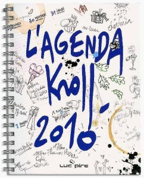

::: {#page .hfeed .site}
[Saltar al
contenido](../../../../../index.html?p=1144#content){.skip-link
.screen-reader-text}

::: {#sidebar .sidebar}
::: {.site-branding}
[{.custom-logo
width="248" height="248" sizes="(max-width: 248px) 100vw, 248px"
srcset="../../../../../wp-content/uploads/2016/04/cropped-Manneken_Pis_Blog_Bruselas_Ricardo_Imbern-248.jpg 248w, ../../../../../wp-content/uploads/2016/04/cropped-Manneken_Pis_Blog_Bruselas_Ricardo_Imbern-248-150x150.jpg 150w"}](../../../../../index.html){.custom-logo-link}

[Blog Bruselas en español](../../../../../index.html)

El blog-guía escrito por españoles en Bruselas para los hispanoparlantes
que viven aquí y para los turistas que aprovechan los vuelos baratos
para descubrir el chocolate, la cerveza, la Grand Place y tantas otras
cosas buenas.

Menú y widgets
:::

::: {#secondary .secondary}
::: {#widget-area .widget-area role="complementary"}
Blog Bruselas es {#blog-bruselas-es .widget-title}
----------------

::: {.textwidget}
Un **blog en español escrito en Bruselas** por unos enamorados de la
capital de Bélgica, corazón mágico de Europa. Una ciudad pequeña y
grande, llena de gente, comida, eventos y rincones encantadores; para
descubrir y disfrutar sin dejarse aguar la fiesta por el tiempo (no es
tan malo).

Para quienes pasan por Bruselas, porque vienen de visita, de turismo o
tienen la suerte de vivir aquí. Sí quieres conocer más que los hoteles
en Bruselas, aprovecha los vuelos baratos y **vive la ciudad**.

Blog Bruselas es el bebé de [Ramón Suárez](http://www.ramonsuarez.com),
bruseleño convencido desde 2003.
:::

Espacios de trabajo compartido {#espacios-de-trabajo-compartido .widget-title}
------------------------------

::: {.textwidget}
[Betacowork Coworking Bruselas](http://www.betacowork.com) [Mapa de
espacios de coworking en Bélgica](http://coworkingbelgium.com)
:::

Último vídeo {#último-vídeo .widget-title}
------------

Asociados con Hispagenda, la guía digital de los españoles en Bélgica {#asociados-con-hispagenda-la-guía-digital-de-los-españoles-en-bélgica .widget-title}
---------------------------------------------------------------------

::: {.textwidget}
[{.attachment-medium
width="250" height="100"}](http://www.hispagenda.com)
:::

Más sobre Bruselas en otros idiomas {#más-sobre-bruselas-en-otros-idiomas .widget-title}
-----------------------------------

::: {.textwidget}
[Agenda.be](http://www.agenda.be) FR NL\
[Bruxelles Blog](http://www.bxlblog.be/) FR\
[Eventos para emprendedores y freelance en
Bruselas](http://www.betacowork.com/events/)\
[The Network
Brussels](http://groups.yahoo.com/group/TheNetworkBrussels/) EN\
[What\'s up in Belgium](http://www.whatsupin.be/) EN
:::

Más sobre Bélgica en Español {#más-sobre-bélgica-en-español .widget-title}
----------------------------

::: {.textwidget}
[Spaniards en Bélgica](http://www.spaniards.es/paises/belgica)
:::
:::
:::
:::

::: {#content .site-content}
::: {#primary .content-area}
::: {#main .site-main role="main"}
Concurso: el chiste más malo {#concurso-el-chiste-más-malo .entry-title}
============================

::: {.entry-content}
Gracias a Laure tenemos una agenda
[Kroll](http://kroll.be/ "Kroll es un dibujante humorístico que suele encontrarse en los periódicos belgas.")
2010 grande para regalar al lector o lectora de Blog Bruselas que cuente
el chiste más malo en un comentario a esta entrada.

{.aligncenter
.size-medium .wp-image-1145 width="242" height="300"
sizes="(max-width: 242px) 100vw, 242px"
srcset="../../../../../wp-content/uploads/2010/01/agenda_kroll_2010-242x300.jpg 242w, ../../../../../wp-content/uploads/2010/01/agenda_kroll_2010-121x150.jpg 121w, ../../../../../wp-content/uploads/2010/01/agenda_kroll_2010.jpg 582w"}

El plazo para presentar los peores chistes del mundo acaba el sábado 9
de enero de 2010. Se admiten multiples chistes. El único requisito es
que cuando dejéis el comentario pongáis vuestro nombre o alias y un
email de contacto en sus respectivos campos del formulario de
comentarios (no en el cuerpo del mensaje).

Pierre Kroll tiene su gracia. A mi me gusta bastante. Sí no le conocéis,
creo que este vídeo os puede dar una idea del personaje (entra en escena
en el segundo 46):\

\

No te funciona el flash, majete

\

::: {.yarpp-related .yarpp-related-none}
Parece que no hay ningún artículo relacionado en Blog Bruselas
:::
:::

::: {.author-info}
Publicado por {#publicado-por .author-heading}
-------------

::: {.author-avatar}
{.avatar
.avatar-56 .photo width="56" height="56"
srcset="http://1.gravatar.com/avatar/df8036046c12f28446f55958f197ed7d?s=112&d=blank&r=pg 2x"}
:::

::: {.author-description}
### Ramón Suárez {#ramón-suárez .author-title}

Soy un español que tiene la suerte de llevar disfrutando Bruselas desde
septiembre de 2003. Llegué para un trabajo temporal, como tantos, y
acabé quedándome. Este blog comenzó como una aventura personal para ir
transformándose poco a poco en una especie de diario o [guía de
Bruselas](../../../../../index.html), abierta a otros autores y en la
que tratamos de mostrar cosas que hacer y ver en esta pequeña gran
ciudad, cada uno con nuestra visión personal. En los ratos ocupados soy
un profesional del marketing y la estrategia de negocios en Internet.
Como no, también he comenzado un blog profesional sobre temas de
[marketing y empresariado en Internet](http://ramonsuarez.com). Podéis
encontrarme en Twitter con estas dos cuentas que muestran dos perfiles
perfiles: [\@blogbruselas](http://twitter.com/blogbruselas) y
[\@ramonsuarez](http://twitter.com/ramonsuarez). **Sí tienes preguntas
sobre Bruselas es mejor que las hagas en la página de [Blog Bruselas en
Facebook](http://www.facebook.com/blogbruselas)**. Somos más de mil y
tendrás muchas más personas que podrán ayudarte. Si quieres ponerte en
contacto conmigo para colaborar con el blog, enviar información o
hacerte esponsor de [Blog Bruselas](../../../../../index.html), manda un
correo electrónico a blogbruselas arrobado en gmail con un puntito com.
[Ver todas las entradas de Ramón
Suárez](../../../04/30/index.html?author=2){.author-link}
:::
:::

[[Publicado el
]{.screen-reader-text}[05/01/201022/01/2010](../../../../../index.html?p=1144)]{.posted-on}[[[Autor
]{.screen-reader-text}[Ramón
Suárez](../../../04/30/index.html?author=2){.url .fn .n}]{.author
.vcard}]{.byline}[[Categorías
]{.screen-reader-text}[Humor](../../../../category/humor/index.html)]{.cat-links}[[Etiquetas
]{.screen-reader-text}[agenda
2010](../../../../tag/agenda-2010/index.html), [blagues pourries en
espagnol](../../../../tag/blagues-pourries-en-espagnol/index.html),
[chistes malos](../../../../tag/chistes-malos/index.html),
[concurso](../../../../tag/concurso/index.html), [Pierre
Kroll](../../../../tag/pierre-kroll/index.html)]{.tags-links}

::: {#disqus_thread}
::: {#dsq-content}
-   ::: {#dsq-comment-1104}
    ::: {#dsq-comment-header-1104 .dsq-comment-header}
    [Josel3](http://josel3.blogspot.com){#dsq-author-user-1104}
    :::

    ::: {#dsq-comment-body-1104 .dsq-comment-body}
    ::: {#dsq-comment-message-1104 .dsq-comment-message}
    Por fin un concurso en el que puedo participar ! xDDD

    "Entra un playmobil a un bar y dice:\
    -- Una fanta!\
    -- De naranja o de limón?\
    -- Me da igual, me la voy a terminar echando por encima de todos
    modos..."

    😀
    :::
    :::
    :::

-   ::: {#dsq-comment-1105}
    ::: {#dsq-comment-header-1105 .dsq-comment-header}
    [Ramón
    Suárez](http://twitter.com/ramonsuarez){#dsq-author-user-1105}
    :::

    ::: {#dsq-comment-body-1105 .dsq-comment-body}
    ::: {#dsq-comment-message-1105 .dsq-comment-message}
    ¡Pegando fuerte!
    :::
    :::
    :::

-   ::: {#dsq-comment-1110}
    ::: {#dsq-comment-header-1110 .dsq-comment-header}
    [Jorge]{#dsq-author-user-1110}
    :::

    ::: {#dsq-comment-body-1110 .dsq-comment-body}
    ::: {#dsq-comment-message-1110 .dsq-comment-message}
    Bueno, pues com cuanto peor sea más opciones tengo, ahí va (léase
    rápido y sin pensar):

    -- Doctor, doctor! Que me quemé!\
    -- Que te que te?
    :::
    :::
    :::

-   ::: {#dsq-comment-1113}
    ::: {#dsq-comment-header-1113 .dsq-comment-header}
    [Bea]{#dsq-author-user-1113}
    :::

    ::: {#dsq-comment-body-1113 .dsq-comment-body}
    ::: {#dsq-comment-message-1113 .dsq-comment-message}
    Doctor, doctor! dígame usted, ¿qué padezco?

    -pues, permítame, padece uztez un ozito!

    Juas juas jua juas
    :::
    :::
    :::

-   ::: {#dsq-comment-1115}
    ::: {#dsq-comment-header-1115 .dsq-comment-header}
    [Ramón
    Suárez](http://twitter.com/ramonsuarez){#dsq-author-user-1115}
    :::

    ::: {#dsq-comment-body-1115 .dsq-comment-body}
    ::: {#dsq-comment-message-1115 .dsq-comment-message}
    Fuera de concurso:

    To be or not to be.\
    To be is to do.\
    Do be do be do...
    :::
    :::
    :::

-   ::: {#dsq-comment-1116}
    ::: {#dsq-comment-header-1116 .dsq-comment-header}
    [Wopper]{#dsq-author-user-1116}
    :::

    ::: {#dsq-comment-body-1116 .dsq-comment-body}
    ::: {#dsq-comment-message-1116 .dsq-comment-message}
    ¿Qué le dice un https a un http? Me siento seguroooooooooooooooo
    :::
    :::
    :::

-   ::: {#dsq-comment-1117}
    ::: {#dsq-comment-header-1117 .dsq-comment-header}
    [Ramón
    Suárez](http://twitter.com/ramonsuarez){#dsq-author-user-1117}
    :::

    ::: {#dsq-comment-body-1117 .dsq-comment-body}
    ::: {#dsq-comment-message-1117 .dsq-comment-message}
    Sois de lo peor. ¡Seguid así! XD
    :::
    :::
    :::

-   ::: {#dsq-comment-1118}
    ::: {#dsq-comment-header-1118 .dsq-comment-header}
    [SONIA]{#dsq-author-user-1118}
    :::

    ::: {#dsq-comment-body-1118 .dsq-comment-body}
    ::: {#dsq-comment-message-1118 .dsq-comment-message}
    ¿Qué hace un arquitecto en el baño?

    Un pisito.
    :::
    :::
    :::

-   ::: {#dsq-comment-1119}
    ::: {#dsq-comment-header-1119 .dsq-comment-header}
    [Ramón
    Suárez](http://twitter.com/ramonsuarez){#dsq-author-user-1119}
    :::

    ::: {#dsq-comment-body-1119 .dsq-comment-body}
    ::: {#dsq-comment-message-1119 .dsq-comment-message}
    ¡Sonia! publica otro con tu email en el formulario, que si ganas no
    hay forma de ponerse en contacto para mandarte el premio 🙂
    :::
    :::
    :::

-   ::: {#dsq-comment-1120}
    ::: {#dsq-comment-header-1120 .dsq-comment-header}
    [zeta](http://zugaldia.net){#dsq-author-user-1120}
    :::

    ::: {#dsq-comment-body-1120 .dsq-comment-body}
    ::: {#dsq-comment-message-1120 .dsq-comment-message}
    Esto era un hombre que cada dos por tres... ¡seis!
    :::
    :::
    :::

-   ::: {#dsq-comment-1121}
    ::: {#dsq-comment-header-1121 .dsq-comment-header}
    [zeta](http://zugaldia.net){#dsq-author-user-1121}
    :::

    ::: {#dsq-comment-body-1121 .dsq-comment-body}
    ::: {#dsq-comment-message-1121 .dsq-comment-message}
    -- Hombre, Manolo, ¡qué alegría! ¡cuánto tiempo sin verte! Cuéntame,
    ¿qué es de tu vida?\
    -- Sí, claro, ¡que te entretenga tu puta madre!

    (lo siento, lo siento, no pude evitar mi ración de malafollá
    granaína!)
    :::
    :::

    -   ::: {#dsq-comment-1125}
        ::: {#dsq-comment-header-1125 .dsq-comment-header}
        [Almudena](http://palabrasyasi@blogspot.com){#dsq-author-user-1125}
        :::

        ::: {#dsq-comment-body-1125 .dsq-comment-body}
        ::: {#dsq-comment-message-1125 .dsq-comment-message}
        Este es muy bueno..;No ganaras!!!!!!
        :::
        :::

        -   ::: {#dsq-comment-1126}
            ::: {#dsq-comment-header-1126 .dsq-comment-header}
            [zeta](http://zugaldia.net){#dsq-author-user-1126}
            :::

            ::: {#dsq-comment-body-1126 .dsq-comment-body}
            ::: {#dsq-comment-message-1126 .dsq-comment-message}
            Pero el otro no me negarás que era malísimo! Como el tuyo 😉
            :::
            :::
            :::

        -   ::: {#dsq-comment-1127}
            ::: {#dsq-comment-header-1127 .dsq-comment-header}
            [Almudena](http://palabrasyasi@blogspot.com){#dsq-author-user-1127}
            :::

            ::: {#dsq-comment-body-1127 .dsq-comment-body}
            ::: {#dsq-comment-message-1127 .dsq-comment-message}
            Pues sí era malo. No lo niego... Pero el mio el peor...
            Ganaré?
            :::
            :::
            :::
        :::
    :::

-   ::: {#dsq-comment-1123}
    ::: {#dsq-comment-header-1123 .dsq-comment-header}
    [Ramón
    Suárez](http://twitter.com/ramonsuarez){#dsq-author-user-1123}
    :::

    ::: {#dsq-comment-body-1123 .dsq-comment-body}
    ::: {#dsq-comment-message-1123 .dsq-comment-message}
    *Me se sartan lah lagrimitah*
    :::
    :::
    :::

-   ::: {#dsq-comment-1124}
    ::: {#dsq-comment-header-1124 .dsq-comment-header}
    [Almudena](http://palabrasyasi@blogspot.com){#dsq-author-user-1124}
    :::

    ::: {#dsq-comment-body-1124 .dsq-comment-body}
    ::: {#dsq-comment-message-1124 .dsq-comment-message}
    uno muy malo que me contaron de pequeña mi primo que era muy
    gracioso.

    Dos gitanos que tienen mucha hambre van a la misa. Lleva el momento
    de comulgar y primero pasa uno al volver le pregunta el segundo:\
    -Qué te ha dao el cura\
    -Una hostia- responde el otro\
    -Bien que te ha caio jodio por sacarle la lengua !!

    ja jaj ajaj

    Malisimo verdad.

    Feliz año a todos
    :::
    :::
    :::

-   ::: {#dsq-comment-1129}
    ::: {#dsq-comment-header-1129 .dsq-comment-header}
    [CAR]{#dsq-author-user-1129}
    :::

    ::: {#dsq-comment-body-1129 .dsq-comment-body}
    ::: {#dsq-comment-message-1129 .dsq-comment-message}
    Se encuentran dos amigos que hace tiempo no se ven y entablan una
    conversación:

    -¡Hombre Manolo! ¿Cómo está tu mujer?

    Y Manolo contesta:

    -- ¿Comparada a quién?
    :::
    :::
    :::

-   ::: {#dsq-comment-1135}
    ::: {#dsq-comment-header-1135 .dsq-comment-header}
    [mari]{#dsq-author-user-1135}
    :::

    ::: {#dsq-comment-body-1135 .dsq-comment-body}
    ::: {#dsq-comment-message-1135 .dsq-comment-message}
    Entra un hombre a un bar de Pinchos y ...... ayyyyyyyyy huyyyyyyyyy
    ayyyy ayyy ayyyy
    :::
    :::
    :::

-   ::: {#dsq-comment-1136}
    ::: {#dsq-comment-header-1136 .dsq-comment-header}
    [PabloElFlamenco](http://pabloelflamenco.blogspot.com/){#dsq-author-user-1136}
    :::

    ::: {#dsq-comment-body-1136 .dsq-comment-body}
    ::: {#dsq-comment-message-1136 .dsq-comment-message}
    Otra vez, participé en un concurso de malos chistes...miré a mi
    calendiario y...¡era el diez de enero!\
    (ha haaaah, ho ho ho, er...) disculpame.
    :::
    :::

    -   ::: {#dsq-comment-1137}
        ::: {#dsq-comment-header-1137 .dsq-comment-header}
        [zeta](http://zugaldia.net){#dsq-author-user-1137}
        :::

        ::: {#dsq-comment-body-1137 .dsq-comment-body}
        ::: {#dsq-comment-message-1137 .dsq-comment-message}
        Ahora que aprendí a decir almenaque, resulta que le dicen
        candelario!
        :::
        :::

        -   ::: {#dsq-comment-1139}
            ::: {#dsq-comment-header-1139 .dsq-comment-header}
            [mari]{#dsq-author-user-1139}
            :::

            ::: {#dsq-comment-body-1139 .dsq-comment-body}
            ::: {#dsq-comment-message-1139 .dsq-comment-message}
            yo me sabia la versión: ahora que se decir "penícula" lo
            llaman "teleflin" jajajaja
            :::
            :::
            :::
        :::
    :::

-   ::: {#dsq-comment-1160}
    ::: {#dsq-comment-header-1160 .dsq-comment-header}
    [Ramón
    Suárez](http://twitter.com/ramonsuarez){#dsq-author-user-1160}
    :::

    ::: {#dsq-comment-body-1160 .dsq-comment-body}
    ::: {#dsq-comment-message-1160 .dsq-comment-message}
    El jurado está decidiendo... está complicada la cosa. Os habéis
    lucido, ¡menuda panda! 😉
    :::
    :::
    :::

-   ::: {#dsq-comment-1161}
    ::: {#dsq-comment-header-1161 .dsq-comment-header}
    [Ramón
    Suárez](http://twitter.com/ramonsuarez){#dsq-author-user-1161}
    :::

    ::: {#dsq-comment-body-1161 .dsq-comment-body}
    ::: {#dsq-comment-message-1161 .dsq-comment-message}
    La cosa queda reducida a dos. El resto no ha puesto el email en el
    formulario de contacto: \#megafail. Lástima, porque los hay podridos
    de malos.

    **Los comentarios se dejan abiertos para seguir contando chistes
    malos**, para que os vayáis entrenando 😀
    :::
    :::
    :::

-   ::: {#dsq-comment-1162}
    ::: {#dsq-comment-header-1162 .dsq-comment-header}
    [Ramón
    Suárez](http://twitter.com/ramonsuarez){#dsq-author-user-1162}
    :::

    ::: {#dsq-comment-body-1162 .dsq-comment-body}
    ::: {#dsq-comment-message-1162 .dsq-comment-message}
    Anunciado [el
    ganador](http://www.blogbruselas.com/2010/01/ganador-del-concurso-de-chistes-malos.html).
    :::
    :::
    :::

-   ::: {#dsq-comment-1174}
    ::: {#dsq-comment-header-1174 .dsq-comment-header}
    [AHI VA EL PEOR CHISTE DEL MUNDO (creacion
    propia)]{#dsq-author-user-1174}
    :::

    ::: {#dsq-comment-body-1174 .dsq-comment-body}
    ::: {#dsq-comment-message-1174 .dsq-comment-message}
    Están dos amigos discutiendo y dice uno:\
    -- Aquí o follamos todos o la puta al río.\
    Y dice el otro:\
    -- Pues la puta al río!
    :::
    :::
    :::

-   ::: {#dsq-comment-1180}
    ::: {#dsq-comment-header-1180 .dsq-comment-header}
    [Mary]{#dsq-author-user-1180}
    :::

    ::: {#dsq-comment-body-1180 .dsq-comment-body}
    ::: {#dsq-comment-message-1180 .dsq-comment-message}
    No entiendo el último :S ¿alguien me lo explica?
    :::
    :::
    :::

-   ::: {#dsq-comment-1182}
    ::: {#dsq-comment-header-1182 .dsq-comment-header}
    [Ramón
    Suárez](http://twitter.com/ramonsuarez){#dsq-author-user-1182}
    :::

    ::: {#dsq-comment-body-1182 .dsq-comment-body}
    ::: {#dsq-comment-message-1182 .dsq-comment-message}
    Más que un chiste es un ensayo sobre la misogínica masculinidad del
    macho ibérico ;P
    :::
    :::
    :::
:::
:::

Navegación de entradas {#navegación-de-entradas .screen-reader-text}
----------------------

::: {.nav-links}
::: {.nav-previous}
[[Anterior]{.meta-nav aria-hidden="true"} [Entrada
anterior:]{.screen-reader-text} [Pobre toro de
Bilbao]{.post-title}](../../../../../index.html?p=1128)
:::

::: {.nav-next}
[[Siguiente]{.meta-nav aria-hidden="true"} [Entrada
siguiente:]{.screen-reader-text} [Maratón Milenium este domingo en
Bruselas]{.post-title}](../../../../../index.html?p=1151)
:::
:::
:::
:::
:::

::: {.site-info}
[Creado con WordPress](https://es.wordpress.org/)
:::
:::
