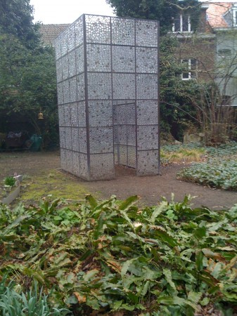
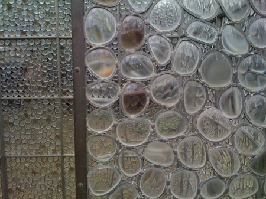

::: {#page .hfeed .site}
[Saltar al
contenido](../../../../../index.html?p=1810#content){.skip-link
.screen-reader-text}

::: {#sidebar .sidebar}
::: {.site-branding}
[{.custom-logo
width="248" height="248" sizes="(max-width: 248px) 100vw, 248px"
srcset="../../../../../wp-content/uploads/2016/04/cropped-Manneken_Pis_Blog_Bruselas_Ricardo_Imbern-248.jpg 248w, ../../../../../wp-content/uploads/2016/04/cropped-Manneken_Pis_Blog_Bruselas_Ricardo_Imbern-248-150x150.jpg 150w"}](../../../../../index.html){.custom-logo-link}

[Blog Bruselas en español](../../../../../index.html)

El blog-guía escrito por españoles en Bruselas para los hispanoparlantes
que viven aquí y para los turistas que aprovechan los vuelos baratos
para descubrir el chocolate, la cerveza, la Grand Place y tantas otras
cosas buenas.

Menú y widgets
:::

::: {#secondary .secondary}
::: {#widget-area .widget-area role="complementary"}
Blog Bruselas es {#blog-bruselas-es .widget-title}
----------------

::: {.textwidget}
Un **blog en español escrito en Bruselas** por unos enamorados de la
capital de Bélgica, corazón mágico de Europa. Una ciudad pequeña y
grande, llena de gente, comida, eventos y rincones encantadores; para
descubrir y disfrutar sin dejarse aguar la fiesta por el tiempo (no es
tan malo).

Para quienes pasan por Bruselas, porque vienen de visita, de turismo o
tienen la suerte de vivir aquí. Sí quieres conocer más que los hoteles
en Bruselas, aprovecha los vuelos baratos y **vive la ciudad**.

Blog Bruselas es el bebé de [Ramón Suárez](http://www.ramonsuarez.com),
bruseleño convencido desde 2003.
:::

Espacios de trabajo compartido {#espacios-de-trabajo-compartido .widget-title}
------------------------------

::: {.textwidget}
[Betacowork Coworking Bruselas](http://www.betacowork.com) [Mapa de
espacios de coworking en Bélgica](http://coworkingbelgium.com)
:::

Último vídeo {#último-vídeo .widget-title}
------------

Asociados con Hispagenda, la guía digital de los españoles en Bélgica {#asociados-con-hispagenda-la-guía-digital-de-los-españoles-en-bélgica .widget-title}
---------------------------------------------------------------------

::: {.textwidget}
[{.attachment-medium
width="250" height="100"}](http://www.hispagenda.com)
:::

Más sobre Bruselas en otros idiomas {#más-sobre-bruselas-en-otros-idiomas .widget-title}
-----------------------------------

::: {.textwidget}
[Agenda.be](http://www.agenda.be) FR NL\
[Bruxelles Blog](http://www.bxlblog.be/) FR\
[Eventos para emprendedores y freelance en
Bruselas](http://www.betacowork.com/events/)\
[The Network
Brussels](http://groups.yahoo.com/group/TheNetworkBrussels/) EN\
[What\'s up in Belgium](http://www.whatsupin.be/) EN
:::

Más sobre Bélgica en Español {#más-sobre-bélgica-en-español .widget-title}
----------------------------

::: {.textwidget}
[Spaniards en Bélgica](http://www.spaniards.es/paises/belgica)
:::
:::
:::
:::

::: {#content .site-content}
::: {#primary .content-area}
::: {#main .site-main role="main"}
El jardin de la casa de Erasmo {#el-jardin-de-la-casa-de-erasmo .entry-title}
==============================

::: {.entry-content}
Entre los muchos rincones agradables de Bruselas está la [Casa de
Erasmo](http://www.erasmushouse.museum/Public/Page.php?ID=4&language=spa)
y su jardín. Parece que el de Rotterdam pasó poco tiempo en ella, pero
suficiente para que, hoy, se le recuerde y se vuelva a repetir lo de que
Bélgica es un sitio de acogida. Como todos los tópicos tienen mucho de
falso, pero también mucho de realidad.\
Bueno, pero lo que yo quería decir es que el jardín es muy agradable y
además hacen cosas de vez en cuando, como exposiciones de esculturas
desde hace muchos años.\
Hace unos días estuve paseando por allí y, aparte de los narcisos
(o *jonquilles)* que se mostraban espléndidos y tal como son, vi una
"escultura" al fondo del jardín, justo detrás de la casa que me interesó
mucho.

[{.aligncenter
.size-medium .wp-image-1809 width="337" height="450"
sizes="(max-width: 337px) 100vw, 337px"
srcset="../../../../../wp-content/uploads/2010/04/IMG_0710-337x450.jpg 337w, ../../../../../wp-content/uploads/2010/04/IMG_0710-112x150.jpg 112w, ../../../../../wp-content/uploads/2010/04/IMG_0710-768x1024.jpg 768w, ../../../../../wp-content/uploads/2010/04/IMG_0710.jpg 1200w"}](http://www.blogbruselas.com/2010/04/el-jardin-de-la-casa-de-erasmo.html/img_0710)

No era la única. De hecho hay toda una instalación. Le llaman el jardín
filosófico y [varios
creadores](http://www.erasmushouse.museum/Public/Page.php?ID=142) tienen
obras allí. El cubo cristalino es obra del
catalán [Perejaume](http://es.wikipedia.org/wiki/Perejaume) y aparte su
belleza rectilínea oculta una pequeña sorpresa: el material del que está
hecho. Cuando te acercas se ve perfectamente.

[{.aligncenter
.size-medium .wp-image-1812 width="450" height="337"
sizes="(max-width: 450px) 100vw, 450px"
srcset="../../../../../wp-content/uploads/2010/04/IMG_0712-450x337.jpg 450w, ../../../../../wp-content/uploads/2010/04/IMG_0712-150x112.jpg 150w, ../../../../../wp-content/uploads/2010/04/IMG_0712-1024x768.jpg 1024w, ../../../../../wp-content/uploads/2010/04/IMG_0712.jpg 1600w"}](http://www.blogbruselas.com/2010/04/el-jardin-de-la-casa-de-erasmo.html/img_0712)

¡Cualquiera de estos días de primavera daos un paseo! Y si podéis,
acompañados. Porque como decía Erasmo "ALLÍ DÓNDE ESTÁN LOS AMIGOS, ALLÍ
ESTA LA RIQUEZA."

::: {.yarpp-related .yarpp-related-none}
Parece que no hay ningún artículo relacionado en Blog Bruselas
:::
:::

[[Publicado el
]{.screen-reader-text}[10/04/201012/04/2010](../../../../../index.html?p=1810)]{.posted-on}[[[Autor
]{.screen-reader-text}[Álvaro
Marín](../../../../../index.html?author=4){.url .fn .n}]{.author
.vcard}]{.byline}[[Categorías
]{.screen-reader-text}[Artes](../../../../category/artes/index.html),
[Gran
Bruselas](../../../../category/gran-bruselas/index.html)]{.cat-links}[[Etiquetas
]{.screen-reader-text}[casa de
erasmo](../../../../tag/casa-de-erasmo/index.html), [cubo
perejaume](../../../../tag/cubo-perejaume/index.html), [estatua
perejaume en
bruselas](../../../../tag/estatua-perejaume-en-bruselas/index.html),
[jardin filosofico
erasmo](../../../../tag/jardin-filosofico-erasmo/index.html), [jardines
de
bruselas](../../../../tag/jardines-de-bruselas/index.html)]{.tags-links}

::: {#disqus_thread}
::: {#dsq-content}
-   ::: {#dsq-comment-1337}
    ::: {#dsq-comment-header-1337 .dsq-comment-header}
    [Ramón
    Suárez](http://twitter.com/ramonsuarez){#dsq-author-user-1337}
    :::

    ::: {#dsq-comment-body-1337 .dsq-comment-body}
    ::: {#dsq-comment-message-1337 .dsq-comment-message}
    ¡Muchas gracias Álvaro! 🙂 Mola el cubo de las gafas, seguro que le
    costó unos cuantos paseos por los mercadillos de Bruselas a la
    búsqueda de material.
    :::
    :::
    :::
:::
:::

Navegación de entradas {#navegación-de-entradas .screen-reader-text}
----------------------

::: {.nav-links}
::: {.nav-previous}
[[Anterior]{.meta-nav aria-hidden="true"} [Entrada
anterior:]{.screen-reader-text} [Las bicis van en
autobus]{.post-title}](../../../../../index.html?p=1801)
:::

::: {.nav-next}
[[Siguiente]{.meta-nav aria-hidden="true"} [Entrada
siguiente:]{.screen-reader-text} [Quedan dos días para ganar las
entradas del concierto de Amparo
Sánchez]{.post-title}](../../../../../index.html?p=1820)
:::
:::
:::
:::
:::

::: {.site-info}
[Creado con WordPress](https://es.wordpress.org/)
:::
:::
