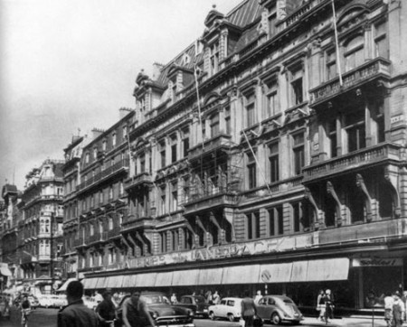
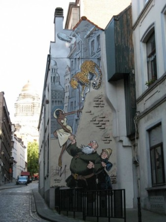
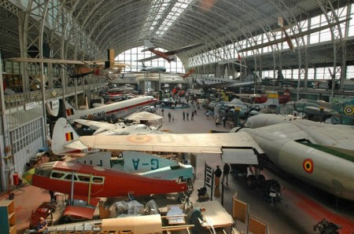

::: {#page .hfeed .site}
[Saltar al
contenido](../../../../../index.html?p=3056#content){.skip-link
.screen-reader-text}

::: {#sidebar .sidebar}
::: {.site-branding}
[{.custom-logo
width="248" height="248" sizes="(max-width: 248px) 100vw, 248px"
srcset="../../../../../wp-content/uploads/2016/04/cropped-Manneken_Pis_Blog_Bruselas_Ricardo_Imbern-248.jpg 248w, ../../../../../wp-content/uploads/2016/04/cropped-Manneken_Pis_Blog_Bruselas_Ricardo_Imbern-248-150x150.jpg 150w"}](../../../../../index.html){.custom-logo-link}

[Blog Bruselas en español](../../../../../index.html)

El blog-guía escrito por españoles en Bruselas para los hispanoparlantes
que viven aquí y para los turistas que aprovechan los vuelos baratos
para descubrir el chocolate, la cerveza, la Grand Place y tantas otras
cosas buenas.

Menú y widgets
:::

::: {#secondary .secondary}
::: {#widget-area .widget-area role="complementary"}
Blog Bruselas es {#blog-bruselas-es .widget-title}
----------------

::: {.textwidget}
Un **blog en español escrito en Bruselas** por unos enamorados de la
capital de Bélgica, corazón mágico de Europa. Una ciudad pequeña y
grande, llena de gente, comida, eventos y rincones encantadores; para
descubrir y disfrutar sin dejarse aguar la fiesta por el tiempo (no es
tan malo).

Para quienes pasan por Bruselas, porque vienen de visita, de turismo o
tienen la suerte de vivir aquí. Sí quieres conocer más que los hoteles
en Bruselas, aprovecha los vuelos baratos y **vive la ciudad**.

Blog Bruselas es el bebé de [Ramón Suárez](http://www.ramonsuarez.com),
bruseleño convencido desde 2003.
:::

Espacios de trabajo compartido {#espacios-de-trabajo-compartido .widget-title}
------------------------------

::: {.textwidget}
[Betacowork Coworking Bruselas](http://www.betacowork.com) [Mapa de
espacios de coworking en Bélgica](http://coworkingbelgium.com)
:::

Último vídeo {#último-vídeo .widget-title}
------------

Asociados con Hispagenda, la guía digital de los españoles en Bélgica {#asociados-con-hispagenda-la-guía-digital-de-los-españoles-en-bélgica .widget-title}
---------------------------------------------------------------------

::: {.textwidget}
[{.attachment-medium
width="250" height="100"}](http://www.hispagenda.com)
:::

Más sobre Bruselas en otros idiomas {#más-sobre-bruselas-en-otros-idiomas .widget-title}
-----------------------------------

::: {.textwidget}
[Agenda.be](http://www.agenda.be) FR NL\
[Bruxelles Blog](http://www.bxlblog.be/) FR\
[Eventos para emprendedores y freelance en
Bruselas](http://www.betacowork.com/events/)\
[The Network
Brussels](http://groups.yahoo.com/group/TheNetworkBrussels/) EN\
[What\'s up in Belgium](http://www.whatsupin.be/) EN
:::

Más sobre Bélgica en Español {#más-sobre-bélgica-en-español .widget-title}
----------------------------

::: {.textwidget}
[Spaniards en Bélgica](http://www.spaniards.es/paises/belgica)
:::
:::
:::
:::

::: {#content .site-content}
::: {#primary .content-area}
::: {#main .site-main role="main"}
Visitas guiadas sobre la historia de Bruselas {#visitas-guiadas-sobre-la-historia-de-bruselas .entry-title}
=============================================

::: {.entry-content}
Con el mes de septiembre llega a los países francófonos la *rentrée*,
concepto ausente en el ámbito cultural hispano si no es por la vuelta al
cole de El Corte Inglés. Lo encontramos por todas partes. En los
periódicos, por ejemplo, se nos da información sobre la rentrée
literaria, la rentrée política, la rentrée musical, la teatral... Hay
quienes incluso te la felicitan; yo ya he recibido hoy mi primera
felicitación: "Je vous souhaite une bonne rentrée 2010-11".

El [Cercle d'Histoire de
Bruxelles](http://www.bruxelles.be/artdet.cfm/5806) anuncia la suya con
tres visitas guiadas sobre diferentes aspectos de la historia
urbanísitica de Bruselas, interensantísima para comprender mejor el
lugar donde vive el Bruselita.

[{.aligncenter
.size-medium .wp-image-3057 width="450" height="362"
sizes="(max-width: 450px) 100vw, 450px"
srcset="../../../../../wp-content/uploads/2010/09/Boulevard_Ansprach-450x362.jpg 450w, ../../../../../wp-content/uploads/2010/09/Boulevard_Ansprach-150x120.jpg 150w, ../../../../../wp-content/uploads/2010/09/Boulevard_Ansprach.jpg 500w"}](http://www.blogbruselas.com/2010/09/visitas-guiadas-sobre-la-historia-de-bruselas.html/boulevard_ansprach)\
La primera de las visitas tendrá lugar el próximo sábado 25 de
septiembre a las 10 de la mañana:\
**Transformaciones urbanísticas de 1830 a 1910**\
El lugar de reunión será la estatua principal del Petit Sablon.

[{.aligncenter
.size-medium .wp-image-3060 width="337" height="450"
sizes="(max-width: 337px) 100vw, 337px"
srcset="../../../../../wp-content/uploads/2010/09/Marolles-337x450.jpg 337w, ../../../../../wp-content/uploads/2010/09/Marolles-112x150.jpg 112w, ../../../../../wp-content/uploads/2010/09/Marolles.jpg 412w"}](http://www.blogbruselas.com/2010/09/visitas-guiadas-sobre-la-historia-de-bruselas.html/marolles)\
La segunda será el 23 de octubre, también a las 10 de la mañana:\
**Marolles de otra manera**\
Lugar de reunión: iglesia de la Chapelle

[{.aligncenter
.size-medium .wp-image-3061 width="450" height="298"
sizes="(max-width: 450px) 100vw, 450px"
srcset="../../../../../wp-content/uploads/2010/09/Musée-de-lArmée-450x298.jpg 450w, ../../../../../wp-content/uploads/2010/09/Musée-de-lArmée-150x99.jpg 150w, ../../../../../wp-content/uploads/2010/09/Musée-de-lArmée.jpg 640w"}](http://www.blogbruselas.com/2010/09/visitas-guiadas-sobre-la-historia-de-bruselas.html/musee-de-larmee)\
Le tercera es la del 27 de noviembre, también a las diez de la mañana:\
**Museo del Ejército: la primera y la segunda guerra mundial**\
Lugar de reunión a la entrada del Museo

Se debe reservar plaza llamando al 022236844.\
Cada visita guiada cuesta 8 €

::: {.yarpp-related .yarpp-related-none}
Parece que no hay ningún artículo relacionado en Blog Bruselas
:::
:::

::: {.author-info}
Publicado por {#publicado-por .author-heading}
-------------

::: {.author-avatar}
{.avatar
.avatar-56 .photo width="56" height="56"
srcset="http://1.gravatar.com/avatar/469ff380e30ad7695820420904f21c64?s=112&d=blank&r=pg 2x"}
:::

::: {.author-description}
### Eduardo Lamas Delgado {#eduardo-lamas-delgado .author-title}

Historiador del arte. Bruselense español afrancesado [Ver todas las
entradas de Eduardo Lamas
Delgado](../../../../author/eduardo/index.html){.author-link}
:::
:::

[[Publicado el
]{.screen-reader-text}[02/09/2010](../../../../../index.html?p=3056)]{.posted-on}[[[Autor
]{.screen-reader-text}[Eduardo Lamas
Delgado](../../../../author/eduardo/index.html){.url .fn .n}]{.author
.vcard}]{.byline}[[Categorías
]{.screen-reader-text}[Artes](../../../../category/artes/index.html),
[Gran
Bruselas](../../../../category/gran-bruselas/index.html)]{.cat-links}

Navegación de entradas {#navegación-de-entradas .screen-reader-text}
----------------------

::: {.nav-links}
::: {.nav-previous}
[[Anterior]{.meta-nav aria-hidden="true"} [Entrada
anterior:]{.screen-reader-text} [Los tweets de Blog Bruselas: la semana
en Twitter 2010-08-28]{.post-title}](../../../../../index.html?p=3053)
:::

::: {.nav-next}
[[Siguiente]{.meta-nav aria-hidden="true"} [Entrada
siguiente:]{.screen-reader-text} [Los tweets de Blog Bruselas: la semana
en Twitter 2010-09-04]{.post-title}](../../../../../index.html?p=3067)
:::
:::
:::
:::
:::

::: {.site-info}
[Creado con WordPress](https://es.wordpress.org/)
:::
:::
