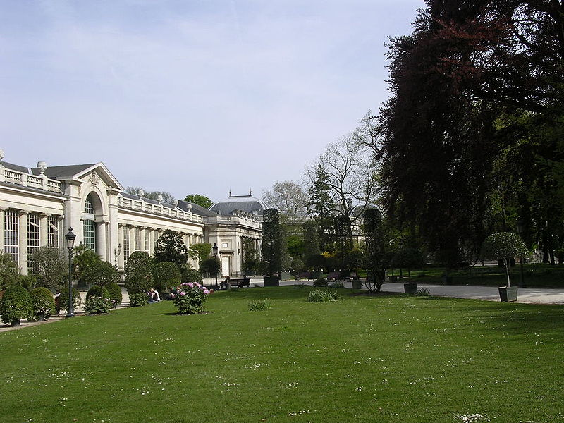

::: {#page .hfeed .site}
[Saltar al
contenido](../../../../../../index.html?p=3310#content){.skip-link
.screen-reader-text}

::: {#sidebar .sidebar}
::: {.site-branding}
[{.custom-logo
width="248" height="248" sizes="(max-width: 248px) 100vw, 248px"
srcset="../../../../../../wp-content/uploads/2016/04/cropped-Manneken_Pis_Blog_Bruselas_Ricardo_Imbern-248.jpg 248w, ../../../../../../wp-content/uploads/2016/04/cropped-Manneken_Pis_Blog_Bruselas_Ricardo_Imbern-248-150x150.jpg 150w"}](../../../../../../index.html){.custom-logo-link}

[Blog Bruselas en español](../../../../../../index.html)

El blog-guía escrito por españoles en Bruselas para los hispanoparlantes
que viven aquí y para los turistas que aprovechan los vuelos baratos
para descubrir el chocolate, la cerveza, la Grand Place y tantas otras
cosas buenas.

Menú y widgets
:::

::: {#secondary .secondary}
::: {#widget-area .widget-area role="complementary"}
Blog Bruselas es {#blog-bruselas-es .widget-title}
----------------

::: {.textwidget}
Un **blog en español escrito en Bruselas** por unos enamorados de la
capital de Bélgica, corazón mágico de Europa. Una ciudad pequeña y
grande, llena de gente, comida, eventos y rincones encantadores; para
descubrir y disfrutar sin dejarse aguar la fiesta por el tiempo (no es
tan malo).

Para quienes pasan por Bruselas, porque vienen de visita, de turismo o
tienen la suerte de vivir aquí. Sí quieres conocer más que los hoteles
en Bruselas, aprovecha los vuelos baratos y **vive la ciudad**.

Blog Bruselas es el bebé de [Ramón Suárez](http://www.ramonsuarez.com),
bruseleño convencido desde 2003.
:::

Espacios de trabajo compartido {#espacios-de-trabajo-compartido .widget-title}
------------------------------

::: {.textwidget}
[Betacowork Coworking Bruselas](http://www.betacowork.com) [Mapa de
espacios de coworking en Bélgica](http://coworkingbelgium.com)
:::

Último vídeo {#último-vídeo .widget-title}
------------

Asociados con Hispagenda, la guía digital de los españoles en Bélgica {#asociados-con-hispagenda-la-guía-digital-de-los-españoles-en-bélgica .widget-title}
---------------------------------------------------------------------

::: {.textwidget}
[{.attachment-medium
width="250" height="100"}](http://www.hispagenda.com)
:::

Más sobre Bruselas en otros idiomas {#más-sobre-bruselas-en-otros-idiomas .widget-title}
-----------------------------------

::: {.textwidget}
[Agenda.be](http://www.agenda.be) FR NL\
[Bruxelles Blog](http://www.bxlblog.be/) FR\
[Eventos para emprendedores y freelance en
Bruselas](http://www.betacowork.com/events/)\
[The Network
Brussels](http://groups.yahoo.com/group/TheNetworkBrussels/) EN\
[What\'s up in Belgium](http://www.whatsupin.be/) EN
:::

Más sobre Bélgica en Español {#más-sobre-bélgica-en-español .widget-title}
----------------------------

::: {.textwidget}
[Spaniards en Bélgica](http://www.spaniards.es/paises/belgica)
:::
:::
:::
:::

::: {#content .site-content}
::: {#primary .content-area}
::: {#main .site-main role="main"}
::: {.nav-links}
::: {.nav-previous}
[Imagen anterior](../../../../../../index.html?p=3309)
:::

::: {.nav-next}
:::
:::

800px-Royal\_Greenhouse\_of\_Laken\_2 {#px-royal_greenhouse_of_laken_2 .entry-title}
=====================================

::: {.entry-content}
::: {.entry-attachment}
{.attachment-large
.size-large width="660" height="495"
sizes="(max-width: 660px) 100vw, 660px"
srcset="../../../../../../wp-content/uploads/2011/04/800px-Royal_Greenhouse_of_Laken_2.jpg 800w, ../../../../../../wp-content/uploads/2011/04/800px-Royal_Greenhouse_of_Laken_2-150x112.jpg 150w, ../../../../../../wp-content/uploads/2011/04/800px-Royal_Greenhouse_of_Laken_2-450x337.jpg 450w"}
:::
:::

[[Publicado el
]{.screen-reader-text}[21/04/2011](../../../../../../index.html?p=3310)]{.posted-on}[[Tamaño
completo ]{.screen-reader-text}[800 ×
600](../../../../../../wp-content/uploads/2011/04/800px-Royal_Greenhouse_of_Laken_2.jpg)]{.full-size-link}

::: {#disqus_thread}
:::

Navegación de entradas {#navegación-de-entradas .screen-reader-text}
----------------------

::: {.nav-links}
::: {.nav-previous}
[[Publicado en]{.meta-nav}[Solo 15 días para visitar los Invernaderos de
Laeken]{.post-title}](../../../../../../index.html?p=3302)
:::
:::
:::
:::
:::

::: {.site-info}
[Creado con WordPress](https://es.wordpress.org/)
:::
:::
