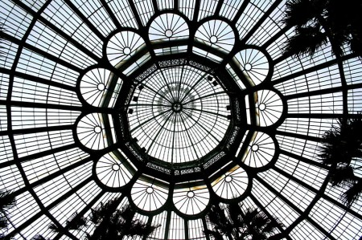
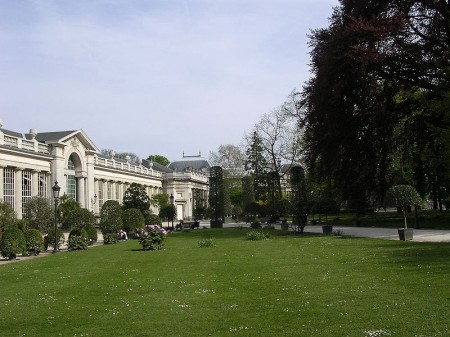

::: {#page .hfeed .site}
[Saltar al
contenido](../../../../../index.html?p=3302#content){.skip-link
.screen-reader-text}

::: {#sidebar .sidebar}
::: {.site-branding}
[{.custom-logo
width="248" height="248" sizes="(max-width: 248px) 100vw, 248px"
srcset="../../../../../wp-content/uploads/2016/04/cropped-Manneken_Pis_Blog_Bruselas_Ricardo_Imbern-248.jpg 248w, ../../../../../wp-content/uploads/2016/04/cropped-Manneken_Pis_Blog_Bruselas_Ricardo_Imbern-248-150x150.jpg 150w"}](../../../../../index.html){.custom-logo-link}

[Blog Bruselas en español](../../../../../index.html)

El blog-guía escrito por españoles en Bruselas para los hispanoparlantes
que viven aquí y para los turistas que aprovechan los vuelos baratos
para descubrir el chocolate, la cerveza, la Grand Place y tantas otras
cosas buenas.

Menú y widgets
:::

::: {#secondary .secondary}
::: {#widget-area .widget-area role="complementary"}
Blog Bruselas es {#blog-bruselas-es .widget-title}
----------------

::: {.textwidget}
Un **blog en español escrito en Bruselas** por unos enamorados de la
capital de Bélgica, corazón mágico de Europa. Una ciudad pequeña y
grande, llena de gente, comida, eventos y rincones encantadores; para
descubrir y disfrutar sin dejarse aguar la fiesta por el tiempo (no es
tan malo).

Para quienes pasan por Bruselas, porque vienen de visita, de turismo o
tienen la suerte de vivir aquí. Sí quieres conocer más que los hoteles
en Bruselas, aprovecha los vuelos baratos y **vive la ciudad**.

Blog Bruselas es el bebé de [Ramón Suárez](http://www.ramonsuarez.com),
bruseleño convencido desde 2003.
:::

Espacios de trabajo compartido {#espacios-de-trabajo-compartido .widget-title}
------------------------------

::: {.textwidget}
[Betacowork Coworking Bruselas](http://www.betacowork.com) [Mapa de
espacios de coworking en Bélgica](http://coworkingbelgium.com)
:::

Último vídeo {#último-vídeo .widget-title}
------------

Asociados con Hispagenda, la guía digital de los españoles en Bélgica {#asociados-con-hispagenda-la-guía-digital-de-los-españoles-en-bélgica .widget-title}
---------------------------------------------------------------------

::: {.textwidget}
[{.attachment-medium
width="250" height="100"}](http://www.hispagenda.com)
:::

Más sobre Bruselas en otros idiomas {#más-sobre-bruselas-en-otros-idiomas .widget-title}
-----------------------------------

::: {.textwidget}
[Agenda.be](http://www.agenda.be) FR NL\
[Bruxelles Blog](http://www.bxlblog.be/) FR\
[Eventos para emprendedores y freelance en
Bruselas](http://www.betacowork.com/events/)\
[The Network
Brussels](http://groups.yahoo.com/group/TheNetworkBrussels/) EN\
[What\'s up in Belgium](http://www.whatsupin.be/) EN
:::

Más sobre Bélgica en Español {#más-sobre-bélgica-en-español .widget-title}
----------------------------

::: {.textwidget}
[Spaniards en Bélgica](http://www.spaniards.es/paises/belgica)
:::
:::
:::
:::

::: {#content .site-content}
::: {#primary .content-area}
::: {#main .site-main role="main"}
Solo 15 días para visitar los Invernaderos de Laeken {#solo-15-días-para-visitar-los-invernaderos-de-laeken .entry-title}
====================================================

::: {.entry-content}
[{.aligncenter
.size-medium .wp-image-3309 width="412" height="274"
sizes="(max-width: 412px) 100vw, 412px"
srcset="../../../../../wp-content/uploads/2011/04/800px-Laeken_Se1aJPG-450x299.jpg 450w, ../../../../../wp-content/uploads/2011/04/800px-Laeken_Se1aJPG-150x99.jpg 150w, ../../../../../wp-content/uploads/2011/04/800px-Laeken_Se1aJPG.jpg 800w"}](../../../../../index.html?p=3309)

Desde el 15 de abril y hasta el próximo 8 de mayo, tenemos la
oportunidad de disfrutar una vez más de los Invernaderos Reales de
Laeken (*Koninklijke Serres van Laken*, *Serres Royales de Laeken*).

Como todos los años por estas fechas, este complejo arquitectónico
construido exclusivamente en cristal y metal, se abre al público para
mostrar una colección impresionante de plantas y flores exóticas, muchas
de las cuales fueros traídas por el rey Leopoldo II tras sus numerosas
expediciones a Congo.

En total, son siete invernaderos y cuentan con un superficie de 14000
m2. Fueron construidos por Alphonse Balat, profesor de Víctor Horta, y
se localizan junto al palacio de Laeken, casa habitual de los soberanos
belgas.

 

Castillo de de Laeken,\
Avenue du Parc Royal\
1020 Bruselas

[{.size-medium
.wp-image-3310 .aligncenter width="433" height="324"
sizes="(max-width: 433px) 100vw, 433px"
srcset="../../../../../wp-content/uploads/2011/04/800px-Royal_Greenhouse_of_Laken_2-450x337.jpg 450w, ../../../../../wp-content/uploads/2011/04/800px-Royal_Greenhouse_of_Laken_2-150x112.jpg 150w, ../../../../../wp-content/uploads/2011/04/800px-Royal_Greenhouse_of_Laken_2.jpg 800w"}](../../../../../index.html?p=3310)

Precio: 2,5 euros\
Menores de 18 años: gratis

Para más información:\
Palacio Real: 02/ 551 34 00\
[www.monarchie.be](http://www.monarchie.be/)

Cerrado los lunes\
Nocturnos: viernes, sábados y domingos de 20.00 -- 22.00

::: {.yarpp-related .yarpp-related-none}
Parece que no hay ningún artículo relacionado en Blog Bruselas
:::
:::

[[Publicado el
]{.screen-reader-text}[21/04/201121/04/2011](../../../../../index.html?p=3302)]{.posted-on}[[[Autor
]{.screen-reader-text}[MSB](../../../../author/mariasanchez/index.html){.url
.fn .n}]{.author .vcard}]{.byline}[[Categorías
]{.screen-reader-text}[Gran
Bruselas](../../../../category/gran-bruselas/index.html)]{.cat-links}

Navegación de entradas {#navegación-de-entradas .screen-reader-text}
----------------------

::: {.nav-links}
::: {.nav-previous}
[[Anterior]{.meta-nav aria-hidden="true"} [Entrada
anterior:]{.screen-reader-text} [Más flamenco en
Bruselas]{.post-title}](../../../../../index.html?p=3288)
:::

::: {.nav-next}
[[Siguiente]{.meta-nav aria-hidden="true"} [Entrada
siguiente:]{.screen-reader-text} [Erasmus: ganad €1000 mensuales y la
fama flamenca]{.post-title}](../../../../../index.html?p=3321)
:::
:::
:::
:::
:::

::: {.site-info}
[Creado con WordPress](https://es.wordpress.org/)
:::
:::
