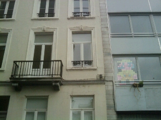

::: {#page .hfeed .site}
[Saltar al contenido](index.html#content){.skip-link
.screen-reader-text}

::: {#sidebar .sidebar}
::: {.site-branding}
[{.custom-logo
width="248" height="248" sizes="(max-width: 248px) 100vw, 248px"
srcset="../../../../../wp-content/uploads/2016/04/cropped-Manneken_Pis_Blog_Bruselas_Ricardo_Imbern-248.jpg 248w, ../../../../../wp-content/uploads/2016/04/cropped-Manneken_Pis_Blog_Bruselas_Ricardo_Imbern-248-150x150.jpg 150w"}](../../../../../index.html){.custom-logo-link}

[Blog Bruselas en español](../../../../../index.html)

El blog-guía escrito por españoles en Bruselas para los hispanoparlantes
que viven aquí y para los turistas que aprovechan los vuelos baratos
para descubrir el chocolate, la cerveza, la Grand Place y tantas otras
cosas buenas.

Menú y widgets
:::

::: {#secondary .secondary}
::: {#widget-area .widget-area role="complementary"}
Blog Bruselas es {#blog-bruselas-es .widget-title}
----------------

::: {.textwidget}
Un **blog en español escrito en Bruselas** por unos enamorados de la
capital de Bélgica, corazón mágico de Europa. Una ciudad pequeña y
grande, llena de gente, comida, eventos y rincones encantadores; para
descubrir y disfrutar sin dejarse aguar la fiesta por el tiempo (no es
tan malo).

Para quienes pasan por Bruselas, porque vienen de visita, de turismo o
tienen la suerte de vivir aquí. Sí quieres conocer más que los hoteles
en Bruselas, aprovecha los vuelos baratos y **vive la ciudad**.

Blog Bruselas es el bebé de [Ramón Suárez](http://www.ramonsuarez.com),
bruseleño convencido desde 2003.
:::

Espacios de trabajo compartido {#espacios-de-trabajo-compartido .widget-title}
------------------------------

::: {.textwidget}
[Betacowork Coworking Bruselas](http://www.betacowork.com) [Mapa de
espacios de coworking en Bélgica](http://coworkingbelgium.com)
:::

Último vídeo {#último-vídeo .widget-title}
------------

Asociados con Hispagenda, la guía digital de los españoles en Bélgica {#asociados-con-hispagenda-la-guía-digital-de-los-españoles-en-bélgica .widget-title}
---------------------------------------------------------------------

::: {.textwidget}
[{.attachment-medium
width="250" height="100"}](http://www.hispagenda.com)
:::

Más sobre Bruselas en otros idiomas {#más-sobre-bruselas-en-otros-idiomas .widget-title}
-----------------------------------

::: {.textwidget}
[Agenda.be](http://www.agenda.be) FR NL\
[Bruxelles Blog](http://www.bxlblog.be/) FR\
[Eventos para emprendedores y freelance en
Bruselas](http://www.betacowork.com/events/)\
[The Network
Brussels](http://groups.yahoo.com/group/TheNetworkBrussels/) EN\
[What\'s up in Belgium](http://www.whatsupin.be/) EN
:::

Más sobre Bélgica en Español {#más-sobre-bélgica-en-español .widget-title}
----------------------------

::: {.textwidget}
[Spaniards en Bélgica](http://www.spaniards.es/paises/belgica)
:::
:::
:::
:::

::: {#content .site-content}
::: {#primary .section .content-area}
::: {#main .site-main role="main"}
Categoría: Artes {#categoría-artes .page-title}
================

::: {.taxonomy-description}
Todo lo relacionado con las artes en sentido amplio: música, cine,
teatro, literatura, fotografía, arquitectura, diseño...
:::

[Conferencia de Ricardo Menendez Salmón el 28 de Mayo](../../../../../index.html?p=1945) {#conferencia-de-ricardo-menendez-salmón-el-28-de-mayo .entry-title}
----------------------------------------------------------------------------------------

::: {.entry-content}
Hay muchos pilares en la literatura del asturiano Ricardo Menendez
Salmón que me parecen importantes: utilizar la narrativa para descubrir
los lugares y tradiciones de donde uno procede, descubrir nuevos autores
a traves de la literatura asi como emplear los blogs para comunicarnos
con otras personas.

{.alignnone
width="244" height="294"}

Menendez Salmón es un escritor muy interesante. Autor de libros
reconocidos como El Derrumbe. Su conferencia promete acercarnos a su
universo asi como ofrecernos una visión alternativa de la literatura
española contemporánea.

El acto tendra lugar el 28 de mayo a las 20h en la [Casa de
Asturias](http://maps.google.es/maps?f=q&hl=es&geocode=&q=casa+de+asturias,bruxelles&sll=43.333416,-5.934201&sspn=1.012865,2.471924&ie=UTF8&hq=casa+de+asturias&hnear=Bruselas,+B%C3%A9lgica&ll=50.851637,4.361658&spn=0.013303,0.038538&z=15&iwloc=A)
en Bruselas y está organizada por el colectivo
[ASBRU](http://asbru.blogspot.com/).
:::

[[Publicado el
]{.screen-reader-text}[12/05/2010](../../../../../index.html?p=1945)]{.posted-on}[[[Autor
]{.screen-reader-text}[Manuel
Pueyo](../../../../author/easysun/index.html){.url .fn .n}]{.author
.vcard}]{.byline}[[Categorías
]{.screen-reader-text}[Artes](../../index.html)]{.cat-links}[[Etiquetas
]{.screen-reader-text}[asbru](../../../../tag/asbru/index.html),
[asturianos en
bruselas](../../../../tag/asturianos-en-bruselas/index.html), [casa de
asturias
bruselas](../../../../tag/casa-de-asturias-bruselas/index.html),
[conferencia menendez salmon
bruselas](../../../../tag/conferencia-menendez-salmon-bruselas/index.html),
[literatura en
bruselas](../../../../tag/literatura-en-bruselas/index.html), [menendez
salmon](../../../../tag/menendez-salmon/index.html)]{.tags-links}

[Fiesta del Iris de Bruselas: ¡a disfrutar de la calle!](../../../../../index.html?p=1938) {#fiesta-del-iris-de-bruselas-a-disfrutar-de-la-calle .entry-title}
------------------------------------------------------------------------------------------

::: {.entry-content}
[{width="402"
height="91"}](http://fetedeliris.be/2010/)\
Ya está aquí de nuevo la [**Fiesta del
Iris**](http://fetedeliris.be/2010/ "Fiesta del Iris, la fiesta de la región de Bruselas")
y con ella el magnífico domingo sin coches y lleno de cosas que hacer en
Bruselas: [**la calle se viste de
fiesta**](http://fetedeliris.be/2010/?page_id=35 "Las calles de Bruselas se visten de fiesta ").

Las [actividades comienzan el
sábado](http://fetedeliris.be/2010/?page_id=10 "Conciertos y opera el sábado en Bruselas por la fiesta del Iris")
por la noche con los **conciertos de Cristophe y Phantom feat Leo** en
la Place des Palais (frente al palacio real), además de la **proyección
de la Opera Don Quijote** en la Grand place.

Pero lo mejor viene el domingo por las calles del centro de Bruselas y
sin coches. ¡Una maravilla, oiga! El [programa de actividades de **La
calle en
fiesta**](http://fetedeliris.be/2010/?page_id=35 "Programa de actividades de la calle en fiesta, región de Bruselas")
está cargadito de cosas buenas para grandes y pequeños. Además están los
**[Encuetros
musicales](http://fetedeliris.be/2010/?page_id=31 "Encuentros musicales de la fiesta del Iris de la región de Bruselas"):
Pic-nic electrónico, Aperitivos urbanos y el Escenario rock**. De once
de la mañana a seis de la tarde habrá una exposición de los muebles del
**[diseñador Alain
Gilles](http://www.alaingilles.com/ "Alain Gilles, diseñador de Bruselas, Bélgica")**
en el parque del Mont des Arts.

**[Más
conciertos](http://fetedeliris.be/2010/?page_id=17 "Los conciertos del domingo de la Fête del Iris en Bruselas")**
desde las siete de la tarde: **Nouvelle vague, Yodélice y Bacon Caravan
Creek**.

¡Viva Bruselas!
:::

[[Publicado el
]{.screen-reader-text}[08/05/201007/05/2010](../../../../../index.html?p=1938)]{.posted-on}[[[Autor
]{.screen-reader-text}[Ramón
Suárez](../../../../2010/04/30/index.html?author=2){.url .fn
.n}]{.author .vcard}]{.byline}[[Categorías
]{.screen-reader-text}[Artes](../../index.html), [Gran
Bruselas](../../../gran-bruselas/index.html)]{.cat-links}[[Etiquetas
]{.screen-reader-text}[conciertos en la fiesta de
Bruselas](../../../../tag/conciertos-en-la-fiesta-de-bruselas/index.html),
[domingo sin coches en
Bruselas](../../../../tag/domingo-sin-coches-en-bruselas/index.html),
[fiesta del Iris de
Bruselas](../../../../tag/fiesta-del-iris-de-bruselas/index.html),
[fiesta en las calles de
Bruselas](../../../../tag/fiesta-en-las-calles-de-bruselas/index.html),
[música en las calles de
Bruselas](../../../../tag/musica-en-las-calles-de-bruselas/index.html)]{.tags-links}

[Jueves 6 Mayo: Presentación del nuevo Libro "Cartas Marcadas" de Xavier Queipo](../../../../../index.html?p=1897) {#jueves-6-mayo-presentación-del-nuevo-libro-cartas-marcadas-de-xavier-queipo .entry-title}
------------------------------------------------------------------------------------------------------------------

::: {.entry-content}
[Xavier Queipo](http://www.xavierqueipo.com) es escritor en lengua
gallega. Tiene gran reconocimiento de crítica y público en Galicia y por
méritos propios se ha asegurado un lugar en la última narrativa gallega.
Desde 1989 reside en Bruselas. Enlazo a un texto escrito en castellano
sobre [el rio de
Bruselas.](http://www.xavierqueipo.com/textos/t_espanhol/txt_xeral.html)

{.alignnone
width="382" height="287"}

El jueves presenta en la [Libreria
Orfeu](http://maps.google.com/maps?f=q&source=s_q&hl=en&geocode=&q=rue+du+taciturne+43+bruxelles&sll=37.0625,-95.677068&sspn=31.23349,78.925781&ie=UTF8&hq=&hnear=Rue+du+Taciturne+43,+Brussels+1000+Brussels,+Brussels-Capital+Region,+Belgium&ll=50.846191,4.37921&spn=0.012139,0.038538&z=15&iwloc=A)
(epicentro indiscutible de la cultura Galaico-Portuguesa en Bruselas)
 su última novela: Cartas Marcadas. Es un acto organizado por [Couto
Mixto de Bruxelas ASBL](http://coutomixtobruxelas.blogspot.com/) y en el
que participa Victor Freixanes: Director general de [Editorial
Galaxia](http://www.editorialgalaxia.es), profesor de la Universidad de
Santiago de Compostela, miembro de la Academia Galega y gran conocedor
del pasado, presente y futuro del libro con el desafío de las nuevas
tecnologías.

El nuevo libro de Xavier Queipo establece un juego doble con el lector,
 que se trata de textos difundidos previamente en la web del [Consello
da Cultura
Galega](http://www.blogbruselas.com/blog/category/artes/page/11/www.culturagalega.org),
que se publican despues en un libro. Texto electrónico y texto impreso
para dos tipos de lectura en momentos diferentes. Copio de una de sus
entradas:

*Levo varias semanas escribindo neste blog. Pouco falei do libro en
cuestión, non sei se para abraio ou desesperación dos meus editores.
Estes escritos deberían estimular o interese do público en ler o libro,
« Cartas marcadas ». Mais se unha cousa nunca souben facer na vida
--temo que sexa tarde amais para mudar de rumbo- foi « vender » os meus
produtos. Meu pai, tivo tenda aberta en Compostela, pois tiña capacidade
para o comercio. Herdei del outras capacidades e maneiras, como comezar
todos os días cantando, mais non a habelencia para o comercio*.

Espero que Xavier siga cantando y haciendo lo que tan bien sabe hacer.
Si podemos, le echaremos una mano con el resto.
:::

[[Publicado el
]{.screen-reader-text}[04/05/2010](../../../../../index.html?p=1897)]{.posted-on}[[[Autor
]{.screen-reader-text}[Manuel
Pueyo](../../../../author/easysun/index.html){.url .fn .n}]{.author
.vcard}]{.byline}[[Categorías
]{.screen-reader-text}[Artes](../../index.html)]{.cat-links}[[Etiquetas
]{.screen-reader-text}[cartas
marcadas](../../../../tag/cartas-marcadas/index.html), [libraria
orfeu](../../../../tag/libraria-orfeu/index.html), [libreria
orfeu](../../../../tag/libreria-orfeu/index.html), [presentacion xavier
queipo
bruxelas](../../../../tag/presentacion-xavier-queipo-bruxelas/index.html),
[ultimo libro xavier
queipo](../../../../tag/ultimo-libro-xavier-queipo/index.html), [victor
freixanes en
bruselas](../../../../tag/victor-freixanes-en-bruselas/index.html),
[xavier queipo](../../../../tag/xavier-queipo/index.html), [xavier
queipo bruselas](../../../../tag/xavier-queipo-bruselas/index.html),
[xavier queipo presentacion en
bruselas](../../../../tag/xavier-queipo-presentacion-en-bruselas/index.html)]{.tags-links}

[Super Mario en Bruselas](../../../../../index.html?p=1895) {#super-mario-en-bruselas .entry-title}
-----------------------------------------------------------

::: {.entry-content}
Esta ciudad está llena de sorpresas y de gente famosa. Hoy me he
encontrado con Super Mario a punto de empezar otra de sus aventuras
saltando por las terrazas de la Place Rouppe Bruselas.

::: {align="center"}
[\
\
](../../../../../wp-content/uploads/2010/05/wpid-36.jpg)
:::
:::

[[Publicado el
]{.screen-reader-text}[03/05/201003/05/2010](../../../../../index.html?p=1895)]{.posted-on}[[[Autor
]{.screen-reader-text}[Ramón
Suárez](../../../../2010/04/30/index.html?author=2){.url .fn
.n}]{.author .vcard}]{.byline}[[Categorías
]{.screen-reader-text}[Artes](../../index.html)]{.cat-links}[[Etiquetas
]{.screen-reader-text}[arte urbano
bruselas](../../../../tag/arte-urbano-bruselas/index.html), [place
rouppe bruselas](../../../../tag/place-rouppe-bruselas/index.html),
[post-it art](../../../../tag/post-it-art/index.html), [super mario bros
en bruselas](../../../../tag/super-mario-bros-en-bruselas/index.html),
[super mario bros
post-its](../../../../tag/super-mario-bros-post-its/index.html)]{.tags-links}

[Ganadoras concurso Amparo Sánchez](../../../../../index.html?p=1866) {#ganadoras-concurso-amparo-sánchez .entry-title}
---------------------------------------------------------------------

::: {.entry-content}
[{.alignright
width="170" height="170"}](http://www.amparosanchez.info/)Se han
adjudicado las entradas y camisetas para el Concierto de Amparo Sánchez
en Bruselas. Las ganadoras del concurso han sido:

1.  **Rosita de Bruselas**: que se lo ha llevado de calle con tanto
    amigo que tiene en Facebook: 22 votos.
2.  **Macarena Rodríguez**: la bloguera de [La Oreja de
    Europa](http://laorejadeeuropa.blogspot.com "La Oreja de Europa es el blog de Macarena Rodríguez sobre política Europea desde Bruselas"),
    que se ha distanciado mucho de la tercera en liza pero es que Rosita
    ha sido mucha Rosita: 11 votos.

Todas las participantes contaron con mi voto.

Para los incrédulos incluyo la captura probatoria del murete del [grupo
de Blog Bruselas en
Facebook](http://www.facebook.com/blogbruselas "Hazte fan de Blog Bruselas en Facebook"),
al que os invito a uniros.

[{.aligncenter
.size-large .wp-image-1867 width="166" height="1024"
sizes="(max-width: 166px) 100vw, 166px"
srcset="../../../../../wp-content/uploads/2010/04/Concurso-entradas-concierto-Amparo-Sanchez-Facebook-Blog-Bruselas-166x1024.png 166w, ../../../../../wp-content/uploads/2010/04/Concurso-entradas-concierto-Amparo-Sanchez-Facebook-Blog-Bruselas-73x450.png 73w"}](../../../../../wp-content/uploads/2010/04/Concurso-entradas-concierto-Amparo-Sanchez-Facebook-Blog-Bruselas.png)

Eso sí, solo han participado chicas.**¿No hay hombres en Bruselas?**

¡Estén atentos a sus pantallas que pronto habrá más concursos!
:::

[[Publicado el
]{.screen-reader-text}[27/04/201030/04/2010](../../../../../index.html?p=1866)]{.posted-on}[[[Autor
]{.screen-reader-text}[Ramón
Suárez](../../../../2010/04/30/index.html?author=2){.url .fn
.n}]{.author .vcard}]{.byline}[[Categorías
]{.screen-reader-text}[Artes](../../index.html), [Gran
Bruselas](../../../gran-bruselas/index.html)]{.cat-links}[[Etiquetas
]{.screen-reader-text}[concierto amparo sanchez en
bruselas](../../../../tag/concierto-amparo-sanchez-en-bruselas/index.html),
[concurso blog bruselas amparo
sanchez](../../../../tag/concurso-blog-bruselas-amparo-sanchez/index.html)]{.tags-links}

Navegación de entradas {#navegación-de-entradas .screen-reader-text}
----------------------

::: {.nav-links}
[Página anterior](../10/index.html){.prev .page-numbers} [[Página
]{.meta-nav .screen-reader-text}1](../../index.html){.page-numbers}
[...]{.page-numbers .dots} [[Página ]{.meta-nav
.screen-reader-text}10](../10/index.html){.page-numbers} [[Página
]{.meta-nav .screen-reader-text}11]{.page-numbers .current} [[Página
]{.meta-nav .screen-reader-text}12](../12/index.html){.page-numbers}
[...]{.page-numbers .dots} [[Página ]{.meta-nav
.screen-reader-text}39](../39/index.html){.page-numbers} [Página
siguiente](../12/index.html){.next .page-numbers}
:::
:::
:::
:::

::: {.site-info}
[Creado con WordPress](https://es.wordpress.org/)
:::
:::
