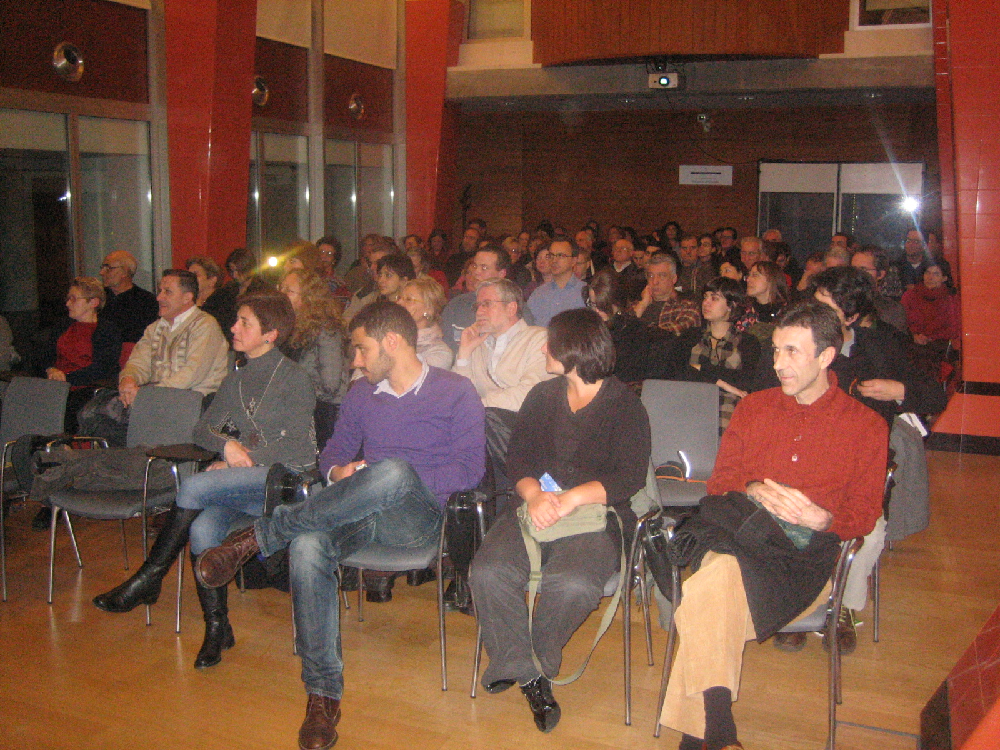
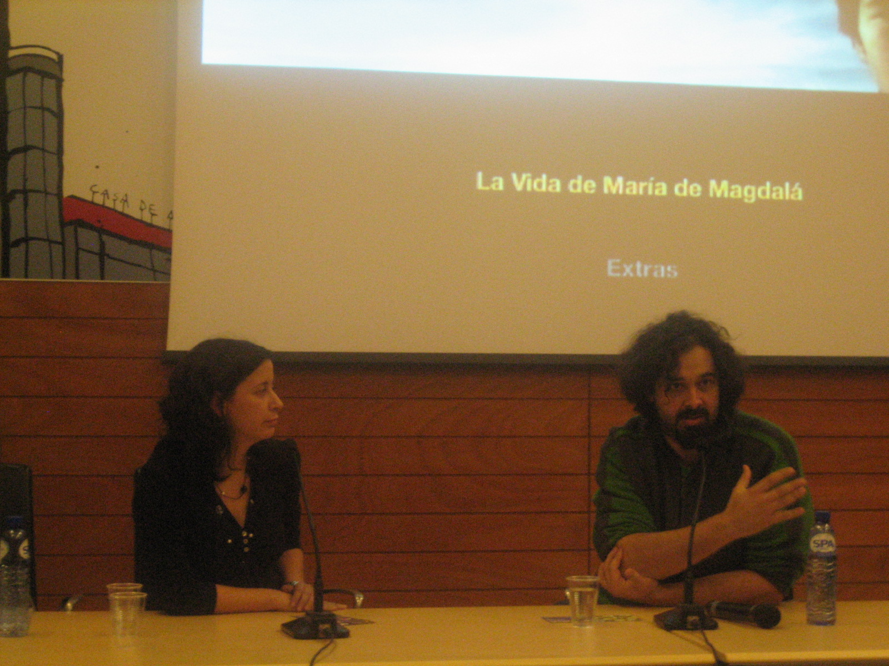

::: {#page .hfeed .site}
[Saltar al contenido](index.html#content){.skip-link
.screen-reader-text}

::: {#sidebar .sidebar}
::: {.site-branding}
[{.custom-logo
width="248" height="248" sizes="(max-width: 248px) 100vw, 248px"
srcset="../../../../../wp-content/uploads/2016/04/cropped-Manneken_Pis_Blog_Bruselas_Ricardo_Imbern-248.jpg 248w, ../../../../../wp-content/uploads/2016/04/cropped-Manneken_Pis_Blog_Bruselas_Ricardo_Imbern-248-150x150.jpg 150w"}](../../../../../index.html){.custom-logo-link}

[Blog Bruselas en español](../../../../../index.html)

El blog-guía escrito por españoles en Bruselas para los hispanoparlantes
que viven aquí y para los turistas que aprovechan los vuelos baratos
para descubrir el chocolate, la cerveza, la Grand Place y tantas otras
cosas buenas.

Menú y widgets
:::

::: {#secondary .secondary}
::: {#widget-area .widget-area role="complementary"}
Blog Bruselas es {#blog-bruselas-es .widget-title}
----------------

::: {.textwidget}
Un **blog en español escrito en Bruselas** por unos enamorados de la
capital de Bélgica, corazón mágico de Europa. Una ciudad pequeña y
grande, llena de gente, comida, eventos y rincones encantadores; para
descubrir y disfrutar sin dejarse aguar la fiesta por el tiempo (no es
tan malo).

Para quienes pasan por Bruselas, porque vienen de visita, de turismo o
tienen la suerte de vivir aquí. Sí quieres conocer más que los hoteles
en Bruselas, aprovecha los vuelos baratos y **vive la ciudad**.

Blog Bruselas es el bebé de [Ramón Suárez](http://www.ramonsuarez.com),
bruseleño convencido desde 2003.
:::

Espacios de trabajo compartido {#espacios-de-trabajo-compartido .widget-title}
------------------------------

::: {.textwidget}
[Betacowork Coworking Bruselas](http://www.betacowork.com) [Mapa de
espacios de coworking en Bélgica](http://coworkingbelgium.com)
:::

Último vídeo {#último-vídeo .widget-title}
------------

Asociados con Hispagenda, la guía digital de los españoles en Bélgica {#asociados-con-hispagenda-la-guía-digital-de-los-españoles-en-bélgica .widget-title}
---------------------------------------------------------------------

::: {.textwidget}
[{.attachment-medium
width="250" height="100"}](http://www.hispagenda.com)
:::

Más sobre Bruselas en otros idiomas {#más-sobre-bruselas-en-otros-idiomas .widget-title}
-----------------------------------

::: {.textwidget}
[Agenda.be](http://www.agenda.be) FR NL\
[Bruxelles Blog](http://www.bxlblog.be/) FR\
[Eventos para emprendedores y freelance en
Bruselas](http://www.betacowork.com/events/)\
[The Network
Brussels](http://groups.yahoo.com/group/TheNetworkBrussels/) EN\
[What\'s up in Belgium](http://www.whatsupin.be/) EN
:::

Más sobre Bélgica en Español {#más-sobre-bélgica-en-español .widget-title}
----------------------------

::: {.textwidget}
[Spaniards en Bélgica](http://www.spaniards.es/paises/belgica)
:::
:::
:::
:::

::: {#content .site-content}
::: {#primary .section .content-area}
::: {#main .site-main role="main"}
Categoría: Artes {#categoría-artes .page-title}
================

::: {.taxonomy-description}
Todo lo relacionado con las artes en sentido amplio: música, cine,
teatro, literatura, fotografía, arquitectura, diseño...
:::

[Daniel Buren en Bruselas: azul sobre amarillo](../../../../../index.html?p=1021) {#daniel-buren-en-bruselas-azul-sobre-amarillo .entry-title}
---------------------------------------------------------------------------------

::: {.entry-content}
[Daniel
Buren](http://www.danielburen.com/__db1/index_matrix_accueil.php?lang=fr)
(Boulogne-Billancourt, 1938) es el autor de la instalación permanente
'Bleus sur jaune', que decora la Place de la Justice de Bruselas desde
hace unos meses.

{width="452"
height="341"}

Foto: [Eve&Jeff](http://www.flickr.com/photos/30938700@N07/3706522231/)

Su obra más conocida son sin duda las coumnas y las fuentes del patio
del Palais-Royal en París, que quizá os suenen de los anuncios de
perfume que Inés Sastre presenta cada Navidad.

{width="401"
height="317"}

Foto: [Lycée
Daudet](http://artsplastiquesdaudet.free.fr/Galerie/galerie1/index.php)

Deben su fama a la polémica que provocaron en su momento (1985-1986),
cuando los franceses bienpensantes se escandalizaron de la afrenta hecha
a un monumento neoclásico. Sin embargo, su fama quedó confirmada con la
obtención del León de Oro en la Bienal de Venecia en el 86.

Del Palais-Royal, uno de mis sitios preferidos de París, recuerdo
siempre un vídeo sobre la polémica que me pusieron en mis clases de
francés en Málaga, donde un francesito a la moda se quejaba de que
lo escandaloso allí era ese pastiche arquitectónico que rodeaba la obra
de Buren. Me encantó ese cinismo.

Buren ha dejado en Bruselas una nueva sucesión repetitiva de elementos
arquitectónicos decorados a su vez con una sucesión repetitiva de
colores.

Se trata de ochenta y nueve mástiles amarillos de alturas variables pero
cuyos extremos aparecen todos sobre un mismo plano horizontal. A estos
mástiles van unidos unas banderolas que se mueven con el viento. Estas
banderolas presentan triángulos azules y triángulos rayados
entrecruzados. La sucesión de rayas blancas alternadas con las rayas de
color, en este caso el azul, es la marca de fábrica de Buren.

Se puede decir que, al igual que sus rayas, Buren es también un tanto
repetitivo. Véase si no su instalación de este año para
[Beaufort03](http://www.beaufort03.be/) en la playa de De Haan, cerca de
Ostende: 'Le vent souffle où il veut'.

Foto:
[Pieterbie](http://acasculpture.blogspot.com/2009_04_01_archive.html)

La instalación de Bruselas es un encargo del Comité des Arts urbains que
quería mejorar la imagen de esta plaza un tanto desangelada pero que
sirve de unión entre la ciudad vieja y los anticuarios chic del Sablón.
El nombre de Place de la Justice le viene de haberse levantado aquí en
1823 el Palacio de Justicia, hasta su demolición una vez terminada la
enormidad de Poelaert en 1883. El espacio fue muy modificado por las
obras de la 'Jonction Nord-Sud', sobre todo con la construcción del
viaducto, de 1955, en un estilo que no cuenta hoy con el apoyo del
público ni de la mayoría de los aficionados. Tiempo al tiempo.

Fuente: Raymond Balau, 'Place Bruen bleus sur jaune', en 'L'Art même',
n° 45, 2009, p. 29.
:::

[[Publicado el
]{.screen-reader-text}[14/12/200906/03/2010](../../../../../index.html?p=1021)]{.posted-on}[[[Autor
]{.screen-reader-text}[Eduardo Lamas
Delgado](../../../../author/eduardo/index.html){.url .fn .n}]{.author
.vcard}]{.byline}[[Categorías
]{.screen-reader-text}[Artes](../../index.html), [Gran
Bruselas](../../../gran-bruselas/index.html)]{.cat-links}[[Etiquetas
]{.screen-reader-text}[arquitectura](../../../../tag/arquitectura/index.html),
[arte](../../../../tag/arte/index.html), [arte
contemporáneo](../../../../tag/arte-contemporaneo/index.html), [arte
urbano](../../../../tag/arte-urbano/index.html),
[belgica](../../../../tag/belgica/index.html),
[bruselas](../../../../tag/bruselas/index.html), [daniel
buren](../../../../tag/daniel-buren/index.html),
[diseño](../../../../tag/diseno/index.html),
[urbanismo](../../../../tag/urbanismo/index.html)]{.tags-links}[[[1
comentario[ en Daniel Buren en Bruselas: azul sobre
amarillo]{.screen-reader-text}]{.dsq-postid
dsqidentifier="1021 http://www.blogbruselas.com/?p=1021"}](../../../../../index.html?p=1021#comments)]{.comments-link}

[El Grand Sablon era plano en 1615](../../../../../index.html?p=987) {#el-grand-sablon-era-plano-en-1615 .entry-title}
--------------------------------------------------------------------

::: {.entry-content}
De visita en el Museo del Prado este fin de semana, me he quedado fijado
en el cuadro del poco conocido pintor flamenco del s.XVII **[Denys van
Alsloot](http://en.wikipedia.org/wiki/Denis_van_Alsloot "Denys van Alsloot")**.
No es el detallismo de los personajes ni el hecho de que el
**[Ommegang](http://www.ommegang.be/index2.php?idx=2&lg=en)** sea una
tradición que perdura en la actualidad lo que más me ha sorprendido.
Como ciclista que pasa por el **Grand Sablon** casi a diario lo que me
sorprende es **¡que la plaza sea plana!** No todo es mas fácil en la
vida del siglo
XXI.{.alignnone
width="450" height="261"}
:::

[[Publicado el
]{.screen-reader-text}[14/12/200914/12/2009](../../../../../index.html?p=987)]{.posted-on}[[[Autor
]{.screen-reader-text}[Manuel
Pueyo](../../../../author/easysun/index.html){.url .fn .n}]{.author
.vcard}]{.byline}[[Categorías
]{.screen-reader-text}[Artes](../../index.html), [Gran
Bruselas](../../../gran-bruselas/index.html)]{.cat-links}[[Etiquetas
]{.screen-reader-text}[Denys van
Alsloot](../../../../tag/denys-van-alsloot/index.html), [Grand
Sablon](../../../../tag/grand-sablon/index.html), [Museo del
Prado](../../../../tag/museo-del-prado/index.html),
[Ommenganck](../../../../tag/ommenganck/index.html), [Tradiciones
Bruselas](../../../../tag/tradiciones-bruselas/index.html)]{.tags-links}[[[4
comentarios[ en El Grand Sablon era plano en
1615]{.screen-reader-text}]{.dsq-postid
dsqidentifier="987 http://www.blogbruselas.com/?p=987"}](../../../../../index.html?p=987#comments)]{.comments-link}

[De Ultieme Hallucinatie cierra sus puertas](../../../../../index.html?p=973) {#de-ultieme-hallucinatie-cierra-sus-puertas .entry-title}
-----------------------------------------------------------------------------

::: {.entry-content}
Hace tiempo que tengo previsto escribir una entrada sobre [De Ultieme
Hallucinatie](http://www.ultiemehallucinatie.be/index.php?LAN=fr), pero
su [cierre
definitivo](http://www.nieuwsblad.be/article/detail.aspx?articleid=GAO2FDR5P#)
ha precipitado las cosas. Éste está anunciado para el próximo viernes 18
de diciembre.

                                      [{width="384"
height="288"}](http://www.brusselnieuws.be/multimedia/images/ultiemehallucinatie.jpg/image_view_fullscreen)

Su propietario, Fred Dericks, lo abrió en 1981 y por problemas de salud
se ve obligado a cerrar. Dericks compró el [Hôtel
Cohn-Donnay](http://www.irismonument.be/fr.Saint-Josse-Ten-Noode.Rue_Royale.316.html),
que en 1904 había sido enteramente redecorado por Paul Hamesse
(1877-1956) siguiendo varias tendencias del Art nouveau.

La mayoría de los salones, con su decoración original, se alquilaban
para recepciones privadas, mientras que el jardín fue cubierto en parte
para albergar la sala de la 'brasserie'. Esta sala se amuebló con una
serie de bancos diseñados por [Henry van de
Velde](http://www.henry-van-de-velde.com/2/Van_de_Velde_facts.htm)
(1863-1957) para la [SNCB](http://www.b-rail.be/main/index.html),
mientras que la galería acristalada que comunicaba la casa con el
pabellón neclásico del jardín se ha convertido en la zona de camareros.

                     {width="324"
height="216"}

Vista de los salones en 'enfilade' dedorados por Hamesse en 1904. 

Foto: © Editions Ereme / Valentine Vermeil

          {width="200"
height="300"}

El vestíbulo y el comedor fueron decorados en un estilo modernista que
sigue los pasos del escocés Charles Rennie Mackintosh (1868-1928).

Foto: © Editions Ereme / Valentine Vermeil

               
 

Una buena parte del jardín se cubrió para instalar la sala de la
'brasserie'. Los bancos verdes son los Van de Velde (años 1930), y el
mostrador del fondo es la galería construída por Hamesse en 1904. 

Foto: © Editions Ereme / Valentine Vermeil

              {width="200"
height="300"}

Interior del pabellón neoclásico al fondo del jardín, que data de 1887.
La cúpula modernista se añadió en 1904.

Foto: © Editions Ereme / Valentine Vermeil

Dericks ha propuesto a la región de Flandes que lo adquiera para crear
una Vlaams Huis, un escaparate de la región en Bruselas, pero el
ministro de turismo considera que aún es pronto para dar una respuesta.

Quienes lo conocen saben la enorme pérdida que va a suponer para el
barrio y para toda Bruselas. Quizá algún millonario asturiano lee esto y
se decide a retomar el negocio.
:::

[[Publicado el
]{.screen-reader-text}[08/12/200914/12/2009](../../../../../index.html?p=973)]{.posted-on}[[[Autor
]{.screen-reader-text}[Eduardo Lamas
Delgado](../../../../author/eduardo/index.html){.url .fn .n}]{.author
.vcard}]{.byline}[[Categorías
]{.screen-reader-text}[Artes](../../index.html), [Comer y
beber](../../../comer-y-beber/index.html), [Gran
Bruselas](../../../gran-bruselas/index.html)]{.cat-links}[[Etiquetas
]{.screen-reader-text}[arquitectura](../../../../tag/arquitectura/index.html),
[art nouveau](../../../../tag/art-nouveau/index.html),
[arte](../../../../tag/arte/index.html),
[bar](../../../../tag/bar/index.html),
[beber](../../../../tag/beber/index.html),
[cerveza](../../../../tag/cerveza/index.html), [cocina
belga](../../../../tag/cocina-belga/index.html),
[diseño](../../../../tag/diseno/index.html),
[modernismo](../../../../tag/modernismo/index.html),
[restaurante](../../../../tag/restaurante/index.html)]{.tags-links}[[[5
comentarios[ en De Ultieme Hallucinatie cierra sus
puertas]{.screen-reader-text}]{.dsq-postid
dsqidentifier="973 http://www.blogbruselas.com/?p=973"}](../../../../../index.html?p=973#comments)]{.comments-link}

[Más sobre jazz en Bruselas: el SAZZ 'n' JAZZ music room](../../../../../index.html?p=902) {#más-sobre-jazz-en-bruselas-el-sazz-n-jazz-music-room .entry-title}
------------------------------------------------------------------------------------------

::: {.entry-content}
El [Sazz 'n' Jazz](http://www.sazznjazz.be/new/go.php?lang=fr#) , en la
periferia del barrio turco, es una sala de conciertos que se abrió
apenas el año pasado (2008), pero que ofrece un
[programa](http://www.sazznjazz.be/new/go.php?lang=fr#) de lo más
interesante. La sala está gestionada por Kultur Sanat, asociación turca
de Bruselas.

                                     

Durante la semana acoge grupos de muy buen nivel y todos los sábados
presenta en concierto un grupo turco. Además, se puede disfrutar de la
buena música con una cerveza, un vino o un picoteo a un precio correcto,
y en un cómodo sillón.

La 'music room' ocupa la planta noble de una típica casona de Bruselas,
uno de los llamados *'hôtels de maître'*. Al local se accede por la
'*porte cochère'*, la entrada de carruajes, que da a un elegante zaguán
que comunica con el vestíbulo a un lado y con el jardín al fondo. Del
vestíbulo pasamos a las clásicas tres piezas en '*enfilade', *que han
conservado su decoración original de zócalos de roble tallado y
artesonados del típico estilo 'renaissance flamande'. Detrás del
edificio se abre un amplio y agradable jardín con mesitas y bancos para
los fumadores, así como para el resto cuando ya no haga frío.

                                          

Este '*hôtel particulier'* ocupa el número 241 de la rue Royale, a pocos
pasos del [Ultieme Halluciantie](http://www.ultiemehallucinatie.be/). Y
es que este barrio, que fue hasta hace algunas décadas uno de los
más ricos de la ciudad, como lo demuestran aún sus edificios, está
experimentando últimamente una cierta 'boboïsation' o 'gentrification'
que quizá lo transforme en unos años en un nuevo Saint-Gilles -está
claro que la subida de los precios por allí obliga a los artistas
tiradillos a buscar allende-.

                                       
{width="201"
height="114"}

El café l'Âne fou, la programación de [Les
Halles](http://www.halles.be/) y  las exposiciones de
[Sint-Lukas](http://www.sintlukas.be/cms/index.php?option=com_content&view=category&layout=blog&id=76&Itemid=190)
o de la Maison des Arts nos muestran que merece la pena ir más allá del
[Botanique](http://www.botanique.be/). Bruselas no se acaba en el
triángulo Centro/Saint-Gilles/Flagey.
:::

[[Publicado el
]{.screen-reader-text}[08/12/200909/12/2009](../../../../../index.html?p=902)]{.posted-on}[[[Autor
]{.screen-reader-text}[Eduardo Lamas
Delgado](../../../../author/eduardo/index.html){.url .fn .n}]{.author
.vcard}]{.byline}[[Categorías
]{.screen-reader-text}[Artes](../../index.html), [Comer y
beber](../../../comer-y-beber/index.html), [Gran
Bruselas](../../../gran-bruselas/index.html)]{.cat-links}[[Etiquetas
]{.screen-reader-text}[arquitectura](../../../../tag/arquitectura/index.html),
[bar](../../../../tag/bar/index.html), [barrio
turco](../../../../tag/barrio-turco/index.html),
[club](../../../../tag/club/index.html),
[concierto](../../../../tag/concierto/index.html),
[jazz](../../../../tag/jazz/index.html),
[musica](../../../../tag/musica/index.html)]{.tags-links}[[[1
comentario[ en Más sobre jazz en Bruselas: el SAZZ 'n' JAZZ music
room]{.screen-reader-text}]{.dsq-postid
dsqidentifier="902 http://www.blogbruselas.com/?p=902"}](../../../../../index.html?p=902#comments)]{.comments-link}

[Brillante clausura del Festival de Cortos Asturianos](../../../../../index.html?p=888) {#brillante-clausura-del-festival-de-cortos-asturianos .entry-title}
---------------------------------------------------------------------------------------

::: {.entry-content}
Ayer estuve en la casa de Asturias en Bruselas. El festival se cerró con
una proyección de todo el trabajo de Santos Hevia. Trilogía de cortos de
gran belleza estética centrados en el Asturias rural y grabados en
asturiano. Contando historias que tocan de forma brillante la
despoblación de las aldeas rurales, la modernización o la sensación de
vacío e impunidad ante las desapariciones de víctimas de la dictadura
franquista.

{.alignnone
.size-full .wp-image-889 width="470" height="353"
sizes="(max-width: 470px) 100vw, 470px"
srcset="../../../../../wp-content/uploads/2009/11/IMG_2657.JPG 1600w, ../../../../../wp-content/uploads/2009/11/IMG_2657-150x112.jpg 150w, ../../../../../wp-content/uploads/2009/11/IMG_2657-300x225.jpg 300w, ../../../../../wp-content/uploads/2009/11/IMG_2657-1024x768.jpg 1024w"}

Asbru nos presento el estreno en Bélgica del último trabajo del autor:
La Vida de Maria de Magdalá. Aquí Santos corta con la temática rural
para ofrecernos una visión lúcido-trágica de una chica cuya inseguridad
la conduce a hacer de su vida una penitencia constante. Santos estuvo
presente y al final hubo un debate y aplausos a todo el equipo
organizador.

{.alignnone
.size-full .wp-image-890 width="470" height="353"
sizes="(max-width: 470px) 100vw, 470px"
srcset="../../../../../wp-content/uploads/2009/11/IMG_2664.JPG 1600w, ../../../../../wp-content/uploads/2009/11/IMG_2664-150x112.jpg 150w, ../../../../../wp-content/uploads/2009/11/IMG_2664-300x225.jpg 300w, ../../../../../wp-content/uploads/2009/11/IMG_2664-1024x768.jpg 1024w"}

El festival se consolida. Adquiere una madurez que le permite mirar al
futuro con optimismo y fijar horizontes más ambiciosos. Como ya viene
siendo tradición, al final hubo pinchos, risas, encuentros con gente
conocida y sobre todo muy buen ambiente.
:::

[[Publicado el
]{.screen-reader-text}[28/11/200928/11/2009](../../../../../index.html?p=888)]{.posted-on}[[[Autor
]{.screen-reader-text}[Manuel
Pueyo](../../../../author/easysun/index.html){.url .fn .n}]{.author
.vcard}]{.byline}[[Categorías
]{.screen-reader-text}[Artes](../../index.html), [Gran
Bruselas](../../../gran-bruselas/index.html)]{.cat-links}[[Etiquetas
]{.screen-reader-text}[asbru](../../../../tag/asbru/index.html),
[asturias](../../../../tag/asturias/index.html),
[cine](../../../../tag/cine/index.html), [festiva
cortos](../../../../tag/festiva-cortos/index.html), [santos
hevia](../../../../tag/santos-hevia/index.html)]{.tags-links}

Navegación de entradas {#navegación-de-entradas .screen-reader-text}
----------------------

::: {.nav-links}
[Página anterior](../18/index.html){.prev .page-numbers} [[Página
]{.meta-nav .screen-reader-text}1](../../index.html){.page-numbers}
[...]{.page-numbers .dots} [[Página ]{.meta-nav
.screen-reader-text}18](../18/index.html){.page-numbers} [[Página
]{.meta-nav .screen-reader-text}19]{.page-numbers .current} [[Página
]{.meta-nav .screen-reader-text}20](../20/index.html){.page-numbers}
[...]{.page-numbers .dots} [[Página ]{.meta-nav
.screen-reader-text}39](../39/index.html){.page-numbers} [Página
siguiente](../20/index.html){.next .page-numbers}
:::
:::
:::
:::

::: {.site-info}
[Creado con WordPress](https://es.wordpress.org/)
:::
:::
