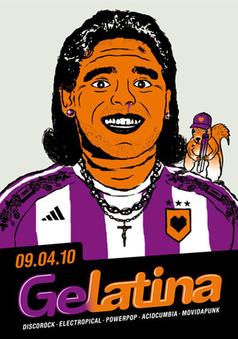

::: {#page .hfeed .site}
[Saltar al contenido](index.html#content){.skip-link
.screen-reader-text}

::: {#sidebar .sidebar}
::: {.site-branding}
[{.custom-logo
width="248" height="248" sizes="(max-width: 248px) 100vw, 248px"
srcset="../../../../../wp-content/uploads/2016/04/cropped-Manneken_Pis_Blog_Bruselas_Ricardo_Imbern-248.jpg 248w, ../../../../../wp-content/uploads/2016/04/cropped-Manneken_Pis_Blog_Bruselas_Ricardo_Imbern-248-150x150.jpg 150w"}](../../../../../index.html){.custom-logo-link}

[Blog Bruselas en español](../../../../../index.html)

El blog-guía escrito por españoles en Bruselas para los hispanoparlantes
que viven aquí y para los turistas que aprovechan los vuelos baratos
para descubrir el chocolate, la cerveza, la Grand Place y tantas otras
cosas buenas.

Menú y widgets
:::

::: {#secondary .secondary}
::: {#widget-area .widget-area role="complementary"}
Blog Bruselas es {#blog-bruselas-es .widget-title}
----------------

::: {.textwidget}
Un **blog en español escrito en Bruselas** por unos enamorados de la
capital de Bélgica, corazón mágico de Europa. Una ciudad pequeña y
grande, llena de gente, comida, eventos y rincones encantadores; para
descubrir y disfrutar sin dejarse aguar la fiesta por el tiempo (no es
tan malo).

Para quienes pasan por Bruselas, porque vienen de visita, de turismo o
tienen la suerte de vivir aquí. Sí quieres conocer más que los hoteles
en Bruselas, aprovecha los vuelos baratos y **vive la ciudad**.

Blog Bruselas es el bebé de [Ramón Suárez](http://www.ramonsuarez.com),
bruseleño convencido desde 2003.
:::

Espacios de trabajo compartido {#espacios-de-trabajo-compartido .widget-title}
------------------------------

::: {.textwidget}
[Betacowork Coworking Bruselas](http://www.betacowork.com) [Mapa de
espacios de coworking en Bélgica](http://coworkingbelgium.com)
:::

Último vídeo {#último-vídeo .widget-title}
------------

Asociados con Hispagenda, la guía digital de los españoles en Bélgica {#asociados-con-hispagenda-la-guía-digital-de-los-españoles-en-bélgica .widget-title}
---------------------------------------------------------------------

::: {.textwidget}
[{.attachment-medium
width="250" height="100"}](http://www.hispagenda.com)
:::

Más sobre Bruselas en otros idiomas {#más-sobre-bruselas-en-otros-idiomas .widget-title}
-----------------------------------

::: {.textwidget}
[Agenda.be](http://www.agenda.be) FR NL\
[Bruxelles Blog](http://www.bxlblog.be/) FR\
[Eventos para emprendedores y freelance en
Bruselas](http://www.betacowork.com/events/)\
[The Network
Brussels](http://groups.yahoo.com/group/TheNetworkBrussels/) EN\
[What\'s up in Belgium](http://www.whatsupin.be/) EN
:::

Más sobre Bélgica en Español {#más-sobre-bélgica-en-español .widget-title}
----------------------------

::: {.textwidget}
[Spaniards en Bélgica](http://www.spaniards.es/paises/belgica)
:::
:::
:::
:::

::: {#content .site-content}
::: {#primary .section .content-area}
::: {#main .site-main role="main"}
Categoría: Comer y beber {#categoría-comer-y-beber .page-title}
========================

::: {.taxonomy-description}
Todo lo relacionado con el placer de las buenas mesas, cocinas y bares
en Bruselas y alrededores. Los placeres ligados al paladar.
:::

[Ya somos 25 para la quedada del sábado](../../../../../index.html?p=1912) {#ya-somos-25-para-la-quedada-del-sábado .entry-title}
--------------------------------------------------------------------------

::: {.entry-content}
¿Te
[apuntas](http://quedada-coctelera-bruselas.eventbrite.com/ "Quedada bloguera coctelera en Bruselas")?
:::

[[Publicado el
]{.screen-reader-text}[06/05/2010](../../../../../index.html?p=1912)]{.posted-on}[[[Autor
]{.screen-reader-text}[Ramón
Suárez](../../../../2010/04/30/index.html?author=2){.url .fn
.n}]{.author .vcard}]{.byline}[[Categorías
]{.screen-reader-text}[Blogs](../../../blogs/index.html), [Comer y
beber](../../index.html)]{.cat-links}[[Etiquetas
]{.screen-reader-text}[archiduc bar de cocteles en
bruselas](../../../../tag/archiduc-bar-de-cocteles-en-bruselas/index.html),
[quedada en española en
Bruselas](../../../../tag/quedada-en-espanola-en-bruselas/index.html),
[quedada españoles en
Bruselas](../../../../tag/quedada-espanoles-en-bruselas/index.html),
[quedada hispana en
Bruselas](../../../../tag/quedada-hispana-en-bruselas/index.html)]{.tags-links}[[[2
comentarios[ en Ya somos 25 para la quedada del
sábado]{.screen-reader-text}]{.dsq-postid
dsqidentifier="1912 http://www.blogbruselas.com/?p=1912"}](../../../../../index.html?p=1912#comments)]{.comments-link}

[Quedada coctelera en Bruselas](../../../../../index.html?p=1870) {#quedada-coctelera-en-bruselas .entry-title}
-----------------------------------------------------------------

::: {.entry-content}
{.alignright
width="236" height="177"}¡Blogueras! ¡Blogueros! ¡Hispanohablantes todos
que andáis por Bruselas! *Habemus* quedada. Desde la noche de los
muertos vivientes no nos reunimos informalmente y ya va siendo hora.

Como siempre el único requisito es estar dispuesto a soportar y decir
chorradas en español y pasar una buena noche de juerga.

Así que sin más preámbulos y para todos aquellos y aquellas que tengan
ganas de echarse unas risas, queda convocada la [**quedada coctelera en
Bruselas**](http://quedada-coctelera-bruselas.eventbrite.com "Quedada española en Bruselas")
para el [**sábado 8 de mayo de 2010 a las 8 de la tarde en**
**[L'Archiduc](http://www.archiduc.net/)**
]{style="font-size: medium;"}(Rue Antoine Dansaert, 6 -- 1000 Bruselas):

[{.alignleft
width="337"
height="54"}](http://www.archiduc.be/ "Archiduc, que canalla eres")Seguimos
con nuestra tradición de descubrir sitios chulos de Bruselas para cada
quedada. El Archiduc es a nuestro buen conocer la coctelería más canalla
de Bruselas, uno de los garitos imprescindibles de la noche bruselense
cualquier día de la semana.

En esta ocasión los agitadores somos [Ramón
Suárez](http://ramonsuarez.com/) ([Blog
Bruselas](../../../../../index.html?author=2)) y [Txema
Muñoz](http://www.hispagenda.com/secciones/asbl/quienes-somos.html)
([Hispagenda](http://www.hispagenda.com/#)).

Contamos con vuestra colaboración para que la noticia llegue a todos los
rincones de Bélgica, a través de vuestros blogs, twitters, facebooks,
tuenties, spaniards, emails, sms y demás útiles de comunicación. **¡No
olvidéis [apuntaros y enlazar a la página de la
quedada](http://quedada-coctelera-bruselas.eventbrite.com "Quedada en Bruselas en español")
para que se apunte todo el mundo y podamos mandar los mensajes de
organización!**

¿Alguien se curra un logo chulo para la ocasión?
:::

[[Publicado el
]{.screen-reader-text}[28/04/201007/06/2010](../../../../../index.html?p=1870)]{.posted-on}[[[Autor
]{.screen-reader-text}[Ramón
Suárez](../../../../2010/04/30/index.html?author=2){.url .fn
.n}]{.author .vcard}]{.byline}[[Categorías
]{.screen-reader-text}[Blogs](../../../blogs/index.html), [Comer y
beber](../../index.html), [Gran
Bruselas](../../../gran-bruselas/index.html)]{.cat-links}[[Etiquetas
]{.screen-reader-text}[archiduc bar de cocteles en
bruselas](../../../../tag/archiduc-bar-de-cocteles-en-bruselas/index.html),
[españoles en
bruselas](../../../../tag/espanoles-en-bruselas/index.html), [hispanos
en bruselas](../../../../tag/hispanos-en-bruselas/index.html), [quedada
bloguera en
bruselas](../../../../tag/quedada-bloguera-en-bruselas/index.html),
[quedada bruselas en
español](../../../../tag/quedada-bruselas-en-espanol/index.html),
[quedada en bruselas](../../../../tag/quedada-en-bruselas/index.html),
[quedada española en
bruselas](../../../../tag/quedada-espanola-en-bruselas/index.html)]{.tags-links}[[[8
comentarios[ en Quedada coctelera en
Bruselas]{.screen-reader-text}]{.dsq-postid
dsqidentifier="1870 http://www.blogbruselas.com/?p=1870"}](../../../../../index.html?p=1870#comments)]{.comments-link}

[¿Llega Gelatina? ¡Anda! y fiesteamos...](../../../../../index.html?p=1780) {#llega-gelatina-anda-y-fiesteamos .entry-title}
---------------------------------------------------------------------------

::: {.entry-content}
Vuelve el calor de la mano de Gelatina dispuesto a fundir a los
humanoides con música pop (de la buena...) y ritmos vacilones del Caribe
mezclados con *sintes* y *electrobeats*.

Será este viernes 9 de abril a partir de las 23h en Club des Halles (la
parte de abajo de Halles St Gery en pleno centro de
Bruselas). Acompañando a [Ricky
Corazón](http://www.myspace.com/rickycorazon), DJ
[Lowdjo](http://lowdjo.blogspot.com/) llega con un set ecléctico
centrado en temas raros con influencias de ritmos populares en
escenarios mundiales: Tropicalia, Favela Funk, Kumbia, Mutant Hip-Hop,
Global Bass y cantados principalmente en castellano y portugués....

[{.alignnone
.size-full .wp-image-1781 width="397" height="565"
sizes="(max-width: 397px) 100vw, 397px"
srcset="../../../../../wp-content/uploads/2010/04/Gelatina-Flyer-Recto.jpg 397w, ../../../../../wp-content/uploads/2010/04/Gelatina-Flyer-Recto-105x150.jpg 105w, ../../../../../wp-content/uploads/2010/04/Gelatina-Flyer-Recto-316x450.jpg 316w"}](http://www.blogbruselas.com/2010/04/llega-gelatina-anda-y-fiesteamos.html/gelatina-flyer-recto)
:::

[[Publicado el
]{.screen-reader-text}[04/04/201005/04/2010](../../../../../index.html?p=1780)]{.posted-on}[[[Autor
]{.screen-reader-text}[Manuel
Pueyo](../../../../author/easysun/index.html){.url .fn .n}]{.author
.vcard}]{.byline}[[Categorías
]{.screen-reader-text}[Artes](../../../artes/index.html), [Comer y
beber](../../index.html)]{.cat-links}[[Etiquetas
]{.screen-reader-text}[electrocumbia](../../../../tag/electrocumbia/index.html),
[fiesta bruselas](../../../../tag/fiesta-bruselas/index.html), [fiesta
en bruselas](../../../../tag/fiesta-en-bruselas/index.html), [fiesta
latina en
bruselas](../../../../tag/fiesta-latina-en-bruselas/index.html),
[gelatina](../../../../tag/gelatina/index.html),
[lowdjo](../../../../tag/lowdjo/index.html), [musica
latina](../../../../tag/musica-latina/index.html), [musica latina en
bruselas](../../../../tag/musica-latina-en-bruselas/index.html)]{.tags-links}[[[2
comentarios[ en ¿Llega Gelatina? ¡Anda! y
fiesteamos...]{.screen-reader-text}]{.dsq-postid
dsqidentifier="1780 http://www.blogbruselas.com/?p=1780"}](../../../../../index.html?p=1780#comments)]{.comments-link}

[Viejos tiempos: hombres de verdad, cerveza de verdad](../../../../../index.html?p=1654) {#viejos-tiempos-hombres-de-verdad-cerveza-de-verdad .entry-title}
----------------------------------------------------------------------------------------

::: {.entry-content}
[{.aligncenter
.size-medium .wp-image-1655 width="450" height="360"
sizes="(max-width: 450px) 100vw, 450px"
srcset="../../../../../wp-content/uploads/2010/03/viejos-tiempos-450x360.jpg 450w, ../../../../../wp-content/uploads/2010/03/viejos-tiempos-150x120.jpg 150w, ../../../../../wp-content/uploads/2010/03/viejos-tiempos-1024x819.jpg 1024w, ../../../../../wp-content/uploads/2010/03/viejos-tiempos.jpg 1280w"}](../../../../../wp-content/uploads/2010/03/viejos-tiempos.jpg)

**¡Qué lejos quedan esos tiempos en los que los hombres de verdad bebían
cerveza de verdad!** El tipo del cartel seguro que está jubilado y sus
hijos preparando los papeles del paro... [***Vieux
Temps***](http://fr.wikipedia.org/wiki/Vieux-Temps_%28Bi%C3%A8re%29 "Cerveza Vieux Temps : viejos tiempos")
es una **cerveza de alta fermentación producida en Bruselas**. Yo soy
abstemio, así que poco más puedo añadir, pero el cartel me encantó: es
tan **retro**.
:::

[[Publicado el
]{.screen-reader-text}[03/03/2010](../../../../../index.html?p=1654)]{.posted-on}[[[Autor
]{.screen-reader-text}[Ramón
Suárez](../../../../2010/04/30/index.html?author=2){.url .fn
.n}]{.author .vcard}]{.byline}[[Categorías ]{.screen-reader-text}[Comer
y beber](../../index.html), [Comunicación y
marketing](../../../comunicacion-y-marketing/index.html)]{.cat-links}[[Etiquetas
]{.screen-reader-text}[cartel antiguo de
cerveza](../../../../tag/cartel-antiguo-de-cerveza/index.html), [cerveza
de bruselas](../../../../tag/cerveza-de-bruselas/index.html), [cerveza
vieux temps](../../../../tag/cerveza-vieux-temps/index.html), [vieux
temps
bruselas](../../../../tag/vieux-temps-bruselas/index.html)]{.tags-links}[[[4
comentarios[ en Viejos tiempos: hombres de verdad, cerveza de
verdad]{.screen-reader-text}]{.dsq-postid
dsqidentifier="1654 http://www.blogbruselas.com/?p=1654"}](../../../../../index.html?p=1654#comments)]{.comments-link}

[Restaurante Volver: este logo me dice algo](../../../../../index.html?p=1650) {#restaurante-volver-este-logo-me-dice-algo .entry-title}
------------------------------------------------------------------------------

::: {.entry-content}
[{.aligncenter
.size-medium .wp-image-1651 width="450" height="300"
sizes="(max-width: 450px) 100vw, 450px"
srcset="../../../../../wp-content/uploads/2010/03/Volver_restaurante_italiano_espanol_en_Bruselas-450x300.jpg 450w, ../../../../../wp-content/uploads/2010/03/Volver_restaurante_italiano_espanol_en_Bruselas-150x100.jpg 150w, ../../../../../wp-content/uploads/2010/03/Volver_restaurante_italiano_espanol_en_Bruselas-1024x682.jpg 1024w"}](../../../../../wp-content/uploads/2010/03/Volver_restaurante_italiano_espanol_en_Bruselas.jpg)

A mi el **logo de
[Volver](http://www.cityplug.be/fr/Bruxelles/AD7XRK74_Restaurant_Volver.html "Volver, restaurante-italiano español en Bruselas")**
me suena a algo... **¿No os hace pensar en Almodovar?** Comida
italiano-española en Bruselas que todavía tengo que catar. ¿Habéis
comido allí?
:::

[[Publicado el
]{.screen-reader-text}[03/03/201003/03/2010](../../../../../index.html?p=1650)]{.posted-on}[[[Autor
]{.screen-reader-text}[Ramón
Suárez](../../../../2010/04/30/index.html?author=2){.url .fn
.n}]{.author .vcard}]{.byline}[[Categorías ]{.screen-reader-text}[Comer
y beber](../../index.html)]{.cat-links}[[Etiquetas
]{.screen-reader-text}[comida para
llevar](../../../../tag/comida-para-llevar/index.html), [restaurante
español en
Bruselas](../../../../tag/restaurante-espanol-en-bruselas/index.html),
[restaurante italiano en
Bruselas](../../../../tag/restaurante-italiano-en-bruselas/index.html),
[volver
Bruselas](../../../../tag/volver-bruselas/index.html)]{.tags-links}[[[2
comentarios[ en Restaurante Volver: este logo me dice
algo]{.screen-reader-text}]{.dsq-postid
dsqidentifier="1650 http://www.blogbruselas.com/?p=1650"}](../../../../../index.html?p=1650#comments)]{.comments-link}

Navegación de entradas {#navegación-de-entradas .screen-reader-text}
----------------------

::: {.nav-links}
[Página anterior](../4/index.html){.prev .page-numbers} [[Página
]{.meta-nav .screen-reader-text}1](../../index.html){.page-numbers}
[...]{.page-numbers .dots} [[Página ]{.meta-nav
.screen-reader-text}4](../4/index.html){.page-numbers} [[Página
]{.meta-nav .screen-reader-text}5]{.page-numbers .current} [[Página
]{.meta-nav .screen-reader-text}6](../6/index.html){.page-numbers}
[...]{.page-numbers .dots} [[Página ]{.meta-nav
.screen-reader-text}20](../20/index.html){.page-numbers} [Página
siguiente](../6/index.html){.next .page-numbers}
:::
:::
:::
:::

::: {.site-info}
[Creado con WordPress](https://es.wordpress.org/)
:::
:::
