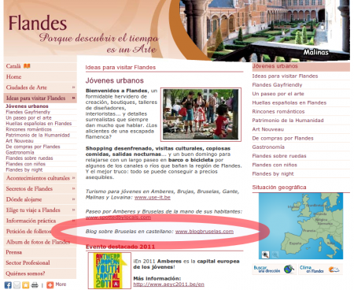

::: {#page .hfeed .site}
[Saltar al contenido](index.html#content){.skip-link
.screen-reader-text}

::: {#sidebar .sidebar}
::: {.site-branding}
[{.custom-logo
width="248" height="248" sizes="(max-width: 248px) 100vw, 248px"
srcset="../../../wp-content/uploads/2016/04/cropped-Manneken_Pis_Blog_Bruselas_Ricardo_Imbern-248.jpg 248w, ../../../wp-content/uploads/2016/04/cropped-Manneken_Pis_Blog_Bruselas_Ricardo_Imbern-248-150x150.jpg 150w"}](../../../index.html){.custom-logo-link}

[Blog Bruselas en español](../../../index.html)

El blog-guía escrito por españoles en Bruselas para los hispanoparlantes
que viven aquí y para los turistas que aprovechan los vuelos baratos
para descubrir el chocolate, la cerveza, la Grand Place y tantas otras
cosas buenas.

Menú y widgets
:::

::: {#secondary .secondary}
::: {#widget-area .widget-area role="complementary"}
Blog Bruselas es {#blog-bruselas-es .widget-title}
----------------

::: {.textwidget}
Un **blog en español escrito en Bruselas** por unos enamorados de la
capital de Bélgica, corazón mágico de Europa. Una ciudad pequeña y
grande, llena de gente, comida, eventos y rincones encantadores; para
descubrir y disfrutar sin dejarse aguar la fiesta por el tiempo (no es
tan malo).

Para quienes pasan por Bruselas, porque vienen de visita, de turismo o
tienen la suerte de vivir aquí. Sí quieres conocer más que los hoteles
en Bruselas, aprovecha los vuelos baratos y **vive la ciudad**.

Blog Bruselas es el bebé de [Ramón Suárez](http://www.ramonsuarez.com),
bruseleño convencido desde 2003.
:::

Espacios de trabajo compartido {#espacios-de-trabajo-compartido .widget-title}
------------------------------

::: {.textwidget}
[Betacowork Coworking Bruselas](http://www.betacowork.com) [Mapa de
espacios de coworking en Bélgica](http://coworkingbelgium.com)
:::

Último vídeo {#último-vídeo .widget-title}
------------

Asociados con Hispagenda, la guía digital de los españoles en Bélgica {#asociados-con-hispagenda-la-guía-digital-de-los-españoles-en-bélgica .widget-title}
---------------------------------------------------------------------

::: {.textwidget}
[{.attachment-medium
width="250" height="100"}](http://www.hispagenda.com)
:::

Más sobre Bruselas en otros idiomas {#más-sobre-bruselas-en-otros-idiomas .widget-title}
-----------------------------------

::: {.textwidget}
[Agenda.be](http://www.agenda.be) FR NL\
[Bruxelles Blog](http://www.bxlblog.be/) FR\
[Eventos para emprendedores y freelance en
Bruselas](http://www.betacowork.com/events/)\
[The Network
Brussels](http://groups.yahoo.com/group/TheNetworkBrussels/) EN\
[What\'s up in Belgium](http://www.whatsupin.be/) EN
:::

Más sobre Bélgica en Español {#más-sobre-bélgica-en-español .widget-title}
----------------------------

::: {.textwidget}
[Spaniards en Bélgica](http://www.spaniards.es/paises/belgica)
:::
:::
:::
:::

::: {#content .site-content}
::: {#primary .section .content-area}
::: {#main .site-main role="main"}
Categoría: Destacados {#categoría-destacados .page-title}
=====================

::: {.taxonomy-description}
Lo más interesante y destacado de Blog Bruselas, lo que más gusta y más
se busca.
:::

[Coworking en Bruselas. Dos años de disfrute y crecimiento](../../../index.html?p=3358) {#coworking-en-bruselas.-dos-años-de-disfrute-y-crecimiento .entry-title}
---------------------------------------------------------------------------------------

::: {.entry-content}
Hace dos años [anuncié en el blog](../../../index.html?p=3223) que me
lanzaba a la aventura empresarial con un espacio de [coworking en
Bruselas](http://coworking.betagroup.be "Coworking Bruselas"). Muchas
cosas han pasado desde entonces, entre ellas que el coworking va muy
bien y que nos hemos convertido en un espacio de referencia. Sin
embargo, lo mejor de todo es la gente con la que tengo la suerte de
trabajar cada día.

Como dentro de un par de semanas es la **[conferencia europea de
coworking](http://coworkingeurope.net "Conferencia Europea de Coworking")**,
he pensado que sería una buena idea hacer un vídeo de presentación de lo
que ha cambiado, mostrando el espacio y poniendo al día de la evolución.

Mis coworker (compañeros) también se han apuntado a hacer la
presentación en diferentes idiomas, y hasta tenemos un vídeo en gallego
de Manuel Pueyo, el creador de **[Open
Kitchen](http://www.open-kitchen.eu "Open Kitchen: art, food, people, soul, Brussels")**:

Podéis comprobar vosotros mismos la evolución comparando con este vídeo
de cuando entramos en el edificio por vez primera :

Cuantos años he pasado soñando en poder trabajar en un espacio como
este, tan abierto a la colaboración y a disfrutar con lo que hacemos 🙂
:::

[[Publicado el
]{.screen-reader-text}[26/10/201226/10/2012](../../../index.html?p=3358)]{.posted-on}[[[Autor
]{.screen-reader-text}[Ramón Suárez (administrador de Blog
Bruselas)](../../author/admin/index.html){.url .fn .n}]{.author
.vcard}]{.byline}[[Categorías ]{.screen-reader-text}[Comunicación y
marketing](../comunicacion-y-marketing/index.html),
[Destacados](index.html), [Españoles por el
mundo](../espanoles-por-el-mundo-2/index.html), [Gran
Bruselas](../gran-bruselas/index.html),
[Trabajo](../trabajo/index.html),
[Vídeos](../videos/index.html)]{.cat-links}[[Etiquetas
]{.screen-reader-text}[betacowork](../../tag/betacowork/index.html),
[betagroup coworking
bruselas](../../tag/betagroup-coworking-bruselas/index.html), [coworking
en Bruselas](../../tag/coworking-en-bruselas/index.html), [ramon
suarez](../../tag/ramon-suarez/index.html)]{.tags-links}

[Bruselas, mi ciudad](../../../index.html?p=3347) {#bruselas-mi-ciudad .entry-title}
-------------------------------------------------

::: {.entry-content}
:::

[[Publicado el
]{.screen-reader-text}[30/08/201230/08/2012](../../../index.html?p=3347)]{.posted-on}[[[Autor
]{.screen-reader-text}[Ramón Suárez (administrador de Blog
Bruselas)](../../author/admin/index.html){.url .fn .n}]{.author
.vcard}]{.byline}[[Categorías
]{.screen-reader-text}[Artes](../artes/index.html),
[Destacados](index.html), [Gran Bruselas](../gran-bruselas/index.html),
[Vídeos](../videos/index.html)]{.cat-links}[[Etiquetas
]{.screen-reader-text}[musica](../../tag/musica/index.html),
[rap](../../tag/rap/index.html), [Sensey
Shogun](../../tag/sensey-shogun/index.html)]{.tags-links}

[¿Quieres publicar en Blog Bruselas? Oportunidad para colaboradores](../../../index.html?p=3284) {#quieres-publicar-en-blog-bruselas-oportunidad-para-colaboradores .entry-title}
------------------------------------------------------------------------------------------------

::: {.entry-content}
{.size-medium
.wp-image-3249 width="450" height="450"
sizes="(max-width: 450px) 100vw, 450px"
srcset="../../../wp-content/uploads/2010/12/Manneken_Pis_Blog_Bruselas_Ricardo_Imbern-450x450.jpg 450w, ../../../wp-content/uploads/2010/12/Manneken_Pis_Blog_Bruselas_Ricardo_Imbern-150x150.jpg 150w, ../../../wp-content/uploads/2010/12/Manneken_Pis_Blog_Bruselas_Ricardo_Imbern.jpg 984w"}

Bruselas es una gran ciudad que acoge a gente maravillosa. [Blog
Bruselas](../../../index.html) es una ventana para los que vivimos aquí
y para el resto del mundo. ¿Porqué no compartir vuestra visión con
todos? Juntando diferentes visiones, personalidades e intereses podemos
dar una visión de Bruselas y de lo que es la vida aquí desde una
perspectiva hispana.

Sí quieres publicar en Blog Bruselas tus sitios favoritos, lo que te
gusta y lo que no, como vas conociendo la ciudad, tus fotos, vídeos o
cualquier otra forma de excpresión, tienes la oportunidad de publicar en
el blog de referencia sobre Bruselas y de llegar a sus seguidores
directamente. Más de 6.000 fans siguen nuestras publicaciones en la
página de [Blog Bruselas en
Facebook](http://www.facebook.com/blogbruselas "Blog Bruselas españoles en Facebook").

Sí tienes que hacer las prácticas de periodismo, aquí tienes la
oportunidad perfecta para aprender y para ganar valor en el mercado
laboral.
[Alberto](../../author/albertosegarraruiz/index.html "Alberto Segarra Ruíz")
fue nuestro primer becario y la experiencia fue muy positiva para todos.

¿Requisitos? Tener ganas de escribir, fotografíar o filmar las cosas que
pasan por esta pequeña gran ciudad, o las que han pasado y que te parece
interesante compartir, desde un punto de vista personal.

Por supuesto, cada uno/una escribirá con su nombre o alias preferido y
tendrá un [perfil de presentación propio](../../../index.html?p=995).

¿Te animas? Mándame un correo a <blogbruselas@gmail.com> ¡y a publicar!

 
:::

[[Publicado el
]{.screen-reader-text}[24/02/2011](../../../index.html?p=3284)]{.posted-on}[[[Autor
]{.screen-reader-text}[Ramón Suárez (administrador de Blog
Bruselas)](../../author/admin/index.html){.url .fn .n}]{.author
.vcard}]{.byline}[[Categorías
]{.screen-reader-text}[Blogs](../blogs/index.html), [Bloguero
invitado](../bloguero-invitado/index.html), [Destacados](index.html),
[Españoles por el
mundo](../espanoles-por-el-mundo-2/index.html)]{.cat-links}[[Etiquetas
]{.screen-reader-text}[beca periodismo
Bruselas](../../tag/beca-periodismo-bruselas/index.html), [becario en
Bruselas](../../tag/becario-en-bruselas/index.html), [Becarios en
Bélgica](../../tag/becarios-en-belgica/index.html), [Blog
Bruselas](../../tag/blog-bruselas/index.html)]{.tags-links}

[Nos recomienda Turismo de Bélgica Flandes](../../../index.html?p=3280) {#nos-recomienda-turismo-de-bélgica-flandes .entry-title}
-----------------------------------------------------------------------

::: {.entry-content}
[{.alignleft
.size-medium .wp-image-3282 width="450" height="368"
sizes="(max-width: 450px) 100vw, 450px"
srcset="../../../wp-content/uploads/2011/02/blog-bruselas-flandes-450x368.png 450w, ../../../wp-content/uploads/2011/02/blog-bruselas-flandes-150x122.png 150w, ../../../wp-content/uploads/2011/02/blog-bruselas-flandes.png 797w"}](http://www.flandes.net/ideas_para_visitar_flandes/jovenes_urbanos)

 

 

 

Gracias 🙂
:::

[[Publicado el
]{.screen-reader-text}[24/02/2011](../../../index.html?p=3280)]{.posted-on}[[[Autor
]{.screen-reader-text}[Ramón
Suárez](../../2010/04/30/index.html?author=2){.url .fn .n}]{.author
.vcard}]{.byline}[[Categorías
]{.screen-reader-text}[Blogs](../blogs/index.html),
[Destacados](index.html)]{.cat-links}[[Etiquetas
]{.screen-reader-text}[Blog
Bruselas](../../tag/blog-bruselas/index.html), [blog recomendado turismo
Bélgica](../../tag/blog-recomendado-turismo-belgica/index.html),
[Turismo Flandes](../../tag/turismo-flandes/index.html)]{.tags-links}

[La Bruselas de los museos](../../../index.html?p=3270) {#la-bruselas-de-los-museos .entry-title}
-------------------------------------------------------

::: {.entry-content}
[{.alignnone
width="438"
height="75"}](http://www.expo-orientalisme.be/images/pages/introduction_img_fr.jpg)

Exposiciones de gran calidad han jalonado la temporada de otoño que toca
ahora a su fin de los museos de Bruselas.

En los Musées Royaux de Beaux-Arts acaba de terminar la exposición
dedicada al
[Orientalisme](http://www.expo-orientalisme.be/infos/fr/introduction.html)
que presentaba un recorrido\
por la que Oriente ha ejercido en la obra de distintos artistas del
siglo XIX, desde Delacroix a Kandinsky (1798 -- 1914).

Hasta el 16 de enero se pudo visitar en el [Musée
d´Ixelles](http://www.museedixelles.be/) dos exposiciones únicas. La
primera, que lleva por título *De Dürer a Jan Fabre. Chefs d´ouvre*
presenta por primera vez las obras más prestigiosas de la colección del
museo (Rodin, Picasso, Miró, Picabia, Permeke) en una misma exposición.

{width="396"
height="166"}

La segunda, dedicada a *Paul Delvaux. Aux sources de l´ouvre* arroja una
mirada inédita sobre la obra del artista belga, al confrontar sus obras
con las de los artistas que más influyeron en su estilo.

<http://www.youtube.com/watch?v=kqSnwRUAESY&feature=player_embedded>

En el caso del [BOZAR](http://www.bozar.be), el 23 de enero terminaron
las tres exposiciones que han constituido el eje de la actividad del
museo durante el otoño. *The World of Lucas Cranach* es la primera
muestra consagrada al artista alemán del siglo XVI en un país del
Benelux. Por su parte, *Jack freak Pictures´* refleja la mirada
irónica del duo inglés -- italiano *Gilbert and George* en 85 obras de
gran tamaño que giran en torno al tema de la bandera inglesa.

{width="72"
height="101"}

Y para terminar, el belga Wim Delvoye ha elegido mezclar el estilo
gótico con el acero para su exposición *Knockin´on heaven´s door* de la
que forma parte la enorme torre que despunta por encima del museo y que
puede verse desde muy lejos rivalizando con la de la *Grand Place*.
:::

[[Publicado el
]{.screen-reader-text}[28/01/201126/01/2011](../../../index.html?p=3270)]{.posted-on}[[[Autor
]{.screen-reader-text}[MSB](../../author/mariasanchez/index.html){.url
.fn .n}]{.author .vcard}]{.byline}[[Categorías
]{.screen-reader-text}[Artes](../artes/index.html),
[Destacados](index.html), [Gran
Bruselas](../gran-bruselas/index.html)]{.cat-links}[[Etiquetas
]{.screen-reader-text}[bozar](../../tag/bozar/index.html), [exposiciones
de pintura en
Bruselas](../../tag/exposiciones-de-pintura-en-bruselas/index.html),
[Museo de Ixelles](../../tag/museo-de-ixelles/index.html), [museos en
Bruselas](../../tag/museos-en-bruselas/index.html)]{.tags-links}

Navegación de entradas {#navegación-de-entradas .screen-reader-text}
----------------------

::: {.nav-links}
[[Página ]{.meta-nav .screen-reader-text}1]{.page-numbers .current}
[[Página ]{.meta-nav
.screen-reader-text}2](page/2/index.html){.page-numbers}
[...]{.page-numbers .dots} [[Página ]{.meta-nav
.screen-reader-text}5](page/5/index.html){.page-numbers} [Página
siguiente](page/2/index.html){.next .page-numbers}
:::
:::
:::
:::

::: {.site-info}
[Creado con WordPress](https://es.wordpress.org/)
:::
:::
