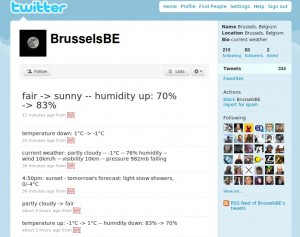
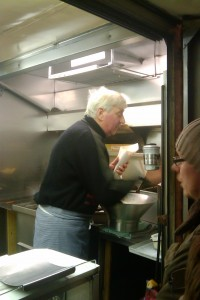

::: {#page .hfeed .site}
[Saltar al contenido](index.html#content){.skip-link
.screen-reader-text}

::: {#sidebar .sidebar}
::: {.site-branding}
[{.custom-logo
width="248" height="248" sizes="(max-width: 248px) 100vw, 248px"
srcset="../../../../../wp-content/uploads/2016/04/cropped-Manneken_Pis_Blog_Bruselas_Ricardo_Imbern-248.jpg 248w, ../../../../../wp-content/uploads/2016/04/cropped-Manneken_Pis_Blog_Bruselas_Ricardo_Imbern-248-150x150.jpg 150w"}](../../../../../index.html){.custom-logo-link}

[Blog Bruselas en español](../../../../../index.html)

El blog-guía escrito por españoles en Bruselas para los hispanoparlantes
que viven aquí y para los turistas que aprovechan los vuelos baratos
para descubrir el chocolate, la cerveza, la Grand Place y tantas otras
cosas buenas.

Menú y widgets
:::

::: {#secondary .secondary}
::: {#widget-area .widget-area role="complementary"}
Blog Bruselas es {#blog-bruselas-es .widget-title}
----------------

::: {.textwidget}
Un **blog en español escrito en Bruselas** por unos enamorados de la
capital de Bélgica, corazón mágico de Europa. Una ciudad pequeña y
grande, llena de gente, comida, eventos y rincones encantadores; para
descubrir y disfrutar sin dejarse aguar la fiesta por el tiempo (no es
tan malo).

Para quienes pasan por Bruselas, porque vienen de visita, de turismo o
tienen la suerte de vivir aquí. Sí quieres conocer más que los hoteles
en Bruselas, aprovecha los vuelos baratos y **vive la ciudad**.

Blog Bruselas es el bebé de [Ramón Suárez](http://www.ramonsuarez.com),
bruseleño convencido desde 2003.
:::

Espacios de trabajo compartido {#espacios-de-trabajo-compartido .widget-title}
------------------------------

::: {.textwidget}
[Betacowork Coworking Bruselas](http://www.betacowork.com) [Mapa de
espacios de coworking en Bélgica](http://coworkingbelgium.com)
:::

Último vídeo {#último-vídeo .widget-title}
------------

Asociados con Hispagenda, la guía digital de los españoles en Bélgica {#asociados-con-hispagenda-la-guía-digital-de-los-españoles-en-bélgica .widget-title}
---------------------------------------------------------------------

::: {.textwidget}
[{.attachment-medium
width="250" height="100"}](http://www.hispagenda.com)
:::

Más sobre Bruselas en otros idiomas {#más-sobre-bruselas-en-otros-idiomas .widget-title}
-----------------------------------

::: {.textwidget}
[Agenda.be](http://www.agenda.be) FR NL\
[Bruxelles Blog](http://www.bxlblog.be/) FR\
[Eventos para emprendedores y freelance en
Bruselas](http://www.betacowork.com/events/)\
[The Network
Brussels](http://groups.yahoo.com/group/TheNetworkBrussels/) EN\
[What\'s up in Belgium](http://www.whatsupin.be/) EN
:::

Más sobre Bélgica en Español {#más-sobre-bélgica-en-español .widget-title}
----------------------------

::: {.textwidget}
[Spaniards en Bélgica](http://www.spaniards.es/paises/belgica)
:::
:::
:::
:::

::: {#content .site-content}
::: {#primary .section .content-area}
::: {#main .site-main role="main"}
Categoría: Gran Bruselas {#categoría-gran-bruselas .page-title}
========================

::: {.taxonomy-description}
Bruselas es una ciudad pequeña pero con un área de influencia bastante
grande. Todo Bélgica queda a un tiro de piedra. El gran cajón de sastre
en el que podŕía caber todo el blog.
:::

[El tiempo en Bruselas: temperatura y lluvia](../../../../../index.html?p=1168) {#el-tiempo-en-bruselas-temperatura-y-lluvia .entry-title}
-------------------------------------------------------------------------------

::: {.entry-content}
Sinceramente, **el tiempo en Bruselas es una locura** y se puede hacer
poco caso de las previsiones. **Lo mejor es venir preparado para todo**
ya que suele cambiar en el mismo día varias veces y sin avisar. Para que
os hagáis una idea de temperaturas y lluvia en Bruselas, este cuadro de
promedios de [Yahoo
Weather](http://es.weather.yahoo.com/climo/BEXX0005_c.html;_ylt=AiyrBKpa93shGFdD_3BMyYVNenUB?woeid=968019 "Promedios de temperatura y precipitaciones en Bruselas en el sitio Yahoo Weather en español")
da suficientes pistas sobre la **previsión del tiempo en Bruselas a lo
largo del año**:

>   -----------------------------------------------------------------------
>   Mes               Prom.\            Prom.\            Prom.\
>                     alta              baja              precipitaciones
>   ----------------- ----------------- ----------------- -----------------
>   **Enero**         5,0 °C            0,0 °C            6,60 cm
>
>   **Febrero**       6,0 °C            0,0 °C            5,33 cm
>
>   **Marzo**         9,0 °C            2,0 °C            7,37 cm
>
>   **Abril**         13,0 °C           5,0 °C            5,84 cm
>
>   **Mayo**          17,0 °C           8,0 °C            7,11 cm
>
>   **Junio**         20,0 °C           11,0 °C           7,87 cm
>
>   **Julio**         22,0 °C           13,0 °C           7,62 cm
>
>   **Agosto**        22,0 °C           13,0 °C           6,35 cm
>
>   **Septiembre**    19,0 °C           11,0 °C           5,84 cm
>
>   **Octubre**       14,0 °C           8,0 °C            7,11 cm
>
>   **Noviembre**     9,0 °C            3,0 °C            7,87 cm
>
>   **Diciembre**     6,0 °C            1,0 °C            7,62 cm
>   -----------------------------------------------------------------------

Cuando **más frío** hace es en diciembre, enero y febrero.

Cuando **más llueve** es en marzo, junio, julio, noviembre y diciembre,
aunque agosto no anda lejos.

Eso sí, recordad que hablan de promedios y que **siempre hay
desviaciones para arriba y para abajo**. Hemos llegado a tener semanas
de 35 grados y también de menos 12, así que no olvidéis echarle un
vistazo a la [previsión del
tiempo](http://es.weather.yahoo.com/b%C3%A9lgica/brussels-capital-region/bruxelas-968019/ "Previsión del tiempo en Bruselas ")
específica para las fechas de vuestro viaje. **Un gorrito para la lluvia
nunca viene mal**, que los paraguas se los lleva el viento.

Por esperiencia propia, la **mejor época para viajar a Bruselas suele
ser septiembre y la primera quincena de octubre**, que es cuando más
posibilidades de tener solazo hay.
:::

[[Publicado el
]{.screen-reader-text}[10/01/201014/02/2010](../../../../../index.html?p=1168)]{.posted-on}[[[Autor
]{.screen-reader-text}[Ramón
Suárez](../../../../2010/04/30/index.html?author=2){.url .fn
.n}]{.author .vcard}]{.byline}[[Categorías ]{.screen-reader-text}[Gran
Bruselas](../../index.html)]{.cat-links}[[Etiquetas
]{.screen-reader-text}[calor en
bruselas](../../../../tag/calor-en-bruselas/index.html), [cuando viajar
a bruselas](../../../../tag/cuando-viajar-a-bruselas/index.html), [frio
en bruselas](../../../../tag/frio-en-bruselas/index.html), [lluvia en
bruselas](../../../../tag/lluvia-en-bruselas/index.html),
[precipitaciones en
bruselas](../../../../tag/precipitaciones-en-bruselas/index.html),
[prevision del tiempo en
bruselas](../../../../tag/prevision-del-tiempo-en-bruselas/index.html),
[temperatura en
bruselas](../../../../tag/temperatura-en-bruselas/index.html), [tiempo
en bruselas](../../../../tag/tiempo-en-bruselas/index.html), [tiempo
viaje a
bruselas](../../../../tag/tiempo-viaje-a-bruselas/index.html)]{.tags-links}[[[1
comentario[ en El tiempo en Bruselas: temperatura y
lluvia]{.screen-reader-text}]{.dsq-postid
dsqidentifier="1168 http://www.blogbruselas.com/?p=1168"}](../../../../../index.html?p=1168#comments)]{.comments-link}

[Twitter y el tiempo en Bruselas](../../../../../index.html?p=1162) {#twitter-y-el-tiempo-en-bruselas .entry-title}
-------------------------------------------------------------------

::: {.entry-content}
Acabo de descubrir una **cuenta de Twitter que te va avisando del tiempo
que hace en Bruselas**:
[\@BrusselsBE](http://twitter.com/BrusselsBE "El tiempo de Bruselas en Twitter.").
En inglés, eso sí.

[{.aligncenter
.size-medium .wp-image-1164 width="300" height="237"
sizes="(max-width: 300px) 100vw, 300px"
srcset="../../../../../wp-content/uploads/2010/01/Tiempo_en_Bruselas_Twitter-300x237.jpg 300w, ../../../../../wp-content/uploads/2010/01/Tiempo_en_Bruselas_Twitter-150x118.jpg 150w, ../../../../../wp-content/uploads/2010/01/Tiempo_en_Bruselas_Twitter.jpg 814w"}](http://twitter.com/brusselsbe)

No da la **[previsión del tiempo en
Bruselas](http://www.blogbruselas.com/2010/01/el-tiempo-en-bruselas-temperatura-y-lluvia.html "El tiempo en Bruselas: temperatura y lluvia durante el año")**,
te va dando los cambios que hay y poniendo al día. Si estás encerrado en
un cubículo viene bien para saber lo que te estás perdiendo y la que, en
estos días de frío, está cayendo ahí fuera, con lo bien que se está al
ladito del radiador...

Y ya que estáis por Twitter, ¿porqué no **suscribiros a la cuenta de
Blog Bruselas**? Esta vez hemos acertado con el nombre:
**[\@blogbruselas](http://twitter.com/blogbruselas "Blog Bruselas en Twiitter")**.
Además de enlazar a las entradas en cuanto se publican, mantenemos una
conversación dicharachera con quién tenga ganas de seguir el mismo rollo
(aunque a veces también soltamos algún rollo que otro).
:::

[[Publicado el
]{.screen-reader-text}[06/01/201016/02/2010](../../../../../index.html?p=1162)]{.posted-on}[[[Autor
]{.screen-reader-text}[Ramón
Suárez](../../../../2010/04/30/index.html?author=2){.url .fn
.n}]{.author .vcard}]{.byline}[[Categorías ]{.screen-reader-text}[Gran
Bruselas](../../index.html)]{.cat-links}[[Etiquetas
]{.screen-reader-text}[tiempo en
bruselas](../../../../tag/tiempo-en-bruselas/index.html),
[twitter](../../../../tag/twitter/index.html)]{.tags-links}[[[2
comentarios[ en Twitter y el tiempo en
Bruselas]{.screen-reader-text}]{.dsq-postid
dsqidentifier="1162 http://www.blogbruselas.com/?p=1162"}](../../../../../index.html?p=1162#comments)]{.comments-link}

[Chicas y chicos geek en Bruselas: Café Numerique acoge al Girl Geek Dinner](../../../../../index.html?p=1155) {#chicas-y-chicos-geek-en-bruselas-café-numerique-acoge-al-girl-geek-dinner .entry-title}
--------------------------------------------------------------------------------------------------------------

::: {.entry-content}
[{.aligncenter
width="226" height="107"}](http://www.brusselsgirlgeekdinner.be/)Mañana
miércoles los chicos del Café Digital (**[*Café
Numerique*](http://www.cafenumerique.be/ "Informática y cacharrería para todos los públicos.")**) 
acogen a las chicas de las cenas
[*geek*](http://es.wikipedia.org/wiki/Geek "¿Qué es geek?") de Bruselas
(**[*Brussels Girl Geek
Dinner*](http://www.brusselsgirlgeekdinner.be/ "Las cenas geek de las chicas en Bruselas")**)
en el Mirano.

Por si no lo conocéis, el *Café Numerique* es un evento semanal en el
que todos los miércoles nos reunimos todos los que tenemos ganas de
aprender y de compartir nuestros conocimientos relacionados con
**Internet, la informática, la cacharrería electrónica, etc**. Es **como
un café literario**, pero en el que hablamos de otras cosas (y cuando
hemos hablado de libros ha sido sobre libros electrónicos). Está
organizado por
**[Mateusz](http://twitter.com/mateusz "Twitter de Mateusz"),
[Zoltán](http://twitter.com/janosizoltan "Twitter de Zoltán"),
[Edouard](http://twitter.com/seynaeve "Twitter de Edouard") y
[Vincent](http://twitter.com/gplouf "Twitter de Vincent")**. El
**ambiente** es muy **relajado** y la **acogida** por parte del personal
del Mirano **fantástica**, con **precios populares y bocatas** ¡hasta de
chorizo! Gracias a estas reuniones he podido incluso verme con otros
personajes hispano-bruselenses-tecnófilos como
**[Carlos](http://twitter.com/wopper "Carlos es Wopper en Twitter")**,
que hizo una presentación muy interesante sobre mundos virtuales.

Las cenas para chicas de Brussels Girl Geek Dinner reunen mensualmente a
un nutrido grupo de mujeres a las que les interesan la tecnología y la
informática. El grupo lo fundó **[Clo
Willaerts](http://www.bnox.be/ "Clo Willaerts, alias bnox")** y esta va
a ser su [23
reunión](http://www.brusselsgirlgeekdinner.be/?p=531 "Brussels Girl Geek Dinner #23 en el Mirano").
Llevo una temporada queriendo asistir (te dejan aunque no seas muy chica
si vas amadrinado) pero entre una cosa y otra al final no he podido
asistir a ninguna.

En esta ocasión **los hombres estamos invitados a asistir** sin tener
que buscar madrina como en las ediciones anteriores. **¡No dejéis pasar
la oportunidad!** A partir de las 18h30 en el
[Mirano](http://mirano.be/ "Mirano, un clásico de la noche de Bruselas").

[{.aligncenter
width="500" height="328"}](http://www.cafenumerique.be/)
:::

[[Publicado el
]{.screen-reader-text}[05/01/201005/01/2010](../../../../../index.html?p=1155)]{.posted-on}[[[Autor
]{.screen-reader-text}[Ramón
Suárez](../../../../2010/04/30/index.html?author=2){.url .fn
.n}]{.author .vcard}]{.byline}[[Categorías
]{.screen-reader-text}[Blogs](../../../blogs/index.html), [Comunicación
y marketing](../../../comunicacion-y-marketing/index.html), [Gran
Bruselas](../../index.html),
[Informática](../../../informatica/index.html)]{.cat-links}[[Etiquetas
]{.screen-reader-text}[bruselas](../../../../tag/bruselas/index.html),
[brussels girl geek
dinner](../../../../tag/brussels-girl-geek-dinner/index.html), [cafe
digital](../../../../tag/cafe-digital/index.html), [cafe
numerique](../../../../tag/cafe-numerique/index.html),
[copas](../../../../tag/copas/index.html), [geeks
bruselas](../../../../tag/geeks-bruselas/index.html),
[Informática](../../../../tag/informatica/index.html),
[tecnología](../../../../tag/tecnologia/index.html)]{.tags-links}[[[1
comentario[ en Chicas y chicos geek en Bruselas: Café Numerique acoge al
Girl Geek Dinner]{.screen-reader-text}]{.dsq-postid
dsqidentifier="1155 http://www.blogbruselas.com/?p=1155"}](../../../../../index.html?p=1155#comments)]{.comments-link}

[En pijama a la peluquería](../../../../../index.html?p=1121) {#en-pijama-a-la-peluquería .entry-title}
-------------------------------------------------------------

::: {.entry-content}
Hay gente que tiene mucho cachondeo encima. Hoy me he pasado por la
[***peluquería Eau Contre
Air***](http://www.facebook.com/pages/manage/updates.php?id=14471236332&sent=1&e=0#/eaucontreair "Eau Contre Air tiene fans en Facebook")
y me he quedado un pelín flipado cuando he visto que **iban todos en
pijama**.

{.aligncenter
.size-medium .wp-image-1122 width="300" height="200"
sizes="(max-width: 300px) 100vw, 300px"
srcset="../../../../../wp-content/uploads/2009/12/Peluqueria_Eau_Contre_Air_en_pijama-300x200.jpg 300w, ../../../../../wp-content/uploads/2009/12/Peluqueria_Eau_Contre_Air_en_pijama-150x100.jpg 150w, ../../../../../wp-content/uploads/2009/12/Peluqueria_Eau_Contre_Air_en_pijama-1024x682.jpg 1024w"}

{.aligncenter
.size-medium .wp-image-1123 width="300" height="200"
sizes="(max-width: 300px) 100vw, 300px"
srcset="../../../../../wp-content/uploads/2009/12/Zapatillas_pijamas_Eau_Contre_Air-300x200.jpg 300w, ../../../../../wp-content/uploads/2009/12/Zapatillas_pijamas_Eau_Contre_Air-150x100.jpg 150w, ../../../../../wp-content/uploads/2009/12/Zapatillas_pijamas_Eau_Contre_Air-1024x682.jpg 1024w"}

Me han explicado que es una tradición suya: **todos los años se ponen de
acuerdo sobre un tema** y el 31 de diciembre se presentan a trabajar
disfrazados. Todavía estáis a tiempo de verlo con vuestros propios ojos
antes de [salir de
fiesta](http://www.blogbruselas.com/2009/12/opciones-para-nochevieja-en-bruselas.html#comment-1097 "Fiestas de año nuevo en Bruselas. Noche vieja de marcha").

Nótese el nombre de la peluquería, que en francés quiere decir **agua
contra aire**, pero que suena como **al contrario**. Además de cortar
bien el pelo, tienen gracia.

Este es el último mensaje de 2009 por mi parte. **¡Feliz año nuevo!**
:::

[[Publicado el
]{.screen-reader-text}[31/12/200931/12/2009](../../../../../index.html?p=1121)]{.posted-on}[[[Autor
]{.screen-reader-text}[Ramón
Suárez](../../../../2010/04/30/index.html?author=2){.url .fn
.n}]{.author .vcard}]{.byline}[[Categorías ]{.screen-reader-text}[Gran
Bruselas](../../index.html),
[Humor](../../../humor/index.html)]{.cat-links}[[Etiquetas
]{.screen-reader-text}[31 de
diciembre](../../../../tag/31-de-diciembre/index.html), [cachondeo en el
trabajo](../../../../tag/cachondeo-en-el-trabajo/index.html),
[disfraces](../../../../tag/disfraces/index.html), [disfrazados en el
trabajo](../../../../tag/disfrazados-en-el-trabajo/index.html), [eau
contre air](../../../../tag/eau-contre-air/index.html), [fin de
año](../../../../tag/fin-de-ano/index.html),
[peluquería](../../../../tag/peluqueria/index.html), [peluquería de
bruselas](../../../../tag/peluqueria-de-bruselas/index.html),
[tradición](../../../../tag/tradicion/index.html)]{.tags-links}

[La Friterie Martin cierra el sábado](../../../../../index.html?p=1112) {#la-friterie-martin-cierra-el-sábado .entry-title}
-----------------------------------------------------------------------

::: {.entry-content}
{.aligncenter
.size-medium .wp-image-1118 width="200" height="300"
sizes="(max-width: 200px) 100vw, 200px"
srcset="../../../../../wp-content/uploads/2009/12/Friterie_Martin_Saint_Josse_Bruselas-200x300.jpg 200w, ../../../../../wp-content/uploads/2009/12/Friterie_Martin_Saint_Josse_Bruselas-100x150.jpg 100w, ../../../../../wp-content/uploads/2009/12/Friterie_Martin_Saint_Josse_Bruselas-682x1024.jpg 682w, ../../../../../wp-content/uploads/2009/12/Friterie_Martin_Saint_Josse_Bruselas.jpg 1344w"}

Este sàbado cierra la ***Friterie Martin* de *Saint Josse***. Para
muchos aquí se preparan las **[mejores patatas fritas de
Bruselas](http://www.blogbruselas.com/2006/12/bruselas-y-las-patatas-fritas.html)**.

Aprovechando que ayer pasaba cerca para asistir al [Café
Numerique](http://www.cafenumerique.be) compré unos cucuruchos de buenas
y artesanales patatas fritas, definitivamente de las mejores de
Bruselas.

**El Sr. Martin comienza su jubilación el domingo**. Con él desaparece
el conocimiento de tres generaciones de maestros friteros, pues nadie en
su familia ha querido seguir la tradición.

Ver el ritual y el mimo con el que prepara los cucuruchos, hoja a hoja,
cucharada a cucharada y entre ellas algún que otro golpe de sal, merece
francamente la pena y te hace disfrutar aun más sus patatas fritas.

Sí andáis por Bruselas estos días no debéis perder la oportunidad de
llevaros a la boca un pedazo de a historia de este país que se va a
perder para siempre.
:::

[[Publicado el
]{.screen-reader-text}[24/12/200928/12/2009](../../../../../index.html?p=1112)]{.posted-on}[[[Autor
]{.screen-reader-text}[Ramón
Suárez](../../../../2010/04/30/index.html?author=2){.url .fn
.n}]{.author .vcard}]{.byline}[[Categorías ]{.screen-reader-text}[Comer
y beber](../../../comer-y-beber/index.html), [Gran
Bruselas](../../index.html)]{.cat-links}[[Etiquetas
]{.screen-reader-text}[bruselas](../../../../tag/bruselas/index.html),
[freiduria](../../../../tag/freiduria/index.html),
[friterie](../../../../tag/friterie/index.html), [friterie
martin](../../../../tag/friterie-martin/index.html),
[fritkot](../../../../tag/fritkot/index.html), [patatas
fritas](../../../../tag/patatas-fritas/index.html), [patatas fritas
bruselas](../../../../tag/patatas-fritas-bruselas/index.html),
[tradición](../../../../tag/tradicion/index.html)]{.tags-links}[[[8
comentarios[ en La Friterie Martin cierra el
sábado]{.screen-reader-text}]{.dsq-postid
dsqidentifier="1112 http://www.blogbruselas.com/?p=1112"}](../../../../../index.html?p=1112#comments)]{.comments-link}

Navegación de entradas {#navegación-de-entradas .screen-reader-text}
----------------------

::: {.nav-links}
[Página anterior](../20/index.html){.prev .page-numbers} [[Página
]{.meta-nav .screen-reader-text}1](../../index.html){.page-numbers}
[...]{.page-numbers .dots} [[Página ]{.meta-nav
.screen-reader-text}20](../20/index.html){.page-numbers} [[Página
]{.meta-nav .screen-reader-text}21]{.page-numbers .current} [[Página
]{.meta-nav .screen-reader-text}22](../22/index.html){.page-numbers}
[...]{.page-numbers .dots} [[Página ]{.meta-nav
.screen-reader-text}66](../66/index.html){.page-numbers} [Página
siguiente](../22/index.html){.next .page-numbers}
:::
:::
:::
:::

::: {.site-info}
[Creado con WordPress](https://es.wordpress.org/)
:::
:::
