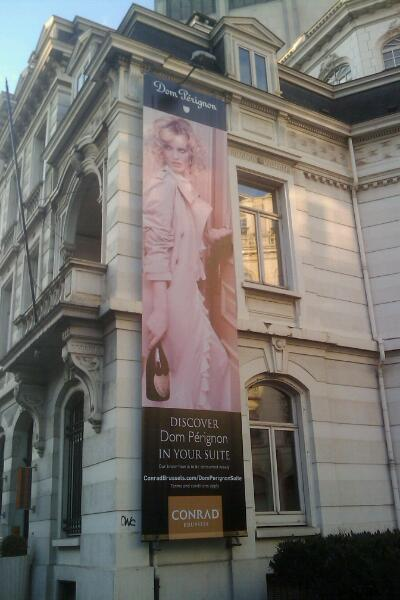
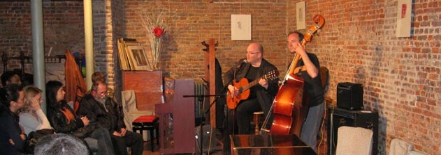

::: {#page .hfeed .site}
[Saltar al contenido](index.html#content){.skip-link
.screen-reader-text}

::: {#sidebar .sidebar}
::: {.site-branding}
[{.custom-logo
width="248" height="248" sizes="(max-width: 248px) 100vw, 248px"
srcset="../../../../../wp-content/uploads/2016/04/cropped-Manneken_Pis_Blog_Bruselas_Ricardo_Imbern-248.jpg 248w, ../../../../../wp-content/uploads/2016/04/cropped-Manneken_Pis_Blog_Bruselas_Ricardo_Imbern-248-150x150.jpg 150w"}](../../../../../index.html){.custom-logo-link}

[Blog Bruselas en español](../../../../../index.html)

El blog-guía escrito por españoles en Bruselas para los hispanoparlantes
que viven aquí y para los turistas que aprovechan los vuelos baratos
para descubrir el chocolate, la cerveza, la Grand Place y tantas otras
cosas buenas.

Menú y widgets
:::

::: {#secondary .secondary}
::: {#widget-area .widget-area role="complementary"}
Blog Bruselas es {#blog-bruselas-es .widget-title}
----------------

::: {.textwidget}
Un **blog en español escrito en Bruselas** por unos enamorados de la
capital de Bélgica, corazón mágico de Europa. Una ciudad pequeña y
grande, llena de gente, comida, eventos y rincones encantadores; para
descubrir y disfrutar sin dejarse aguar la fiesta por el tiempo (no es
tan malo).

Para quienes pasan por Bruselas, porque vienen de visita, de turismo o
tienen la suerte de vivir aquí. Sí quieres conocer más que los hoteles
en Bruselas, aprovecha los vuelos baratos y **vive la ciudad**.

Blog Bruselas es el bebé de [Ramón Suárez](http://www.ramonsuarez.com),
bruseleño convencido desde 2003.
:::

Espacios de trabajo compartido {#espacios-de-trabajo-compartido .widget-title}
------------------------------

::: {.textwidget}
[Betacowork Coworking Bruselas](http://www.betacowork.com) [Mapa de
espacios de coworking en Bélgica](http://coworkingbelgium.com)
:::

Último vídeo {#último-vídeo .widget-title}
------------

Asociados con Hispagenda, la guía digital de los españoles en Bélgica {#asociados-con-hispagenda-la-guía-digital-de-los-españoles-en-bélgica .widget-title}
---------------------------------------------------------------------

::: {.textwidget}
[{.attachment-medium
width="250" height="100"}](http://www.hispagenda.com)
:::

Más sobre Bruselas en otros idiomas {#más-sobre-bruselas-en-otros-idiomas .widget-title}
-----------------------------------

::: {.textwidget}
[Agenda.be](http://www.agenda.be) FR NL\
[Bruxelles Blog](http://www.bxlblog.be/) FR\
[Eventos para emprendedores y freelance en
Bruselas](http://www.betacowork.com/events/)\
[The Network
Brussels](http://groups.yahoo.com/group/TheNetworkBrussels/) EN\
[What\'s up in Belgium](http://www.whatsupin.be/) EN
:::

Más sobre Bélgica en Español {#más-sobre-bélgica-en-español .widget-title}
----------------------------

::: {.textwidget}
[Spaniards en Bélgica](http://www.spaniards.es/paises/belgica)
:::
:::
:::
:::

::: {#content .site-content}
::: {#primary .section .content-area}
::: {#main .site-main role="main"}
Categoría: Gran Bruselas {#categoría-gran-bruselas .page-title}
========================

::: {.taxonomy-description}
Bruselas es una ciudad pequeña pero con un área de influencia bastante
grande. Todo Bélgica queda a un tiro de piedra. El gran cajón de sastre
en el que podŕía caber todo el blog.
:::

[EBE Gilipollas (al menos la camiseta)](../../../../../index.html?p=755) {#ebe-gilipollas-al-menos-la-camiseta .entry-title}
------------------------------------------------------------------------

::: {.entry-content}
Pues sí señoras y señores, la dinastía de los Gilipollas de Bélgica
comienza su contaminación nobilística del [Evento Blog
España](http://www.eventoblog.com "La cita de la internet participativa en español").

Aquí la camiseta del EBE tal que vino [el año
pasado](http://www.blogbruselas.com/2008/11/evento-blog-08-la-conexin-bruselas.html "EBE08, el descubrimiento")
y como la usamos para nuestro particular [Evento Blog Extranjero en
Bruselas](http://www.blogbruselas.com/2009/03/cronica-de-una-quedada-anunciada.html "Cronica de la quedada en Bruselas"):

[{.aligncenter
.size-medium .wp-image-756 width="300" height="225"
sizes="(max-width: 300px) 100vw, 300px"
srcset="../../../../../wp-content/uploads/2009/10/Camiseta-EBE-300x225.jpg 300w, ../../../../../wp-content/uploads/2009/10/Camiseta-EBE-150x112.jpg 150w, ../../../../../wp-content/uploads/2009/10/Camiseta-EBE-1024x768.jpg 1024w"}](http://www.eventoblog.com)

Y aquí el reverso contaminante con el
[logo](http://www.blogbruselas.com/2009/02/logo-gilipollista-gracias-jab.html "Logo de la Orden de Amigos del Gilipollas Pis")
que nos hizo José Antonio Bautista (alias
[JAB](http://jabcomics.com/ "Humor y arte gilipollas de la mano de JAB "))
para la Orden de los Amigos del Gilipollas Pis:

[{.aligncenter
.size-medium .wp-image-757 width="300" height="225"
sizes="(max-width: 300px) 100vw, 300px"
srcset="../../../../../wp-content/uploads/2009/10/Camiseta-EBE-Gilipollas-Pis-300x225.jpg 300w, ../../../../../wp-content/uploads/2009/10/Camiseta-EBE-Gilipollas-Pis-150x112.jpg 150w, ../../../../../wp-content/uploads/2009/10/Camiseta-EBE-Gilipollas-Pis-1024x768.jpg 1024w"}](../../../../../wp-content/uploads/2009/10/Camiseta-EBE-Gilipollas-Pis.JPG)

¡Gilipollas de Bruselas! Espero veros en la quedada de Halloween y en el
EBE. Para la [próxima
quedada](http://quedadabruselas3.eventbrite.com/ "La noche de los bloggers vivientes")
somos ya 19.

Para el EBE09, de momento vamos suesencia [Charlotte-Marisol
Harris](http://palomasenlaquinta.blogspot.com/ "Palomas en la quinta")
(la primera chica que ingresó en la dinastía de los Gilipollas de
Bélgica) y servidor (Gilipollas Segundo de Bélgica).

¿No vais a aprovechar la oportunidad para huir del otoño bruseliano y
disfrutar de un fin de semana de *geeks* y buen rollo en pleno Sevilla?
:::

[[Publicado el
]{.screen-reader-text}[21/10/200921/10/2009](../../../../../index.html?p=755)]{.posted-on}[[[Autor
]{.screen-reader-text}[Ramón
Suárez](../../../../2010/04/30/index.html?author=2){.url .fn
.n}]{.author .vcard}]{.byline}[[Categorías
]{.screen-reader-text}[Artes](../../../artes/index.html),
[Blogs](../../../blogs/index.html), [Gran Bruselas](../../index.html),
[Humor](../../../humor/index.html)]{.cat-links}[[Etiquetas
]{.screen-reader-text}[belgica](../../../../tag/belgica/index.html),
[camiseta](../../../../tag/camiseta/index.html),
[ebe](../../../../tag/ebe/index.html),
[ebe09](../../../../tag/ebe09/index.html), [el niño gilipollas que
quería
volar](../../../../tag/el-nino-gilipollas-que-queria-volar/index.html),
[evento blog españa](../../../../tag/evento-blog-espana/index.html),
[gilipollas](../../../../tag/gilipollas/index.html),
[jab](../../../../tag/jab/index.html), [niño
gilipollas](../../../../tag/nino-gilipollas/index.html), [orden de
amigos del gilipollas
pis](../../../../tag/orden-de-amigos-del-gilipollas-pis/index.html)]{.tags-links}

[Hotel Conrad: ¿cambio de clientela?](../../../../../index.html?p=731) {#hotel-conrad-cambio-de-clientela .entry-title}
----------------------------------------------------------------------

::: {.entry-content}

Me da en la nariz que los clientes de lujo que busca el Hotel Conrad no
son precisamente los turistas que vienen a Bruselas, aunque también
puede ser que estén promoviendo otro tipo de incentivos...
:::

[[Publicado el
]{.screen-reader-text}[12/10/200913/10/2009](../../../../../index.html?p=731)]{.posted-on}[[[Autor
]{.screen-reader-text}[Ramón
Suárez](../../../../2010/04/30/index.html?author=2){.url .fn
.n}]{.author .vcard}]{.byline}[[Categorías ]{.screen-reader-text}[Gran
Bruselas](../../index.html),
[Humor](../../../humor/index.html)]{.cat-links}[[Etiquetas
]{.screen-reader-text}[bruselas](../../../../tag/bruselas/index.html),
[canita al aire](../../../../tag/canita-al-aire/index.html),
[hosteleria](../../../../tag/hosteleria/index.html),
[lujo](../../../../tag/lujo/index.html),
[prostitucion](../../../../tag/prostitucion/index.html),
[turismo](../../../../tag/turismo/index.html)]{.tags-links}[[[5
comentarios[ en Hotel Conrad: ¿cambio de
clientela?]{.screen-reader-text}]{.dsq-postid
dsqidentifier="731 http://www.blogbruselas.com/2009/10/hotel-conrad-%c2%bfcambio-de-clientela.html"}](../../../../../index.html?p=731#comments)]{.comments-link}

[La Prohibida en Bruselas](../../../../../index.html?p=722) {#la-prohibida-en-bruselas .entry-title}
-----------------------------------------------------------

::: {.entry-content}
[{.alignleft
width="89" height="104"}](http://www.myspace.com/soylaprohibida)Estamos
lanzados. La cultura española va poniendo picas musicales en Bruselas
para alegrarnos el otoño.  Tras el concierto de [Ojos de
Brujo](http://www.abconcerts.be/en/concerts/p/detail/ojos-de-brujo-05-10-2009 "Ojos de Brujo en Bruselas, Ancienne Belgique")
ayer y [Luz casal el 5 de
noviembre](http://www.abconcerts.be/nl/concerten/p/detail/luz-casal-05-11-2009 "Luz Casal en Bruselas, Ancienne Belgique"),
me acaba de avisar Fernando de que el 10 de noviembre actuará [La
Prohibida](http://www.myspace.com/soylaprohibida "La Prohibida  en MySpace")
en [The Wax
Club](http://thewaxclub.com/ "The Wax Club, la mejor música electrónica de Bruselas").

Puede que incluso deleite a los presentes con algún clásico francés:

<http://www.dailymotion.com/video/x96qo_cest-la-ouatela-prohibida_fun>

Estaría bien que llevara a La Pequeña Prohibida consigo, pero parece que
solo viene la gran fruta prohibida a Bruselas:

<http://www.youtube.com/watch?v=k0fvQQtkqoA>

Atención, el Wax es pequeñito y solo hay 100 entradas disponibles, a 10
euros por persona petarda, bajo reservación en el propio local. ¡Corred
que se acaban!
:::

[[Publicado el
]{.screen-reader-text}[06/10/200921/10/2009](../../../../../index.html?p=722)]{.posted-on}[[[Autor
]{.screen-reader-text}[Ramón
Suárez](../../../../2010/04/30/index.html?author=2){.url .fn
.n}]{.author .vcard}]{.byline}[[Categorías
]{.screen-reader-text}[Artes](../../../artes/index.html), [Gran
Bruselas](../../index.html)]{.cat-links}[[Etiquetas
]{.screen-reader-text}[drag
queen](../../../../tag/drag-queen/index.html),
[espectáculo](../../../../tag/espectaculo/index.html),
[musica](../../../../tag/musica/index.html),
[petarda](../../../../tag/petarda/index.html),
[transformista](../../../../tag/transformista/index.html),
[travesti](../../../../tag/travesti/index.html)]{.tags-links}[[[2
comentarios[ en La Prohibida en
Bruselas]{.screen-reader-text}]{.dsq-postid
dsqidentifier="722 http://www.blogbruselas.com/?p=722"}](../../../../../index.html?p=722#comments)]{.comments-link}

[Noche de los bloggers vivientes](../../../../../index.html?p=703) {#noche-de-los-bloggers-vivientes .entry-title}
------------------------------------------------------------------

::: {.entry-content}
[{.aligncenter
.size-medium .wp-image-704 width="300" height="179"
sizes="(max-width: 300px) 100vw, 300px"
srcset="../../../../../wp-content/uploads/2009/10/Quedada-Blogger-Halloween-Bruselas-300x179.png 300w, ../../../../../wp-content/uploads/2009/10/Quedada-Blogger-Halloween-Bruselas-150x89.png 150w, ../../../../../wp-content/uploads/2009/10/Quedada-Blogger-Halloween-Bruselas.png 567w"}](http://quedadabruselas3.eventbrite.com/)Señoras
y señores,

Ya va siendo hora de que abandonen sus puestos frente a la pantalla del
ordenador para **pasar un buen rato en compañía de otros** seres
humanoides, escritores y lectores interneteros de blogs, tuiters,
feisbucs y demás. Ha llegado el momento de que las gentes de Bruselas se
sorprendan al vernos salir de nuestros cubículos y es por ello que os
convocamos a [**la noche de los bloggers
vivientes**](http://quedadabruselas3.eventbrite.com/ "¡Apúntate a la quedada!").

Tras el éxito de las anteriores quedadas- en las que realizamos un
avanzado experimento sociológico para ver que horario era el preferido
([noche](http://www.blogbruselas.com/2009/03/cronica-de-una-quedada-anunciada.html "Demostración del cachondeo de la primera quedada")
o
[día](http://www.blogbruselas.com/2009/06/tapeo-extremo-en-bruselas-cronica-de-la.html "Tapeo extremo en Bruselas. Corres el riesgo de pasarlo bien"))
y parece que tuvo más adeptos la noche-
**[Josel3](http://josel3.blogspot.com/ "Josel3 está en el mundo sin estar en él")**
(el artista que ha realizado ese pedazo de flyer) y
**[Ramón](../../../../../index.html "Blog Bruselas, el bebé blog de Ramón Suárez")**
(el pesado que escribe esto) hemos decidido convocar una [nueva quedada
bloguera en Bruselas en la noche de
Halloween](http://quedadabruselas3.eventbrite.com/ "¡Apúntate!"). Somos
dos blogueros españoles en Bélgica, con ganas de verles las caras a
todos los que léen y les léen.

Requisitos:

-   Hablar español
-   Tener ganas de cachondeo
-   Ser capaz de decir a alguno de los participantes "he leido tu blog".
    Hay muchos y aunque sea mentira les hará ilusión. Sí no los conocéis
    en la barra lateral derecha de este blog tenéis los enlaces.
-   Aderezarse con al menos un detallito gore de Halloween, aunque mejor
    si es un disfraz completo.

Para que sea más fácil la identificación, rogamos porten las chapicas
del niño gilipollas y las [camisetas del
EBE](http://www.facebook.com/home.php#/group.php?gid=153214485571&ref=ts "Comparte tus fotos con la camiseta del EBE en Facebook")
de la primera quedada.

Atención, apuntarse a la quedada significa comprometerse con estos
votos:

> Como insigne propietario de la presente entrada me comprometo a liarla
> parda en Bruselas en la noche de los bloggers vivientes. Ante lo
> ilustre del acontecimiento, haré todo lo posible e incluso más por
> pasarlo bien y que los demás lo pasen bien, además de portar un
> disfraz o detalle que me haga encajar mejor con el espíritu de tan
> especial ocasión.

Hagan el favor de **apuntarse dándole al [botoncico naranja ese en el
que pone
Register](http://quedadabruselas3.eventbrite.com/ "Apúntate a la noche de los bloggers vivientes")**
en la página creada a tal efecto, que así es más fácil la organización.
Solo hay 2147483647 entradas, ¡que se acaban!

Para los tuiteros, nuestra etiqueta es **\#qb** (por: ¡qué bueno!,
¡quedada bloguer!, ¡quedada en Bruselas!, ¡queso de Burgos!)

Encontraréis los **[mensajes sobre esta quedada y las
anteriores](../../../../../index.html?s=quedada "Mensajes sobre las quedadas en Blog Bruselas")**
en Blog Bruselas, además de en los selectos blogs y tuiters de sus
participantes.

\*Nota de la redacción Blogger= bloguer= bloguero= bloggero=
yoquesecuantasformasmáshabrádeescribirlo
:::

[[Publicado el
]{.screen-reader-text}[04/10/200904/10/2009](../../../../../index.html?p=703)]{.posted-on}[[[Autor
]{.screen-reader-text}[Ramón
Suárez](../../../../2010/04/30/index.html?author=2){.url .fn
.n}]{.author .vcard}]{.byline}[[Categorías
]{.screen-reader-text}[Blogs](../../../blogs/index.html), [Comer y
beber](../../../comer-y-beber/index.html), [Gran
Bruselas](../../index.html)]{.cat-links}[[Etiquetas
]{.screen-reader-text}[\#qb](../../../../tag/qb/index.html),
[bar](../../../../tag/bar/index.html),
[blog](../../../../tag/blog/index.html),
[blogger](../../../../tag/blogger/index.html),
[Blogs](../../../../tag/blogs/index.html),
[bloguer](../../../../tag/bloguer/index.html),
[bloguera](../../../../tag/bloguera/index.html),
[bloguero](../../../../tag/bloguero/index.html),
[bruselas](../../../../tag/bruselas/index.html),
[cachondeo](../../../../tag/cachondeo/index.html),
[cervezas](../../../../tag/cervezas/index.html),
[copas](../../../../tag/copas/index.html),
[disfraces](../../../../tag/disfraces/index.html),
[disfraz](../../../../tag/disfraz/index.html),
[facebook](../../../../tag/facebook/index.html),
[halloween](../../../../tag/halloween/index.html),
[juerga](../../../../tag/juerga/index.html), [la porte
noire](../../../../tag/la-porte-noire/index.html),
[quedada](../../../../tag/quedada/index.html),
[tweeter](../../../../tag/tweeter/index.html),
[vivientes](../../../../tag/vivientes/index.html)]{.tags-links}[[[6
comentarios[ en Noche de los bloggers
vivientes]{.screen-reader-text}]{.dsq-postid
dsqidentifier="703 http://www.blogbruselas.com/?p=703"}](../../../../../index.html?p=703#comments)]{.comments-link}

[¡Bruselas! ¡Bruxelles!](../../../../../index.html?p=694) {#bruselas-bruxelles .entry-title}
---------------------------------------------------------

::: {.entry-content}
La literatura no entiende de idiomas. Y para que lo comprobéis os invito
a una noche un tanto  especial.

*La Maison du Figuier* (casa de la higuera) es un grupo de escritores
franco-hispánico que armonizan e integran los dos idiomas  en noches
literarias.

El programa del viernes próximo comenzará por un debate literario sobre
la obra de Bertolt Brecht,  seguido de la  lectura de poemas y prosa en
francés   y español  de algunos escritores integrantes del grupo,  así
como   invitados.  Estos  encuentros son muy  distendidos y simpáticos. 
También el  lugar es  muy acogedor;  en un bar de Ixelles que posee
  una sala  de cultura al fondo del jardín.

Esta es la segunda vez que me proponen  participar y  compartir con
ellos y con el público allí presente   algunos de mis poemas  en
español. ¡Os aviso! Me pondré roja.

Os envío  el programa y la dirección a continuación.

****
{width="631"
height="223"}

***La Casa de la Higuera / La Maison du Figuier\
el viernes 9 octubre 2009 a partir de 19h\
en el café l'Imagin'Air, 6 place Fernand Cocq à Ixelles\*\****

**

***ENTRADA GRATIS\
19h***

1)    El debate literario comenzará con  una travesía por los caminos de
la obra de Bertolt Brecht: las mujeres, el erotismo, el amor, una
poética siempre actual en su universalidad, en una decena de poemas y de
canciones extraídas de sus óperas, a través de una intermusicalidad de
lenguas, un descanso que será amenizado con la música de : Serge
Delandsheere (piano) et Coco Kunik (clarinete)

2\) Autores invitados (lecturas):

**Marcelle Collin (poemas, FR)\
Gustavo Gómez (poemas, ES)\
Serge Noël (poemas, FR)**

::: {style="text-align: center"}
*(pausa bar)*
:::

**Almudena Martín  (poemas, ES)\
Léon Laffut (prosas, FR)**

3\) Lecturas libres, (aquí si queréis podéis leer algo de vuestra propia
cosecha) según la hora.

*Cierre musical: Serge Delandsheere (piano) et Coco Kunik (clarinete)*
:::

[[Publicado el
]{.screen-reader-text}[03/10/200921/10/2009](../../../../../index.html?p=694)]{.posted-on}[[[Autor
]{.screen-reader-text}[Almudena](../../../../author/almudena/index.html){.url
.fn .n}]{.author .vcard}]{.byline}[[Categorías
]{.screen-reader-text}[Gran
Bruselas](../../index.html)]{.cat-links}[[Etiquetas
]{.screen-reader-text}[bruselas](../../../../tag/bruselas/index.html),
[declamar](../../../../tag/declamar/index.html),
[lectura](../../../../tag/lectura/index.html),
[poesia](../../../../tag/poesia/index.html),
[recitar](../../../../tag/recitar/index.html)]{.tags-links}[[[5
comentarios[ en ¡Bruselas!
¡Bruxelles!]{.screen-reader-text}]{.dsq-postid
dsqidentifier="694 http://www.blogbruselas.com/?p=694"}](../../../../../index.html?p=694#comments)]{.comments-link}

Navegación de entradas {#navegación-de-entradas .screen-reader-text}
----------------------

::: {.nav-links}
[Página anterior](../26/index.html){.prev .page-numbers} [[Página
]{.meta-nav .screen-reader-text}1](../../index.html){.page-numbers}
[...]{.page-numbers .dots} [[Página ]{.meta-nav
.screen-reader-text}26](../26/index.html){.page-numbers} [[Página
]{.meta-nav .screen-reader-text}27]{.page-numbers .current} [[Página
]{.meta-nav .screen-reader-text}28](../28/index.html){.page-numbers}
[...]{.page-numbers .dots} [[Página ]{.meta-nav
.screen-reader-text}66](../66/index.html){.page-numbers} [Página
siguiente](../28/index.html){.next .page-numbers}
:::
:::
:::
:::

::: {.site-info}
[Creado con WordPress](https://es.wordpress.org/)
:::
:::
