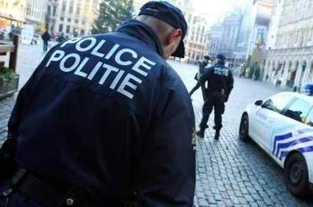

::: {#page .hfeed .site}
[Saltar al contenido](index.html#content){.skip-link
.screen-reader-text}

::: {#sidebar .sidebar}
::: {.site-branding}
[{.custom-logo
width="248" height="248" sizes="(max-width: 248px) 100vw, 248px"
srcset="../../../../../wp-content/uploads/2016/04/cropped-Manneken_Pis_Blog_Bruselas_Ricardo_Imbern-248.jpg 248w, ../../../../../wp-content/uploads/2016/04/cropped-Manneken_Pis_Blog_Bruselas_Ricardo_Imbern-248-150x150.jpg 150w"}](../../../../../index.html){.custom-logo-link}

[Blog Bruselas en español](../../../../../index.html)

El blog-guía escrito por españoles en Bruselas para los hispanoparlantes
que viven aquí y para los turistas que aprovechan los vuelos baratos
para descubrir el chocolate, la cerveza, la Grand Place y tantas otras
cosas buenas.

Menú y widgets
:::

::: {#secondary .secondary}
::: {#widget-area .widget-area role="complementary"}
Blog Bruselas es {#blog-bruselas-es .widget-title}
----------------

::: {.textwidget}
Un **blog en español escrito en Bruselas** por unos enamorados de la
capital de Bélgica, corazón mágico de Europa. Una ciudad pequeña y
grande, llena de gente, comida, eventos y rincones encantadores; para
descubrir y disfrutar sin dejarse aguar la fiesta por el tiempo (no es
tan malo).

Para quienes pasan por Bruselas, porque vienen de visita, de turismo o
tienen la suerte de vivir aquí. Sí quieres conocer más que los hoteles
en Bruselas, aprovecha los vuelos baratos y **vive la ciudad**.

Blog Bruselas es el bebé de [Ramón Suárez](http://www.ramonsuarez.com),
bruseleño convencido desde 2003.
:::

Espacios de trabajo compartido {#espacios-de-trabajo-compartido .widget-title}
------------------------------

::: {.textwidget}
[Betacowork Coworking Bruselas](http://www.betacowork.com) [Mapa de
espacios de coworking en Bélgica](http://coworkingbelgium.com)
:::

Último vídeo {#último-vídeo .widget-title}
------------

Asociados con Hispagenda, la guía digital de los españoles en Bélgica {#asociados-con-hispagenda-la-guía-digital-de-los-españoles-en-bélgica .widget-title}
---------------------------------------------------------------------

::: {.textwidget}
[{.attachment-medium
width="250" height="100"}](http://www.hispagenda.com)
:::

Más sobre Bruselas en otros idiomas {#más-sobre-bruselas-en-otros-idiomas .widget-title}
-----------------------------------

::: {.textwidget}
[Agenda.be](http://www.agenda.be) FR NL\
[Bruxelles Blog](http://www.bxlblog.be/) FR\
[Eventos para emprendedores y freelance en
Bruselas](http://www.betacowork.com/events/)\
[The Network
Brussels](http://groups.yahoo.com/group/TheNetworkBrussels/) EN\
[What\'s up in Belgium](http://www.whatsupin.be/) EN
:::

Más sobre Bélgica en Español {#más-sobre-bélgica-en-español .widget-title}
----------------------------

::: {.textwidget}
[Spaniards en Bélgica](http://www.spaniards.es/paises/belgica)
:::
:::
:::
:::

::: {#content .site-content}
::: {#primary .section .content-area}
::: {#main .site-main role="main"}
Categoría: Gran Bruselas {#categoría-gran-bruselas .page-title}
========================

::: {.taxonomy-description}
Bruselas es una ciudad pequeña pero con un área de influencia bastante
grande. Todo Bélgica queda a un tiro de piedra. El gran cajón de sastre
en el que podŕía caber todo el blog.
:::

[Patinando en Bruselas](../../../../../index.html?p=2967) {#patinando-en-bruselas .entry-title}
---------------------------------------------------------

::: {.entry-content}
[{.alignnone
.size-full .wp-image-2970 width="342" height="355"
sizes="(max-width: 342px) 100vw, 342px"
srcset="../../../../../wp-content/uploads/2010/08/skateboarding.jpg 342w, ../../../../../wp-content/uploads/2010/08/skateboarding-144x150.jpg 144w"}](http://es.wikipedia.org/wiki/Skateboarding)

**Dentro del** ***Skatepark*** **más importante de Bruselas,** ***Rue
des Ursulines*****.** Con un solitario rascacielo de fondo y el sol
resbalando en cada salto, las fachadas *Art Nouveau* miran con un gesto
de desprecio y desconfianza mientras te vas dando cuenta de que son
distintos. Colorean toda la tarde el barrio de la *Chapelle*, hablamos
de *Skaters*, de *Riders*, ya lleven patín o bicicleta de *BMX* el
método de ambos es común, venga otra más. Otros chicos se sientan en el
fondo, beben unas cervezas y miran con crítica y desafío. En cada rampa
se mezclan chicos de todas las edades que viven esta cultura con fervor,
mi tabla es la proyección de mi personalidad aseguran.

BlogBruselas se infiltra entre ellos, prueba una vez tío verás como te
engancha, insisten. La mayoría comenzaron por influencias externas y
ahora son los máximos representantes de esta forma de vida. Hablamos con
**Ian Cahill**, viene de Australia con 25 años de edad. El pasado mayo
consiguió su título de ingeniero y ahora está viajando por toda Europa,
se mueve en tren y Bruselas era su segunda parada después de Berlín. El
descaro que demuestra patinando se convierte en timidez fuera, no se
deja fotografiar. El público local lo observa con admiración, tomando
apunte mentalmente de todos sus movimientos. *Ian* asegura que las
diferentes culturas de los países se nota en el *skate*. En Europa la
rivalidad está hecha para el aprendizaje, en Australia siempre te
quieren dejar en evidencia, ejemplifica.

Lleva una larga melena rubia, pantalones ajustados y el cuadro de la
Libertad guiando al pueblo de *Delacroix* con una espada láser en lugar
de una bandera es el diseño de su camiseta. La ropa es mi segunda piel,
el estilo al vestir habla mucho de uno mismo, pero aunque no sea tu
estilo no hay que dejar de conocer, dice. Nos cuenta que la cultura del
Skater es una cultura muy sana, además de que se centra en una actividad
física también tiene inquietudes intelectuales. Todo el mundo sabe el
gusto refinado de un *Skater* por la música, y las rampas de todos los
*Skateparks* no están pintadas por casualidad, es otro ejemplo más de la
expresión artística de esta cultura, añade. Y en su caso doy fe de su
exquisito paladar por la arquitectura europea. En Europa las ciudades no
son monstruosas, se ve la personalidad del país y es muy agradable que
el patrimonio histórico de una cultura siga en pie y conviva día a día
con la gente, adoro Europa afirma.

*Ian* es un ejemplo de la cantidad de gente que viaja por una afición
este caso el *Skate*. Es un ejemplo de que Bruselas va más allá de la
*Grand Place* y el *Atomium.* **Bruselas tiene cultura de calle, y aquí
se ama el *Skate*. Mañana actualizaremos con el testimonio curioso de un
veterano *Skater* local, todo un ejemplo.**

Feliz sábado!
:::

[[Publicado el
]{.screen-reader-text}[14/08/201014/08/2010](../../../../../index.html?p=2967)]{.posted-on}[[[Autor
]{.screen-reader-text}[Alberto Segarra
Ruíz](../../../../author/albertosegarraruiz/index.html){.url .fn
.n}]{.author .vcard}]{.byline}[[Categorías ]{.screen-reader-text}[Gran
Bruselas](../../index.html)]{.cat-links}[[Etiquetas
]{.screen-reader-text}[hacer skate en
Bruselas](../../../../tag/hacer-skate-en-bruselas/index.html), [patinar
en Bruselas](../../../../tag/patinar-en-bruselas/index.html), [skatepark
en bruselas](../../../../tag/skatepark-en-bruselas/index.html), [skaters
en
Bruselas](../../../../tag/skaters-en-bruselas/index.html)]{.tags-links}

[Flamencos, valones, flores y música en el último Objetivo Bruselas de la temporada](../../../../../index.html?p=2940) {#flamencos-valones-flores-y-música-en-el-último-objetivo-bruselas-de-la-temporada .entry-title}
----------------------------------------------------------------------------------------------------------------------

::: {.entry-content}
En el ecuador de agosto, Bruselas se prepara para dos de los
acontecimientos estivales más esperados en la ciudad. Se trata del
[Brussels Summer Festival](http://www.bsf.be) y del [Tapiz de
Flores](http://www.flowercarpet.be/site/main.php?lg=en) de la Grand
Place. Dos acontecimientos tan diferentes como interesantes.

En nuestro programa de hoy martes, además de centrarnos en estos dos
eventos vamos dar una vuelta de tuerca a nuestras entrevistas
habituales.

Hoy no tendremos a un español que nos hable sobre su experiencia y su
visión de Bruselas, sino que tendremos a dos belgas que nos contarán
cómo nos ven a los españoles. Dos jóvenes, **una flamenca y un valón nos
expondrán su punto de vista sobre nosotros**, nuestra cultura y nuestras
costumbres. Además, aprovechando la presencia de los dos, intentaremos
profundizar en la relación entre ambas comunidades.

Y hoy nuevamente tendremos consejos útiles de nuestra nutricionista
**Beatriz Rodríguez** que nos va a hablar de todo lo que tenemos que
saber sobre las **dietas de verano** y nos va a aconsejar para evitar
engaños sobre las dietas milagrosas. Además nos propondrá menús
saludables de verano que podemos preparar fácilmente aquí en Bruselas.

**Vacaciones en la radio, pero no en el blog**

Y el de este martes es nuestro último programa de la temporada. Seis
meses después de comenzar hacemos un **pequeño paréntesis en nuestra
cita semanal**, pero no en nuestro blog que seguiremos actualizando a
diario como llevamos haciendo desde febrero. Aprovechando este programa
especial para conectar con los presentadores originales de Objetivo
Bruselas, **Alberto Pascual**, desde Madrid, y **Jorge Gutiérrez**, en
Algeciras. Todo esto será a las 19 horas en Radio Alma, la 101.9 FM de
Bruselas. Os esperamos.
:::

[[Publicado el
]{.screen-reader-text}[10/08/201011/08/2010](../../../../../index.html?p=2940)]{.posted-on}[[[Autor
]{.screen-reader-text}[Objetivo
Bruselas](../../../../author/objetivo-bruselas/index.html){.url .fn
.n}]{.author .vcard}]{.byline}[[Categorías ]{.screen-reader-text}[Gran
Bruselas](../../index.html)]{.cat-links}

[Preparando la guía de las mejores discotecas de Bruselas: háblanos de tu noche](../../../../../index.html?p=2907) {#preparando-la-guía-de-las-mejores-discotecas-de-bruselas-háblanos-de-tu-noche .entry-title}
------------------------------------------------------------------------------------------------------------------

::: {.entry-content}
[{.alignnone
.size-medium .wp-image-2908 width="450" height="337"
sizes="(max-width: 450px) 100vw, 450px"
srcset="../../../../../wp-content/uploads/2010/08/tumblr_kozue7szqw1qzj3obo1_500-450x337.jpg 450w, ../../../../../wp-content/uploads/2010/08/tumblr_kozue7szqw1qzj3obo1_500-150x112.jpg 150w, ../../../../../wp-content/uploads/2010/08/tumblr_kozue7szqw1qzj3obo1_500.jpg 490w"}](http://ffffound.com/image/37d0280b464f170d1c30a9f8088e1ecf3c349232)

La imitación ha prostituido hasta los alfileres. Sí, puede ser, pero no
hacemos ni [puto]{style="text-decoration: line-through;"} caso a los
consejos, porque creemos que la experiencia es una virtud sublime. Así
que dinos tú, querido lector, dónde vomitas estrofas incoherentes al
amanecer, dinos dónde te tomas la penúltima copa, dinos dónde podemos
colgar los corazones en la muñeca, dinos dónde coges ebrio el taxi, ése
que te devuelve a la realidad absoluta.

Venimos una vez más, para volver a comenzar de nuevo. Siguiente meta.
Esto va de cumplir objetivos entre todos, vamos a hacer la guía Bruselas
*nightlife.* Para los que nos gusta justamente el plato que el otro
come, para los indecisos, que aborrecen una camisa tras otra. A los que
nos gusta purgar nuestro cuerpo noche tras noche con sueños.

**Dinos tu local, bar, discoteca favorita en la capital de Europa,
queremos aprender a ser tú.**

Os dejo el vídeo de *Justice*, *We are your friends*. Un tema que todos
hemos bailado!
:::

[[Publicado el
]{.screen-reader-text}[06/08/201009/08/2010](../../../../../index.html?p=2907)]{.posted-on}[[[Autor
]{.screen-reader-text}[Alberto Segarra
Ruíz](../../../../author/albertosegarraruiz/index.html){.url .fn
.n}]{.author .vcard}]{.byline}[[Categorías ]{.screen-reader-text}[Gran
Bruselas](../../index.html)]{.cat-links}[[Etiquetas
]{.screen-reader-text}[de fiesta en
Bruselas](../../../../tag/de-fiesta-en-bruselas/index.html), [discotecas
bruselas](../../../../tag/discotecas-bruselas/index.html), [noche en
bruselas](../../../../tag/noche-en-bruselas/index.html), [salir de noche
en
Bruselas](../../../../tag/salir-de-noche-en-bruselas/index.html)]{.tags-links}

[Seis meses tomando el pulso a la ciudad en Objetivo Bruselas](../../../../../index.html?p=2895) {#seis-meses-tomando-el-pulso-a-la-ciudad-en-objetivo-bruselas .entry-title}
------------------------------------------------------------------------------------------------

::: {.entry-content}
Agosto ha llegado a la ciudad. Los días de bochorno y las tormentas de
verano se suceden como habitualmente. **Las fiestas y actividades de
verano están en pleno apogeo en estos días** al igual que las calles y
plazas llenas de turistas. Y en **Objetivo Bruselas** no descansamos en
nuestro empeño por daros a conocer todas las caras de la capital de
Europa. En nuestro primer programa de agosto, os contamos nuevas
propuestas para vuestro tiempo de ocio como las jornadas de precios
reducidos en la [Foire du Midi](http://www.foiredumidi.be) o las
sesiones de cine al aire libre en Woluwé-Saint-Lambert y en el [Museo
BelVue!](http://www.belvue.be)

**Medio año sacando jugo a Bruselas**

Nuestro programa del 3 de agosto fue una fecha especial porque justo
cumplimos seis meses en antena. Fue un **3 de febrero** cuando la ciudad
ofrecía un aspecto totalmente diferente al de ahora que dos jóvenes
recién llegados a Bruselas ponían en marcha un proyecto que ha ido
creciendo con el tiempo hasta conseguir una gran cantidad de seguidores
diarios. Os damos las gracias a todos.

**Más recién llegados a la ciudad**

En nuestro programa nos gusta seguir escuchando las historias de los
españoles que siguen llegando a la ciudad. Por ello contamos nuevamente
con un invitado que lleva pocas semanas en la ciudad. **Fernando
Tajuelo**, un joven llegado de Ciudad Real nos contó su experiencia en
la ciudad, donde desde hace un mes trabaja como becario en la delegación
de Castilla-La Mancha en Bruselas.

**Consejos de seguridad en Bruselas**

Bruselas **no es una ciudad ni más, ni menos peligrosa** que el resto de
grandes ciudades europeas, pero nunca está de más tener unos cuantos
datos con las consignas más importantes de seguridad y que nos pueden
venir bien en un caso de robo, emergencia o cuando perdemos documentos
personales. **No se trata de ser alarmista, sino simplemente de ser
cuidadoso, no perder la calma** y saber qué hacer y dónde acudir en cada
situación.

[{.size-full
.wp-image-2898 .aligncenter width="399" height="264"
sizes="(max-width: 399px) 100vw, 399px"
srcset="../../../../../wp-content/uploads/2010/08/police2.jpg 399w, ../../../../../wp-content/uploads/2010/08/police2-150x99.jpg 150w"}](http://www.blogbruselas.com/2010/08/seis-meses-tomando-el-pulso-a-la-ciudad-en-objetivo-bruselas.html/police-3)

**Visitas interesantes y fotos sobre Europa**

Además de los contenidos de nuestro programa, esta semana en nuestro
blog, hemos conocido la historia de dos de las ganadoras del certamen de
fotografía organizado por Espacio Europa, **Clara Benavente y Gloria
Montañés**. También hemos informado sobre una visita interesante como es
la del Palacio Real, que abre sus puertas hasta septiembre y de forma
totalmente gratuita.

**Supermercados y trenes en Bruselas**

Pero además hemos prestado atención a dos temas muy importantes para los
que vivimos en Bruselas. El primero de ellos fue en nuestra sección
**['Me quejo
de...'](http://objetivobruselas.blogspot.com/2010/08/averias-y-retrasos-en-los-trenes-belgas.html)**,
en el que María de la Vega nos contaba su experiencia y desesperación
como usuaria de la [SNCB](http://www.sncb.be), aunque también intentamos
buscar la manera de solucionar estos problemas como, por ejemplo, poner
una reclamación ante la compañía. El segundo punto que abordamos fue la
**[lista de la
compra](http://objetivobruselas.blogspot.com/2010/07/supermercados-en-bruselas-i-te-ayudamos.html)**
con toda la información sobre los supermercados más conocidos de la
ciudad y las ventajas e inconvenientes de cada uno.
:::

[[Publicado el
]{.screen-reader-text}[04/08/201009/08/2010](../../../../../index.html?p=2895)]{.posted-on}[[[Autor
]{.screen-reader-text}[Objetivo
Bruselas](../../../../author/objetivo-bruselas/index.html){.url .fn
.n}]{.author .vcard}]{.byline}[[Categorías ]{.screen-reader-text}[Gran
Bruselas](../../index.html)]{.cat-links}[[Etiquetas
]{.screen-reader-text}[becario en
Bruselas](../../../../tag/becario-en-bruselas/index.html), [Clara
Benavente](../../../../tag/clara-benavente/index.html), [consejos de
seguridad en
Bruselas](../../../../tag/consejos-de-seguridad-en-bruselas/index.html),
[feria de Midi en
Bruselas](../../../../tag/feria-de-midi-en-bruselas/index.html),
[Fernando Tajuelo](../../../../tag/fernando-tajuelo/index.html), [Gloria
Montañés](../../../../tag/gloria-montanes/index.html), [la semana en
Objetivo
Bruselas](../../../../tag/la-semana-en-objetivo-bruselas/index.html),
[lista de la compra en los supermercados de
Bruselas](../../../../tag/lista-de-la-compra-en-los-supermercados-de-bruselas/index.html),
[María Vega](../../../../tag/maria-vega/index.html), [Museo Belvue
Bruselas](../../../../tag/museo-belvue-bruselas/index.html), [quejas
SNCB tren
belga](../../../../tag/quejas-sncb-tren-belga/index.html)]{.tags-links}[[[1
comentario[ en Seis meses tomando el pulso a la ciudad en Objetivo
Bruselas]{.screen-reader-text}]{.dsq-postid
dsqidentifier="2895 http://www.blogbruselas.com/?p=2895"}](../../../../../index.html?p=2895#comments)]{.comments-link}

[Festival gastronómico de Amberes](../../../../../index.html?p=2879) {#festival-gastronómico-de-amberes .entry-title}
--------------------------------------------------------------------

::: {.entry-content}
[{.alignnone
.size-medium .wp-image-2880 width="309" height="450"
sizes="(max-width: 309px) 100vw, 309px"
srcset="../../../../../wp-content/uploads/2010/08/LOVIN_IT__by_Lora8-309x450.jpg 309w, ../../../../../wp-content/uploads/2010/08/LOVIN_IT__by_Lora8-103x150.jpg 103w, ../../../../../wp-content/uploads/2010/08/LOVIN_IT__by_Lora8.jpg 480w"}](http://ffffound.com/image/d41119d1d6f80b7c26c7217cef932d9225211d70)

Lo de hoy no va de gustos, ni colores, ni depende del cristal por donde
lo mires. Lo de hoy no es una historia de fe y mentiras. Es una historia
acerca de pecados, de insatisfacciones, porque mi/nuestro talón de
Aquiles siempre fue el mismo, devorar. Devorar experiencias, personas,
olores y sabores, devorar mentiras, incluso las mías propias. Viene
semana fuerte para acumular experiencias, sin tener que echarnos la
culpa al día siguiente, sin resaca, porque esta semana no es blanco o
negro, vuelven los matices, porque Bélgica no es esa tía buena aburrida,
cansada y apagada con la pose de: ¿Ahora qué hacemos?

Todo este rollo de los matices tiene motivos, el día 5 de agosto empieza
en Amberes el festival ***[Antwerp
Taste](http://www.antwerpenproeft.be/)***, y dura hasta el día 8 del
mismo mes. Este festival gastronómico está en su cuarta edición y forma
parte del programa de fiestas de la ciudad,
*[Bollekefeest](http://www.bollekesfeest.be/)*, y consiste en la
exposición, a través de 25 restaurantes de Flandes, de las mejores
recetas culinarias basadas en los mejores productos nacionales. **La
entrada al festival es gratuita** y el espacio que se ha adecuado para
la cita está en el barrio de Zuid de Amberes.

¡Cuidad la barriga!
:::

[[Publicado el
]{.screen-reader-text}[02/08/201009/08/2010](../../../../../index.html?p=2879)]{.posted-on}[[[Autor
]{.screen-reader-text}[Alberto Segarra
Ruíz](../../../../author/albertosegarraruiz/index.html){.url .fn
.n}]{.author .vcard}]{.byline}[[Categorías ]{.screen-reader-text}[Comer
y beber](../../../comer-y-beber/index.html), [Gran
Bruselas](../../index.html)]{.cat-links}[[Etiquetas
]{.screen-reader-text}[Antwerp
Taste](../../../../tag/antwerp-taste/index.html), [Bollekefest
Amberes](../../../../tag/bollekefest-amberes/index.html), [comer en
Amberes](../../../../tag/comer-en-amberes/index.html), [festival
gastronómico
Amberes](../../../../tag/festival-gastronomico-amberes/index.html)]{.tags-links}

Navegación de entradas {#navegación-de-entradas .screen-reader-text}
----------------------

::: {.nav-links}
[Página anterior](../5/index.html){.prev .page-numbers} [[Página
]{.meta-nav .screen-reader-text}1](../../index.html){.page-numbers}
[...]{.page-numbers .dots} [[Página ]{.meta-nav
.screen-reader-text}5](../5/index.html){.page-numbers} [[Página
]{.meta-nav .screen-reader-text}6]{.page-numbers .current} [[Página
]{.meta-nav .screen-reader-text}7](../7/index.html){.page-numbers}
[...]{.page-numbers .dots} [[Página ]{.meta-nav
.screen-reader-text}66](../66/index.html){.page-numbers} [Página
siguiente](../7/index.html){.next .page-numbers}
:::
:::
:::
:::

::: {.site-info}
[Creado con WordPress](https://es.wordpress.org/)
:::
:::
