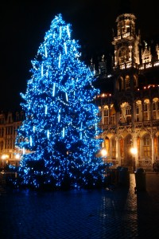

::: {#page .hfeed .site}
[Saltar al contenido](index.html#content){.skip-link
.screen-reader-text}

::: {#sidebar .sidebar}
::: {.site-branding}
[{.custom-logo
width="248" height="248" sizes="(max-width: 248px) 100vw, 248px"
srcset="../../../wp-content/uploads/2016/04/cropped-Manneken_Pis_Blog_Bruselas_Ricardo_Imbern-248.jpg 248w, ../../../wp-content/uploads/2016/04/cropped-Manneken_Pis_Blog_Bruselas_Ricardo_Imbern-248-150x150.jpg 150w"}](../../../index.html){.custom-logo-link}

[Blog Bruselas en español](../../../index.html)

El blog-guía escrito por españoles en Bruselas para los hispanoparlantes
que viven aquí y para los turistas que aprovechan los vuelos baratos
para descubrir el chocolate, la cerveza, la Grand Place y tantas otras
cosas buenas.

Menú y widgets
:::

::: {#secondary .secondary}
::: {#widget-area .widget-area role="complementary"}
Blog Bruselas es {#blog-bruselas-es .widget-title}
----------------

::: {.textwidget}
Un **blog en español escrito en Bruselas** por unos enamorados de la
capital de Bélgica, corazón mágico de Europa. Una ciudad pequeña y
grande, llena de gente, comida, eventos y rincones encantadores; para
descubrir y disfrutar sin dejarse aguar la fiesta por el tiempo (no es
tan malo).

Para quienes pasan por Bruselas, porque vienen de visita, de turismo o
tienen la suerte de vivir aquí. Sí quieres conocer más que los hoteles
en Bruselas, aprovecha los vuelos baratos y **vive la ciudad**.

Blog Bruselas es el bebé de [Ramón Suárez](http://www.ramonsuarez.com),
bruseleño convencido desde 2003.
:::

Espacios de trabajo compartido {#espacios-de-trabajo-compartido .widget-title}
------------------------------

::: {.textwidget}
[Betacowork Coworking Bruselas](http://www.betacowork.com) [Mapa de
espacios de coworking en Bélgica](http://coworkingbelgium.com)
:::

Último vídeo {#último-vídeo .widget-title}
------------

Asociados con Hispagenda, la guía digital de los españoles en Bélgica {#asociados-con-hispagenda-la-guía-digital-de-los-españoles-en-bélgica .widget-title}
---------------------------------------------------------------------

::: {.textwidget}
[{.attachment-medium
width="250" height="100"}](http://www.hispagenda.com)
:::

Más sobre Bruselas en otros idiomas {#más-sobre-bruselas-en-otros-idiomas .widget-title}
-----------------------------------

::: {.textwidget}
[Agenda.be](http://www.agenda.be) FR NL\
[Bruxelles Blog](http://www.bxlblog.be/) FR\
[Eventos para emprendedores y freelance en
Bruselas](http://www.betacowork.com/events/)\
[The Network
Brussels](http://groups.yahoo.com/group/TheNetworkBrussels/) EN\
[What\'s up in Belgium](http://www.whatsupin.be/) EN
:::

Más sobre Bélgica en Español {#más-sobre-bélgica-en-español .widget-title}
----------------------------

::: {.textwidget}
[Spaniards en Bélgica](http://www.spaniards.es/paises/belgica)
:::
:::
:::
:::

::: {#content .site-content}
::: {#primary .section .content-area}
::: {#main .site-main role="main"}
Etiqueta: arbol {#etiqueta-arbol .page-title}
===============

[Iluminación de navidad Grand Place Bruselas 2009](../../../index.html?p=914) {#iluminación-de-navidad-grand-place-bruselas-2009 .entry-title}
-----------------------------------------------------------------------------

::: {.entry-content}
La iluminación de navidad de la Grand Place de Bruselas este año es un
auténtico horror, bastante peor que la de años anteriores. En el vídeo
tenéis la iluminación del ayuntamiento de Bruselas para celebrar el fin
de 2009. Y aquí el arbol de navidad:

[{.aligncenter
.size-medium .wp-image-915 width="200" height="300"
sizes="(max-width: 200px) 100vw, 200px"
srcset="../../../wp-content/uploads/2009/12/Arbol_navidad_Grand_Place_Bruselas_2009-200x300.jpg 200w, ../../../wp-content/uploads/2009/12/Arbol_navidad_Grand_Place_Bruselas_2009-100x150.jpg 100w, ../../../wp-content/uploads/2009/12/Arbol_navidad_Grand_Place_Bruselas_2009-682x1024.jpg 682w, ../../../wp-content/uploads/2009/12/Arbol_navidad_Grand_Place_Bruselas_2009.jpg 1344w"}](../../../wp-content/uploads/2009/12/Arbol_navidad_Grand_Place_Bruselas_2009.jpg)

Así en la foto parece hasta mono, pero en la vida real da bastante
cutre. Una lástima. Pusieron el listón demasiado alto el año de las
bolas del atomium con árboles de navidad dentro, pero tampoco hace falta
ir al extremo contrario.
:::

[[Publicado el
]{.screen-reader-text}[04/12/200922/12/2009](../../../index.html?p=914)]{.posted-on}[[[Autor
]{.screen-reader-text}[Ramón
Suárez](../../2010/04/30/index.html?author=2){.url .fn .n}]{.author
.vcard}]{.byline}[[Categorías ]{.screen-reader-text}[Gran
Bruselas](../../category/gran-bruselas/index.html)]{.cat-links}[[Etiquetas
]{.screen-reader-text}[arbol](index.html),
[bruselas](../bruselas/index.html), [grand
place](../grand-place/index.html), [navidad](../navidad/index.html),
[plaisirs d\'hiver](../plaisirs-dhiver/index.html)]{.tags-links}[[[3
comentarios[ en Iluminación de navidad Grand Place Bruselas
2009]{.screen-reader-text}]{.dsq-postid
dsqidentifier="914 http://www.blogbruselas.com/?p=914"}](../../../index.html?p=914#comments)]{.comments-link}
:::
:::
:::

::: {.site-info}
[Creado con WordPress](https://es.wordpress.org/)
:::
:::
