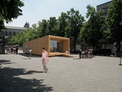

::: {#page .hfeed .site}
[Saltar al contenido](index.html#content){.skip-link
.screen-reader-text}

::: {#sidebar .sidebar}
::: {.site-branding}
[{.custom-logo
width="248" height="248" sizes="(max-width: 248px) 100vw, 248px"
srcset="../../../../../wp-content/uploads/2016/04/cropped-Manneken_Pis_Blog_Bruselas_Ricardo_Imbern-248.jpg 248w, ../../../../../wp-content/uploads/2016/04/cropped-Manneken_Pis_Blog_Bruselas_Ricardo_Imbern-248-150x150.jpg 150w"}](../../../../../index.html){.custom-logo-link}

[Blog Bruselas en español](../../../../../index.html)

El blog-guía escrito por españoles en Bruselas para los hispanoparlantes
que viven aquí y para los turistas que aprovechan los vuelos baratos
para descubrir el chocolate, la cerveza, la Grand Place y tantas otras
cosas buenas.

Menú y widgets
:::

::: {#secondary .secondary}
::: {#widget-area .widget-area role="complementary"}
Blog Bruselas es {#blog-bruselas-es .widget-title}
----------------

::: {.textwidget}
Un **blog en español escrito en Bruselas** por unos enamorados de la
capital de Bélgica, corazón mágico de Europa. Una ciudad pequeña y
grande, llena de gente, comida, eventos y rincones encantadores; para
descubrir y disfrutar sin dejarse aguar la fiesta por el tiempo (no es
tan malo).

Para quienes pasan por Bruselas, porque vienen de visita, de turismo o
tienen la suerte de vivir aquí. Sí quieres conocer más que los hoteles
en Bruselas, aprovecha los vuelos baratos y **vive la ciudad**.

Blog Bruselas es el bebé de [Ramón Suárez](http://www.ramonsuarez.com),
bruseleño convencido desde 2003.
:::

Espacios de trabajo compartido {#espacios-de-trabajo-compartido .widget-title}
------------------------------

::: {.textwidget}
[Betacowork Coworking Bruselas](http://www.betacowork.com) [Mapa de
espacios de coworking en Bélgica](http://coworkingbelgium.com)
:::

Último vídeo {#último-vídeo .widget-title}
------------

Asociados con Hispagenda, la guía digital de los españoles en Bélgica {#asociados-con-hispagenda-la-guía-digital-de-los-españoles-en-bélgica .widget-title}
---------------------------------------------------------------------

::: {.textwidget}
[{.attachment-medium
width="250" height="100"}](http://www.hispagenda.com)
:::

Más sobre Bruselas en otros idiomas {#más-sobre-bruselas-en-otros-idiomas .widget-title}
-----------------------------------

::: {.textwidget}
[Agenda.be](http://www.agenda.be) FR NL\
[Bruxelles Blog](http://www.bxlblog.be/) FR\
[Eventos para emprendedores y freelance en
Bruselas](http://www.betacowork.com/events/)\
[The Network
Brussels](http://groups.yahoo.com/group/TheNetworkBrussels/) EN\
[What\'s up in Belgium](http://www.whatsupin.be/) EN
:::

Más sobre Bélgica en Español {#más-sobre-bélgica-en-español .widget-title}
----------------------------

::: {.textwidget}
[Spaniards en Bélgica](http://www.spaniards.es/paises/belgica)
:::
:::
:::
:::

::: {#content .site-content}
::: {#primary .section .content-area}
::: {#main .site-main role="main"}
Etiqueta: arquitectura {#etiqueta-arquitectura .page-title}
======================

[Visita a la Palette House](../../../../../index.html?p=641) {#visita-a-la-palette-house .entry-title}
------------------------------------------------------------

::: {.entry-content}
Esta mañana estuve visitando la Pallet House de las que os hablaba hace
unos días.\
Junto a la moderna salida de la estación de Metro de Sainte-Catherine, y
ayudado por el sol que lucía con ganas, la Palette House ofrecía una
agradable imagen.\
{.aligncenter
.size-medium .wp-image-637 width="300" height="225"
sizes="(max-width: 300px) 100vw, 300px"
srcset="../../../../../wp-content/uploads/2009/09/IMG_0247-300x225.jpg 300w, ../../../../../wp-content/uploads/2009/09/IMG_0247-1024x768.jpg 1024w, ../../../../../wp-content/uploads/2009/09/IMG_0247.JPG 1600w"}\
El adoquinado resaltaba el color de la madera con la que está construida
la casa. Los pequeños rectángulos de piedra rivalizaban con el gran
rectángulo de lo que podría denominarse parte trasera de la casa.\
{.aligncenter
.size-medium .wp-image-638 width="300" height="225"
sizes="(max-width: 300px) 100vw, 300px"
srcset="../../../../../wp-content/uploads/2009/09/IMG_0249-300x225.jpg 300w, ../../../../../wp-content/uploads/2009/09/IMG_0249-1024x768.jpg 1024w, ../../../../../wp-content/uploads/2009/09/IMG_0249.JPG 1600w"}\
En el interior hay una pequeña exposición sobre los proyectos premiados
en un concurso organizado por el Comité Económico y Social y no se
cuanta gente más. Se trata, por supuesto de arquitectura sostenible,
respetuosa con el medio ambiente, integrada en el entorno.\
{.aligncenter
.size-medium .wp-image-639 width="300" height="225"
sizes="(max-width: 300px) 100vw, 300px"
srcset="../../../../../wp-content/uploads/2009/09/IMG_0248-300x225.jpg 300w, ../../../../../wp-content/uploads/2009/09/IMG_0248-1024x768.jpg 1024w, ../../../../../wp-content/uploads/2009/09/IMG_0248.JPG 1600w"}\
En los paneles se explica la filosofía de la construcción. Porque la
Pallet House es sobre todo eso: una construcción. Más que una casa es
una forma de entender la construcción de lugares para habitar.\
Hay también algunos folletos de empresas, del CES y un folleto-libro muy
bien diseñado que informa sobre los participantes en el concurso, sus
obras y los patrocinadores, que son muchos, variados y prestigiosos.
Además hay un minilibrería donde venden publicaciones relacionadas con
el tema de la sostenibilidad en arquitectura y en urbanismo.\
En fin, merece la pena visitarla.

{.aligncenter
.size-medium .wp-image-640 width="300" height="225"
sizes="(max-width: 300px) 100vw, 300px"
srcset="../../../../../wp-content/uploads/2009/09/IMG_0255-300x225.jpg 300w, ../../../../../wp-content/uploads/2009/09/IMG_0255-1024x768.jpg 1024w, ../../../../../wp-content/uploads/2009/09/IMG_0255.JPG 1600w"}
:::

[[Publicado el
]{.screen-reader-text}[27/09/200927/09/2009](../../../../../index.html?p=641)]{.posted-on}[[[Autor
]{.screen-reader-text}[Álvaro
Marín](../../../../../index.html?author=4){.url .fn .n}]{.author
.vcard}]{.byline}[[Categorías ]{.screen-reader-text}[Gran
Bruselas](../../../../category/gran-bruselas/index.html)]{.cat-links}[[Etiquetas
]{.screen-reader-text}[arquitectura](../../index.html),
[bruselas](../../../bruselas/index.html),
[casa](../../../casa/index.html),
[sostenibilidad](../../../sostenibilidad/index.html),
[urbanismo](../../../urbanismo/index.html)]{.tags-links}[[[3
comentarios[ en Visita a la Palette
House]{.screen-reader-text}]{.dsq-postid
dsqidentifier="641 http://www.blogbruselas.com/?p=641"}](../../../../../index.html?p=641#comments)]{.comments-link}

[Jardins en fête 2009. Domingo 27, la fiesta de los jardines de Bruselas](../../../../../index.html?p=625) {#jardins-en-fête-2009.-domingo-27-la-fiesta-de-los-jardines-de-bruselas .entry-title}
----------------------------------------------------------------------------------------------------------

::: {.entry-content}
[{width="480"
height="356"}](http://www.blogbruselas.com/blog/tag/arquitectura/page/3/void(0);)

Bruselas es la ciudad más verde del mundo después de Washington. Esto se
lo debe en primer lugar al gran número de parques y jardines públicos
que tiene (40m² de espacios verdes por habitante, lo que deja en bragas
la inmensa mayoría de las ciudades españolas).

Pero se lo debe también a la gran cantidad de jardines particulares que
hay aquí. Basta con pasear por ahí y echar un ojo a las ventanas del
primer piso; por lo menos en uno de cada tres edificios, a través de las
clásicas habitaciones *en enfilade*,  lo que se ve es verde.

Como cada año, la [Bibliothèque René Pechère](http://www.bvrp.net/)
celebra este domingo la [fiesta de los
jardines](http://jardinsenfete.bvrp.net/main/dynmenu.aspx?lg=FR). Se
trata de la ocasión de visitar jardines particulares de la ciudad de la
mano de sus propietarios, aficionados a la jardinería.\
Pero es también la ocasión de conocer o de ver con nuevos ojos algunos
de los parques más curiosos de Bruselas, de la mano de un guía.\
Este año la jornada está dedicada al tema del agua, y habrá en total
cuarenta parques y jardines ([ver la
lista](http://jardinsenfete.bvrp.net/main/default.aspx?lg=FR)).

Para los jardines particulares es necesario reservar por internet.
Quedan pocas plazas; así que si os interesa ¡daos prisa!

Curiosidades:\
[René Péchère](http://www.bvrp.net/main/home.aspx?pager=A03_02)
(1908-2002) es uno de los más importantes arquitectos paisajistas del
siglo XX. Se hizo célebre por la concepción de los espacios públicos de
la EXPO58. Entre sus trabajos más conocidos de Bruselas se encuentran el
jardín del Mont des Arts, el jardín de la Cité Administrative y el
Botanique. Pero hay muchos más.
:::

[[Publicado el
]{.screen-reader-text}[24/09/200928/09/2009](../../../../../index.html?p=625)]{.posted-on}[[[Autor
]{.screen-reader-text}[Eduardo Lamas
Delgado](../../../../author/eduardo/index.html){.url .fn .n}]{.author
.vcard}]{.byline}[[Categorías ]{.screen-reader-text}[Gran
Bruselas](../../../../category/gran-bruselas/index.html)]{.cat-links}[[Etiquetas
]{.screen-reader-text}[arquitectura](../../index.html),
[arte](../../../arte/index.html),
[bruselas](../../../bruselas/index.html),
[fiesta](../../../fiesta/index.html),
[jardín](../../../jardin/index.html),
[parque](../../../parque/index.html),
[urbanismo](../../../urbanismo/index.html)]{.tags-links}

[KVS: el Teatro Real Flamenco de Bruselas](../../../../../index.html?p=515) {#kvs-el-teatro-real-flamenco-de-bruselas .entry-title}
---------------------------------------------------------------------------

::: {.entry-content}
El [KVS](http://www.kvs.be/) es el Koninklijke Vlaams Schouwburg, es
decir, el Teatro Real Flamenco de Bruselas.

 

 {width="320"
height="292"}

Pero no os mováis a engaño; este teatro nada tiene que ver con el *cante
jondo* ni con los *Pink Flamingos*. Se trata de uno de los más hermosos
teatros de Bruselas y lamentablemente, y como tantas cosas en esta
ciudad, es un absoluto desconocido para muchos.\
El [KVS](http://www.ebru.be/Architectuur/archkvs.html)  fue construido
en 1880-1887, y su fachada principal se debe al arquitecto Jean Baes
(1848-1914). Su estilo es el que aquí llaman "renaissance flamande". Se
trata de uno de los diferentes historicismos que se desarrollan en esos
años en cada país europeo para recrear un supuesto estilo "nacional"
reinterpretando la arquitectura de un período que se supone áulico. Un
ejemplo del equivalente en España son las fachadas del primer tramo de
la Gran Vía de Madrid, donde se pretende recrear la arquitectura bajo el
reinado de Carlos V.

 

Foto: [Mon Nikon et
moi](http://monnikonetmoi.skynetblogs.be/post/7069857/theatre-royal-flamand-de-bruxelles)

Las terrazas laterales son las escaleras de incendios, avanzadísimas
para la época.

El KVS sufrió una profunda remodelación hace poco tiempo (se empezó en
2001), y que le ha dado el magnífico interior de que hoy dispone, así
como el edificio anejo, el Box, con una sala suplementaria y donde
tienen lugar muy buenos saraos con ese gusto que sólo tienen los
flamencos.

foto: [KVS](http://www.ebru.be/Architectuur/archkvs.html)

La sala principal es el Bol, la bola, por oposición al Box, la caja. Y
es que el edificio antiguo se ha convertido en el envoltorio de una
enorme esfera de hormigón, en cuyo interior se encuentran los palcos y
el patio de butacas. El contraste entre la austeridad de las partes
nuevas con la decoración abigarrada de las antiguas tiene especial
encanto muy de Bruselas.

El teatro ocupa el lugar de un antiguo arsenal de artillería
(1780-1781), del que se ha conservado la fachada principal de estilo
neoclásico. Hoy es la fachada trasera del teatro, que da al Quai aux
Pierres de Taille/Arduinkaai.

{width="334"
height="249"}

 La
[programación](http://www.kvs.be/index2.php?page=program&discipline=1/)
del [KVS](http://www.kvs.be/) es de las más interesantes de
Bruselas. Casi todas las obras son en neerlandés, pero todas tienen
sobretítulos en francés y en inglés. También hay obras bilingües o en
inglés o en francés. Y no se reduce a teatro; también hay danza,
conciertos, conferencias, lecturas...

Tienen una declarada política de apertura al cosmopolitismo de Bruselas
y hacen verdaderos esfuerzos por hacer del teatro un lugar para todos.

Y finalmente, el bar del teatro, en el ***foyer,*** es la única zona que
conserva la decoración original, y es sencillamente genial. El box
cuenta con otro bar, el Café Congo, que tampoco está mal.

 \
Foto: [KVS](http://www.ebru.be/Architectuur/archkvs.html)\
** **

Por supuesto, no hay que olvidar tampoco el lado más lúdico, y es que el
KVS también organiza fiestas en el espacio del BOX, fiestas con mucha
clase y buena música electrónica. Se trata de los saraos [BAL IN DE
BOX](http://www.facebook.com/group.php?gid=58378236845&ref=ts/) , que se
organizan regularmente.

 \
foto: [Peter Forret](http://www.flickr.com/photos/pforret//)

Tomad nota de la próxima: **viernes 16 de octubre**

[Programa:]{style="text-decoration: underline"}

[\*gran sala\*]{style="text-decoration: underline"}\
**DJ NERO** (Free The Funk, Suite, Poplife)

23h30\
[MADENSUYU](http://www.madensuyu.be/) -- concierto en vivo (ver
[YouTube](http://www.youtube.com/watch?v=mWG-cOkXYwY))

1h00\
[THE GLIMMERS](http://www.myspace.com/theglimmers) presentan [DISKO
DRUNKARDS](http://www.myspace.com/diskodrunkards)\
\>\> los primeros 500 recibirán un CD gratis!!!
(ver [YouTube](http://www.youtube.com/watch?v=TdPAevsXUIo))

[DJ BLACKJACK aka RAKESH](http://www.myspace.com/blackjackmusicman)
(KVS, Charlatan,...)

[\*café congo\*]{style="text-decoration: underline"}\
[TLP all night long](http://www.myspace.com/tlptroubleman) (KVS,
StuBru,...)

Entrada: 10 euros

** **

**Un lugar que hay que descubrir.\
**

** **

Curiosidades:

Existe una curiosa anécdota en torno a la fundación del edificio en
1887. El teatro fue construido por iniciativa del Ayuntamiento de
Bruselas, y para invitar al rey Leopoldo II a la ceremonia de
inauguración el burgomaestre (alcalde) se dirigió a él en estos
términos: ***« J'aurai l'honneur, Sire, de vous souhaiter la bievenue en
Flamand, dans le temple érigé pour l'art dramatique flamand »*** (Tendré
el honor, Señor, de desearle la bienvenida en flamenco, en el templo
dedicado al arte dramático flamenco), a lo que el rey respondió: ***«
Mon cher bourgmestre, vous m'offrez là une bonne occasion pour vous
répondre dans cette même langue nationale, en Flamand »*** (Mi querido
alcalde, con ello me ofrece Vd. la ocasión de responderle en esa misma
lengua nacional, en flamenco). Y así lo hizo, y aquella ceremonia (un 13
de octubre, día de san Eduardo) se convirtió en algo así como en un
reconocimiento oficial de esta lengua, aunque todavía habría mucho
camino por hacer. De hecho, se trataba de la primera vez en que un rey
belga hablaba en neerlandés en una ceremonia oficial. El burgomaestre en
cuestión era Charles Buls, quien puso por primera vez los carteles
bilingües en las calles de Bruselas; los otros municipios lo hicieron
después.
:::

[[Publicado el
]{.screen-reader-text}[24/09/2009](../../../../../index.html?p=515)]{.posted-on}[[[Autor
]{.screen-reader-text}[Eduardo Lamas
Delgado](../../../../author/eduardo/index.html){.url .fn .n}]{.author
.vcard}]{.byline}[[Categorías
]{.screen-reader-text}[Artes](../../../../category/artes/index.html),
[Gran
Bruselas](../../../../category/gran-bruselas/index.html)]{.cat-links}[[Etiquetas
]{.screen-reader-text}[arquitectura](../../index.html),
[arte](../../../arte/index.html), [bar](../../../bar/index.html),
[beber](../../../beber/index.html), [belga](../../../belga/index.html),
[belgica](../../../belgica/index.html),
[bruselas](../../../bruselas/index.html),
[fiesta](../../../fiesta/index.html),
[flamenco](../../../flamenco/index.html),
[teatro](../../../teatro/index.html)]{.tags-links}[[[6 comentarios[ en
KVS: el Teatro Real Flamenco de
Bruselas]{.screen-reader-text}]{.dsq-postid
dsqidentifier="515 http://www.blogbruselas.com/?p=515"}](../../../../../index.html?p=515#comments)]{.comments-link}

[La Pallet House. Una casa eficiente energéticamente se instala en Sainte-Catherine](../../../../../index.html?p=608) {#la-pallet-house.-una-casa-eficiente-energéticamente-se-instala-en-sainte-catherine .entry-title}
---------------------------------------------------------------------------------------------------------------------

::: {.entry-content}
{.alignleft
.size-full .wp-image-610 width="200" height="151"}Entre el *Centre
International pour la Ville, l'Architecture et le Paysage* (CIVA) belga
y los parisinos de la *Cité de l'Architecture et du Patrimoine* nos han
instalado una casa que merece una visita este fin de semana.

Eficiencia energética y diseño nada convencional parecen ser las
características principales de esta construcción ideada por unos
estudiantes de la Universidad Técnica de Viena.

A lo mejor nos dan ideas para construirnos algo en Bruselas, en vez de
alquilar o comprar lo que ya está hecho. Así le daríamos una oportunidad
a algún arquitecto que ande por estos parajes de hacer algo actual y que
merezca la pena.

Y para los que les interese más el tema hay la posibilidad de seguir
alguno de los actos de un programa que se puede consultar en la página
del [CIVA](http://www.civa.be/sub/01_1_show.asp?agid=41).
:::

[[Publicado el
]{.screen-reader-text}[24/09/200924/09/2009](../../../../../index.html?p=608)]{.posted-on}[[[Autor
]{.screen-reader-text}[Álvaro
Marín](../../../../../index.html?author=4){.url .fn .n}]{.author
.vcard}]{.byline}[[Categorías ]{.screen-reader-text}[Gran
Bruselas](../../../../category/gran-bruselas/index.html)]{.cat-links}[[Etiquetas
]{.screen-reader-text}[arquitectura](../../index.html),
[bruselas](../../../bruselas/index.html),
[casa](../../../casa/index.html),
[construcción](../../../construccion/index.html),
[eficiencia](../../../eficiencia/index.html),
[energética](../../../energetica/index.html),
[energía](../../../energia/index.html),
[paris](../../../paris/index.html),
[sostenible](../../../sostenible/index.html),
[viena](../../../viena/index.html)]{.tags-links}[[[2 comentarios[ en La
Pallet House. Una casa eficiente energéticamente se instala en
Sainte-Catherine]{.screen-reader-text}]{.dsq-postid
dsqidentifier="608 http://www.blogbruselas.com/?p=608"}](../../../../../index.html?p=608#comments)]{.comments-link}

Navegación de entradas {#navegación-de-entradas .screen-reader-text}
----------------------

::: {.nav-links}
[Página anterior](../2/index.html){.prev .page-numbers} [[Página
]{.meta-nav .screen-reader-text}1](../../index.html){.page-numbers}
[[Página ]{.meta-nav
.screen-reader-text}2](../2/index.html){.page-numbers} [[Página
]{.meta-nav .screen-reader-text}3]{.page-numbers .current}
:::
:::
:::
:::

::: {.site-info}
[Creado con WordPress](https://es.wordpress.org/)
:::
:::
