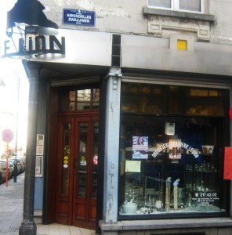
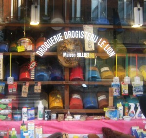

::: {#page .hfeed .site}
[Saltar al contenido](index.html#content){.skip-link
.screen-reader-text}

::: {#sidebar .sidebar}
::: {.site-branding}
[{.custom-logo
width="248" height="248" sizes="(max-width: 248px) 100vw, 248px"
srcset="../../../../../wp-content/uploads/2016/04/cropped-Manneken_Pis_Blog_Bruselas_Ricardo_Imbern-248.jpg 248w, ../../../../../wp-content/uploads/2016/04/cropped-Manneken_Pis_Blog_Bruselas_Ricardo_Imbern-248-150x150.jpg 150w"}](../../../../../index.html){.custom-logo-link}

[Blog Bruselas en español](../../../../../index.html)

El blog-guía escrito por españoles en Bruselas para los hispanoparlantes
que viven aquí y para los turistas que aprovechan los vuelos baratos
para descubrir el chocolate, la cerveza, la Grand Place y tantas otras
cosas buenas.

Menú y widgets
:::

::: {#secondary .secondary}
::: {#widget-area .widget-area role="complementary"}
Blog Bruselas es {#blog-bruselas-es .widget-title}
----------------

::: {.textwidget}
Un **blog en español escrito en Bruselas** por unos enamorados de la
capital de Bélgica, corazón mágico de Europa. Una ciudad pequeña y
grande, llena de gente, comida, eventos y rincones encantadores; para
descubrir y disfrutar sin dejarse aguar la fiesta por el tiempo (no es
tan malo).

Para quienes pasan por Bruselas, porque vienen de visita, de turismo o
tienen la suerte de vivir aquí. Sí quieres conocer más que los hoteles
en Bruselas, aprovecha los vuelos baratos y **vive la ciudad**.

Blog Bruselas es el bebé de [Ramón Suárez](http://www.ramonsuarez.com),
bruseleño convencido desde 2003.
:::

Espacios de trabajo compartido {#espacios-de-trabajo-compartido .widget-title}
------------------------------

::: {.textwidget}
[Betacowork Coworking Bruselas](http://www.betacowork.com) [Mapa de
espacios de coworking en Bélgica](http://coworkingbelgium.com)
:::

Último vídeo {#último-vídeo .widget-title}
------------

Asociados con Hispagenda, la guía digital de los españoles en Bélgica {#asociados-con-hispagenda-la-guía-digital-de-los-españoles-en-bélgica .widget-title}
---------------------------------------------------------------------

::: {.textwidget}
[{.attachment-medium
width="250" height="100"}](http://www.hispagenda.com)
:::

Más sobre Bruselas en otros idiomas {#más-sobre-bruselas-en-otros-idiomas .widget-title}
-----------------------------------

::: {.textwidget}
[Agenda.be](http://www.agenda.be) FR NL\
[Bruxelles Blog](http://www.bxlblog.be/) FR\
[Eventos para emprendedores y freelance en
Bruselas](http://www.betacowork.com/events/)\
[The Network
Brussels](http://groups.yahoo.com/group/TheNetworkBrussels/) EN\
[What\'s up in Belgium](http://www.whatsupin.be/) EN
:::

Más sobre Bélgica en Español {#más-sobre-bélgica-en-español .widget-title}
----------------------------

::: {.textwidget}
[Spaniards en Bélgica](http://www.spaniards.es/paises/belgica)
:::
:::
:::
:::

::: {#content .site-content}
::: {#primary .section .content-area}
::: {#main .site-main role="main"}
Etiqueta: arte {#etiqueta-arte .page-title}
==============

[Jardins en fête 2009. Domingo 27, la fiesta de los jardines de Bruselas](../../../../../index.html?p=625) {#jardins-en-fête-2009.-domingo-27-la-fiesta-de-los-jardines-de-bruselas .entry-title}
----------------------------------------------------------------------------------------------------------

::: {.entry-content}
[{width="480"
height="356"}](http://www.blogbruselas.com/blog/tag/arte/page/5/void(0);)

Bruselas es la ciudad más verde del mundo después de Washington. Esto se
lo debe en primer lugar al gran número de parques y jardines públicos
que tiene (40m² de espacios verdes por habitante, lo que deja en bragas
la inmensa mayoría de las ciudades españolas).

Pero se lo debe también a la gran cantidad de jardines particulares que
hay aquí. Basta con pasear por ahí y echar un ojo a las ventanas del
primer piso; por lo menos en uno de cada tres edificios, a través de las
clásicas habitaciones *en enfilade*,  lo que se ve es verde.

Como cada año, la [Bibliothèque René Pechère](http://www.bvrp.net/)
celebra este domingo la [fiesta de los
jardines](http://jardinsenfete.bvrp.net/main/dynmenu.aspx?lg=FR). Se
trata de la ocasión de visitar jardines particulares de la ciudad de la
mano de sus propietarios, aficionados a la jardinería.\
Pero es también la ocasión de conocer o de ver con nuevos ojos algunos
de los parques más curiosos de Bruselas, de la mano de un guía.\
Este año la jornada está dedicada al tema del agua, y habrá en total
cuarenta parques y jardines ([ver la
lista](http://jardinsenfete.bvrp.net/main/default.aspx?lg=FR)).

Para los jardines particulares es necesario reservar por internet.
Quedan pocas plazas; así que si os interesa ¡daos prisa!

Curiosidades:\
[René Péchère](http://www.bvrp.net/main/home.aspx?pager=A03_02)
(1908-2002) es uno de los más importantes arquitectos paisajistas del
siglo XX. Se hizo célebre por la concepción de los espacios públicos de
la EXPO58. Entre sus trabajos más conocidos de Bruselas se encuentran el
jardín del Mont des Arts, el jardín de la Cité Administrative y el
Botanique. Pero hay muchos más.
:::

[[Publicado el
]{.screen-reader-text}[24/09/200928/09/2009](../../../../../index.html?p=625)]{.posted-on}[[[Autor
]{.screen-reader-text}[Eduardo Lamas
Delgado](../../../../author/eduardo/index.html){.url .fn .n}]{.author
.vcard}]{.byline}[[Categorías ]{.screen-reader-text}[Gran
Bruselas](../../../../category/gran-bruselas/index.html)]{.cat-links}[[Etiquetas
]{.screen-reader-text}[arquitectura](../../../arquitectura/index.html),
[arte](../../index.html), [bruselas](../../../bruselas/index.html),
[fiesta](../../../fiesta/index.html),
[jardín](../../../jardin/index.html),
[parque](../../../parque/index.html),
[urbanismo](../../../urbanismo/index.html)]{.tags-links}

[KVS: el Teatro Real Flamenco de Bruselas](../../../../../index.html?p=515) {#kvs-el-teatro-real-flamenco-de-bruselas .entry-title}
---------------------------------------------------------------------------

::: {.entry-content}
El [KVS](http://www.kvs.be/) es el Koninklijke Vlaams Schouwburg, es
decir, el Teatro Real Flamenco de Bruselas.

 

 {width="320"
height="292"}

Pero no os mováis a engaño; este teatro nada tiene que ver con el *cante
jondo* ni con los *Pink Flamingos*. Se trata de uno de los más hermosos
teatros de Bruselas y lamentablemente, y como tantas cosas en esta
ciudad, es un absoluto desconocido para muchos.\
El [KVS](http://www.ebru.be/Architectuur/archkvs.html)  fue construido
en 1880-1887, y su fachada principal se debe al arquitecto Jean Baes
(1848-1914). Su estilo es el que aquí llaman "renaissance flamande". Se
trata de uno de los diferentes historicismos que se desarrollan en esos
años en cada país europeo para recrear un supuesto estilo "nacional"
reinterpretando la arquitectura de un período que se supone áulico. Un
ejemplo del equivalente en España son las fachadas del primer tramo de
la Gran Vía de Madrid, donde se pretende recrear la arquitectura bajo el
reinado de Carlos V.

 

Foto: [Mon Nikon et
moi](http://monnikonetmoi.skynetblogs.be/post/7069857/theatre-royal-flamand-de-bruxelles)

Las terrazas laterales son las escaleras de incendios, avanzadísimas
para la época.

El KVS sufrió una profunda remodelación hace poco tiempo (se empezó en
2001), y que le ha dado el magnífico interior de que hoy dispone, así
como el edificio anejo, el Box, con una sala suplementaria y donde
tienen lugar muy buenos saraos con ese gusto que sólo tienen los
flamencos.

foto: [KVS](http://www.ebru.be/Architectuur/archkvs.html)

La sala principal es el Bol, la bola, por oposición al Box, la caja. Y
es que el edificio antiguo se ha convertido en el envoltorio de una
enorme esfera de hormigón, en cuyo interior se encuentran los palcos y
el patio de butacas. El contraste entre la austeridad de las partes
nuevas con la decoración abigarrada de las antiguas tiene especial
encanto muy de Bruselas.

El teatro ocupa el lugar de un antiguo arsenal de artillería
(1780-1781), del que se ha conservado la fachada principal de estilo
neoclásico. Hoy es la fachada trasera del teatro, que da al Quai aux
Pierres de Taille/Arduinkaai.

{width="334"
height="249"}

 La
[programación](http://www.kvs.be/index2.php?page=program&discipline=1/)
del [KVS](http://www.kvs.be/) es de las más interesantes de
Bruselas. Casi todas las obras son en neerlandés, pero todas tienen
sobretítulos en francés y en inglés. También hay obras bilingües o en
inglés o en francés. Y no se reduce a teatro; también hay danza,
conciertos, conferencias, lecturas...

Tienen una declarada política de apertura al cosmopolitismo de Bruselas
y hacen verdaderos esfuerzos por hacer del teatro un lugar para todos.

Y finalmente, el bar del teatro, en el ***foyer,*** es la única zona que
conserva la decoración original, y es sencillamente genial. El box
cuenta con otro bar, el Café Congo, que tampoco está mal.

 \
Foto: [KVS](http://www.ebru.be/Architectuur/archkvs.html)\
** **

Por supuesto, no hay que olvidar tampoco el lado más lúdico, y es que el
KVS también organiza fiestas en el espacio del BOX, fiestas con mucha
clase y buena música electrónica. Se trata de los saraos [BAL IN DE
BOX](http://www.facebook.com/group.php?gid=58378236845&ref=ts/) , que se
organizan regularmente.

 \
foto: [Peter Forret](http://www.flickr.com/photos/pforret//)

Tomad nota de la próxima: **viernes 16 de octubre**

[Programa:]{style="text-decoration: underline"}

[\*gran sala\*]{style="text-decoration: underline"}\
**DJ NERO** (Free The Funk, Suite, Poplife)

23h30\
[MADENSUYU](http://www.madensuyu.be/) -- concierto en vivo (ver
[YouTube](http://www.youtube.com/watch?v=mWG-cOkXYwY))

1h00\
[THE GLIMMERS](http://www.myspace.com/theglimmers) presentan [DISKO
DRUNKARDS](http://www.myspace.com/diskodrunkards)\
\>\> los primeros 500 recibirán un CD gratis!!!
(ver [YouTube](http://www.youtube.com/watch?v=TdPAevsXUIo))

[DJ BLACKJACK aka RAKESH](http://www.myspace.com/blackjackmusicman)
(KVS, Charlatan,...)

[\*café congo\*]{style="text-decoration: underline"}\
[TLP all night long](http://www.myspace.com/tlptroubleman) (KVS,
StuBru,...)

Entrada: 10 euros

** **

**Un lugar que hay que descubrir.\
**

** **

Curiosidades:

Existe una curiosa anécdota en torno a la fundación del edificio en
1887. El teatro fue construido por iniciativa del Ayuntamiento de
Bruselas, y para invitar al rey Leopoldo II a la ceremonia de
inauguración el burgomaestre (alcalde) se dirigió a él en estos
términos: ***« J'aurai l'honneur, Sire, de vous souhaiter la bievenue en
Flamand, dans le temple érigé pour l'art dramatique flamand »*** (Tendré
el honor, Señor, de desearle la bienvenida en flamenco, en el templo
dedicado al arte dramático flamenco), a lo que el rey respondió: ***«
Mon cher bourgmestre, vous m'offrez là une bonne occasion pour vous
répondre dans cette même langue nationale, en Flamand »*** (Mi querido
alcalde, con ello me ofrece Vd. la ocasión de responderle en esa misma
lengua nacional, en flamenco). Y así lo hizo, y aquella ceremonia (un 13
de octubre, día de san Eduardo) se convirtió en algo así como en un
reconocimiento oficial de esta lengua, aunque todavía habría mucho
camino por hacer. De hecho, se trataba de la primera vez en que un rey
belga hablaba en neerlandés en una ceremonia oficial. El burgomaestre en
cuestión era Charles Buls, quien puso por primera vez los carteles
bilingües en las calles de Bruselas; los otros municipios lo hicieron
después.
:::

[[Publicado el
]{.screen-reader-text}[24/09/2009](../../../../../index.html?p=515)]{.posted-on}[[[Autor
]{.screen-reader-text}[Eduardo Lamas
Delgado](../../../../author/eduardo/index.html){.url .fn .n}]{.author
.vcard}]{.byline}[[Categorías
]{.screen-reader-text}[Artes](../../../../category/artes/index.html),
[Gran
Bruselas](../../../../category/gran-bruselas/index.html)]{.cat-links}[[Etiquetas
]{.screen-reader-text}[arquitectura](../../../arquitectura/index.html),
[arte](../../index.html), [bar](../../../bar/index.html),
[beber](../../../beber/index.html), [belga](../../../belga/index.html),
[belgica](../../../belgica/index.html),
[bruselas](../../../bruselas/index.html),
[fiesta](../../../fiesta/index.html),
[flamenco](../../../flamenco/index.html),
[teatro](../../../teatro/index.html)]{.tags-links}[[[6 comentarios[ en
KVS: el Teatro Real Flamenco de
Bruselas]{.screen-reader-text}]{.dsq-postid
dsqidentifier="515 http://www.blogbruselas.com/?p=515"}](../../../../../index.html?p=515#comments)]{.comments-link}

[La Droguería le Lion](../../../../../index.html?p=569) {#la-droguería-le-lion .entry-title}
-------------------------------------------------------

::: {.entry-content}
{.aligncenter
.size-medium .wp-image-634 width="296" height="300"
sizes="(max-width: 296px) 100vw, 296px"
srcset="../../../../../wp-content/uploads/2009/09/0151-296x300.jpg 296w, ../../../../../wp-content/uploads/2009/09/0151.JPG 936w"}{.aligncenter
.size-medium .wp-image-598 width="300" height="284"
sizes="(max-width: 300px) 100vw, 300px"
srcset="../../../../../wp-content/uploads/2009/09/0013-300x284.jpg 300w, ../../../../../wp-content/uploads/2009/09/0013.JPG 998w"}

La droguería Le Lion existe desde 1875. Situada en la rue de Laeken
haciendo esquina con la rue  l'Hirondelle detrás del cine de brouker .
La diferencia entre los grandes supermercados es que gracias a su larga
experiencia sabe aconsejar según tus necesidades. Tiene más de 4500
artículos, desde lo más sofisticado hasta lo más rustico.  El espacio es
estrecho, desordenado,  casi laberintico. Con aspecto antiguo que nos
hace salir del tiempo real durante unos minutos.  Siempre que voy allí,
termino dando excusas a los dependientes para alargar mi estancia. Ese
olor  en el aire a jabón natural, a acrílicos... a historia. Por allí
han pasado Magritte, Ensor, Delvaux y tantos y tantos anónimos  y
artistas  en busca de la calidad  y precisión que ofrecen.

Personalmente encuentro muy interesante la gran variedad  de pigmentos
 naturales que posee.  Con más de 90 colores diferentes  ¡así quién no
ve la vida en color! Estos pigmentos se mezclan con pintura blanca
plástica o cualquier otro tipo  y dan un toque especial a los muros  de
tu casa.

La droguería Le Lion es otra historia...

{.aligncenter
.size-full .wp-image-595 width="567" height="468"
sizes="(max-width: 567px) 100vw, 567px"
srcset="../../../../../wp-content/uploads/2009/09/MELEMEL-copie3.jpg 567w, ../../../../../wp-content/uploads/2009/09/MELEMEL-copie3-300x247.jpg 300w"}
:::

[[Publicado el
]{.screen-reader-text}[23/09/200929/09/2009](../../../../../index.html?p=569)]{.posted-on}[[[Autor
]{.screen-reader-text}[Almudena](../../../../author/almudena/index.html){.url
.fn .n}]{.author .vcard}]{.byline}[[Categorías
]{.screen-reader-text}[Gran
Bruselas](../../../../category/gran-bruselas/index.html)]{.cat-links}[[Etiquetas
]{.screen-reader-text}[arte](../../index.html),
[curiosidades](../../../curiosidades/index.html),
[tiendas](../../../tiendas/index.html)]{.tags-links}[[[10 comentarios[
en La Droguería le Lion]{.screen-reader-text}]{.dsq-postid
dsqidentifier="569 http://www.blogbruselas.com/?p=569"}](../../../../../index.html?p=569#comments)]{.comments-link}

[LDN/BRU: arte, debate y creatividad viajan en Eurostar.](../../../../../index.html?p=552) {#ldnbru-arte-debate-y-creatividad-viajan-en-eurostar. .entry-title}
------------------------------------------------------------------------------------------

::: {.entry-content}
{.alignnone
width="465" height="1280"}

El primer fin de semana de Octubre, Bruselas [Gare du
Congres](http://www.bruxelles-congres.eu/) será la sede una serie de
actividades con el objetivo de fomentar el intercambio cultural entre
dos ciudades capitales en Europa: Londres y Bruselas. Estas actividades
serán completadas con otras que tendrán lugar en Londres en el marco del
mismo programa.

El sábado 3 habrá una conferencia para transmitir a la sociedad la
importancia de desarrollar entornos creativos. En ella seguro que salen
recomendaciones sobre como las ciudades puede hacer para movilizar
creatividad y conocimiento y de esta forma incrementar el crecimiento y
el empleo.  Hablaran el profesor John Hutnyk de la universidad
[Goldsmiths](http://www.gold.ac.uk/) de Londres, Monika
Dzięgielewska-Geitz del programa [Creative
Cities](http://creativecities.britishcouncil.org/) asi como Henri Simons
que fue antiguo Bourgmester de Bruselas de cultura y urbanismo.

De sabado a domingo se expondran obras de artistas multidisciplinarios
de ambas ciudades. Asimismo, la galeria-apartamento 105 Besme acogera la
instalacion video *"Vaudeville"* de la artista londinense Cadi Helene
Rowlands.

Como no podía ser de otra forma, el evento se cierra con música fina.
Una seleccion de funk, sweet soul, 80's rare groove y nu-disco a cargo
de la incansable Lady Jane, la incandescente Dance Machine, [Will
Martin](http://www.myspace.com/willmartinmusic) y el colectivo
londinense de DJs [A Love
Supreme.](http://www.facebook.com/group.php?gid=51935736197)

Como gestor de eventos culturales este tipo de intercambios en ambas
direcciones me parecen muy interesantes y tentadores porque te permite
estar en contacto con la escena cultural de ambas urbes. Por qué no
hacer algo así con una ciudad española? Habría que intentarlo.
:::

[[Publicado el
]{.screen-reader-text}[16/09/200916/09/2009](../../../../../index.html?p=552)]{.posted-on}[[[Autor
]{.screen-reader-text}[Manuel
Pueyo](../../../../author/easysun/index.html){.url .fn .n}]{.author
.vcard}]{.byline}[[Categorías
]{.screen-reader-text}[Artes](../../../../category/artes/index.html)]{.cat-links}[[Etiquetas
]{.screen-reader-text}[arte](../../index.html),
[creatividad](../../../creatividad/index.html),
[londres](../../../londres/index.html),
[urbanismo](../../../urbanismo/index.html)]{.tags-links}[[[1 comentario[
en LDN/BRU: arte, debate y creatividad viajan en
Eurostar.]{.screen-reader-text}]{.dsq-postid
dsqidentifier="552 http://www.blogbruselas.com/?p=552"}](../../../../../index.html?p=552#comments)]{.comments-link}

[Un viajero en el Cercle des Voyageurs](../../../../../index.html?p=468) {#un-viajero-en-el-cercle-des-voyageurs .entry-title}
------------------------------------------------------------------------

::: {.entry-content}
[**Casitas de Extremadura es una** ]{lang="es-ES"}[**exposición
fotográfica dedicada a paisajes**]{lang="es-ES"}[[
]{lang="es-ES"}]{style="text-decoration: line-through;"}[ **de
Extremadura. A partir del 10 de Septiembre.\
**]{lang="es-ES"}

[[Pepe Higuero es un hombre del renacimiento. Director en varios medios
de
comunicación]{lang="es-ES"}]{style="font-family: Apple Braille,Times New Roman"}[[[
]{lang="es-ES"}]{style="font-family: Apple Braille,Times New Roman"}]{style="text-decoration: line-through;"}[[,
DJ en clubes históricos de la capital cacereña, coleccionista de
vinilos, actor, fotógrafo.
]{lang="es-ES"}]{style="font-family: Apple Braille,Times New Roman"}

[[En 2009, nos sorprende como comendador de Alcuéscar en su papel de
coordinador del voluntariado de Cáceres Evocado, ese proyecto de la
Consejería de Cultura y Turismo que por segundo año consecutivo ha
convertido Cáceres en una recreación histórica de la España
barroca.]{lang="es-ES"}]{style="font-family: Apple Braille,Times New Roman"}

[[Como fotógrafo, destaca en fotografía social, el seguimiento de
acontecimientos extraordinarios y los reportajes de ciudades o países.
Ha realizado exposiciones sobre las ciudades de Londres, San José, La
Habana, Cuzco, Lima, Cáceres o Leningrado. Y de espacios naturales como
Las Hurdes o
Machu-Pichu.]{lang="es-ES"}]{style="font-family: Apple Braille,Times New Roman"}

[[Con este CV, el [lugar escogido](http://www.lecercledesvoyageurs.com/)
en Bruselas no podía ser más adecuado para acoger a este gran viajero de
ciudades, disciplinas y
conceptos.]{lang="es-ES"}]{style="font-family: Apple Braille,Times New Roman"}

[Las obras de la exposición de Pepe Higuero, CASITAS, corresponden a
espacios naturales y paisajes urbanos de Extremadura: cerezos del Jerte,
Sierra de Montánchez, Puente de Alcántara, Monfragüe, Trujillo,
Cáceres... ]{style="font-family: Apple Braille,Times New Roman"}

[\
]{style="font-family: Apple Braille,Times New Roman"}

{.alignnone
.size-full .wp-image-469 width="546" height="390"
sizes="(max-width: 546px) 100vw, 546px"
srcset="../../../../../wp-content/uploads/2009/09/cercle-1.jpg 780w, ../../../../../wp-content/uploads/2009/09/cercle-1-300x214.jpg 300w"}

[Junto a fotografías de concepción tradicional, el autor presenta otras
realizadas digitalmente con técnicas de HDR y coloreado. Hay
representaciones de la realidad y otras de composición imaginada.
]{style="font-family: Apple Braille,Times New Roman"}

[{.alignnone
.size-full .wp-image-470 width="662" height="472"
sizes="(max-width: 662px) 100vw, 662px"
srcset="../../../../../wp-content/uploads/2009/09/cercle-2.jpg 945w, ../../../../../wp-content/uploads/2009/09/cercle-2-300x214.jpg 300w"}\
]{style="font-family: Apple Braille,Times New Roman"}

[[Pepe tiene mucha relación con Bruselas. Su hija Marta lleva varios
años establecida en la capital belga. Donde además de trabajar en el
departamento financiero de una gran multinacional de textiles, colabora
en proyectos musicales en varios grupos locales y pincha discos en
varios clubes de la capital
belga.]{lang="es-ES"}]{style="font-family: Apple Braille,Times New Roman"}
:::

[[Publicado el
]{.screen-reader-text}[01/09/200902/10/2009](../../../../../index.html?p=468)]{.posted-on}[[[Autor
]{.screen-reader-text}[Manuel
Pueyo](../../../../author/easysun/index.html){.url .fn .n}]{.author
.vcard}]{.byline}[[Categorías
]{.screen-reader-text}[Artes](../../../../category/artes/index.html)]{.cat-links}[[Etiquetas
]{.screen-reader-text}[arte](../../index.html),
[bruselas](../../../bruselas/index.html),
[casitas](../../../casitas/index.html), [cercle des
voyageurs](../../../cercle-des-voyageurs/index.html),
[exposicion](../../../exposicion/index.html),
[extremadura](../../../extremadura/index.html),
[fotografia](../../../fotografia/index.html)]{.tags-links}[[[9
comentarios[ en Un viajero en el Cercle des
Voyageurs]{.screen-reader-text}]{.dsq-postid
dsqidentifier="468 http://www.blogbruselas.com/?p=468"}](../../../../../index.html?p=468#comments)]{.comments-link}

Navegación de entradas {#navegación-de-entradas .screen-reader-text}
----------------------

::: {.nav-links}
[Página anterior](../4/index.html){.prev .page-numbers} [[Página
]{.meta-nav .screen-reader-text}1](../../index.html){.page-numbers}
[...]{.page-numbers .dots} [[Página ]{.meta-nav
.screen-reader-text}4](../4/index.html){.page-numbers} [[Página
]{.meta-nav .screen-reader-text}5]{.page-numbers .current}
:::
:::
:::
:::

::: {.site-info}
[Creado con WordPress](https://es.wordpress.org/)
:::
:::
