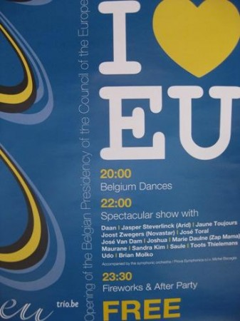
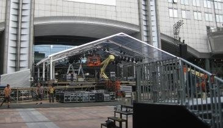
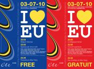
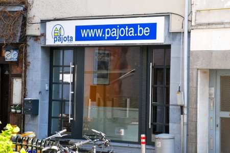

::: {#page .hfeed .site}
[Saltar al contenido](index.html#content){.skip-link
.screen-reader-text}

::: {#sidebar .sidebar}
::: {.site-branding}
[{.custom-logo
width="248" height="248" sizes="(max-width: 248px) 100vw, 248px"
srcset="../../../wp-content/uploads/2016/04/cropped-Manneken_Pis_Blog_Bruselas_Ricardo_Imbern-248.jpg 248w, ../../../wp-content/uploads/2016/04/cropped-Manneken_Pis_Blog_Bruselas_Ricardo_Imbern-248-150x150.jpg 150w"}](../../../index.html){.custom-logo-link}

[Blog Bruselas en español](../../../index.html)

El blog-guía escrito por españoles en Bruselas para los hispanoparlantes
que viven aquí y para los turistas que aprovechan los vuelos baratos
para descubrir el chocolate, la cerveza, la Grand Place y tantas otras
cosas buenas.

Menú y widgets
:::

::: {#secondary .secondary}
::: {#widget-area .widget-area role="complementary"}
Blog Bruselas es {#blog-bruselas-es .widget-title}
----------------

::: {.textwidget}
Un **blog en español escrito en Bruselas** por unos enamorados de la
capital de Bélgica, corazón mágico de Europa. Una ciudad pequeña y
grande, llena de gente, comida, eventos y rincones encantadores; para
descubrir y disfrutar sin dejarse aguar la fiesta por el tiempo (no es
tan malo).

Para quienes pasan por Bruselas, porque vienen de visita, de turismo o
tienen la suerte de vivir aquí. Sí quieres conocer más que los hoteles
en Bruselas, aprovecha los vuelos baratos y **vive la ciudad**.

Blog Bruselas es el bebé de [Ramón Suárez](http://www.ramonsuarez.com),
bruseleño convencido desde 2003.
:::

Espacios de trabajo compartido {#espacios-de-trabajo-compartido .widget-title}
------------------------------

::: {.textwidget}
[Betacowork Coworking Bruselas](http://www.betacowork.com) [Mapa de
espacios de coworking en Bélgica](http://coworkingbelgium.com)
:::

Último vídeo {#último-vídeo .widget-title}
------------

Asociados con Hispagenda, la guía digital de los españoles en Bélgica {#asociados-con-hispagenda-la-guía-digital-de-los-españoles-en-bélgica .widget-title}
---------------------------------------------------------------------

::: {.textwidget}
[{.attachment-medium
width="250" height="100"}](http://www.hispagenda.com)
:::

Más sobre Bruselas en otros idiomas {#más-sobre-bruselas-en-otros-idiomas .widget-title}
-----------------------------------

::: {.textwidget}
[Agenda.be](http://www.agenda.be) FR NL\
[Bruxelles Blog](http://www.bxlblog.be/) FR\
[Eventos para emprendedores y freelance en
Bruselas](http://www.betacowork.com/events/)\
[The Network
Brussels](http://groups.yahoo.com/group/TheNetworkBrussels/) EN\
[What\'s up in Belgium](http://www.whatsupin.be/) EN
:::

Más sobre Bélgica en Español {#más-sobre-bélgica-en-español .widget-title}
----------------------------

::: {.textwidget}
[Spaniards en Bélgica](http://www.spaniards.es/paises/belgica)
:::
:::
:::
:::

::: {#content .site-content}
::: {#primary .section .content-area}
::: {#main .site-main role="main"}
Etiqueta: belgica {#etiqueta-belgica .page-title}
=================

[Fiesta de la presidencia belga de la UE, este sábado](../../../index.html?p=2455) {#fiesta-de-la-presidencia-belga-de-la-ue-este-sábado .entry-title}
----------------------------------------------------------------------------------

::: {.entry-content}
Para los que osen no ver el partido España-Paraguay o los que después de
celebrar la victoria en la Bolsa quieran seguir con la fiesta, la
Presidencia belga de la UE organiza una movida delante del Parlamento
Europeo\
[{.aligncenter
.size-medium .wp-image-2474 width="337" height="450"
sizes="(max-width: 337px) 100vw, 337px"
srcset="../../../wp-content/uploads/2010/07/FiestaPresidUE-337x450.jpg 337w, ../../../wp-content/uploads/2010/07/FiestaPresidUE-112x150.jpg 112w, ../../../wp-content/uploads/2010/07/FiestaPresidUE.jpg 367w"}](http://www.blogbruselas.com/2010/07/fiesta-de-la-presidencia-belga-de-la-ue-este-sabado.html/fiestapresidue)\
La cosa comienza a las 8 de la tarde bajo el lema "I love EU" = "I love
you", y promete durar hasta altas horas de la madrugada.

Para abrir el apetito los espectadores serán invitados a convertirse en
actores de una coreografía (televisada) que será ejecutada en 12
ciudades belgas: [Anvers, Bruges, Bruxelles, Charleroi, Eupen, Gand,
Hasselt, Liège, Leuven, Louvain-la-Neuve, Namur et
Tournai.]{style="font-family: 'Trebuchet MS', sans-serif; font-size: small;"}

[Luego los edificios del Parlamento servirán de decorado de un
espectáculo de luz y
sonido.]{style="font-family: 'Trebuchet MS', sans-serif; font-size: small;"}

[A las 10 comienza el espectáculo
musical:]{style="font-family: 'Trebuchet MS', sans-serif; font-size: small;"}

[-- el jazzista belga Toots Thielemans, Marie Daulne, cantante congolesa
del grupo [Zap Mama](http://www.youtube.com/watch?v=VxkbipVwZv4), la
cantante Maurane, Sandra Kim la única belga que ha ganado un concurso de
Eurovisión (tenía entonces 13 años, la pobre), el cantante de heavy
metal alemán [U.D.O.](http://www.youtube.com/watch?v=HpB_5fRq730) y el
grupo belga independiente
[Daan](http://www.youtube.com/watch?v=WjNUJSuV42k); el cantante,
guitarrista y pianista [Jasper
Steverlink](http://www.youtube.com/watch?v=fNQahTd2IT8&feature=related).]{style="font-family: 'Trebuchet MS', sans-serif; font-size: small;"}

[ Y a partir de las 11:30 la fiesta se traslada a la plaza de
Luxemburgo. Además se asegura que acudirán el Rey Alberto y Paola y Van
Rompuy y Ives Leterme, aunque esto último no se si es un atractivo más
de la fiesta o justamente lo contrario.\
[{.aligncenter
.size-full .wp-image-2486 width="365" height="210"
sizes="(max-width: 365px) 100vw, 365px"
srcset="../../../wp-content/uploads/2010/07/MailPE.jpg 365w, ../../../wp-content/uploads/2010/07/MailPE-150x86.jpg 150w"}](http://www.blogbruselas.com/2010/07/fiesta-de-la-presidencia-belga-de-la-ue-este-sabado.html/mailpe)]{style="font-family: 'Trebuchet MS', sans-serif; font-size: small;"}

[ ]{style="font-family: 'Trebuchet MS', sans-serif; font-size: small;"}
:::

[[Publicado el
]{.screen-reader-text}[02/07/201013/07/2010](../../../index.html?p=2455)]{.posted-on}[[[Autor
]{.screen-reader-text}[Álvaro Marín](../../../index.html?author=4){.url
.fn .n}]{.author .vcard}]{.byline}[[Categorías
]{.screen-reader-text}[Artes](../../category/artes/index.html), [Gran
Bruselas](../../category/gran-bruselas/index.html)]{.cat-links}[[Etiquetas
]{.screen-reader-text}[belgica](index.html), [concierto de Daan en
Bruselas](../concierto-de-daan-en-bruselas/index.html), [concierto de
Jasper Steverlink en
Bruselas](../concierto-de-jasper-steverlink-en-bruselas/index.html),
[concierto de Marie Daulne Zap Mama en
Bruselas](../concierto-de-marie-daulne-zap-mama-en-bruselas/index.html),
[concierto de Maurane en
Bruselas](../concierto-de-maurane-en-bruselas/index.html), [concierto de
Sandra Kim Eurovision en
Bruselas](../concierto-de-sandra-kim-eurovision-en-bruselas/index.html),
[concierto de Toots Thielemans en
Bruselas](../concierto-de-toots-thielemans-en-bruselas/index.html),
[concierto de U.D.O. en
Bruselas](../concierto-de-u-d-o-en-bruselas/index.html), [concierto
presidencia belga de la Unión Europea Parlamento
Europeo](../concierto-presidencia-belga-de-la-union-europea-parlamento-europeo/index.html),
[conciertos frente al Parlamento
Europeo](../conciertos-frente-al-parlamento-europeo/index.html), [danza
en Bruselas](../danza-en-bruselas/index.html), [espectáculo de luz y
sonido en
Bruselas](../espectaculo-de-luz-y-sonido-en-bruselas/index.html),
[fiesta](../fiesta/index.html), [I love
EU/You](../i-love-euyou/index.html),
[musica](../musica/index.html)]{.tags-links}

[Presidencia Belga por todo lo alto](../../../index.html?p=2460) {#presidencia-belga-por-todo-lo-alto .entry-title}
----------------------------------------------------------------

::: {.entry-content}
[{.alignright
.size-full .wp-image-2461 width="190" height="139"
sizes="(max-width: 190px) 100vw, 190px"
srcset="../../../wp-content/uploads/2010/07/ENG-FRA.jpg 190w, ../../../wp-content/uploads/2010/07/ENG-FRA-150x109.jpg 150w"}](../../../wp-content/uploads/2010/07/ENG-FRA.jpg)Desde
el 1 de julio de 2010 y tras recibir el relevo de España, **Bélgica** es
el nuevo país encargado de presidir el Consejo de la Unión Europea.
Aprovechando que ya ha comenzado el verano, y con ello el buen tiempo,
el país ha decidido celebrar, **este finde de semana**, su presidencia
con una serie de eventos, que, sin duda, harán disfrutar a todo el
mundo.

-   El **viernes 2 de julio**, tendrá lugar la **ceremonia de apertura**
    de la Presidencia Belga de la Unión Europa con un concierto del
    barítono también belga, **José Van Dam**.

```{=html}
<!-- -->
```
-   El **sábado 3 de julio**, desde las **20: 00 hasta las 21:30** se
    celebrará "**Belgium Dance Europe!**" en la que todos los asistentes
    tendréis la oportunidad de **aprender una coreografía** que se
    bailará simultáneamente en **12 ciudades de Bélgica** (Amberes,
    Brujas, Bruselas, Charleroi, Eupen, Gante, Hasselt, Lieja, Lovaina,
    Lovaina --  la Nueva, Namur, Tournai).

```{=html}
<!-- -->
```
-   **A las 22:00**: podréis disfrutar del  espectáculo: "**I love
    EU**". El escenario será la explanada del **Parlamento Europeo** y
    la **Plaza de Luxemburgo** con un popurrí de música, danza, fuegos
    artificiales y otras sorpresas. Todo ello, de la mano de artistas
    internacionales belgas. Y para todos los que quieran seguir de
    fiesta, les espera la **After Party** a partir de las **23:3o.**

¡No te lo pierdas!

Para más información podéis consultar la web de la Presidencia Belga:
[www.eurotrio.be](http://www.eutrio.be/)
:::

[[Publicado el
]{.screen-reader-text}[01/07/201001/07/2010](../../../index.html?p=2460)]{.posted-on}[[[Autor
]{.screen-reader-text}[Hispagenda](../../author/hispagenda/index.html){.url
.fn .n}]{.author .vcard}]{.byline}[[Categorías
]{.screen-reader-text}[Artes](../../category/artes/index.html), [Gran
Bruselas](../../category/gran-bruselas/index.html)]{.cat-links}[[Etiquetas
]{.screen-reader-text}[belgica](index.html), [Belgium Dance
Europe](../belgium-dance-europe/index.html), [conciertos en
Bruselas](../conciertos-en-bruselas/index.html), [I love
EU](../i-love-eu/index.html), [Presidencia Belga de la Unión
Europea](../presidencia-belga-de-la-union-europea/index.html)]{.tags-links}[[[3
comentarios[ en Presidencia Belga por todo lo
alto]{.screen-reader-text}]{.dsq-postid
dsqidentifier="2460 http://www.blogbruselas.com/?p=2460"}](../../../index.html?p=2460#comments)]{.comments-link}

[De corresponsal en Flandes](../../../index.html?p=2347) {#de-corresponsal-en-flandes .entry-title}
--------------------------------------------------------

::: {.entry-content}
[{.alignleft
width="65" height="97"}](http://www.flandes.net/)Los estudiantes Erasmus
que vayan a realizar sus estudios en Bélgica están de enhorabuena.
Resulta que la [Oficina de Turismo de Bélgica: Flandes y
Bruselas](http://www.flandes.net/) busca **corresponsal español**. Si
vas a estudiar en Amberes, Gante o Lovaina, tienes buenas dotes de
comunicación, participas en redes sociales y sobre todo, tienes don de
gentes; esta es tu gran oportunidad para ganar hasta **1.000 euros** al
mes, que incluyen tu estancia en Flandes, billetes de tren para viajar
por las distintas ciudades de la región y además, entradas gratis para
festivales, museos y otros eventos.

A cambio deberás escribir un blog semanal sobre tu vida y experiencias
en Flandes. No lo dudes, y envía tu currículum vítae antes del **12 de
julio** a la dirección <practicas@flandes.net> incluyendo una carta en
la que cuentes los motivos que te han llevado a presentarte a este
concurso, así como un vídeo de no más de 3 minutos presentándote a ti
mismo y en formato wmv.

Si quieres más información consulta
[Hispagenda](http://www.hispagenda.com/index.html#flandes).

¡No te lo pienses! Y contribuye a poner tu pica en Flandes.
:::

[[Publicado el
]{.screen-reader-text}[24/06/201024/06/2010](../../../index.html?p=2347)]{.posted-on}[[[Autor
]{.screen-reader-text}[Hispagenda](../../author/hispagenda/index.html){.url
.fn .n}]{.author .vcard}]{.byline}[[Categorías
]{.screen-reader-text}[Breves](../../category/breves/index.html),
[Ideas](../../category/ideas/index.html)]{.cat-links}[[Etiquetas
]{.screen-reader-text}[Amberes](../amberes/index.html),
[belgica](index.html), [corresponsal
español](../corresponsal-espanol/index.html), [Erasmus
Belgica](../erasmus-belgica/index.html), [Gante](../gante/index.html),
[hispagenda](../hispagenda/index.html),
[Lovaina](../lovaina/index.html), [Turismo
Flandes](../turismo-flandes/index.html)]{.tags-links}[[[1 comentario[ en
De corresponsal en Flandes]{.screen-reader-text}]{.dsq-postid
dsqidentifier="2347 http://www.blogbruselas.com/?p=2347"}](../../../index.html?p=2347#comments)]{.comments-link}

[Cosas belgas](../../../index.html?p=2006) {#cosas-belgas .entry-title}
------------------------------------------

::: {.entry-content}
Por ejemplo, plantar un árbol justo delante de un semáforo.

Un, dos, tres, responda otra vez.

[{.alignnone
width="450"
height="300"}](http://www.photoshelter.com/c/bernalrevert/image/I0000B4j6h4rWNhM)

(Visto junto al Parc du Cinquantenaire)
:::

[[Publicado el
]{.screen-reader-text}[27/05/201027/05/2010](../../../index.html?p=2006)]{.posted-on}[[[Autor
]{.screen-reader-text}[Bernal
Revert](../../../index.html?author=30){.url .fn .n}]{.author
.vcard}]{.byline}[[Categorías
]{.screen-reader-text}[Humor](../../category/humor/index.html)]{.cat-links}[[Etiquetas
]{.screen-reader-text}[belga](../belga/index.html),
[belgica](index.html), [Blog Bruselas](../blog-bruselas/index.html),
[Cosas belgas](../cosas-belgas/index.html),
[fotografia](../fotografia/index.html), [Humor](../humor/index.html),
[urbanismo](../urbanismo/index.html)]{.tags-links}[[[5 comentarios[ en
Cosas belgas]{.screen-reader-text}]{.dsq-postid
dsqidentifier="2006 http://www.blogbruselas.com/?p=2006"}](../../../index.html?p=2006#comments)]{.comments-link}

[¡Como van estos belgas!](../../../index.html?p=1858) {#como-van-estos-belgas .entry-title}
-----------------------------------------------------

::: {.entry-content}
El sabado, paseando Halle (si la de BHV) vi este anuncio de
[Pajota](http://www.pajota.be).

Un negocio al ladito de la iglesia y el ayuntamiento. ¡Que descaro!
¡Adonde vamos a llegar!

[{.aligncenter
.size-medium .wp-image-1857 width="450" height="301"
sizes="(max-width: 450px) 100vw, 450px"
srcset="../../../wp-content/uploads/2010/04/DSC_0029_21-450x301.jpg 450w, ../../../wp-content/uploads/2010/04/DSC_0029_21-150x100.jpg 150w, ../../../wp-content/uploads/2010/04/DSC_0029_21-1024x686.jpg 1024w"}](http://www.blogbruselas.com/2010/04/%c2%a1como-van-estos-belgas.html/dsc_0029_2-2)
:::

[[Publicado el
]{.screen-reader-text}[27/04/201010/06/2010](../../../index.html?p=1858)]{.posted-on}[[[Autor
]{.screen-reader-text}[Álvaro Marín](../../../index.html?author=4){.url
.fn .n}]{.author .vcard}]{.byline}[[Categorías
]{.screen-reader-text}[Humor](../../category/humor/index.html)]{.cat-links}[[Etiquetas
]{.screen-reader-text}[belgica](index.html),
[carteles](../carteles/index.html), [cosas del
multilingüísmo](../cosas-del-multilinguismo/index.html),
[escaparates](../escaparates/index.html),
[fotografia](../fotografia/index.html), [inmobiliaria
pajota](../inmobiliaria-pajota/index.html)]{.tags-links}[[[2
comentarios[ en ¡Como van estos
belgas!]{.screen-reader-text}]{.dsq-postid
dsqidentifier="1858 http://www.blogbruselas.com/?p=1858"}](../../../index.html?p=1858#comments)]{.comments-link}

Navegación de entradas {#navegación-de-entradas .screen-reader-text}
----------------------

::: {.nav-links}
[[Página ]{.meta-nav .screen-reader-text}1]{.page-numbers .current}
[[Página ]{.meta-nav
.screen-reader-text}2](page/2/index.html){.page-numbers}
[...]{.page-numbers .dots} [[Página ]{.meta-nav
.screen-reader-text}4](page/4/index.html){.page-numbers} [Página
siguiente](page/2/index.html){.next .page-numbers}
:::
:::
:::
:::

::: {.site-info}
[Creado con WordPress](https://es.wordpress.org/)
:::
:::
