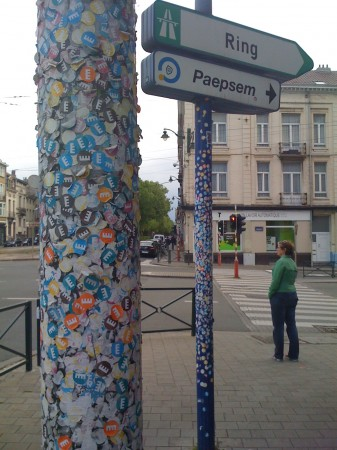
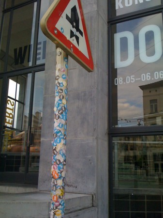
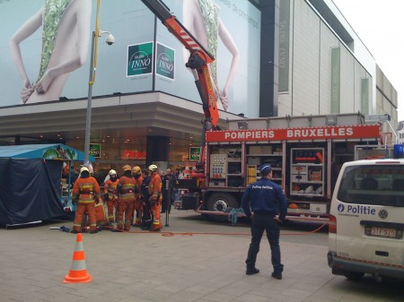
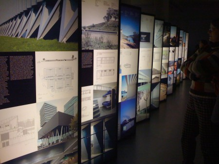
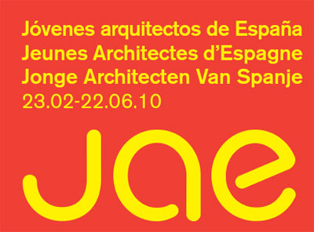
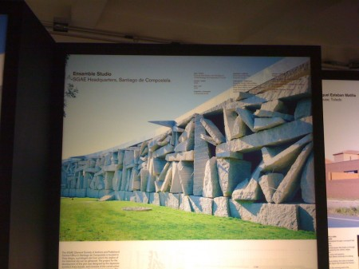

::: {#page .hfeed .site}
[Saltar al contenido](index.html#content){.skip-link
.screen-reader-text}

::: {#sidebar .sidebar}
::: {.site-branding}
[{.custom-logo
width="248" height="248" sizes="(max-width: 248px) 100vw, 248px"
srcset="../../../../../wp-content/uploads/2016/04/cropped-Manneken_Pis_Blog_Bruselas_Ricardo_Imbern-248.jpg 248w, ../../../../../wp-content/uploads/2016/04/cropped-Manneken_Pis_Blog_Bruselas_Ricardo_Imbern-248-150x150.jpg 150w"}](../../../../../index.html){.custom-logo-link}

[Blog Bruselas en español](../../../../../index.html)

El blog-guía escrito por españoles en Bruselas para los hispanoparlantes
que viven aquí y para los turistas que aprovechan los vuelos baratos
para descubrir el chocolate, la cerveza, la Grand Place y tantas otras
cosas buenas.

Menú y widgets
:::

::: {#secondary .secondary}
::: {#widget-area .widget-area role="complementary"}
Blog Bruselas es {#blog-bruselas-es .widget-title}
----------------

::: {.textwidget}
Un **blog en español escrito en Bruselas** por unos enamorados de la
capital de Bélgica, corazón mágico de Europa. Una ciudad pequeña y
grande, llena de gente, comida, eventos y rincones encantadores; para
descubrir y disfrutar sin dejarse aguar la fiesta por el tiempo (no es
tan malo).

Para quienes pasan por Bruselas, porque vienen de visita, de turismo o
tienen la suerte de vivir aquí. Sí quieres conocer más que los hoteles
en Bruselas, aprovecha los vuelos baratos y **vive la ciudad**.

Blog Bruselas es el bebé de [Ramón Suárez](http://www.ramonsuarez.com),
bruseleño convencido desde 2003.
:::

Espacios de trabajo compartido {#espacios-de-trabajo-compartido .widget-title}
------------------------------

::: {.textwidget}
[Betacowork Coworking Bruselas](http://www.betacowork.com) [Mapa de
espacios de coworking en Bélgica](http://coworkingbelgium.com)
:::

Último vídeo {#último-vídeo .widget-title}
------------

Asociados con Hispagenda, la guía digital de los españoles en Bélgica {#asociados-con-hispagenda-la-guía-digital-de-los-españoles-en-bélgica .widget-title}
---------------------------------------------------------------------

::: {.textwidget}
[{.attachment-medium
width="250" height="100"}](http://www.hispagenda.com)
:::

Más sobre Bruselas en otros idiomas {#más-sobre-bruselas-en-otros-idiomas .widget-title}
-----------------------------------

::: {.textwidget}
[Agenda.be](http://www.agenda.be) FR NL\
[Bruxelles Blog](http://www.bxlblog.be/) FR\
[Eventos para emprendedores y freelance en
Bruselas](http://www.betacowork.com/events/)\
[The Network
Brussels](http://groups.yahoo.com/group/TheNetworkBrussels/) EN\
[What\'s up in Belgium](http://www.whatsupin.be/) EN
:::

Más sobre Bélgica en Español {#más-sobre-bélgica-en-español .widget-title}
----------------------------

::: {.textwidget}
[Spaniards en Bélgica](http://www.spaniards.es/paises/belgica)
:::
:::
:::
:::

::: {#content .site-content}
::: {#primary .section .content-area}
::: {#main .site-main role="main"}
Etiqueta: bruselas {#etiqueta-bruselas .page-title}
==================

[Farolas de colores, ¡ole!](../../../../../index.html?p=2421) {#farolas-de-colores-ole .entry-title}
-------------------------------------------------------------

::: {.entry-content}
Si farolas, y no
[alfileres](http://www.youtube.com/watch?v=2kTazZdMUCw), de colores se
pueden encontrar en Bruselas.\
No se trata de que las pinten con más o menos 'arte'. No es, tampoco, la
imaginación del gestor público la que ha ideado estas farolas, en el
cruce de dos vías de tráfico y que sólo tiene por referencia ciudadana
el [Centro de Arte Contemporáneo
Wiels](http://www.wiels.org/site2/home.php), que destaca por su
arquitectura y por su... falta de colores: viva el gris, que para eso
estamos en Bruselas.

En esa esquina el personal se ha dedicado a poner pegatinas en las
farolas y en los postes de las señales de tráfico.

[{.aligncenter
.size-medium .wp-image-2434 width="337" height="450"
sizes="(max-width: 337px) 100vw, 337px"
srcset="../../../../../wp-content/uploads/2010/06/IMG_08521-337x450.jpg 337w, ../../../../../wp-content/uploads/2010/06/IMG_08521-112x150.jpg 112w, ../../../../../wp-content/uploads/2010/06/IMG_08521-768x1024.jpg 768w, ../../../../../wp-content/uploads/2010/06/IMG_08521.jpg 1200w"}](http://www.blogbruselas.com/2010/06/farolas-de-colores-%c2%a1ole.html/img_0852-2)\
Lo cierto es que las pegatinas son todas "made in Wiels". Es decir, el
color que le falta al edificio lo han volcado en las pegatinas.  Claro
que un edificio de colores no quedaría fino y ya sabemos lo finos que
son los responsables de arte de Bruselas (y de algún que otro sitio).

[{.aligncenter
.size-medium .wp-image-2435 width="337" height="450"
sizes="(max-width: 337px) 100vw, 337px"
srcset="../../../../../wp-content/uploads/2010/06/IMG_08541-337x450.jpg 337w, ../../../../../wp-content/uploads/2010/06/IMG_08541-112x150.jpg 112w, ../../../../../wp-content/uploads/2010/06/IMG_08541-768x1024.jpg 768w, ../../../../../wp-content/uploads/2010/06/IMG_08541.jpg 1200w"}](http://www.blogbruselas.com/2010/06/farolas-de-colores-%c2%a1ole.html/img_0854-2)
:::

[[Publicado el
]{.screen-reader-text}[28/06/201026/06/2010](../../../../../index.html?p=2421)]{.posted-on}[[[Autor
]{.screen-reader-text}[Álvaro
Marín](../../../../../index.html?author=4){.url .fn .n}]{.author
.vcard}]{.byline}[[Categorías
]{.screen-reader-text}[Artes](../../../../category/artes/index.html),
[Gran
Bruselas](../../../../category/gran-bruselas/index.html)]{.cat-links}[[Etiquetas
]{.screen-reader-text}[arquitectura](../../../arquitectura/index.html),
[arte](../../../arte/index.html), [bruselas](../../index.html), [CAC
Wiels](../../../cac-wiels/index.html),
[colores](../../../colores/index.html),
[farolas](../../../farolas/index.html)]{.tags-links}[[[1 comentario[ en
Farolas de colores, ¡ole!]{.screen-reader-text}]{.dsq-postid
dsqidentifier="2421 http://www.blogbruselas.com/?p=2421"}](../../../../../index.html?p=2421#comments)]{.comments-link}

[Duros trabajos bruselenses](../../../../../index.html?p=1695) {#duros-trabajos-bruselenses .entry-title}
--------------------------------------------------------------

::: {.entry-content}
Yo siempre pensé que lo de uno trabajando y cinco mirando era algo
castizo, plenamente español, típico de un país subdesarrollado, poco
eficiente.

Pero en todas partes cuecen habas. El viernes pasado, en la rue Neuve,
vi un "espectáculo" que no pude más que fotografiar.

Parece ser que alguien, mejor algo, un camión de reparto, supongo, le
había dado un fuerte golpe a una pequeña farola de las que iluminan esta
calle. No se si con presteza o no, empleados públicos estaban allí, en
pleno esfuerzo para sustituir la farola. O al menos arrancarla antes de
que cayese por si sola y causase males mayores.

Hasta ahí nada de especial. Lo curioso era el esfuerzo humano y técnico
desplegado. Unas diez personas o más estaban en el tajo. Los bomberos ya
los veis en la foto que hay más abajo. Excepto los conductores de los
camiones. Si los, en plural, porque había otro camión más que ya no
cabía en la foto. También estaban los policías, varios, aunque en la
foto sólo salga uno. Con su furgoneta, porque no iban a venir a pie.
Parece que regulaban el tráfico no dejando pasar a la gente más allá de
los conos, por si la farola decidía caerse, a pesar de estar atada a la
grúa.

[{.aligncenter
.size-medium .wp-image-1696 width="450" height="337"
sizes="(max-width: 450px) 100vw, 450px"
srcset="../../../../../wp-content/uploads/2010/03/IMG_0636-450x337.jpg 450w, ../../../../../wp-content/uploads/2010/03/IMG_0636-150x112.jpg 150w, ../../../../../wp-content/uploads/2010/03/IMG_0636-1024x768.jpg 1024w, ../../../../../wp-content/uploads/2010/03/IMG_0636.jpg 1600w"}](http://www.blogbruselas.com/2010/03/duros-trabajos-bruselenses.html/img_0636)

Todo un espectáculo, como decía al principio. Y en plena rue Neuve. Todo
el mundo se paraba porque no comprendían el porqué de tal movilización.

De todas formas, algo porcentualmente superior ocurrió hace una semana
al principio de mi calle. Es verdad que había menos camiones, pero yo
creo que se superaba el número de personas y, además habían cortado el
tráfico de una calle. Y todo para poner en su sitio uno de esos postes
que hay en las aceras, de unos 6o cm. de altura, que algún automovilista
había arrancado el último fin de semana.

En fin, que se cuecen habas en todos sitios.
:::

[[Publicado el
]{.screen-reader-text}[14/03/201014/03/2010](../../../../../index.html?p=1695)]{.posted-on}[[[Autor
]{.screen-reader-text}[Álvaro
Marín](../../../../../index.html?author=4){.url .fn .n}]{.author
.vcard}]{.byline}[[Categorías ]{.screen-reader-text}[Gran
Bruselas](../../../../category/gran-bruselas/index.html),
[Humor](../../../../category/humor/index.html)]{.cat-links}[[Etiquetas
]{.screen-reader-text}[bomberos](../../../bomberos/index.html),
[bruselas](../../index.html), [farolas](../../../farolas/index.html),
[Humor](../../../humor/index.html), [rue
neuve](../../../rue-neuve/index.html),
[urbanismo](../../../urbanismo/index.html)]{.tags-links}[[[1 comentario[
en Duros trabajos bruselenses]{.screen-reader-text}]{.dsq-postid
dsqidentifier="1695 http://www.blogbruselas.com/?p=1695"}](../../../../../index.html?p=1695#comments)]{.comments-link}

[La expo "Jóvenes Arquitectos de España"](../../../../../index.html?p=1543) {#la-expo-jóvenes-arquitectos-de-españa .entry-title}
---------------------------------------------------------------------------

::: {.entry-content}
Ayer tarde se inauguró la exposición "Jóvenes arquitectos de España" en
la Casa de Asturias, la antigua sede del diario Le Peuple. La
exposición, que organiza el Ministerio de la Vivienda y el Gobierno de
España, consta de 62 proyectos de arquitectura actual española, firmados
por arquitectos nacidos después de 1965 (menores de 40 años). Por
supuesto está enmarcada en los actos organizados por la Presidencia
española del Consejo de la UE.

[{.aligncenter
.size-medium .wp-image-1552 width="450" height="337"
sizes="(max-width: 450px) 100vw, 450px"
srcset="../../../../../wp-content/uploads/2010/02/IMG_05641-450x337.jpg 450w, ../../../../../wp-content/uploads/2010/02/IMG_05641-150x112.jpg 150w, ../../../../../wp-content/uploads/2010/02/IMG_05641-1024x768.jpg 1024w, ../../../../../wp-content/uploads/2010/02/IMG_05641.jpg 1600w"}](http://www.blogbruselas.com/2010/02/la-expo-jovenes-arquitectos-de-espana.html/img_0564-2)\
La exposición estará abierta hasta el 22 de junio de 2010 y, como suele
ocurrir, para verla bien es mejor visitarla algún diferente al de la
inauguración. Esto es aún más cierto en este caso ya que el precioso
edificio que es la sede de la casa de Asturias no es un lugar muy
adecuado para este tipo de exposiciones. En buena parte del recorrido
hace falta un poco más de espacio para ver los paneles con un cierta
comodidad y perspectiva.

Según informa el Ministerio de la Vivienda en su nota de prensa, Jóvenes
Arquitectos de España persigue mostrar que la excelencia arquitectónica
no sólo se halla en la obra de los maestros españoles de renombre
internacional sino en el trabajo desconocido que se realiza en estudios
de una nueva generación de profesionales que asegura un prometedor
futuro para la arquitectura de España.

La muestra ya estuvo en la sala La Arquería de Nuevos Ministerios de
Madrid y en la Escuela de Arquitectura (GSAPP) de la Universidad de
Columbia de Nueva York .

Un total de 80 cajas iluminadas de gran tamaño albergan paneles con
fotografías, vídeos e información de 62 obras arquitectónicas realizadas
por 98 españoles dentro y fuera de nuestro país y por seis extranjeros
que han encontrado en España el lugar donde dar forma a sus proyectos.
Las edificaciones se hallan repartidas por 28 provincias del territorio
nacional. Además, cinco proyectos se levantan en Shanghai (China),
Oaxaca (México), Groningen (Países Bajos), Budapest (Hungría) y Berlín
(Alemania).

[{.aligncenter
.size-full .wp-image-1545 width="400" height="296"
sizes="(max-width: 400px) 100vw, 400px"
srcset="../../../../../wp-content/uploads/2010/02/230210_01.jpg 400w, ../../../../../wp-content/uploads/2010/02/230210_01-150x111.jpg 150w"}](http://www.blogbruselas.com/2010/02/la-expo-jovenes-arquitectos-de-espana.html/230210_01)\
Para elegir las obras se efectuó una convocatoria pública y abierta a
toda la arquitectura joven española. Los más de 700 proyectos
presentados se sometieron a un proceso de selección que fue realizado de
forma individual por los miembros de un jurado internacional integrado
por prestigiosos arquitectos como Alberto Campo y Manuel Blanco; y los
críticos de arquitectura Kenneth Frampton y Juhani Pallasma.

Hice tres fotos, pero el que quiera ver algo de más calidad puede echar
un vistazo en la página del [Ministerio de la
Vivienda](http://www.mviv.es/es/index.php?option=com_ponygallery&Itemid=310&func=viewcategory&catid=271)
o el diario [El
Mundo](http://www.elmundo.es/albumes/2008/09/10/jovenes_arquitectos/index.html).
De todas formas no puedo dejar de poner una foto que hice porque me
pareció significativo el proyecto y el destino del edificio (en letra
pequeña arriba a la izquierda). ¿Opináis lo mismo?

[{.aligncenter
.size-medium .wp-image-1555 width="450" height="337"
sizes="(max-width: 450px) 100vw, 450px"
srcset="../../../../../wp-content/uploads/2010/02/IMG_0563-450x337.jpg 450w, ../../../../../wp-content/uploads/2010/02/IMG_0563-150x112.jpg 150w, ../../../../../wp-content/uploads/2010/02/IMG_0563-1024x768.jpg 1024w, ../../../../../wp-content/uploads/2010/02/IMG_0563.jpg 1600w"}](http://www.blogbruselas.com/2010/02/la-expo-jovenes-arquitectos-de-espana.html/img_0563)
:::

[[Publicado el
]{.screen-reader-text}[24/02/201005/03/2010](../../../../../index.html?p=1543)]{.posted-on}[[[Autor
]{.screen-reader-text}[Álvaro
Marín](../../../../../index.html?author=4){.url .fn .n}]{.author
.vcard}]{.byline}[[Categorías
]{.screen-reader-text}[Artes](../../../../category/artes/index.html)]{.cat-links}[[Etiquetas
]{.screen-reader-text}[arquitectura](../../../arquitectura/index.html),
[arte](../../../arte/index.html), [bruselas](../../index.html),
[españa](../../../espana/index.html),
[exposicion](../../../exposicion/index.html)]{.tags-links}[[[1
comentario[ en La expo "Jóvenes Arquitectos de
España"]{.screen-reader-text}]{.dsq-postid
dsqidentifier="1543 http://www.blogbruselas.com/?p=1543"}](../../../../../index.html?p=1543#comments)]{.comments-link}

[Tournai en Pastrana y Pastrana en Bruselas: exposición de tapices flamencos](../../../../../index.html?p=1515) {#tournai-en-pastrana-y-pastrana-en-bruselas-exposición-de-tapices-flamencos .entry-title}
---------------------------------------------------------------------------------------------------------------

::: {.entry-content}
[{.aligncenter
.size-full .wp-image-1517 width="300" height="225"
sizes="(max-width: 300px) 100vw, 300px"
srcset="../../../../../wp-content/uploads/2010/02/museo_TAPIZ.jpg 300w, ../../../../../wp-content/uploads/2010/02/museo_TAPIZ-150x112.jpg 150w"}](http://www.blogbruselas.com/2010/02/tournai-en-pastrana-y-pastrana-en-bruselas-exposicion-de-tapices-flamencos-de-la-alcarria-en-los-musees-royaux-dart-et-dhistoire.html/museo_tapiz)\
Hasta el 14 de marzo los [Musées royaux d'Art et
d'Histoire](http://www.kmkg-mrah.be/) de Bruselas exponen cuatro tapices
de la Colegiata de [Pastrana](http://www.pastrana.org/), en la Alcarria.
Se trata de las únicas piezas subsistentes de una serie elaborada en las
manufacturas de Tournai en el siglo XV, período del que se conservan
pocos ejemplos de series tan completas.\
Los tapices representan la campaña militar del rey Alfonso V de Portugal
en la costa magrebí en 1471: tres de ellos narran la toma de Asila y el
cuarto la de Tánger.\
Aunque fueron encargados por el rey de Portugal, los tapices se
encuentran en Castilla desde el siglo XVI, como otras muchas colecciones
de tapices flamencos repartidos por iglesias y museos de todo el país, y
que nos hablan de las estrechas relaciones hispano-belgas en el pasado.\
Los tapices llegaron a Bélgica en 2009 para ser restaurados en Malinas,
y la exposición aprovecha la ocasión de este regreso después de varios
siglos.\
La restauración y la exposición han sido organizadas por iniciativa de
la [Fundación Carlos de Amberes](http://www.fcamberes.org/) de Madrid,
dentro del marco de la presidencia española de la Unión.\
Con tan sólo cuatro magníficos tapices viajamos de Bruselas a Pastrana
pasando por Tournai, Marruecos y Portugal. Un viaje ideal para la pausa
del almuerzo, y un buen ejemplo de que las relaciones culturales entre
países han existido siempre.
:::

[[Publicado el
]{.screen-reader-text}[17/02/201013/11/2016](../../../../../index.html?p=1515)]{.posted-on}[[[Autor
]{.screen-reader-text}[Eduardo Lamas
Delgado](../../../../author/eduardo/index.html){.url .fn .n}]{.author
.vcard}]{.byline}[[Categorías
]{.screen-reader-text}[Artes](../../../../category/artes/index.html)]{.cat-links}[[Etiquetas
]{.screen-reader-text}[arte](../../../arte/index.html), [arte
flamenco](../../../arte-flamenco/index.html),
[belgica](../../../belgica/index.html), [bruselas](../../index.html),
[españa](../../../espana/index.html),
[exposicion](../../../exposicion/index.html),
[museo](../../../museo/index.html)]{.tags-links}[[[2 comentarios[ en
Tournai en Pastrana y Pastrana en Bruselas: exposición de tapices
flamencos]{.screen-reader-text}]{.dsq-postid
dsqidentifier="1515 http://www.blogbruselas.com/?p=1515"}](../../../../../index.html?p=1515#comments)]{.comments-link}

[We happy few: fiesta y exposición](../../../../../index.html?p=1416) {#we-happy-few-fiesta-y-exposición .entry-title}
---------------------------------------------------------------------

::: {.entry-content}
[{.aligncenter
.size-medium .wp-image-1418 width="300" height="198"
sizes="(max-width: 300px) 100vw, 300px"
srcset="../../../../../wp-content/uploads/2010/02/flyer_wehappy1-300x198.jpg 300w, ../../../../../wp-content/uploads/2010/02/flyer_wehappy1-150x99.jpg 150w, ../../../../../wp-content/uploads/2010/02/flyer_wehappy1.jpg 950w"}](http://www.blogbruselas.com/2010/02/we-happy-few-fiesta-y-exposicion.html/flyer_wehappy1)\
Esta noche se inaugura, se celebra y se clausura ['We happy
few'](http://wehappyfew.be/), una fiesta-exposición de diferentes
jóvenes talentos: fotógrafos, grafistas y pintores que presentan su
trabajo tan sólo durante una noche.\
De la parte fiesta se encargarán los pinchadiscos [DJ Flash the
certified clubbanger](http://www.myspace.com/djflashfable) et
[Laurenzinho](http://www.laurenzinho.com)

Será a partir de las nueve en
[L'axess](http://www.ready2move.be/liens/gotoframe.php?url=www.laxess.be),
un restaurante y bar de copas en el Entrepôt Royal de Tour et Taxis.
Para mayor información: ['We happy few'](http://wehappyfew.be/)
:::

[[Publicado el
]{.screen-reader-text}[05/02/201006/02/2010](../../../../../index.html?p=1416)]{.posted-on}[[[Autor
]{.screen-reader-text}[Eduardo Lamas
Delgado](../../../../author/eduardo/index.html){.url .fn .n}]{.author
.vcard}]{.byline}[[Categorías
]{.screen-reader-text}[Artes](../../../../category/artes/index.html),
[Comer y
beber](../../../../category/comer-y-beber/index.html)]{.cat-links}[[Etiquetas
]{.screen-reader-text}[arte](../../../arte/index.html),
[bar](../../../bar/index.html), [beber](../../../beber/index.html),
[bruselas](../../index.html),
[exposicion](../../../exposicion/index.html),
[fiesta](../../../fiesta/index.html),
[fotografia](../../../fotografia/index.html),
[grafismo](../../../grafismo/index.html), [música
electrónica](../../../musica-electronica/index.html),
[pintura](../../../pintura/index.html), [Tour et
Taxis](../../../tour-et-taxis/index.html),
[vernissage](../../../vernissage/index.html)]{.tags-links}

Navegación de entradas {#navegación-de-entradas .screen-reader-text}
----------------------

::: {.nav-links}
[Página anterior](../../index.html){.prev .page-numbers} [[Página
]{.meta-nav .screen-reader-text}1](../../index.html){.page-numbers}
[[Página ]{.meta-nav .screen-reader-text}2]{.page-numbers .current}
[[Página ]{.meta-nav
.screen-reader-text}3](../3/index.html){.page-numbers}
[...]{.page-numbers .dots} [[Página ]{.meta-nav
.screen-reader-text}15](../15/index.html){.page-numbers} [Página
siguiente](../3/index.html){.next .page-numbers}
:::
:::
:::
:::

::: {.site-info}
[Creado con WordPress](https://es.wordpress.org/)
:::
:::
