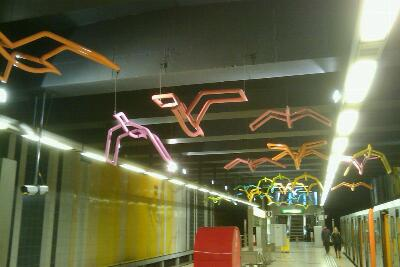

::: {#page .hfeed .site}
[Saltar al contenido](index.html#content){.skip-link
.screen-reader-text}

::: {#sidebar .sidebar}
::: {.site-branding}
[{.custom-logo
width="248" height="248" sizes="(max-width: 248px) 100vw, 248px"
srcset="../../../../../wp-content/uploads/2016/04/cropped-Manneken_Pis_Blog_Bruselas_Ricardo_Imbern-248.jpg 248w, ../../../../../wp-content/uploads/2016/04/cropped-Manneken_Pis_Blog_Bruselas_Ricardo_Imbern-248-150x150.jpg 150w"}](../../../../../index.html){.custom-logo-link}

[Blog Bruselas en español](../../../../../index.html)

El blog-guía escrito por españoles en Bruselas para los hispanoparlantes
que viven aquí y para los turistas que aprovechan los vuelos baratos
para descubrir el chocolate, la cerveza, la Grand Place y tantas otras
cosas buenas.

Menú y widgets
:::

::: {#secondary .secondary}
::: {#widget-area .widget-area role="complementary"}
Blog Bruselas es {#blog-bruselas-es .widget-title}
----------------

::: {.textwidget}
Un **blog en español escrito en Bruselas** por unos enamorados de la
capital de Bélgica, corazón mágico de Europa. Una ciudad pequeña y
grande, llena de gente, comida, eventos y rincones encantadores; para
descubrir y disfrutar sin dejarse aguar la fiesta por el tiempo (no es
tan malo).

Para quienes pasan por Bruselas, porque vienen de visita, de turismo o
tienen la suerte de vivir aquí. Sí quieres conocer más que los hoteles
en Bruselas, aprovecha los vuelos baratos y **vive la ciudad**.

Blog Bruselas es el bebé de [Ramón Suárez](http://www.ramonsuarez.com),
bruseleño convencido desde 2003.
:::

Espacios de trabajo compartido {#espacios-de-trabajo-compartido .widget-title}
------------------------------

::: {.textwidget}
[Betacowork Coworking Bruselas](http://www.betacowork.com) [Mapa de
espacios de coworking en Bélgica](http://coworkingbelgium.com)
:::

Último vídeo {#último-vídeo .widget-title}
------------

Asociados con Hispagenda, la guía digital de los españoles en Bélgica {#asociados-con-hispagenda-la-guía-digital-de-los-españoles-en-bélgica .widget-title}
---------------------------------------------------------------------

::: {.textwidget}
[{.attachment-medium
width="250" height="100"}](http://www.hispagenda.com)
:::

Más sobre Bruselas en otros idiomas {#más-sobre-bruselas-en-otros-idiomas .widget-title}
-----------------------------------

::: {.textwidget}
[Agenda.be](http://www.agenda.be) FR NL\
[Bruxelles Blog](http://www.bxlblog.be/) FR\
[Eventos para emprendedores y freelance en
Bruselas](http://www.betacowork.com/events/)\
[The Network
Brussels](http://groups.yahoo.com/group/TheNetworkBrussels/) EN\
[What\'s up in Belgium](http://www.whatsupin.be/) EN
:::

Más sobre Bélgica en Español {#más-sobre-bélgica-en-español .widget-title}
----------------------------

::: {.textwidget}
[Spaniards en Bélgica](http://www.spaniards.es/paises/belgica)
:::
:::
:::
:::

::: {#content .site-content}
::: {#primary .section .content-area}
::: {#main .site-main role="main"}
Etiqueta: bruselas {#etiqueta-bruselas .page-title}
==================

[Movimiento moderno lúdico en el Atomium](../../../../../index.html?p=1075) {#movimiento-moderno-lúdico-en-el-atomium .entry-title}
---------------------------------------------------------------------------

::: {.entry-content}
[{.aligncenter
.size-full .wp-image-1076 width="136" height="200"
sizes="(max-width: 136px) 100vw, 136px"
srcset="../../../../../wp-content/uploads/2009/12/Bruxelles_50_60_architecture_moderne_expo_58_caroline_berckmans_pierre_bernard.jpg 136w, ../../../../../wp-content/uploads/2009/12/Bruxelles_50_60_architecture_moderne_expo_58_caroline_berckmans_pierre_bernard-102x150.jpg 102w"}](../../../../../wp-content/uploads/2009/12/Bruxelles_50_60_architecture_moderne_expo_58_caroline_berckmans_pierre_bernard.jpg)

Esta noche se inaugura la exposición **[Movimiento moderno
Lúdico](http://www.atomium.be/#/modernisme.aspx?lang=en "Modernismo lúdico, exposición en el Atomium de Bruselas")
en las bolas del Atomium**. Se trata de una expo temporal basada en el
libro ***Bruxelles '50 '60 Architecture moderne au temps de l'Expor
58***, escrito por mi amiga **Caroline Berckmans** y por **Pierre
Bernard**, quienes hacen también de comisarios en esta ocasión. En ella
muestran una selección de fotografías de los diseños realizados en una
época de un cierto optimismo que en prinicipio parece no haberse
transmitido muy bién con el tiempo. No es que sea una época de las que
se hable muy bien normalmente, pero al pasar las páginas del libro se
encuentra uno con edificios y detalles sorprendentes. Como me ha dejado
tirado el avión para ir a España a causa de la nieve, aprovecharé para
ir a tomar unos canapés y ver las fotos en grande. ¡A mal tiempo buena
cara!

Podéis visitar la exposición hasta el 25 de abril de 2010.
:::

[[Publicado el
]{.screen-reader-text}[22/12/200904/01/2010](../../../../../index.html?p=1075)]{.posted-on}[[[Autor
]{.screen-reader-text}[Ramón
Suárez](../../../../2010/04/30/index.html?author=2){.url .fn
.n}]{.author .vcard}]{.byline}[[Categorías
]{.screen-reader-text}[Artes](../../../../category/artes/index.html),
[Gran
Bruselas](../../../../category/gran-bruselas/index.html)]{.cat-links}[[Etiquetas
]{.screen-reader-text}[50](../../../50/index.html),
[60](../../../60/index.html),
[arquitectura](../../../arquitectura/index.html),
[atomium](../../../atomium/index.html), [bruselas](../../index.html),
[modernismo](../../../modernismo/index.html)]{.tags-links}[[[2
comentarios[ en Movimiento moderno lúdico en el
Atomium]{.screen-reader-text}]{.dsq-postid
dsqidentifier="1075 http://www.blogbruselas.com/?p=1075"}](../../../../../index.html?p=1075#comments)]{.comments-link}

[Opciones para nochevieja en Bruselas](../../../../../index.html?p=1081) {#opciones-para-nochevieja-en-bruselas .entry-title}
------------------------------------------------------------------------

::: {.entry-content}
1\. Por méritos propios primero va la fiesta de Fin de Año en la iglesia
de Gesu. Sus dimensiones e historia la hacen ya legendaria: este año
2009 ha sido suyo en cuanto a fiestas se refiere. Se han celebrado alli
más de 10 eventos. Gesu está gestionada por el colectivo
[Plastic](http://www.facebook.com/search/?q=plastic&init=quick#/group.php?gid=15137642742&ref=ts),
una referencia en la organización de eventos que combinan la musica
electrónica con el arte. Sin embargo, la fiesta de este año la organiza
uno de los DJs mas conocidos de la capital belga: Darko. El nombre de la
fiesta es [BXNYE](http://bxnye.be/). La entrada son 15 euros y tienes
músicos y DJ's de fama mundial: el surafricano
[Mujava](http://www.myspace.com/mujava),
[Oxia](http://www.myspace.com/oxiagoodlife), [James
Bacon](http://www.myspace.com/dj-james-bacon) así como el propio
[Darko](http://www.facebook.com/event.php?eid=205382631929#/Darko.1).

{.size-large
.wp-image-1084 width="316" height="491"
sizes="(max-width: 316px) 100vw, 316px"
srcset="../../../../../wp-content/uploads/2009/12/DSC_00121-658x1023.jpg 658w, ../../../../../wp-content/uploads/2009/12/DSC_00121-96x150.jpg 96w"}

2\. Una opción para la cena y la primera copa tiene lugar justo en
frente de la anterior. El bar restaurante del Hotel Bloom se llama
[Smoods](http://www.smoods.net/). Es un sitio de diseño, un poco
recargado en la decoración pero hay bastante separación entre las mesas
y se puede encontrar un personal amable. La música ambiente es bastante
cuidada. El menú son 65 euros.

3\. Otra posibilidad estimulante es descubrir el espíritu del bosque en
uno de los parques de Bruselas. [Wood](http://thewood.be/) ofrece una
cena original. Nuevo restaurante del omnipresente Carl de Moncharline
abierto en septiembre de 2009. Esta en medio del parque de La Cambre y
en su arquitectura y mobiliario predomina la madera. El menú son 100
euros y pincha Lady Jane después de la cena.

{.alignnone
width="200" height="283"}

4\. Si sois de los que os quedais hasta el final, recomendamos el gran
clásico de las mañanas del 1 de Enero. Organizado por los DJ´s [Prince
Off](http://bruclectic.blogspot.com/) (Bruclectic) y Jeoffroy. En el
[Dali's
Bar](http://maps.google.com/maps?f=q&source=s_q&hl=en&geocode=&q=35,+Petite+rue+des+bouchers+bruxelles&sll=37.0625,-95.677068&sspn=27.781434,79.013672&ie=UTF8&hq=&hnear=Korte+Beenhouwersstraat+35,+Brussel+1000+Bruxelles,+Brussel+Hoofdstedelijk+Gewest,+Belgium&ll=50.847566,4.353676&spn=0.002696,0.009645&z=17)
seguro que os encontráis habitantes de otro tiempo, gente de lo más
resistente en la pista: DJ\`s y personal de fiestas anteriores que
alargan, como por arte de magia, las campanadas hasta la tarde.

{.size-full
.wp-image-1087 width="384" height="270"
sizes="(max-width: 384px) 100vw, 384px"
srcset="../../../../../wp-content/uploads/2009/12/gview.png 800w, ../../../../../wp-content/uploads/2009/12/gview-150x105.png 150w, ../../../../../wp-content/uploads/2009/12/gview-300x211.png 300w"}
:::

[[Publicado el
]{.screen-reader-text}[21/12/200904/01/2010](../../../../../index.html?p=1081)]{.posted-on}[[[Autor
]{.screen-reader-text}[Manuel
Pueyo](../../../../author/easysun/index.html){.url .fn .n}]{.author
.vcard}]{.byline}[[Categorías ]{.screen-reader-text}[Comer y
beber](../../../../category/comer-y-beber/index.html)]{.cat-links}[[Etiquetas
]{.screen-reader-text}[año nuevo](../../../ano-nuevo/index.html),
[bruselas](../../index.html), [carl de
moncharline](../../../carl-de-moncharline/index.html), [dali\'s
bar](../../../dalis-bar/index.html), [darko](../../../darko/index.html),
[fiesta 31 diciembre](../../../fiesta-31-diciembre/index.html), [fiesta
nochevieja](../../../fiesta-nochevieja/index.html),
[geoffroy](../../../geoffroy/index.html),
[gesu](../../../gesu/index.html), [gesu
church](../../../gesu-church/index.html), [james
baco](../../../james-baco/index.html), [james
bacon](../../../james-bacon/index.html),
[mujava](../../../mujava/index.html), [nochevieja
bruselas](../../../nochevieja-bruselas/index.html),
[NYE](../../../nye/index.html), [NYE
Brussels](../../../nye-brussels/index.html), [petit rue des
boucheurs](../../../petit-rue-des-boucheurs/index.html),
[plastic](../../../plastic/index.html), [prince
offe](../../../prince-offe/index.html), [reveillon
bruxelles](../../../reveillon-bruxelles/index.html),
[Wood](../../../wood/index.html)]{.tags-links}[[[5 comentarios[ en
Opciones para nochevieja en Bruselas]{.screen-reader-text}]{.dsq-postid
dsqidentifier="1081 http://www.blogbruselas.com/?p=1081"}](../../../../../index.html?p=1081#comments)]{.comments-link}

[Los Barones de Molembeek](../../../../../index.html?p=1032) {#los-barones-de-molembeek .entry-title}
------------------------------------------------------------

::: {.entry-content}
Sí hay una película bruselense que no os podéis perder este año es **Los
Barones** (*[Les
Barons](http://www.google.be/movies?hl=fr&near=Brussels&dq=les+barons+film&sort=1&mid=17741667c483ba7e&ei=6-woS4zZJonR-QaK0e2oDQ&sa=X&oi=showtimes&ct=movie-link&cd=1&ved=0CAwQwAMoBA "Les Barons, a mourir de rire")*)
. Una comedia bastante divertida sobre la vida de un grupo de amigos de
[Molembeek](http://www.molenbeek.be/ "Comuna de Molembeek").

Tuve la impresión de estar viendo una película americana, la típica de
italianos en Nueva York, solo que aquí hablan en francés y las calles
son las de Bruselas. Muchas risas y sitios conocidos. Merece la pena
verlar. Si no hablas bien francés, es una buena ocasión para practicar 😉
:::

[[Publicado el
]{.screen-reader-text}[16/12/200917/12/2009](../../../../../index.html?p=1032)]{.posted-on}[[[Autor
]{.screen-reader-text}[Álvaro
Marín](../../../../../index.html?author=4){.url .fn .n}]{.author
.vcard}]{.byline}[[Categorías
]{.screen-reader-text}[Artes](../../../../category/artes/index.html)]{.cat-links}[[Etiquetas
]{.screen-reader-text}[barones](../../../barones/index.html),
[bruselas](../../index.html), [cine](../../../cine/index.html),
[comedia](../../../comedia/index.html),
[Humor](../../../humor/index.html),
[molembeek](../../../molembeek/index.html),
[pelicula](../../../pelicula/index.html)]{.tags-links}[[[1 comentario[
en Los Barones de Molembeek]{.screen-reader-text}]{.dsq-postid
dsqidentifier="1032 http://www.blogbruselas.com/?p=1032"}](../../../../../index.html?p=1032#comments)]{.comments-link}

[Las gaviotas del rey Balduino](../../../../../index.html?p=1031) {#las-gaviotas-del-rey-balduino .entry-title}
-----------------------------------------------------------------

::: {.entry-content}

Me encantan las paradas del metro de Bruselas. Todas son diferentes y
están personalizadas con la obra de algún artista. Hoy me he encontrado
con estas gaviotas en la estación Rey Balduino y me han alegrado la
mañana.
:::

[[Publicado el
]{.screen-reader-text}[15/12/2009](../../../../../index.html?p=1031)]{.posted-on}[[[Autor
]{.screen-reader-text}[Ramón
Suárez](../../../../2010/04/30/index.html?author=2){.url .fn
.n}]{.author .vcard}]{.byline}[[Categorías ]{.screen-reader-text}[Gran
Bruselas](../../../../category/gran-bruselas/index.html)]{.cat-links}[[Etiquetas
]{.screen-reader-text}[balduino](../../../balduino/index.html),
[bruselas](../../index.html), [gaviotas](../../../gaviotas/index.html),
[metro](../../../metro/index.html),
[pajaros](../../../pajaros/index.html)]{.tags-links}[[[3 comentarios[ en
Las gaviotas del rey Balduino]{.screen-reader-text}]{.dsq-postid
dsqidentifier="1031 http://www.blogbruselas.com/2009/12/las-gaviotas-del-rey-balduino.html"}](../../../../../index.html?p=1031#comments)]{.comments-link}

[Daniel Buren en Bruselas: azul sobre amarillo](../../../../../index.html?p=1021) {#daniel-buren-en-bruselas-azul-sobre-amarillo .entry-title}
---------------------------------------------------------------------------------

::: {.entry-content}
[Daniel
Buren](http://www.danielburen.com/__db1/index_matrix_accueil.php?lang=fr)
(Boulogne-Billancourt, 1938) es el autor de la instalación permanente
'Bleus sur jaune', que decora la Place de la Justice de Bruselas desde
hace unos meses.

{width="452"
height="341"}

Foto: [Eve&Jeff](http://www.flickr.com/photos/30938700@N07/3706522231/)

Su obra más conocida son sin duda las coumnas y las fuentes del patio
del Palais-Royal en París, que quizá os suenen de los anuncios de
perfume que Inés Sastre presenta cada Navidad.

{width="401"
height="317"}

Foto: [Lycée
Daudet](http://artsplastiquesdaudet.free.fr/Galerie/galerie1/index.php)

Deben su fama a la polémica que provocaron en su momento (1985-1986),
cuando los franceses bienpensantes se escandalizaron de la afrenta hecha
a un monumento neoclásico. Sin embargo, su fama quedó confirmada con la
obtención del León de Oro en la Bienal de Venecia en el 86.

Del Palais-Royal, uno de mis sitios preferidos de París, recuerdo
siempre un vídeo sobre la polémica que me pusieron en mis clases de
francés en Málaga, donde un francesito a la moda se quejaba de que
lo escandaloso allí era ese pastiche arquitectónico que rodeaba la obra
de Buren. Me encantó ese cinismo.

Buren ha dejado en Bruselas una nueva sucesión repetitiva de elementos
arquitectónicos decorados a su vez con una sucesión repetitiva de
colores.

Se trata de ochenta y nueve mástiles amarillos de alturas variables pero
cuyos extremos aparecen todos sobre un mismo plano horizontal. A estos
mástiles van unidos unas banderolas que se mueven con el viento. Estas
banderolas presentan triángulos azules y triángulos rayados
entrecruzados. La sucesión de rayas blancas alternadas con las rayas de
color, en este caso el azul, es la marca de fábrica de Buren.

Se puede decir que, al igual que sus rayas, Buren es también un tanto
repetitivo. Véase si no su instalación de este año para
[Beaufort03](http://www.beaufort03.be/) en la playa de De Haan, cerca de
Ostende: 'Le vent souffle où il veut'.

Foto:
[Pieterbie](http://acasculpture.blogspot.com/2009_04_01_archive.html)

La instalación de Bruselas es un encargo del Comité des Arts urbains que
quería mejorar la imagen de esta plaza un tanto desangelada pero que
sirve de unión entre la ciudad vieja y los anticuarios chic del Sablón.
El nombre de Place de la Justice le viene de haberse levantado aquí en
1823 el Palacio de Justicia, hasta su demolición una vez terminada la
enormidad de Poelaert en 1883. El espacio fue muy modificado por las
obras de la 'Jonction Nord-Sud', sobre todo con la construcción del
viaducto, de 1955, en un estilo que no cuenta hoy con el apoyo del
público ni de la mayoría de los aficionados. Tiempo al tiempo.

Fuente: Raymond Balau, 'Place Bruen bleus sur jaune', en 'L'Art même',
n° 45, 2009, p. 29.
:::

[[Publicado el
]{.screen-reader-text}[14/12/200906/03/2010](../../../../../index.html?p=1021)]{.posted-on}[[[Autor
]{.screen-reader-text}[Eduardo Lamas
Delgado](../../../../author/eduardo/index.html){.url .fn .n}]{.author
.vcard}]{.byline}[[Categorías
]{.screen-reader-text}[Artes](../../../../category/artes/index.html),
[Gran
Bruselas](../../../../category/gran-bruselas/index.html)]{.cat-links}[[Etiquetas
]{.screen-reader-text}[arquitectura](../../../arquitectura/index.html),
[arte](../../../arte/index.html), [arte
contemporáneo](../../../arte-contemporaneo/index.html), [arte
urbano](../../../arte-urbano/index.html),
[belgica](../../../belgica/index.html), [bruselas](../../index.html),
[daniel buren](../../../daniel-buren/index.html),
[diseño](../../../diseno/index.html),
[urbanismo](../../../urbanismo/index.html)]{.tags-links}[[[1 comentario[
en Daniel Buren en Bruselas: azul sobre
amarillo]{.screen-reader-text}]{.dsq-postid
dsqidentifier="1021 http://www.blogbruselas.com/?p=1021"}](../../../../../index.html?p=1021#comments)]{.comments-link}

Navegación de entradas {#navegación-de-entradas .screen-reader-text}
----------------------

::: {.nav-links}
[Página anterior](../3/index.html){.prev .page-numbers} [[Página
]{.meta-nav .screen-reader-text}1](../../index.html){.page-numbers}
[...]{.page-numbers .dots} [[Página ]{.meta-nav
.screen-reader-text}3](../3/index.html){.page-numbers} [[Página
]{.meta-nav .screen-reader-text}4]{.page-numbers .current} [[Página
]{.meta-nav .screen-reader-text}5](../5/index.html){.page-numbers}
[...]{.page-numbers .dots} [[Página ]{.meta-nav
.screen-reader-text}15](../15/index.html){.page-numbers} [Página
siguiente](../5/index.html){.next .page-numbers}
:::
:::
:::
:::

::: {.site-info}
[Creado con WordPress](https://es.wordpress.org/)
:::
:::
