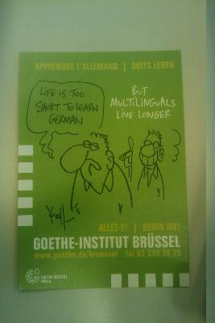
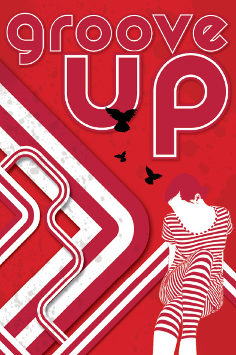

::: {#page .hfeed .site}
[Saltar al contenido](index.html#content){.skip-link
.screen-reader-text}

::: {#sidebar .sidebar}
::: {.site-branding}
[{.custom-logo
width="248" height="248" sizes="(max-width: 248px) 100vw, 248px"
srcset="../../../../../wp-content/uploads/2016/04/cropped-Manneken_Pis_Blog_Bruselas_Ricardo_Imbern-248.jpg 248w, ../../../../../wp-content/uploads/2016/04/cropped-Manneken_Pis_Blog_Bruselas_Ricardo_Imbern-248-150x150.jpg 150w"}](../../../../../index.html){.custom-logo-link}

[Blog Bruselas en español](../../../../../index.html)

El blog-guía escrito por españoles en Bruselas para los hispanoparlantes
que viven aquí y para los turistas que aprovechan los vuelos baratos
para descubrir el chocolate, la cerveza, la Grand Place y tantas otras
cosas buenas.

Menú y widgets
:::

::: {#secondary .secondary}
::: {#widget-area .widget-area role="complementary"}
Blog Bruselas es {#blog-bruselas-es .widget-title}
----------------

::: {.textwidget}
Un **blog en español escrito en Bruselas** por unos enamorados de la
capital de Bélgica, corazón mágico de Europa. Una ciudad pequeña y
grande, llena de gente, comida, eventos y rincones encantadores; para
descubrir y disfrutar sin dejarse aguar la fiesta por el tiempo (no es
tan malo).

Para quienes pasan por Bruselas, porque vienen de visita, de turismo o
tienen la suerte de vivir aquí. Sí quieres conocer más que los hoteles
en Bruselas, aprovecha los vuelos baratos y **vive la ciudad**.

Blog Bruselas es el bebé de [Ramón Suárez](http://www.ramonsuarez.com),
bruseleño convencido desde 2003.
:::

Espacios de trabajo compartido {#espacios-de-trabajo-compartido .widget-title}
------------------------------

::: {.textwidget}
[Betacowork Coworking Bruselas](http://www.betacowork.com) [Mapa de
espacios de coworking en Bélgica](http://coworkingbelgium.com)
:::

Último vídeo {#último-vídeo .widget-title}
------------

Asociados con Hispagenda, la guía digital de los españoles en Bélgica {#asociados-con-hispagenda-la-guía-digital-de-los-españoles-en-bélgica .widget-title}
---------------------------------------------------------------------

::: {.textwidget}
[{.attachment-medium
width="250" height="100"}](http://www.hispagenda.com)
:::

Más sobre Bruselas en otros idiomas {#más-sobre-bruselas-en-otros-idiomas .widget-title}
-----------------------------------

::: {.textwidget}
[Agenda.be](http://www.agenda.be) FR NL\
[Bruxelles Blog](http://www.bxlblog.be/) FR\
[Eventos para emprendedores y freelance en
Bruselas](http://www.betacowork.com/events/)\
[The Network
Brussels](http://groups.yahoo.com/group/TheNetworkBrussels/) EN\
[What\'s up in Belgium](http://www.whatsupin.be/) EN
:::

Más sobre Bélgica en Español {#más-sobre-bélgica-en-español .widget-title}
----------------------------

::: {.textwidget}
[Spaniards en Bélgica](http://www.spaniards.es/paises/belgica)
:::
:::
:::
:::

::: {#content .site-content}
::: {#primary .section .content-area}
::: {#main .site-main role="main"}
Etiqueta: bruselas {#etiqueta-bruselas .page-title}
==================

[Nuevo look para el Manneken Pis](../../../../../index.html?p=804) {#nuevo-look-para-el-manneken-pis .entry-title}
------------------------------------------------------------------

::: {.entry-content}
Gracias a un [tuiteo de
Millezime](http://twitter.com/millezime "El tuiter de Millezime (Twitter)"),
me he encontrado con este logo:

[{.aligncenter
.size-medium .wp-image-809 width="213" height="300"
sizes="(max-width: 213px) 100vw, 213px"
srcset="../../../../../wp-content/uploads/2009/10/Manneken_Pis_Millezime-213x300.jpg 213w, ../../../../../wp-content/uploads/2009/10/Manneken_Pis_Millezime-106x150.jpg 106w, ../../../../../wp-content/uploads/2009/10/Manneken_Pis_Millezime.jpg 476w"}](http://twitpic.com/n4gte)

¿Qué os parece este nuevo look para el Manneken Pis?
:::

[[Publicado el
]{.screen-reader-text}[27/10/200927/10/2009](../../../../../index.html?p=804)]{.posted-on}[[[Autor
]{.screen-reader-text}[Ramón
Suárez](../../../../2010/04/30/index.html?author=2){.url .fn
.n}]{.author .vcard}]{.byline}[[Categorías
]{.screen-reader-text}[Artes](../../../../category/artes/index.html),
[Comunicación y
marketing](../../../../category/comunicacion-y-marketing/index.html),
[Gran
Bruselas](../../../../category/gran-bruselas/index.html)]{.cat-links}[[Etiquetas
]{.screen-reader-text}[bruselas](../../index.html),
[diseño](../../../diseno/index.html), [logo](../../../logo/index.html),
[manneken pis](../../../manneken-pis/index.html)]{.tags-links}[[[2
comentarios[ en Nuevo look para el Manneken
Pis]{.screen-reader-text}]{.dsq-postid
dsqidentifier="804 http://www.blogbruselas.com/?p=804"}](../../../../../index.html?p=804#comments)]{.comments-link}

[Controversias. Una historia estética y jurídica de la fotografía](../../../../../index.html?p=776) {#controversias.-una-historia-estética-y-jurídica-de-la-fotografía .entry-title}
---------------------------------------------------------------------------------------------------

::: {.entry-content}
 

{width="494"
height="411"}

OlivieroToscani **Suora e Prete**, 1992

La galería de fotografía del
[Botanique](http://www.botanique.be/cgi?usr=hnutek8u4d&lg=fr&pag=877&tab=111&rec=761&frm=350&par=secorig874&id=5413&flux=77631199)
presenta hasta el 22 de noviembre una exposición que recorre la
evolución de la reglamentación de la fotografía obtenida a golpe de
escándalo y de decisión judicial.

Y es que a esta forma artística relativamente reciente le ha costado
hacerse con el reconocimiento del público, primero, y de la legalidad,
después. ¿Cuál es la frontera entre el documento y la obra de arte?,
¿entre la reproducción mecánica y la construcción consciente?, ¿entre
arte y pornografía? Estas son algunas de las cuestiones que se plantean
en esta exposición muy bien documentada (algo que tan a menudo se echa
de menos en Bruselas).

{width="455"
height="323"} 

Man Ray, **Noire et blanche**, 1926

Así, encontramos un gran número de fotos célebres, sobre todo las
periodísticas, conocidas por la enorme circulación que se les dio en su
día en la prensa. Imágenes de las guerras de las últimas décadas: en
Vietnam, en Sudán, en Palestina. Desastres naturales, atentados...
Ejemplos de la foto documental que plantean cuestiones morales sobre el
papel del periodista. ¿Se puede informar de un hecho a precio de no
intervenir para evitar una tragedia?, ¿hay un límite entre la
información y el puro morbo?

Huynh Cong Ut (Nick), **La niña de Trang Bang**, 1972

También se nos da a conocer el ridículo a que conducen los desvaríos de
lo políticamente correcto.  Como cuando se decide borrar el cigarro de
la imagen de fotografía de Sartre fumador emperdernido, carretero
incluso, para el cartel de una exposición que se le dedica en París en
2005, por miedo a que se pueda considerar una incitación a al consumo de
tabaco. Este caso pone el acento sobre el creciente fenómeno de
la autocensura, incluso entre los propios artistas, que temen deber
hacer frente a jucios cuyos costes, sobre todo en Estados Unidos, les
pueden dejar en la ruina, amén de la pérdida de tiempo y de energía.

{width="368"
height="487"}

Portada del catálogo de la exposición **Sartre** (París, 2005)

{width="344"
height="373"}

Lipnitzky, **Jean-Paul Sartre en el teatro Antoine de París**, 1946

(esta es la fotografía usada para el cartel, y donde lleva el polémico
cigarro, aquí imperceptible)

Otro aspecto desarrollado en la exposición es el espinoso asunto de los
derechos de autor, y los límites del plagio. Como en el caso de la foto
de Forsythe, quien consiguió ganar un juicio a Matel, que le había
puesto una demanda por plagio. En cualquier caso, no cabe duda de que
con la reglamentación desarrollada a lo largo del siglo XX la evolución
de la historia del arte tal y como la conocemos no hubiese sido posible.
¿Puede reglamentarse el borroso límite entre la copia servil y la
inspiración o la interpretación? La controversia está servida.

{width="268"
height="575"}

Napoléon Sarony, **Retrato de Oscar Wilde**, 1882.

Tom Forsythe, **Barbie**, 1998.

En nuestro mundo dominado por la imagen estas cuestiones siguen de plena
actualidad. Una prueba de ello es la nueva reglamentación en Francia y
Reino Unido en materia de manipulación de imágenes (Véase: [Coto a la
dictadura del
Photoshop](http://www.elpais.com/articulo/sociedad/Coto/dictadura/Photoshop/elpepisoc/20090928elpepisoc_1/Tes),
El País, 28/09/209).

La exposición ha sido organizada por el [Musée de l'Elysée de
Lausanne](http://www.elysee.ch/), y en la primavera pasada estuvo en la
prestigiosa [Galerie de la Photographie de la Bibliothèque
Nationale](http://expositions.bnf.fr/photos/), en París.

Cada fotografía viene acompañada de un texto que presenta la
controversia en cuestión, y la emplaza en el contexto general de la
historia del arte, la legislación, la ética o la política según el caso.
Además, se indica puntualmente las caracteísticas técnicas de cada
fotografía, así como su lugar de conservación. Y esto, muy de
agradecer, es algo realmente poco común en las exposiciones de Bruselas.

La única nota discordante es la mala calidad de alguna que otra tirada,
pero como su función es ante todo la de ilustrar el hilo conductor de la
exposición, resulta menos grave. En efecto, la exposición no pretende
exponer arte sino historia del arte.

El catálogo de la exposición está muy bien hecho, y servirá de
documentación a más de un aficionado:

{width="150"
height="198"}

Daniel Girardin et Christian Pirker, *Controverses, une Histoire
juridique et éthique de la photographie*, Actes Sud, 2008

 

 

 

 

La galería
del [Botanique](http://www.botanique.be/cgi?usr=hnutek8u4d&lg=fr&pag=877&tab=111&rec=761&frm=350&par=secorig874&id=5413&flux=77631199)
abre de miércoles a domingo entre las 12h y las 20h.
:::

[[Publicado el
]{.screen-reader-text}[26/10/200926/10/2009](../../../../../index.html?p=776)]{.posted-on}[[[Autor
]{.screen-reader-text}[Eduardo Lamas
Delgado](../../../../author/eduardo/index.html){.url .fn .n}]{.author
.vcard}]{.byline}[[Categorías
]{.screen-reader-text}[Artes](../../../../category/artes/index.html),
[Gran
Bruselas](../../../../category/gran-bruselas/index.html)]{.cat-links}[[Etiquetas
]{.screen-reader-text}[arte](../../../arte/index.html),
[botanique](../../../botanique/index.html),
[bruselas](../../index.html),
[escándalo](../../../escandalo/index.html),
[exposicion](../../../exposicion/index.html),
[fotografia](../../../fotografia/index.html), [historia del
arte](../../../historia-del-arte/index.html),
[publicidad](../../../publicidad/index.html)]{.tags-links}[[[3
comentarios[ en Controversias. Una historia estética y jurídica de la
fotografía]{.screen-reader-text}]{.dsq-postid
dsqidentifier="776 http://www.blogbruselas.com/?p=776"}](../../../../../index.html?p=776#comments)]{.comments-link}

[La vida es demasiado corta para aprender alemán](../../../../../index.html?p=789) {#la-vida-es-demasiado-corta-para-aprender-alemán .entry-title}
----------------------------------------------------------------------------------

::: {.entry-content}

Aunque los multilinguístas vivamos más. Magnífica publicidad del
[Goethe-Institut de
Bruselas](http://www.goethe.de/ins/be/bru/frindex.htm "Lo dicho, para aprender alemán en Bruselas"),
perfectamente aplicable a como me siento en mi intento por aprender
flamenco.
:::

[[Publicado el
]{.screen-reader-text}[26/10/200926/10/2009](../../../../../index.html?p=789)]{.posted-on}[[[Autor
]{.screen-reader-text}[Ramón
Suárez](../../../../2010/04/30/index.html?author=2){.url .fn
.n}]{.author .vcard}]{.byline}[[Categorías
]{.screen-reader-text}[Comunicación y
marketing](../../../../category/comunicacion-y-marketing/index.html)]{.cat-links}[[Etiquetas
]{.screen-reader-text}[academia](../../../academia/index.html),
[aleman](../../../aleman/index.html),
[aprender](../../../aprender/index.html), [bruselas](../../index.html),
[goethe](../../../goethe/index.html),
[idiomas](../../../idiomas/index.html),
[instituto](../../../instituto/index.html),
[lenguas](../../../lenguas/index.html)]{.tags-links}[[[7 comentarios[ en
La vida es demasiado corta para aprender
alemán]{.screen-reader-text}]{.dsq-postid
dsqidentifier="789 http://www.blogbruselas.com/2009/10/la-vida-es-demasiado-corta-para-aprender-alemn.html"}](../../../../../index.html?p=789#comments)]{.comments-link}

[Groove Up!! Una opción disco para los blogueros mas vivientes](../../../../../index.html?p=764) {#groove-up-una-opción-disco-para-los-blogueros-mas-vivientes .entry-title}
------------------------------------------------------------------------------------------------

::: {.entry-content}
Señores blogueros, tuiteros y demás especies virtuales: como os venía
comentando, se está cociendo una catarsis eventual que se llama [Groove
Up](http://grooveupbxl.blogspot.com/). Tendra lugar en Barrio y, mira
por donde, está literalmente a dos pasos del lugar de la [kedada del 31
de
octubre](http://www.blogbruselas.com/2009/10/noche-de-los-bloggers-vivientes.html "Quedada bloguera en Bruselas ").

Es por esto que no quiero desaprovechar la oportunidad que me ofrece
este foro, para animaros a que os paseis. Va a estar bien. Tanto yo
([Roska](http://www.myspace.com/bruclectico) y organizador del evento)
como DJ A. estamos, desde ya, haciendo una interesante aventura
exploratoria de los sonidos que hacían bailar a la gente (al menos en
N.Y) en la época en la que nacimos (finales 70): Disco, Garage, Funk,
Salsoul y todo lo que nace de ahí hasta llegar a los ritmos que bailamos
hoy...House, Space Disco.

Si consigo pasármelo tan bien durante la noche como me lo estoy pasando
ahora en mi cuarto, la cosa promete.

{.alignnone
.size-full .wp-image-765 width="394" height="591"
sizes="(max-width: 394px) 100vw, 394px"
srcset="../../../../../wp-content/uploads/2009/10/Groove_LR.jpg 394w, ../../../../../wp-content/uploads/2009/10/Groove_LR-100x150.jpg 100w, ../../../../../wp-content/uploads/2009/10/Groove_LR-200x300.jpg 200w"}

Os daré mas detalles en persona en la noche de los Blogueros Vivientes.

Hasta entonces.....dont stop....let your body rock !!!
:::

[[Publicado el
]{.screen-reader-text}[23/10/200925/10/2009](../../../../../index.html?p=764)]{.posted-on}[[[Autor
]{.screen-reader-text}[Manuel
Pueyo](../../../../author/easysun/index.html){.url .fn .n}]{.author
.vcard}]{.byline}[[Categorías
]{.screen-reader-text}[Artes](../../../../category/artes/index.html)]{.cat-links}[[Etiquetas
]{.screen-reader-text}[Baile](../../../baile/index.html),
[bruselas](../../index.html), [Disco](../../../disco/index.html),
[fiesta](../../../fiesta/index.html), [Funk](../../../funk/index.html),
[Groove](../../../groove/index.html),
[halloween](../../../halloween/index.html),
[Noche](../../../noche/index.html)]{.tags-links}[[[3 comentarios[ en
Groove Up!! Una opción disco para los blogueros mas
vivientes]{.screen-reader-text}]{.dsq-postid
dsqidentifier="764 http://www.blogbruselas.com/?p=764"}](../../../../../index.html?p=764#comments)]{.comments-link}

[De Cans a Bruselas: una cita con cine gallego](../../../../../index.html?p=737) {#de-cans-a-bruselas-una-cita-con-cine-gallego .entry-title}
--------------------------------------------------------------------------------

::: {.entry-content}
Por segundo año consecutivo, Couto Mixto A.S.B.L dedica una jornada a
presentar en Bruselas unas pinceladas del mejor cine hecho en Galicia en
2009. Será en el Cine Vendome (Chausee de Wavre 28) el jueves 29 de
Octubre a las 19h.

Como el año anterior, la fórmula empleada, será la de presentar los
cortos premiados en el [Festival de
Cans](http://www.festivaldecans.com/festival/content/view/110/102/lang,galego/)
que es un peculiar festival de cortos que se celebra en mayo en la
parroquia de Cans (Pontevedra),  que coincide en la fecha con el
Festival de Cannes. Precisamente la idea del festival salió de la
similitud entre los nombres.

Este año se proyectaran las siguientes producciones gallegas actuales:

-- *Uruguay 2030* de Rafa de los Arcos\
-- *The Werepig* de Sam Orti\
-- *X nada* de Dani de la Torre e Toni Veiga\
-- *O pintor de Ceos* de Ferbando Cortizo

{.alignnone
width="229" height="320"}
:::

[[Publicado el
]{.screen-reader-text}[19/10/200921/10/2009](../../../../../index.html?p=737)]{.posted-on}[[[Autor
]{.screen-reader-text}[Manuel
Pueyo](../../../../author/easysun/index.html){.url .fn .n}]{.author
.vcard}]{.byline}[[Categorías
]{.screen-reader-text}[Artes](../../../../category/artes/index.html)]{.cat-links}[[Etiquetas
]{.screen-reader-text}[bruselas](../../index.html),
[cine](../../../cine/index.html),
[galicia](../../../galicia/index.html)]{.tags-links}

Navegación de entradas {#navegación-de-entradas .screen-reader-text}
----------------------

::: {.nav-links}
[Página anterior](../7/index.html){.prev .page-numbers} [[Página
]{.meta-nav .screen-reader-text}1](../../index.html){.page-numbers}
[...]{.page-numbers .dots} [[Página ]{.meta-nav
.screen-reader-text}7](../7/index.html){.page-numbers} [[Página
]{.meta-nav .screen-reader-text}8]{.page-numbers .current} [[Página
]{.meta-nav .screen-reader-text}9](../9/index.html){.page-numbers}
[...]{.page-numbers .dots} [[Página ]{.meta-nav
.screen-reader-text}15](../15/index.html){.page-numbers} [Página
siguiente](../9/index.html){.next .page-numbers}
:::
:::
:::
:::

::: {.site-info}
[Creado con WordPress](https://es.wordpress.org/)
:::
:::
