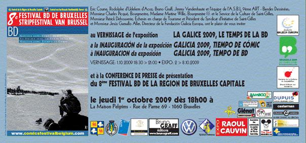

::: {#page .hfeed .site}
[Saltar al contenido](index.html#content){.skip-link
.screen-reader-text}

::: {#sidebar .sidebar}
::: {.site-branding}
[{.custom-logo
width="248" height="248" sizes="(max-width: 248px) 100vw, 248px"
srcset="../../../wp-content/uploads/2016/04/cropped-Manneken_Pis_Blog_Bruselas_Ricardo_Imbern-248.jpg 248w, ../../../wp-content/uploads/2016/04/cropped-Manneken_Pis_Blog_Bruselas_Ricardo_Imbern-248-150x150.jpg 150w"}](../../../index.html){.custom-logo-link}

[Blog Bruselas en español](../../../index.html)

El blog-guía escrito por españoles en Bruselas para los hispanoparlantes
que viven aquí y para los turistas que aprovechan los vuelos baratos
para descubrir el chocolate, la cerveza, la Grand Place y tantas otras
cosas buenas.

Menú y widgets
:::

::: {#secondary .secondary}
::: {#widget-area .widget-area role="complementary"}
Blog Bruselas es {#blog-bruselas-es .widget-title}
----------------

::: {.textwidget}
Un **blog en español escrito en Bruselas** por unos enamorados de la
capital de Bélgica, corazón mágico de Europa. Una ciudad pequeña y
grande, llena de gente, comida, eventos y rincones encantadores; para
descubrir y disfrutar sin dejarse aguar la fiesta por el tiempo (no es
tan malo).

Para quienes pasan por Bruselas, porque vienen de visita, de turismo o
tienen la suerte de vivir aquí. Sí quieres conocer más que los hoteles
en Bruselas, aprovecha los vuelos baratos y **vive la ciudad**.

Blog Bruselas es el bebé de [Ramón Suárez](http://www.ramonsuarez.com),
bruseleño convencido desde 2003.
:::

Espacios de trabajo compartido {#espacios-de-trabajo-compartido .widget-title}
------------------------------

::: {.textwidget}
[Betacowork Coworking Bruselas](http://www.betacowork.com) [Mapa de
espacios de coworking en Bélgica](http://coworkingbelgium.com)
:::

Último vídeo {#último-vídeo .widget-title}
------------

Asociados con Hispagenda, la guía digital de los españoles en Bélgica {#asociados-con-hispagenda-la-guía-digital-de-los-españoles-en-bélgica .widget-title}
---------------------------------------------------------------------

::: {.textwidget}
[{.attachment-medium
width="250" height="100"}](http://www.hispagenda.com)
:::

Más sobre Bruselas en otros idiomas {#más-sobre-bruselas-en-otros-idiomas .widget-title}
-----------------------------------

::: {.textwidget}
[Agenda.be](http://www.agenda.be) FR NL\
[Bruxelles Blog](http://www.bxlblog.be/) FR\
[Eventos para emprendedores y freelance en
Bruselas](http://www.betacowork.com/events/)\
[The Network
Brussels](http://groups.yahoo.com/group/TheNetworkBrussels/) EN\
[What\'s up in Belgium](http://www.whatsupin.be/) EN
:::

Más sobre Bélgica en Español {#más-sobre-bélgica-en-español .widget-title}
----------------------------

::: {.textwidget}
[Spaniards en Bélgica](http://www.spaniards.es/paises/belgica)
:::
:::
:::
:::

::: {#content .site-content}
::: {#primary .section .content-area}
::: {#main .site-main role="main"}
Etiqueta: comic {#etiqueta-comic .page-title}
===============

[Revista Hola en flamenco](../../../index.html?p=820) {#revista-hola-en-flamenco .entry-title}
-----------------------------------------------------

::: {.entry-content}

No parece qué sea la misma revista Hola que en España.\
Viñeta de apertura del tebeo *De val der blinden*. Yo acabo hablando
flamenco por narices.
:::

[[Publicado el
]{.screen-reader-text}[30/10/200928/10/2009](../../../index.html?p=820)]{.posted-on}[[[Autor
]{.screen-reader-text}[Ramón
Suárez](../../2010/04/30/index.html?author=2){.url .fn .n}]{.author
.vcard}]{.byline}[[Categorías
]{.screen-reader-text}[Humor](../../category/humor/index.html)]{.cat-links}[[Etiquetas
]{.screen-reader-text}[comic](index.html),
[flamenco](../flamenco/index.html), [hola](../hola/index.html),
[neerlandés](../neerlandes/index.html),
[tebeo](../tebeo/index.html)]{.tags-links}

[Exposición Galicia 2009, Tiempo de Cómic](../../../index.html?p=673) {#exposición-galicia-2009-tiempo-de-cómic .entry-title}
---------------------------------------------------------------------

::: {.entry-content}
Galicia existe también en tebeo: centollos que se apegan a humanos,
petroleros a la deriva y paisajes celtas. Pero mas allá de esta
simplificación sobre todo, existe talento, en muchos casos muy grande,
por parte de los autores y autoras del noroeste peninsular. Del 1 al 8
de octubre en La Maison Pelgrims. Rue de Parme, 69 se puede contemplar
una muestra de ello en una exposición organizada por la [Fundación
Galicia Europa.](http://www.fundaciongaliciaeuropa.eu)

{.alignnone
.size-full .wp-image-675 width="450" height="212"
sizes="(max-width: 450px) 100vw, 450px"
srcset="../../../wp-content/uploads/2009/10/image0011.jpg 604w, ../../../wp-content/uploads/2009/10/image0011-300x141.jpg 300w"}

A pesar de que el número de editores es escaso en Galicia, existen
numerosos colectivos de autores de una calidad contrastada e
indiscutible. Destaca el colectivo [BDBanda](http://www.bdbanda.com/) ,
asociación de aficcionados que agrupa a una docena de autores y que
lleva trabajando 5 años en la difusión del cómic en lengua gallega. Su
trabajo les valió también el reconocimiento del Saló de Barcelona, entre
otros.

El colectivo
[Polaqia](http://www.polaqiacomic.com/index.php?option=com_content&task=blogsection&id=1&Itemid=35)
congrega una docena de autores. Desde 2001 tiró alrededor de una
veintena de títulos, mayoritariamente en formato comicbook en gallego.
Mantiene desde hace mas de 5 años la publicación periódica Barsowia que
va por el número 14 y tiene gran éxito de publico y critica.

{.alignnone
width="450" height="209"}

Vale la pena acercarse a la Rue de Parme en Bruselas para comprobar la
creatividad de estos textos y la belleza de sus dibujos.
:::

[[Publicado el
]{.screen-reader-text}[02/10/200916/02/2010](../../../index.html?p=673)]{.posted-on}[[[Autor
]{.screen-reader-text}[Manuel
Pueyo](../../author/easysun/index.html){.url .fn .n}]{.author
.vcard}]{.byline}[[Categorías
]{.screen-reader-text}[Artes](../../category/artes/index.html), [Gran
Bruselas](../../category/gran-bruselas/index.html)]{.cat-links}[[Etiquetas
]{.screen-reader-text}[bande desinee](../bande-desinee/index.html),
[bd](../bd/index.html), [bruselas](../bruselas/index.html),
[comic](index.html), [galicia](../galicia/index.html),
[tebeo](../tebeo/index.html)]{.tags-links}

[¿Qué pasa con los tebeos del niño gilipollas?](../../../index.html?p=377) {#qué-pasa-con-los-tebeos-del-niño-gilipollas .entry-title}
--------------------------------------------------------------------------

::: {.entry-content}
No
se ve mucho movimiento de la Orden de amigos del niño gilipollas-pis.
¿Están rulando los tebeos que nos mandó JAB? ¿Por donde andan?

Y lo más importante, ¿hacemos una reunión cervecera de los ilustres
miembros de la orden?

Gilipollas de Bruselas, ¡pronunciaros! ;-P

::: {.blogger-post-footer}
Comer, hablar, amar. www.blogbruselas.com
:::
:::

[[Publicado el
]{.screen-reader-text}[21/07/200905/09/2009](../../../index.html?p=377)]{.posted-on}[[[Autor
]{.screen-reader-text}[Ramón
Suárez](../../2010/04/30/index.html?author=2){.url .fn .n}]{.author
.vcard}]{.byline}[[Categorías
]{.screen-reader-text}[Artes](../../category/artes/index.html),
[Humor](../../category/humor/index.html)]{.cat-links}[[Etiquetas
]{.screen-reader-text}[belgica](../belgica/index.html),
[bruselas](../bruselas/index.html), [comic](index.html),
[gilipollas](../gilipollas/index.html),
[gilipollismo](../gilipollismo/index.html), [niño](../nino/index.html),
[tebeo](../tebeo/index.html)]{.tags-links}
:::
:::
:::

::: {.site-info}
[Creado con WordPress](https://es.wordpress.org/)
:::
:::
