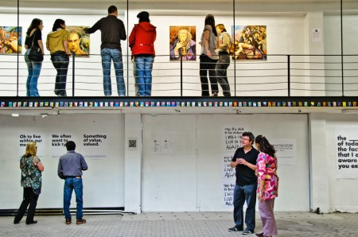

::: {#page .hfeed .site}
[Saltar al contenido](index.html#content){.skip-link
.screen-reader-text}

::: {#sidebar .sidebar}
::: {.site-branding}
[{.custom-logo
width="248" height="248" sizes="(max-width: 248px) 100vw, 248px"
srcset="../../../wp-content/uploads/2016/04/cropped-Manneken_Pis_Blog_Bruselas_Ricardo_Imbern-248.jpg 248w, ../../../wp-content/uploads/2016/04/cropped-Manneken_Pis_Blog_Bruselas_Ricardo_Imbern-248-150x150.jpg 150w"}](../../../index.html){.custom-logo-link}

[Blog Bruselas en español](../../../index.html)

El blog-guía escrito por españoles en Bruselas para los hispanoparlantes
que viven aquí y para los turistas que aprovechan los vuelos baratos
para descubrir el chocolate, la cerveza, la Grand Place y tantas otras
cosas buenas.

Menú y widgets
:::

::: {#secondary .secondary}
::: {#widget-area .widget-area role="complementary"}
Blog Bruselas es {#blog-bruselas-es .widget-title}
----------------

::: {.textwidget}
Un **blog en español escrito en Bruselas** por unos enamorados de la
capital de Bélgica, corazón mágico de Europa. Una ciudad pequeña y
grande, llena de gente, comida, eventos y rincones encantadores; para
descubrir y disfrutar sin dejarse aguar la fiesta por el tiempo (no es
tan malo).

Para quienes pasan por Bruselas, porque vienen de visita, de turismo o
tienen la suerte de vivir aquí. Sí quieres conocer más que los hoteles
en Bruselas, aprovecha los vuelos baratos y **vive la ciudad**.

Blog Bruselas es el bebé de [Ramón Suárez](http://www.ramonsuarez.com),
bruseleño convencido desde 2003.
:::

Espacios de trabajo compartido {#espacios-de-trabajo-compartido .widget-title}
------------------------------

::: {.textwidget}
[Betacowork Coworking Bruselas](http://www.betacowork.com) [Mapa de
espacios de coworking en Bélgica](http://coworkingbelgium.com)
:::

Último vídeo {#último-vídeo .widget-title}
------------

Asociados con Hispagenda, la guía digital de los españoles en Bélgica {#asociados-con-hispagenda-la-guía-digital-de-los-españoles-en-bélgica .widget-title}
---------------------------------------------------------------------

::: {.textwidget}
[{.attachment-medium
width="250" height="100"}](http://www.hispagenda.com)
:::

Más sobre Bruselas en otros idiomas {#más-sobre-bruselas-en-otros-idiomas .widget-title}
-----------------------------------

::: {.textwidget}
[Agenda.be](http://www.agenda.be) FR NL\
[Bruxelles Blog](http://www.bxlblog.be/) FR\
[Eventos para emprendedores y freelance en
Bruselas](http://www.betacowork.com/events/)\
[The Network
Brussels](http://groups.yahoo.com/group/TheNetworkBrussels/) EN\
[What\'s up in Belgium](http://www.whatsupin.be/) EN
:::

Más sobre Bélgica en Español {#más-sobre-bélgica-en-español .widget-title}
----------------------------

::: {.textwidget}
[Spaniards en Bélgica](http://www.spaniards.es/paises/belgica)
:::
:::
:::
:::

::: {#content .site-content}
::: {#primary .section .content-area}
::: {#main .site-main role="main"}
Etiqueta: concierto strand bruselas {#etiqueta-concierto-strand-bruselas .page-title}
===================================

[Concierto de Strand y arte en DAPht](../../../index.html?p=3337) {#concierto-de-strand-y-arte-en-dapht .entry-title}
-----------------------------------------------------------------

::: {.entry-content}
[{.alignnone
.size-medium .wp-image-3339 width="450" height="298"
sizes="(max-width: 450px) 100vw, 450px"
srcset="../../../wp-content/uploads/2011/05/gallery-450x298.jpg 450w, ../../../wp-content/uploads/2011/05/gallery-150x99.jpg 150w, ../../../wp-content/uploads/2011/05/gallery.jpg 988w"}](http://www.dapht.be)\
Este sábado podeis asistir a un concierto gratuito de Strand en la
[galería temporal DAPht](http://dapht.be/).\
\
Además del concierto del sábado, podéis aprovechar para ver una
**selección de artistas internacionales afincados en Bruselas**. Se
trata de una iniciativa de Gilbert West, gracias al cuál podemos
disfrutar de la obra de los artistas y DJ todos los jueves, viernes y
sábados del mes de mayo, de 12 a 18h. La galería está al ladito del
Parlamento Europeo, en la Chaussée de Wavre 216
([mapa](http://dapht.be/index.php/dapht/map)).
:::

[[Publicado el
]{.screen-reader-text}[20/05/201120/05/2011](../../../index.html?p=3337)]{.posted-on}[[[Autor
]{.screen-reader-text}[Ramón Suárez (administrador de Blog
Bruselas)](../../author/admin/index.html){.url .fn .n}]{.author
.vcard}]{.byline}[[Categorías
]{.screen-reader-text}[Artes](../../category/artes/index.html)]{.cat-links}[[Etiquetas
]{.screen-reader-text}[concierto strand bruselas](index.html),
[dapht.be](../dapht-be/index.html), [galería de
arte](../galeria-de-arte/index.html), [Gilbert
West](../gilbert-west/index.html)]{.tags-links}[[[1 comentario[ en
Concierto de Strand y arte en DAPht]{.screen-reader-text}]{.dsq-postid
dsqidentifier="3337 http://www.blogbruselas.com/?p=3337"}](../../../index.html?p=3337#comments)]{.comments-link}
:::
:::
:::

::: {.site-info}
[Creado con WordPress](https://es.wordpress.org/)
:::
:::
