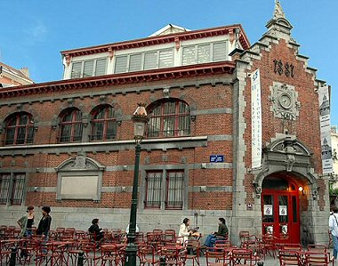

::: {#page .hfeed .site}
[Saltar al contenido](index.html#content){.skip-link
.screen-reader-text}

::: {#sidebar .sidebar}
::: {.site-branding}
[{.custom-logo
width="248" height="248" sizes="(max-width: 248px) 100vw, 248px"
srcset="../../../wp-content/uploads/2016/04/cropped-Manneken_Pis_Blog_Bruselas_Ricardo_Imbern-248.jpg 248w, ../../../wp-content/uploads/2016/04/cropped-Manneken_Pis_Blog_Bruselas_Ricardo_Imbern-248-150x150.jpg 150w"}](../../../index.html){.custom-logo-link}

[Blog Bruselas en español](../../../index.html)

El blog-guía escrito por españoles en Bruselas para los hispanoparlantes
que viven aquí y para los turistas que aprovechan los vuelos baratos
para descubrir el chocolate, la cerveza, la Grand Place y tantas otras
cosas buenas.

Menú y widgets
:::

::: {#secondary .secondary}
::: {#widget-area .widget-area role="complementary"}
Blog Bruselas es {#blog-bruselas-es .widget-title}
----------------

::: {.textwidget}
Un **blog en español escrito en Bruselas** por unos enamorados de la
capital de Bélgica, corazón mágico de Europa. Una ciudad pequeña y
grande, llena de gente, comida, eventos y rincones encantadores; para
descubrir y disfrutar sin dejarse aguar la fiesta por el tiempo (no es
tan malo).

Para quienes pasan por Bruselas, porque vienen de visita, de turismo o
tienen la suerte de vivir aquí. Sí quieres conocer más que los hoteles
en Bruselas, aprovecha los vuelos baratos y **vive la ciudad**.

Blog Bruselas es el bebé de [Ramón Suárez](http://www.ramonsuarez.com),
bruseleño convencido desde 2003.
:::

Espacios de trabajo compartido {#espacios-de-trabajo-compartido .widget-title}
------------------------------

::: {.textwidget}
[Betacowork Coworking Bruselas](http://www.betacowork.com) [Mapa de
espacios de coworking en Bélgica](http://coworkingbelgium.com)
:::

Último vídeo {#último-vídeo .widget-title}
------------

Asociados con Hispagenda, la guía digital de los españoles en Bélgica {#asociados-con-hispagenda-la-guía-digital-de-los-españoles-en-bélgica .widget-title}
---------------------------------------------------------------------

::: {.textwidget}
[{.attachment-medium
width="250" height="100"}](http://www.hispagenda.com)
:::

Más sobre Bruselas en otros idiomas {#más-sobre-bruselas-en-otros-idiomas .widget-title}
-----------------------------------

::: {.textwidget}
[Agenda.be](http://www.agenda.be) FR NL\
[Bruxelles Blog](http://www.bxlblog.be/) FR\
[Eventos para emprendedores y freelance en
Bruselas](http://www.betacowork.com/events/)\
[The Network
Brussels](http://groups.yahoo.com/group/TheNetworkBrussels/) EN\
[What\'s up in Belgium](http://www.whatsupin.be/) EN
:::

Más sobre Bélgica en Español {#más-sobre-bélgica-en-español .widget-title}
----------------------------

::: {.textwidget}
[Spaniards en Bélgica](http://www.spaniards.es/paises/belgica)
:::
:::
:::
:::

::: {#content .site-content}
::: {#primary .section .content-area}
::: {#main .site-main role="main"}
Etiqueta: concierto {#etiqueta-concierto .page-title}
===================

[Hoy: concierto de Mandra en Bruselas](../../../index.html?p=2453) {#hoy-concierto-de-mandra-en-bruselas .entry-title}
------------------------------------------------------------------

::: {.entry-content}
Hace cuatro días os hablaba del grupo Mandra y prometía que os tendría
informados de la próxima actuación del grupo. Pues bien, esta misma
tarde, 1 de julio, a partir de las 18:30 los podréis oír y ver en el que
parece ser último evento de la temporada de EasySundays,

[{.aligncenter
.size-full .wp-image-2456 width="200" height="283"
sizes="(max-width: 200px) 100vw, 200px"
srcset="../../../wp-content/uploads/2010/07/41602_104155636302700_2952_n.jpg 200w, ../../../wp-content/uploads/2010/07/41602_104155636302700_2952_n-106x150.jpg 106w"}](http://www.blogbruselas.com/2010/07/concierto-mandra-bruselas-easy-sundays.html/41602_104155636302700_2952_n)

[EasySundays](http://www.easysundays.info/) es una iniciativa llevada a
cabo por un grupo de mujeres que viven en Bruselas que tiene como
objetivo reunir a la gente, para descubrir lugares en la ciudad y para
apoyar grandes causas.

Los ingresos serán destinados a la ayuda de
[Quinoa](http://www.quinoa.be/), una ONG que lleva proyectos de
educación como medio de desarrollo. El evento tendrá lugar en [Mundo
b](http://www.mundo-b.org/fr/objectifs.html), 26 rue d'Edimbourg y se
puede reservar en Facebook:  [EasySundays afterwork garden party with
live
music!](http://www.facebook.com/event.php?eid=104155636302700#!/event.php?eid=104155636302700&ref=ts)

Animo. Merece la pena
:::

[[Publicado el
]{.screen-reader-text}[01/07/201013/07/2010](../../../index.html?p=2453)]{.posted-on}[[[Autor
]{.screen-reader-text}[Álvaro Marín](../../../index.html?author=4){.url
.fn .n}]{.author .vcard}]{.byline}[[Categorías
]{.screen-reader-text}[Artes](../../category/artes/index.html), [Comer y
beber](../../category/comer-y-beber/index.html), [Gran
Bruselas](../../category/gran-bruselas/index.html)]{.cat-links}[[Etiquetas
]{.screen-reader-text}[arte](../arte/index.html),
[bruselas](../bruselas/index.html), [concierto](index.html), [concierto
Madra](../concierto-madra/index.html), [easy sundays
Bruselas](../easy-sundays-bruselas/index.html),
[fiesta](../fiesta/index.html), [mundo b](../mundo-b/index.html),
[musica](../musica/index.html)]{.tags-links}

[El barrio de Saint-Géry en Bruselas (1)](../../../index.html?p=2050) {#el-barrio-de-saint-géry-en-bruselas-1 .entry-title}
---------------------------------------------------------------------

::: {.entry-content}
[{.size-full
.wp-image-2052 .alignnone width="380" height="299"
sizes="(max-width: 380px) 100vw, 380px"
srcset="../../../wp-content/uploads/2010/06/archsintgorikshal4.jpg 380w, ../../../wp-content/uploads/2010/06/archsintgorikshal4-150x118.jpg 150w"}](http://www.blogbruselas.com/2010/06/el-barrio-de-saint-gery-en-bruselas-1.html/archsintgorikshal4)

Raros son los neo-bruselitas hispanoparlantes que no conocen los bares
de Saint-Géry, un barrio situado en una de las zonas de Bruselas que más
intensamente experimentaron las transformaciones urbanísticas de la
ciudad en el siglo XIX.

Un poco paradójicamente, hoy constituye una de las partes menos
alteradas del antiguo espacio intra muros, conocido como *le Pentagone*;
tanto el trazado de las calles como las fachadas apenas han sufrido
alteraciones desde entonces, lo que la convierte en uno de los barrios
antiguos mejor conservados del centro.

Antes de la transformación urbanística, el barrio era una isla formada
por la Senne, el río de Bruselas. La isla formaba un gran círculo que
iba desde la antigua iglesia de las Calrisas hasta la actual bolsa, poco
más o menos. Había una segunda isla más pequeña muy cerca, allí donde
está hoy la plaza Fontainas, donde el río bordeaba la iglesia de Nuestra
Señora del Socorro. Ambas se distinguen bien en este plano de la ciudad
de 1837.\
[{.size-full
.wp-image-2071 .alignnone width="434" height="360"
sizes="(max-width: 434px) 100vw, 434px"
srcset="../../../wp-content/uploads/2010/06/Brussels_1837.jpg 724w, ../../../wp-content/uploads/2010/06/Brussels_1837-150x124.jpg 150w, ../../../wp-content/uploads/2010/06/Brussels_1837-450x372.jpg 450w"}](http://www.blogbruselas.com/2010/06/el-barrio-de-saint-gery-en-bruselas-1.html/brussels_1837)

Resulta divertido apreciar que la homofonía no es lo único que el río de
Bruselas tiene en común con el de París.

A partir de 1867, se procedió a cubrir el río, por lo que hoy resulta
invisible a los transeuntes; es lo que se conoce en francés como el
[*Voûtement de la
Senne*](http://www.brunette.brucity.be/lepage/eaufinal/LEPAGE2000/Dossantos/levoutementdelasenne.htm)
. Hasta entonces Saint-Géry debió de ser un barrio pintoresco,
laberíntico, sucio, popular, todo lo que el urbanismo del siglo XIX
detestaba. Rodeado por canales parecidos a los que todavía hoy tiene
Brujas, el barrio conservaba aún un aspecto medieval, lo que para la
mentalidad de entonces quería decir insalubre.

{.size-medium
.wp-image-2059 width="313" height="450"
sizes="(max-width: 313px) 100vw, 313px"
srcset="../../../wp-content/uploads/2010/06/barrio_st_Géry-313x450.jpg 313w, ../../../wp-content/uploads/2010/06/barrio_st_Géry-104x150.jpg 104w, ../../../wp-content/uploads/2010/06/barrio_st_Géry.jpg 337w"}

Lo único que queda de la isla es el recuerdo, y el nombre de una de las
calles que llevan al mercado de Saint-Géry, y que ha conservado en buena
parte su antiguo trazado: la *rue de la Grande-Île /
Groot-Eilandstraat*.

{.size-medium
.wp-image-2090 width="360" height="450"
sizes="(max-width: 360px) 100vw, 360px"
srcset="../../../wp-content/uploads/2010/06/dyn008_original_454_567_pjpeg_2674957_449eeb6bbc0525413d6ef41970311019-360x450.jpg 360w, ../../../wp-content/uploads/2010/06/dyn008_original_454_567_pjpeg_2674957_449eeb6bbc0525413d6ef41970311019-120x150.jpg 120w, ../../../wp-content/uploads/2010/06/dyn008_original_454_567_pjpeg_2674957_449eeb6bbc0525413d6ef41970311019.jpg 454w"}

Del Sena nos queda un pequeño tramo visible precisamente a un paso del
mercado, en un patio particular pero accesible durante el día.

{.size-medium
.wp-image-2116 width="302" height="450"
sizes="(max-width: 302px) 100vw, 302px"
srcset="../../../wp-content/uploads/2010/06/senne_St-Gery1-302x450.jpg 302w, ../../../wp-content/uploads/2010/06/senne_St-Gery1-100x150.jpg 100w, ../../../wp-content/uploads/2010/06/senne_St-Gery1.jpg 390w"}
:::

[[Publicado el
]{.screen-reader-text}[01/06/201007/06/2010](../../../index.html?p=2050)]{.posted-on}[[[Autor
]{.screen-reader-text}[Eduardo Lamas
Delgado](../../author/eduardo/index.html){.url .fn .n}]{.author
.vcard}]{.byline}[[Categorías ]{.screen-reader-text}[Gran
Bruselas](../../category/gran-bruselas/index.html)]{.cat-links}[[Etiquetas
]{.screen-reader-text}[Barrio
Saint-Géry](../barrio-saint-gery/index.html), [concierto](index.html),
[El viejo Bruselas](../el-viejo-bruselas/index.html), [historia de
Bruselas](../historia-de-bruselas/index.html), [isla
Saint-Géry](../isla-saint-gery/index.html), [La
Senne](../la-senne/index.html), [urbanismo de
Bruselas](../urbanismo-de-bruselas/index.html)]{.tags-links}[[[5
comentarios[ en El barrio de Saint-Géry en Bruselas
(1)]{.screen-reader-text}]{.dsq-postid
dsqidentifier="2050 http://www.blogbruselas.com/?p=2050"}](../../../index.html?p=2050#comments)]{.comments-link}

[La "Anti-tapas", una fiesta para hincarle el diente](../../../index.html?p=1991) {#la-anti-tapas-una-fiesta-para-hincarle-el-diente .entry-title}
---------------------------------------------------------------------------------

::: {.entry-content}
Sí, sí, es que el nombre de la fiesta, Anti-tapas, mezcla del italiano
antipasto y de las castizas tapas, resulta muy apetecible. La mezcla
italo-ibérica se explica también porque es una asociación italiana la
que organiza el fiestorro en la sede del centro de Galicia (Ex-Cantina).

Pero bueno, vamos a lo importante, que es la fiesta en sí. Para los más
madrugadores, hubo comida italiana para picar, incluída en el precio de
la entrada. O sea, por 5 euros: picoteo+concierto+buen ambiente. Todos
los ingredientes para una buena noche. Y larga, porque la fiesta se
prolonga hasta bien tarde para los más *noctámbulos*.

En el caso del pasado viernes 14, los invitados eran ***Modena City
Ramblers***, un veterano grupo muy conocido en el país de la bota. Folk
y letras combativas. La gente se lo pasó (nos lo pasamos) en grande.
Tanta gente y tanto ambiente que casi no se podía respirar...Para
muestra, este vídeo:

De hecho, sobre las 10 de la noche la cola para entrar era considerable,
y hubo quien se tuvo que quedar sin entrar.

Los chicos de esta asociación italiana, que se llama Palais des
Sciences, no saben quedarse quietos y ya este sábado 22 de mayo, como ya
se ha dicho aquí en el blog, junto a la organización del Parcours
d´Artistes de Saint-Gilles, nos traen a Tonino Carotone en concierto en
Bruselas. Será en la fiesta de clausura al aire libre de este evento, en
la Place Marie Janson -- Parvis de St. Gilles, a las ocho de la noche.
Además se trata de la primera vez que el cantante actúa en Bruselas.
Actuaciones buenas, bonitas y baratas(por la patilla esta vez) en
nuestra querida ciudad, ¿quién da más?
:::

[[Publicado el
]{.screen-reader-text}[20/05/201021/05/2010](../../../index.html?p=1991)]{.posted-on}[[[Autor
]{.screen-reader-text}[Objetivo
Bruselas](../../author/objetivo-bruselas/index.html){.url .fn
.n}]{.author .vcard}]{.byline}[[Categorías ]{.screen-reader-text}[Gran
Bruselas](../../category/gran-bruselas/index.html)]{.cat-links}[[Etiquetas
]{.screen-reader-text}[anti-tapas](../anti-tapas/index.html),
[concierto](index.html),
[fiesta](../fiesta/index.html)]{.tags-links}[[[3 comentarios[ en La
"Anti-tapas", una fiesta para hincarle el
diente]{.screen-reader-text}]{.dsq-postid
dsqidentifier="1991 http://www.blogbruselas.com/?p=1991"}](../../../index.html?p=1991#comments)]{.comments-link}

[Falla en el Palais de Beaux-Arts: El retablo de Maese Pedro](../../../index.html?p=1228) {#falla-en-el-palais-de-beaux-arts-el-retablo-de-maese-pedro .entry-title}
-----------------------------------------------------------------------------------------

::: {.entry-content}
<http://www.youtube.com/watch?v=PILn69SArUk&feature=player_embedded>

El [Palais de Beaux Arts](http://www.bozar.be/) de Bruselas (BOZAR)
presenta el próximo 6 de febrero ['El retablo de Maese
Pedro](http://www.manueldefalla.com/falla/website/obradetalle.jsp?sesid=-1&planguage=ES&id=479807556070)',
de [Manuel de Falla](http://www.manueldefalla.com/) (1876-1946),
concierto para clave y cinco instrumentos inspirado del pasaje de la
segunda parte del Quijote. Se trata en realidad de una representación de
marionetas de un solo acto acompañada de música.

La mayor parte de las veces esta obra se presenta en su versión
concierto, por lo que esta es una ocasión rara de poder disfrutar del
espectáculo completo como fue concebido en su origen.

Se trata al parecer de una nueva versión inédita, con una puesta en
escena muy elaborada preparada para celebrar la presidencia española de
la Unión europea. Nadie podrá negar que estos festejos políticos son una
ventaja añadida a esta ciudad.
:::

[[Publicado el
]{.screen-reader-text}[12/01/2010](../../../index.html?p=1228)]{.posted-on}[[[Autor
]{.screen-reader-text}[Eduardo Lamas
Delgado](../../author/eduardo/index.html){.url .fn .n}]{.author
.vcard}]{.byline}[[Categorías
]{.screen-reader-text}[Artes](../../category/artes/index.html)]{.cat-links}[[Etiquetas
]{.screen-reader-text}[arte](../arte/index.html),
[belgica](../belgica/index.html), [Blog
Bruselas](../blog-bruselas/index.html), [bozar](../bozar/index.html),
[concierto](index.html), [España en
Bruselas](../espana-en-bruselas/index.html),
[musica](../musica/index.html)]{.tags-links}

[Sarao Truc Troc 2010](../../../index.html?p=1221) {#sarao-truc-troc-2010 .entry-title}
--------------------------------------------------

::: {.entry-content}
[{width="441"
height="701"}](http://www.perrier-tructroc.be/)

Un año más, el sexto ya, el [Palais de
Beaux-Arts](http://www.bozar.be/home.php?lng=fr&) de Bruselas acoge
[TRUC TROC](http://www.perrier-tructroc.be/), una fiesta y evento
artístico que permite acercar a la gente al arte contemporáneo.

Durante dos días se organiza un sarao vernissage en que diferentes
artistas presentan sus obras al público como en una exposición colectiva
en una galería de arte. Como en los vernisages  las bebidas también son
gratuitas (o lo han sido en ediciones anteriores), pero las obras no
están a la venta, sino que se proponen en trueque al mejor postor.

La idea es simple y muy divertida. Los interesados en tal o tal obra
deberán dejar un post-it con sus coordenadas y la mejor oferta que estén
dispuestos a hacer, y con un poco de suerte quizá les llamen. Cada año
se ve de todo: préstamo de la casa de la playa durante un año, clases de
cocina, cajas de champán...

La historia de esta estupenda inicitiva aparece resumida en la página
web de [TRUC TROC](http://www.perrier-tructroc.be/) en francés, en
neerlandés y en inglés.

Éxito asegurado
:::

[[Publicado el
]{.screen-reader-text}[12/01/201013/01/2010](../../../index.html?p=1221)]{.posted-on}[[[Autor
]{.screen-reader-text}[Eduardo Lamas
Delgado](../../author/eduardo/index.html){.url .fn .n}]{.author
.vcard}]{.byline}[[Categorías
]{.screen-reader-text}[Artes](../../category/artes/index.html), [Comer y
beber](../../category/comer-y-beber/index.html)]{.cat-links}[[Etiquetas
]{.screen-reader-text}[arte](../arte/index.html),
[bar](../bar/index.html), [beber](../beber/index.html), [Blog
Bruselas](../blog-bruselas/index.html), [concierto](index.html),
[exposicion](../exposicion/index.html), [fiesta](../fiesta/index.html),
[fotografia](../fotografia/index.html),
[performance](../performance/index.html),
[trueque](../trueque/index.html)]{.tags-links}

Navegación de entradas {#navegación-de-entradas .screen-reader-text}
----------------------

::: {.nav-links}
[[Página ]{.meta-nav .screen-reader-text}1]{.page-numbers .current}
[[Página ]{.meta-nav
.screen-reader-text}2](page/2/index.html){.page-numbers} [[Página
]{.meta-nav .screen-reader-text}3](page/3/index.html){.page-numbers}
[Página siguiente](page/2/index.html){.next .page-numbers}
:::
:::
:::
:::

::: {.site-info}
[Creado con WordPress](https://es.wordpress.org/)
:::
:::
