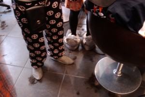

::: {#page .hfeed .site}
[Saltar al contenido](index.html#content){.skip-link
.screen-reader-text}

::: {#sidebar .sidebar}
::: {.site-branding}
[{.custom-logo
width="248" height="248" sizes="(max-width: 248px) 100vw, 248px"
srcset="../../../wp-content/uploads/2016/04/cropped-Manneken_Pis_Blog_Bruselas_Ricardo_Imbern-248.jpg 248w, ../../../wp-content/uploads/2016/04/cropped-Manneken_Pis_Blog_Bruselas_Ricardo_Imbern-248-150x150.jpg 150w"}](../../../index.html){.custom-logo-link}

[Blog Bruselas en español](../../../index.html)

El blog-guía escrito por españoles en Bruselas para los hispanoparlantes
que viven aquí y para los turistas que aprovechan los vuelos baratos
para descubrir el chocolate, la cerveza, la Grand Place y tantas otras
cosas buenas.

Menú y widgets
:::

::: {#secondary .secondary}
::: {#widget-area .widget-area role="complementary"}
Blog Bruselas es {#blog-bruselas-es .widget-title}
----------------

::: {.textwidget}
Un **blog en español escrito en Bruselas** por unos enamorados de la
capital de Bélgica, corazón mágico de Europa. Una ciudad pequeña y
grande, llena de gente, comida, eventos y rincones encantadores; para
descubrir y disfrutar sin dejarse aguar la fiesta por el tiempo (no es
tan malo).

Para quienes pasan por Bruselas, porque vienen de visita, de turismo o
tienen la suerte de vivir aquí. Sí quieres conocer más que los hoteles
en Bruselas, aprovecha los vuelos baratos y **vive la ciudad**.

Blog Bruselas es el bebé de [Ramón Suárez](http://www.ramonsuarez.com),
bruseleño convencido desde 2003.
:::

Espacios de trabajo compartido {#espacios-de-trabajo-compartido .widget-title}
------------------------------

::: {.textwidget}
[Betacowork Coworking Bruselas](http://www.betacowork.com) [Mapa de
espacios de coworking en Bélgica](http://coworkingbelgium.com)
:::

Último vídeo {#último-vídeo .widget-title}
------------

Asociados con Hispagenda, la guía digital de los españoles en Bélgica {#asociados-con-hispagenda-la-guía-digital-de-los-españoles-en-bélgica .widget-title}
---------------------------------------------------------------------

::: {.textwidget}
[{.attachment-medium
width="250" height="100"}](http://www.hispagenda.com)
:::

Más sobre Bruselas en otros idiomas {#más-sobre-bruselas-en-otros-idiomas .widget-title}
-----------------------------------

::: {.textwidget}
[Agenda.be](http://www.agenda.be) FR NL\
[Bruxelles Blog](http://www.bxlblog.be/) FR\
[Eventos para emprendedores y freelance en
Bruselas](http://www.betacowork.com/events/)\
[The Network
Brussels](http://groups.yahoo.com/group/TheNetworkBrussels/) EN\
[What\'s up in Belgium](http://www.whatsupin.be/) EN
:::

Más sobre Bélgica en Español {#más-sobre-bélgica-en-español .widget-title}
----------------------------

::: {.textwidget}
[Spaniards en Bélgica](http://www.spaniards.es/paises/belgica)
:::
:::
:::
:::

::: {#content .site-content}
::: {#primary .section .content-area}
::: {#main .site-main role="main"}
Etiqueta: disfrazados en el trabajo {#etiqueta-disfrazados-en-el-trabajo .page-title}
===================================

[En pijama a la peluquería](../../../index.html?p=1121) {#en-pijama-a-la-peluquería .entry-title}
-------------------------------------------------------

::: {.entry-content}
Hay gente que tiene mucho cachondeo encima. Hoy me he pasado por la
[***peluquería Eau Contre
Air***](http://www.facebook.com/pages/manage/updates.php?id=14471236332&sent=1&e=0#/eaucontreair "Eau Contre Air tiene fans en Facebook")
y me he quedado un pelín flipado cuando he visto que **iban todos en
pijama**.

{.aligncenter
.size-medium .wp-image-1122 width="300" height="200"
sizes="(max-width: 300px) 100vw, 300px"
srcset="../../../wp-content/uploads/2009/12/Peluqueria_Eau_Contre_Air_en_pijama-300x200.jpg 300w, ../../../wp-content/uploads/2009/12/Peluqueria_Eau_Contre_Air_en_pijama-150x100.jpg 150w, ../../../wp-content/uploads/2009/12/Peluqueria_Eau_Contre_Air_en_pijama-1024x682.jpg 1024w"}

{.aligncenter
.size-medium .wp-image-1123 width="300" height="200"
sizes="(max-width: 300px) 100vw, 300px"
srcset="../../../wp-content/uploads/2009/12/Zapatillas_pijamas_Eau_Contre_Air-300x200.jpg 300w, ../../../wp-content/uploads/2009/12/Zapatillas_pijamas_Eau_Contre_Air-150x100.jpg 150w, ../../../wp-content/uploads/2009/12/Zapatillas_pijamas_Eau_Contre_Air-1024x682.jpg 1024w"}

Me han explicado que es una tradición suya: **todos los años se ponen de
acuerdo sobre un tema** y el 31 de diciembre se presentan a trabajar
disfrazados. Todavía estáis a tiempo de verlo con vuestros propios ojos
antes de [salir de
fiesta](http://www.blogbruselas.com/2009/12/opciones-para-nochevieja-en-bruselas.html#comment-1097 "Fiestas de año nuevo en Bruselas. Noche vieja de marcha").

Nótese el nombre de la peluquería, que en francés quiere decir **agua
contra aire**, pero que suena como **al contrario**. Además de cortar
bien el pelo, tienen gracia.

Este es el último mensaje de 2009 por mi parte. **¡Feliz año nuevo!**
:::

[[Publicado el
]{.screen-reader-text}[31/12/200931/12/2009](../../../index.html?p=1121)]{.posted-on}[[[Autor
]{.screen-reader-text}[Ramón
Suárez](../../2010/04/30/index.html?author=2){.url .fn .n}]{.author
.vcard}]{.byline}[[Categorías ]{.screen-reader-text}[Gran
Bruselas](../../category/gran-bruselas/index.html),
[Humor](../../category/humor/index.html)]{.cat-links}[[Etiquetas
]{.screen-reader-text}[31 de diciembre](../31-de-diciembre/index.html),
[cachondeo en el trabajo](../cachondeo-en-el-trabajo/index.html),
[disfraces](../disfraces/index.html), [disfrazados en el
trabajo](index.html), [eau contre air](../eau-contre-air/index.html),
[fin de año](../fin-de-ano/index.html),
[peluquería](../peluqueria/index.html), [peluquería de
bruselas](../peluqueria-de-bruselas/index.html),
[tradición](../tradicion/index.html)]{.tags-links}
:::
:::
:::

::: {.site-info}
[Creado con WordPress](https://es.wordpress.org/)
:::
:::
