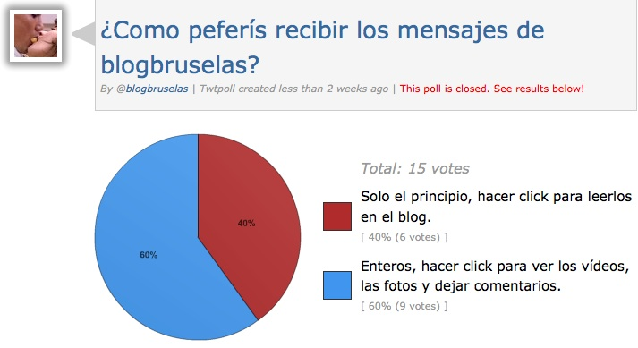

::: {#page .hfeed .site}
[Saltar al contenido](index.html#content){.skip-link
.screen-reader-text}

::: {#sidebar .sidebar}
::: {.site-branding}
[{.custom-logo
width="248" height="248" sizes="(max-width: 248px) 100vw, 248px"
srcset="../../../wp-content/uploads/2016/04/cropped-Manneken_Pis_Blog_Bruselas_Ricardo_Imbern-248.jpg 248w, ../../../wp-content/uploads/2016/04/cropped-Manneken_Pis_Blog_Bruselas_Ricardo_Imbern-248-150x150.jpg 150w"}](../../../index.html){.custom-logo-link}

[Blog Bruselas en español](../../../index.html)

El blog-guía escrito por españoles en Bruselas para los hispanoparlantes
que viven aquí y para los turistas que aprovechan los vuelos baratos
para descubrir el chocolate, la cerveza, la Grand Place y tantas otras
cosas buenas.

Menú y widgets
:::

::: {#secondary .secondary}
::: {#widget-area .widget-area role="complementary"}
Blog Bruselas es {#blog-bruselas-es .widget-title}
----------------

::: {.textwidget}
Un **blog en español escrito en Bruselas** por unos enamorados de la
capital de Bélgica, corazón mágico de Europa. Una ciudad pequeña y
grande, llena de gente, comida, eventos y rincones encantadores; para
descubrir y disfrutar sin dejarse aguar la fiesta por el tiempo (no es
tan malo).

Para quienes pasan por Bruselas, porque vienen de visita, de turismo o
tienen la suerte de vivir aquí. Sí quieres conocer más que los hoteles
en Bruselas, aprovecha los vuelos baratos y **vive la ciudad**.

Blog Bruselas es el bebé de [Ramón Suárez](http://www.ramonsuarez.com),
bruseleño convencido desde 2003.
:::

Espacios de trabajo compartido {#espacios-de-trabajo-compartido .widget-title}
------------------------------

::: {.textwidget}
[Betacowork Coworking Bruselas](http://www.betacowork.com) [Mapa de
espacios de coworking en Bélgica](http://coworkingbelgium.com)
:::

Último vídeo {#último-vídeo .widget-title}
------------

Asociados con Hispagenda, la guía digital de los españoles en Bélgica {#asociados-con-hispagenda-la-guía-digital-de-los-españoles-en-bélgica .widget-title}
---------------------------------------------------------------------

::: {.textwidget}
[{.attachment-medium
width="250" height="100"}](http://www.hispagenda.com)
:::

Más sobre Bruselas en otros idiomas {#más-sobre-bruselas-en-otros-idiomas .widget-title}
-----------------------------------

::: {.textwidget}
[Agenda.be](http://www.agenda.be) FR NL\
[Bruxelles Blog](http://www.bxlblog.be/) FR\
[Eventos para emprendedores y freelance en
Bruselas](http://www.betacowork.com/events/)\
[The Network
Brussels](http://groups.yahoo.com/group/TheNetworkBrussels/) EN\
[What\'s up in Belgium](http://www.whatsupin.be/) EN
:::

Más sobre Bélgica en Español {#más-sobre-bélgica-en-español .widget-title}
----------------------------

::: {.textwidget}
[Spaniards en Bélgica](http://www.spaniards.es/paises/belgica)
:::
:::
:::
:::

::: {#content .site-content}
::: {#primary .section .content-area}
::: {#main .site-main role="main"}
Etiqueta: encuesta {#etiqueta-encuesta .page-title}
==================

[Resultado encuesta suscriptores por correo electrónico](../../../index.html?p=526) {#resultado-encuesta-suscriptores-por-correo-electrónico .entry-title}
-----------------------------------------------------------------------------------

::: {.entry-content}
Ante los comentarios amigables (=quejas) de
[Sandel](http://twitter.com/sandel "Twitter de un colombiano geek en Bruselas")
y
[Zeta](http://twitter.com/zugaldia "Antonio Zugaldía, oráculo tecnológico de Blog Bruselas")
sobre el **formato de entrega del
[RSS](http://es.wikipedia.org/wiki/Rss "¿Qué es el RSS?") de Blog
Bruselas**, envié una **miniencuesta** a los suscriptores que lo reciben
[por correo
electrónico](http://feedburner.google.com/fb/a/mailverify?uri=ComerHablarAmar&loc=es_ES "Recibe las novedades en tu correo electrónico"):

[{.alignnone
.size-full .wp-image-527 width="713" height="389"
sizes="(max-width: 713px) 100vw, 713px"
srcset="../../../wp-content/uploads/2009/09/Resultado_encuesta_RSS_blog_bruselas.jpg 713w, ../../../wp-content/uploads/2009/09/Resultado_encuesta_RSS_blog_bruselas-300x163.jpg 300w"}](http://twtpoll.com/jj29to "Por si no os fiáis")

La **participación** ha sido aún más **baja** que en las elecciones
europeas y no se ha oído la voz de los que acceden al blog a través de
lectores RSS o de Facebook, así que no sé que hacer con el resultado.

**¿Qué pensáis?**
:::

[[Publicado el
]{.screen-reader-text}[13/09/200914/09/2009](../../../index.html?p=526)]{.posted-on}[[[Autor
]{.screen-reader-text}[Ramón
Suárez](../../2010/04/30/index.html?author=2){.url .fn .n}]{.author
.vcard}]{.byline}[[Categorías
]{.screen-reader-text}[Blogs](../../category/blogs/index.html)]{.cat-links}[[Etiquetas
]{.screen-reader-text}[blog](../blog/index.html), [Blog
Bruselas](../blog-bruselas/index.html), [correo
electrónico](../correo-electronico/index.html),
[email](../email/index.html), [encuesta](index.html),
[facebook](../facebook/index.html), [rss](../rss/index.html),
[twitter](../twitter/index.html)]{.tags-links}[[[9 comentarios[ en
Resultado encuesta suscriptores por correo
electrónico]{.screen-reader-text}]{.dsq-postid
dsqidentifier="526 http://www.blogbruselas.com/?p=526"}](../../../index.html?p=526#comments)]{.comments-link}

[Encuesta Blog Bruselas: parece que gusta](../../../index.html?p=382) {#encuesta-blog-bruselas-parece-que-gusta .entry-title}
---------------------------------------------------------------------

::: {.entry-content}
Parece que el blog está gustando. Ya llevamos 7 meses con la encuesta y
de momento la inmensa mayoría piensa que el blog mola y mucho 🙂

[{#BLOGGER_PHOTO_ID_5362369046269078738}](http://4.bp.blogspot.com/_m9ESRqvSnjc/Smr2PI1rLNI/AAAAAAAACsE/0MqtgufagME/s1600-h/encuestablogbruselas.png)¿A
ti que te parece? Vota en el panel izquierdo, que con el cambio de
maqueta se acabará la encuesta.

PD: el cambio llegará pronto, pero estoy teniendo problemillas de
importación.

::: {.blogger-post-footer}
Comer, hablar, amar. www.blogbruselas.com
:::
:::

[[Publicado el
]{.screen-reader-text}[25/07/200905/09/2009](../../../index.html?p=382)]{.posted-on}[[[Autor
]{.screen-reader-text}[Ramón
Suárez](../../2010/04/30/index.html?author=2){.url .fn .n}]{.author
.vcard}]{.byline}[[Categorías
]{.screen-reader-text}[Blogs](../../category/blogs/index.html)]{.cat-links}[[Etiquetas
]{.screen-reader-text}[calidad](../calidad/index.html),
[encuesta](index.html)]{.tags-links}[[[2 comentarios[ en Encuesta Blog
Bruselas: parece que gusta]{.screen-reader-text}]{.dsq-postid
dsqidentifier="382 http://www.blogbruselas.com/2009/07/encuesta-blog-bruselas-parece-que-gusta.html"}](../../../index.html?p=382#comments)]{.comments-link}

[Los toros solo interesan a uno de cada cuatro españoles](../../../index.html?p=25) {#los-toros-solo-interesan-a-uno-de-cada-cuatro-españoles .entry-title}
-----------------------------------------------------------------------------------

::: {.entry-content}
En el blog the Antonio Escolar, director de 20 minutos, aparece esta
[nota sobre los
toros](http://blogs.20minutos.es/arsenioescolar/post/2006/12/19/los-toros-interesan-uno-cada-cuatro-espanoles):

> ***Los toros interesan a uno de cada cuatro españoles**\
> El País publicaba en su edición de ayer [un
> artículo](http://www.elpais.com/articulo/cultura/Corra/corra/acaban/toros/elpepucul/20061218elpepicul_10/Tes)
> de José Suárez-Inclán que incluía datos de una encuesta que hace
> Gallup desde hace años tan reveladores como éstos:\
> -- El 72% de los españoles no muestran hoy ningún interés por las
> corridas de toros.\
> -- Actualmente están interesados en las corridas de toros el 27% de
> los españoles, mientras que en octubre de 1993 eran el 38% y en
> febrero de 1971 eran el 55%.\
> -- Entre los menores de 25 años, el interés baja al 16,6% de los
> encuestados.\
> -- Entre las mujeres, sólo el 20,1% están interesadas en los toros.\
> El autor del artículo, que es aficionado taurino, lo titula "Corra,
> corra, que se acaban los toros".*

Los toros no son arte, son tortura. Ya es hora de que se acabe con este
triste espectáculo de dolor y muerte.

::: {.blogger-post-footer}
Comer, hablar, amar. www.blogbruselas.com
:::
:::

[[Publicado el
]{.screen-reader-text}[20/12/200615/09/2009](../../../index.html?p=25)]{.posted-on}[[[Autor
]{.screen-reader-text}[Ramón
Suárez](../../2010/04/30/index.html?author=2){.url .fn .n}]{.author
.vcard}]{.byline}[[Categorías
]{.screen-reader-text}[Ideas](../../category/ideas/index.html)]{.cat-links}[[Etiquetas
]{.screen-reader-text}[corrida](../corrida/index.html),
[encuesta](index.html), [españa](../espana/index.html),
[españoles](../espanoles/index.html),
[espectáculo](../espectaculo/index.html),
[muerte](../muerte/index.html), [plaza](../plaza/index.html),
[tauromaquia](../tauromaquia/index.html), [toro](../toro/index.html),
[toros](../toros/index.html),
[tortura](../tortura/index.html)]{.tags-links}
:::
:::
:::

::: {.site-info}
[Creado con WordPress](https://es.wordpress.org/)
:::
:::
