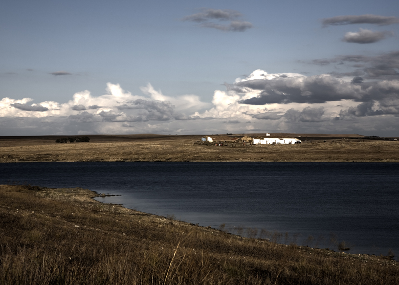

::: {#page .hfeed .site}
[Saltar al contenido](index.html#content){.skip-link
.screen-reader-text}

::: {#sidebar .sidebar}
::: {.site-branding}
[{.custom-logo
width="248" height="248" sizes="(max-width: 248px) 100vw, 248px"
srcset="../../../wp-content/uploads/2016/04/cropped-Manneken_Pis_Blog_Bruselas_Ricardo_Imbern-248.jpg 248w, ../../../wp-content/uploads/2016/04/cropped-Manneken_Pis_Blog_Bruselas_Ricardo_Imbern-248-150x150.jpg 150w"}](../../../index.html){.custom-logo-link}

[Blog Bruselas en español](../../../index.html)

El blog-guía escrito por españoles en Bruselas para los hispanoparlantes
que viven aquí y para los turistas que aprovechan los vuelos baratos
para descubrir el chocolate, la cerveza, la Grand Place y tantas otras
cosas buenas.

Menú y widgets
:::

::: {#secondary .secondary}
::: {#widget-area .widget-area role="complementary"}
Blog Bruselas es {#blog-bruselas-es .widget-title}
----------------

::: {.textwidget}
Un **blog en español escrito en Bruselas** por unos enamorados de la
capital de Bélgica, corazón mágico de Europa. Una ciudad pequeña y
grande, llena de gente, comida, eventos y rincones encantadores; para
descubrir y disfrutar sin dejarse aguar la fiesta por el tiempo (no es
tan malo).

Para quienes pasan por Bruselas, porque vienen de visita, de turismo o
tienen la suerte de vivir aquí. Sí quieres conocer más que los hoteles
en Bruselas, aprovecha los vuelos baratos y **vive la ciudad**.

Blog Bruselas es el bebé de [Ramón Suárez](http://www.ramonsuarez.com),
bruseleño convencido desde 2003.
:::

Espacios de trabajo compartido {#espacios-de-trabajo-compartido .widget-title}
------------------------------

::: {.textwidget}
[Betacowork Coworking Bruselas](http://www.betacowork.com) [Mapa de
espacios de coworking en Bélgica](http://coworkingbelgium.com)
:::

Último vídeo {#último-vídeo .widget-title}
------------

Asociados con Hispagenda, la guía digital de los españoles en Bélgica {#asociados-con-hispagenda-la-guía-digital-de-los-españoles-en-bélgica .widget-title}
---------------------------------------------------------------------

::: {.textwidget}
[{.attachment-medium
width="250" height="100"}](http://www.hispagenda.com)
:::

Más sobre Bruselas en otros idiomas {#más-sobre-bruselas-en-otros-idiomas .widget-title}
-----------------------------------

::: {.textwidget}
[Agenda.be](http://www.agenda.be) FR NL\
[Bruxelles Blog](http://www.bxlblog.be/) FR\
[Eventos para emprendedores y freelance en
Bruselas](http://www.betacowork.com/events/)\
[The Network
Brussels](http://groups.yahoo.com/group/TheNetworkBrussels/) EN\
[What\'s up in Belgium](http://www.whatsupin.be/) EN
:::

Más sobre Bélgica en Español {#más-sobre-bélgica-en-español .widget-title}
----------------------------

::: {.textwidget}
[Spaniards en Bélgica](http://www.spaniards.es/paises/belgica)
:::
:::
:::
:::

::: {#content .site-content}
::: {#primary .section .content-area}
::: {#main .site-main role="main"}
Etiqueta: extremadura {#etiqueta-extremadura .page-title}
=====================

[Un viajero en el Cercle des Voyageurs](../../../index.html?p=468) {#un-viajero-en-el-cercle-des-voyageurs .entry-title}
------------------------------------------------------------------

::: {.entry-content}
[**Casitas de Extremadura es una** ]{lang="es-ES"}[**exposición
fotográfica dedicada a paisajes**]{lang="es-ES"}[[
]{lang="es-ES"}]{style="text-decoration: line-through;"}[ **de
Extremadura. A partir del 10 de Septiembre.\
**]{lang="es-ES"}

[[Pepe Higuero es un hombre del renacimiento. Director en varios medios
de
comunicación]{lang="es-ES"}]{style="font-family: Apple Braille,Times New Roman"}[[[
]{lang="es-ES"}]{style="font-family: Apple Braille,Times New Roman"}]{style="text-decoration: line-through;"}[[,
DJ en clubes históricos de la capital cacereña, coleccionista de
vinilos, actor, fotógrafo.
]{lang="es-ES"}]{style="font-family: Apple Braille,Times New Roman"}

[[En 2009, nos sorprende como comendador de Alcuéscar en su papel de
coordinador del voluntariado de Cáceres Evocado, ese proyecto de la
Consejería de Cultura y Turismo que por segundo año consecutivo ha
convertido Cáceres en una recreación histórica de la España
barroca.]{lang="es-ES"}]{style="font-family: Apple Braille,Times New Roman"}

[[Como fotógrafo, destaca en fotografía social, el seguimiento de
acontecimientos extraordinarios y los reportajes de ciudades o países.
Ha realizado exposiciones sobre las ciudades de Londres, San José, La
Habana, Cuzco, Lima, Cáceres o Leningrado. Y de espacios naturales como
Las Hurdes o
Machu-Pichu.]{lang="es-ES"}]{style="font-family: Apple Braille,Times New Roman"}

[[Con este CV, el [lugar escogido](http://www.lecercledesvoyageurs.com/)
en Bruselas no podía ser más adecuado para acoger a este gran viajero de
ciudades, disciplinas y
conceptos.]{lang="es-ES"}]{style="font-family: Apple Braille,Times New Roman"}

[Las obras de la exposición de Pepe Higuero, CASITAS, corresponden a
espacios naturales y paisajes urbanos de Extremadura: cerezos del Jerte,
Sierra de Montánchez, Puente de Alcántara, Monfragüe, Trujillo,
Cáceres... ]{style="font-family: Apple Braille,Times New Roman"}

[\
]{style="font-family: Apple Braille,Times New Roman"}

{.alignnone
.size-full .wp-image-469 width="546" height="390"
sizes="(max-width: 546px) 100vw, 546px"
srcset="../../../wp-content/uploads/2009/09/cercle-1.jpg 780w, ../../../wp-content/uploads/2009/09/cercle-1-300x214.jpg 300w"}

[Junto a fotografías de concepción tradicional, el autor presenta otras
realizadas digitalmente con técnicas de HDR y coloreado. Hay
representaciones de la realidad y otras de composición imaginada.
]{style="font-family: Apple Braille,Times New Roman"}

[{.alignnone
.size-full .wp-image-470 width="662" height="472"
sizes="(max-width: 662px) 100vw, 662px"
srcset="../../../wp-content/uploads/2009/09/cercle-2.jpg 945w, ../../../wp-content/uploads/2009/09/cercle-2-300x214.jpg 300w"}\
]{style="font-family: Apple Braille,Times New Roman"}

[[Pepe tiene mucha relación con Bruselas. Su hija Marta lleva varios
años establecida en la capital belga. Donde además de trabajar en el
departamento financiero de una gran multinacional de textiles, colabora
en proyectos musicales en varios grupos locales y pincha discos en
varios clubes de la capital
belga.]{lang="es-ES"}]{style="font-family: Apple Braille,Times New Roman"}
:::

[[Publicado el
]{.screen-reader-text}[01/09/200902/10/2009](../../../index.html?p=468)]{.posted-on}[[[Autor
]{.screen-reader-text}[Manuel
Pueyo](../../author/easysun/index.html){.url .fn .n}]{.author
.vcard}]{.byline}[[Categorías
]{.screen-reader-text}[Artes](../../category/artes/index.html)]{.cat-links}[[Etiquetas
]{.screen-reader-text}[arte](../arte/index.html),
[bruselas](../bruselas/index.html), [casitas](../casitas/index.html),
[cercle des voyageurs](../cercle-des-voyageurs/index.html),
[exposicion](../exposicion/index.html), [extremadura](index.html),
[fotografia](../fotografia/index.html)]{.tags-links}[[[9 comentarios[ en
Un viajero en el Cercle des Voyageurs]{.screen-reader-text}]{.dsq-postid
dsqidentifier="468 http://www.blogbruselas.com/?p=468"}](../../../index.html?p=468#comments)]{.comments-link}
:::
:::
:::

::: {.site-info}
[Creado con WordPress](https://es.wordpress.org/)
:::
:::
