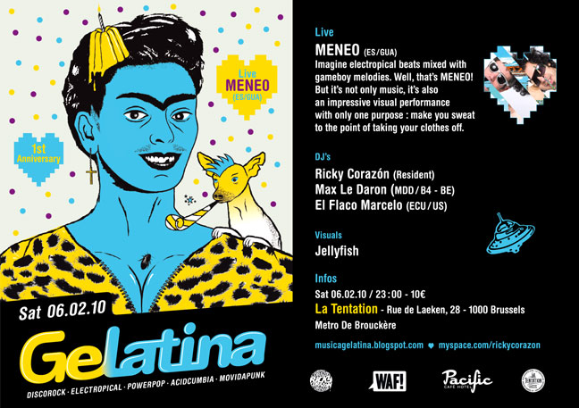

::: {#page .hfeed .site}
[Saltar al contenido](index.html#content){.skip-link
.screen-reader-text}

::: {#sidebar .sidebar}
::: {.site-branding}
[{.custom-logo
width="248" height="248" sizes="(max-width: 248px) 100vw, 248px"
srcset="../../../wp-content/uploads/2016/04/cropped-Manneken_Pis_Blog_Bruselas_Ricardo_Imbern-248.jpg 248w, ../../../wp-content/uploads/2016/04/cropped-Manneken_Pis_Blog_Bruselas_Ricardo_Imbern-248-150x150.jpg 150w"}](../../../index.html){.custom-logo-link}

[Blog Bruselas en español](../../../index.html)

El blog-guía escrito por españoles en Bruselas para los hispanoparlantes
que viven aquí y para los turistas que aprovechan los vuelos baratos
para descubrir el chocolate, la cerveza, la Grand Place y tantas otras
cosas buenas.

Menú y widgets
:::

::: {#secondary .secondary}
::: {#widget-area .widget-area role="complementary"}
Blog Bruselas es {#blog-bruselas-es .widget-title}
----------------

::: {.textwidget}
Un **blog en español escrito en Bruselas** por unos enamorados de la
capital de Bélgica, corazón mágico de Europa. Una ciudad pequeña y
grande, llena de gente, comida, eventos y rincones encantadores; para
descubrir y disfrutar sin dejarse aguar la fiesta por el tiempo (no es
tan malo).

Para quienes pasan por Bruselas, porque vienen de visita, de turismo o
tienen la suerte de vivir aquí. Sí quieres conocer más que los hoteles
en Bruselas, aprovecha los vuelos baratos y **vive la ciudad**.

Blog Bruselas es el bebé de [Ramón Suárez](http://www.ramonsuarez.com),
bruseleño convencido desde 2003.
:::

Espacios de trabajo compartido {#espacios-de-trabajo-compartido .widget-title}
------------------------------

::: {.textwidget}
[Betacowork Coworking Bruselas](http://www.betacowork.com) [Mapa de
espacios de coworking en Bélgica](http://coworkingbelgium.com)
:::

Último vídeo {#último-vídeo .widget-title}
------------

Asociados con Hispagenda, la guía digital de los españoles en Bélgica {#asociados-con-hispagenda-la-guía-digital-de-los-españoles-en-bélgica .widget-title}
---------------------------------------------------------------------

::: {.textwidget}
[{.attachment-medium
width="250" height="100"}](http://www.hispagenda.com)
:::

Más sobre Bruselas en otros idiomas {#más-sobre-bruselas-en-otros-idiomas .widget-title}
-----------------------------------

::: {.textwidget}
[Agenda.be](http://www.agenda.be) FR NL\
[Bruxelles Blog](http://www.bxlblog.be/) FR\
[Eventos para emprendedores y freelance en
Bruselas](http://www.betacowork.com/events/)\
[The Network
Brussels](http://groups.yahoo.com/group/TheNetworkBrussels/) EN\
[What\'s up in Belgium](http://www.whatsupin.be/) EN
:::

Más sobre Bélgica en Español {#más-sobre-bélgica-en-español .widget-title}
----------------------------

::: {.textwidget}
[Spaniards en Bélgica](http://www.spaniards.es/paises/belgica)
:::
:::
:::
:::

::: {#content .site-content}
::: {#primary .section .content-area}
::: {#main .site-main role="main"}
Etiqueta: fiesta en bruselas {#etiqueta-fiesta-en-bruselas .page-title}
============================

[Parade City 2010](../../../index.html?p=3001) {#parade-city-2010 .entry-title}
----------------------------------------------

::: {.entry-content}
[{.alignnone
.size-medium .wp-image-3002 width="326" height="450"
sizes="(max-width: 326px) 100vw, 326px"
srcset="../../../wp-content/uploads/2010/08/5535f01219394642_b66ffcdd0322a776_p-326x450.jpg 326w, ../../../wp-content/uploads/2010/08/5535f01219394642_b66ffcdd0322a776_p-108x150.jpg 108w, ../../../wp-content/uploads/2010/08/5535f01219394642_b66ffcdd0322a776_p.jpg 435w"}](http://www.axecityparade.be/2010/en-US/)

Se acerca otro fin de semana más, los últimos del verano. Los últimos
momentos de paz absoluta, de esfuerzo cero. Porque todavía no son
demasiadas resacas, ni demasiados errores. ¿Qué sería de la vida sin
esos benditos errores? Bruselas nos da la razón, una vez más, y nos
permite volver  a tropezarnos en cerveza, una vez más. Esta vez nos
brinda la ocasión mediante el festival ***[City Parade
2010](http://www.axecityparade.be/2010/en-US/)***, que este año vuelve
bajo el lema *Dance for Life*, para celebrar su décimo aniversario.

**El día en concreto será este sábado 21 de agosto**, en la [Expo frente
al Atomium.](http://www.axecityparade.be/2010/en-US/access/) Las puertas
abren a las 2 del mediodía y cerrarán a medianoche. La entrada cuesta 5
euros y las podéis conseguir
[online](https://cityparade.timoco.eu/list/events), en
[Fnac](http://be.fnacspectacles.com/recherche/rechercheRapide.do?search=CITYP&okSearchButton=OK_x=x&_lang=fr)
o en [Free Record
Shop](http://www.freerecordshop.be/is-bin/INTERSHOP.enfinity/WFS/FreeRecordShop-FRS_B2C_BE-Site/fr_BE/-/EUR/ViewContent-Display;pgid=g42o9oI0SRVSR0QKEy1b0BKC00008cq0nrGT?Folder=companyinfo%2Fshops&SelectTemplate=frsbe).
El festival consiste en [tres ambientes donde reina la música
dance](http://www.axecityparade.be/2010/en-US/opening-closing-party/),
es un estilo muy parecido al que os podéis encontrar en Ibiza por estas
fechas. Desde las 5 hasta las 7 y media de la tarde habrán camiones
ambientados circulando por toda la zona Expo, poniendo en buena sintonía
a todo el público. Por cierto, la organización no dejará entrar bebida
ni comida al festival, hay que consumir dentro.

A partir de las diez de la noche, [la fiesta cambiará de
rumbo](http://www.axecityparade.be/2010/en-US/after-party/) en el
pabellón 5 de la Expo, pero ahora más versión española hasta las 6 de la
mañana. Pincharán *Dj'*s como *Fedde Le Grand[, Dave Clarke o
]{style="font-style: normal"}Dada Life*. Para este apartado del
festival, *After Party*, las entradas son distintas, se pueden comprar
en los mismos sitios que hemos nombrado antes, pero su precio son de 25
euros.

Os dejo unos vídeos de *Dada Life*, *Let's get bleeped tonight*, y un
clásico de *Fedde Le Grand*, *Put your hands for Detroit.* Bailad!

**

**
:::

[[Publicado el
]{.screen-reader-text}[19/08/2010](../../../index.html?p=3001)]{.posted-on}[[[Autor
]{.screen-reader-text}[Alberto Segarra
Ruíz](../../author/albertosegarraruiz/index.html){.url .fn .n}]{.author
.vcard}]{.byline}[[Categorías
]{.screen-reader-text}[Breves](../../category/breves/index.html)]{.cat-links}[[Etiquetas
]{.screen-reader-text}[atomium](../atomium/index.html), [Dada
Life](../dada-life/index.html), [Expo
Bruselas](../expo-bruselas/index.html), [Fedde Le
Grand](../fedde-le-grand/index.html), [fiesta en bruselas](index.html),
[Parade City 2010](../parade-city-2010/index.html)]{.tags-links}

[Guía de las mejores discotecas: la noche de Bruselas no deja resaca](../../../index.html?p=2615) {#guía-de-las-mejores-discotecas-la-noche-de-bruselas-no-deja-resaca .entry-title}
-------------------------------------------------------------------------------------------------

::: {.entry-content}
[{.alignnone
.size-medium .wp-image-2621 width="450" height="327"
sizes="(max-width: 450px) 100vw, 450px"
srcset="../../../wp-content/uploads/2010/07/Fuse-BXL-450x327.jpg 450w, ../../../wp-content/uploads/2010/07/Fuse-BXL-150x109.jpg 150w, ../../../wp-content/uploads/2010/07/Fuse-BXL-1024x745.jpg 1024w, ../../../wp-content/uploads/2010/07/Fuse-BXL.jpg 1033w"}](http://www.blogbruselas.com/2010/07/guia-discotecas-noche-bruselas-fiesta.html/fuse-bxl)Es
la hora de dar un repaso a la noche de Bruselas, a los mejores locales
de la ciudad dónde poder decir frases incoherentes al amanecer, dónde
dejarnos los cuartos pagando copas a esa chica que, tampoco, nos hizo
caso. Lugares dónde no sentir el mazo del tiempo que nos queda a la
espalda, dónde sentirse culpable, dónde pasan los cruces, las
casualidades y las cosas extrañas, dónde saquear el universo y dejar
todo patas arriba, dónde para bien o para mal la realidad esté
prohibida.  Porque es imposible conocer la jungla si sólo paseas por sus
alrededores, conoce la *nightlife* de la capital de Europa.

***[Le You:](http://www.leyou.be)*** Situado en la Rue Dusquenoy, cerca
de la estación Central, abierto de jueves a domingo, pinchan el *house*
más comercial con tiempo para el *funk* y el *R'n'B*. Los domingos es
momento para el ambiente gay, dónde se puede escuchar el *electro* más
bailongo de Europa.

***[Recyclart:](http://www.recyclart.be)*** Quizás el local más
alternativo de la ciudad, en Rue des Ursulines 25,  se junta el ambiente
más *underground* de Bruselas, ambientado en una estación de trenes.
Entre su lío de andenes se puede escuchar *electro* de última moda
mientras conoces a la gente que navega por la subcultura europea.

***[Le Fuse:](http://www.fuse.be)*** Uno de los templos para los grandes
amantes de la música *electro* en Europa, quizá el local con más
prestigio musical de Bruselas, y uno de los grandes nombres de la noche
europea. Lo frecuentan grandes *Dj's* para un público muy exigente que
no pare de saltar toda la noche. En Porte De Hal, Rue des Blaes, uno de
los lugares donde el reloj corre más rápido.

***[Louise Gallery:](http://www.louisegallery.com)*** Situada en la
avenida Louise, es el lugar preferido para los seguidores de la música
más comercial, el *funk* y el *R'nB* más oído del momento es el
protagonista en esta discoteca, bastante frecuentada, por estudiantes de
todo el mundo. Los domingos preparan sesiones de *electro* para darle
forma a fiestas de ambiente gay.
:::

[[Publicado el
]{.screen-reader-text}[14/07/201014/07/2010](../../../index.html?p=2615)]{.posted-on}[[[Autor
]{.screen-reader-text}[Alberto Segarra
Ruíz](../../author/albertosegarraruiz/index.html){.url .fn .n}]{.author
.vcard}]{.byline}[[Categorías ]{.screen-reader-text}[Comer y
beber](../../category/comer-y-beber/index.html)]{.cat-links}[[Etiquetas
]{.screen-reader-text}[clubs Bruselas](../clubs-bruselas/index.html),
[de copas por Bruselas](../de-copas-por-bruselas/index.html),
[discotecas bruselas](../discotecas-bruselas/index.html), [donde bailar
en Bruselas](../donde-bailar-en-bruselas/index.html), [fiesta en
bruselas](index.html), [garitos de
Bruselas](../garitos-de-bruselas/index.html), [le
fuse](../le-fuse/index.html), [le you](../le-you/index.html), [louise
gallery](../louise-gallery/index.html), [noche
Bruselas](../noche-bruselas/index.html),
[recyclart](../recyclart/index.html), [salir en
bruselas](../salir-en-bruselas/index.html)]{.tags-links}[[[4
comentarios[ en Guía de las mejores discotecas: la noche de Bruselas no
deja resaca]{.screen-reader-text}]{.dsq-postid
dsqidentifier="2615 http://www.blogbruselas.com/?p=2615"}](../../../index.html?p=2615#comments)]{.comments-link}

[BOUM!! Liberación de energía de la Bruselas festiva y nocturna](../../../index.html?p=2215) {#boum-liberación-de-energía-de-la-bruselas-festiva-y-nocturna .entry-title}
--------------------------------------------------------------------------------------------

::: {.entry-content}

Los chicos de la asociación [Hêbê
Asbl](http://asbl-hebe.eu/index.html?_ret_=return) tienen un método. Lo
llaman "The Brussels way of Life". A que se refieren con esto? Gente de
diferentes nacionalidades que disfrutan viviendo en Bruselas y se reunen
en comités para hacer proyectos creativos y deportivos para la comunidad
y sin ánimo de lucro. Han hecho ya cosas importantes, una liga de futbol
multitudinaria, teatro, debates...

{.size-full
.wp-image-2217 width="225" height="213"
sizes="(max-width: 225px) 100vw, 225px"
srcset="../../../wp-content/uploads/2010/06/Untitled-1.png 375w, ../../../wp-content/uploads/2010/06/Untitled-1-150x142.png 150w"}

He participado en el comité de Fiesta. El resultado se verá el sábado 19
de junio en la [Brasserie
Vellevue](http://maps.google.com/maps?f=q&source=s_q&hl=en&geocode=&q=43+quai+du+hainaut+1080+brussels&sll=37.0625,-95.677068&sspn=34.176059,78.925781&ie=UTF8&hq=&hnear=Henegouwenkaai+43,+Sint-Jans-Molenbeek+1080+Molenbeek-Saint-Jean,+Brussels-Capital+Region,+Belgium&ll=50.851028,4.337389&spn=0.006652,0.019269&z=16&iwloc=A).
Han participado más de 10 personas cada una arrimando el hombro como
puede: *"yo conozco a un DJ...", "yo puedo contactar a mi amigo que es
técnico de sonido...", "yo pongo la casa y cocino una Frikadelu
Zupa...".* Asi todos hemos intercambiado ideas y sobre todo compartido
experiencias por el camino. Es el método Hebe, un modelo efectivo de
Europa en movimiento.

En la práctica. El sábado 19 va a haber visuales, una charanga de locos,
djs de gran calidad, comida y buen espiritu multicultuur-groove.

{.size-medium
.wp-image-2216 width="450" height="319"
sizes="(max-width: 450px) 100vw, 450px"
srcset="../../../wp-content/uploads/2010/06/flyer_hebe_verso-450x319.jpg 450w, ../../../wp-content/uploads/2010/06/flyer_hebe_verso-150x106.jpg 150w, ../../../wp-content/uploads/2010/06/flyer_hebe_verso.jpg 840w"}
:::

[[Publicado el
]{.screen-reader-text}[13/06/201013/06/2010](../../../index.html?p=2215)]{.posted-on}[[[Autor
]{.screen-reader-text}[Manuel
Pueyo](../../author/easysun/index.html){.url .fn .n}]{.author
.vcard}]{.byline}[[Categorías ]{.screen-reader-text}[Gran
Bruselas](../../category/gran-bruselas/index.html)]{.cat-links}[[Etiquetas
]{.screen-reader-text}[brasserie
bellevue](../brasserie-bellevue/index.html), [dj
lowdjo](../dj-lowdjo/index.html), [fiesta en bruselas](index.html),
[hebe](../hebe/index.html), [hebe asbl](../hebe-asbl/index.html), [la
clinik du dr.
poembak](../la-clinik-du-dr-poembak/index.html)]{.tags-links}[[[2
comentarios[ en BOUM!! Liberación de energía de la Bruselas festiva y
nocturna]{.screen-reader-text}]{.dsq-postid
dsqidentifier="2215 http://www.blogbruselas.com/?p=2215"}](../../../index.html?p=2215#comments)]{.comments-link}

[¿Llega Gelatina? ¡Anda! y fiesteamos...](../../../index.html?p=1780) {#llega-gelatina-anda-y-fiesteamos .entry-title}
---------------------------------------------------------------------

::: {.entry-content}
Vuelve el calor de la mano de Gelatina dispuesto a fundir a los
humanoides con música pop (de la buena...) y ritmos vacilones del Caribe
mezclados con *sintes* y *electrobeats*.

Será este viernes 9 de abril a partir de las 23h en Club des Halles (la
parte de abajo de Halles St Gery en pleno centro de
Bruselas). Acompañando a [Ricky
Corazón](http://www.myspace.com/rickycorazon), DJ
[Lowdjo](http://lowdjo.blogspot.com/) llega con un set ecléctico
centrado en temas raros con influencias de ritmos populares en
escenarios mundiales: Tropicalia, Favela Funk, Kumbia, Mutant Hip-Hop,
Global Bass y cantados principalmente en castellano y portugués....

[{.alignnone
.size-full .wp-image-1781 width="397" height="565"
sizes="(max-width: 397px) 100vw, 397px"
srcset="../../../wp-content/uploads/2010/04/Gelatina-Flyer-Recto.jpg 397w, ../../../wp-content/uploads/2010/04/Gelatina-Flyer-Recto-105x150.jpg 105w, ../../../wp-content/uploads/2010/04/Gelatina-Flyer-Recto-316x450.jpg 316w"}](http://www.blogbruselas.com/2010/04/llega-gelatina-anda-y-fiesteamos.html/gelatina-flyer-recto)
:::

[[Publicado el
]{.screen-reader-text}[04/04/201005/04/2010](../../../index.html?p=1780)]{.posted-on}[[[Autor
]{.screen-reader-text}[Manuel
Pueyo](../../author/easysun/index.html){.url .fn .n}]{.author
.vcard}]{.byline}[[Categorías
]{.screen-reader-text}[Artes](../../category/artes/index.html), [Comer y
beber](../../category/comer-y-beber/index.html)]{.cat-links}[[Etiquetas
]{.screen-reader-text}[electrocumbia](../electrocumbia/index.html),
[fiesta bruselas](../fiesta-bruselas/index.html), [fiesta en
bruselas](index.html), [fiesta latina en
bruselas](../fiesta-latina-en-bruselas/index.html),
[gelatina](../gelatina/index.html), [lowdjo](../lowdjo/index.html),
[musica latina](../musica-latina/index.html), [musica latina en
bruselas](../musica-latina-en-bruselas/index.html)]{.tags-links}[[[2
comentarios[ en ¿Llega Gelatina? ¡Anda! y
fiesteamos...]{.screen-reader-text}]{.dsq-postid
dsqidentifier="1780 http://www.blogbruselas.com/?p=1780"}](../../../index.html?p=1780#comments)]{.comments-link}

[Este sábado toca meneo](../../../index.html?p=1400) {#este-sábado-toca-meneo .entry-title}
----------------------------------------------------

::: {.entry-content}
[Gelatina](http://www.musicagelatina.blogspot.com/) es un colectivo de
DJs y productores belgas que mezclan música latina y todo tipo de
folclore vacilón del Caribe con beats y sintetizadores. Liderados por el
dúo [Ricky Corazón](http://www.myspace.com/rickycorazon),
intentan promover a artistas españoles, latinoaméricanos e hispano
parlantes en su mayoría.

Después de 4 exitosos eventos y diversas colaboraciones con artistas de
México, Nueva York, España y Portugal, el próximo 6 de febrero, festejan
su 1er aniversario junto con el dúo español
[MENEO](http://www.myspace.com/meneo) (Barcelona).

[{.alignnone
.size-full .wp-image-1401 width="454" height="320"
sizes="(max-width: 454px) 100vw, 454px"
srcset="../../../wp-content/uploads/2010/02/flyerwebH_gelatina4.jpg 648w, ../../../wp-content/uploads/2010/02/flyerwebH_gelatina4-150x105.jpg 150w, ../../../wp-content/uploads/2010/02/flyerwebH_gelatina4-300x211.jpg 300w"}](http://www.blogbruselas.com/2010/02/este-sabado-toca-meneo.html/flyerwebh_gelatina4)

El evento tendrá lugar La Tentation (Rue de Laeken 28) que viene siendo
el centro gallego de Bruselas. Comienza a partir de las 23 horas y el
precio de la entrada son 10 euros.

Una representación de Blogbruselas estará presente en el acto con el
único objetivo de comprobar si se produce un aceleramiento del
calentamiento global del planeta a base de groove multicultural.
:::

[[Publicado el
]{.screen-reader-text}[05/02/201005/02/2010](../../../index.html?p=1400)]{.posted-on}[[[Autor
]{.screen-reader-text}[Manuel
Pueyo](../../author/easysun/index.html){.url .fn .n}]{.author
.vcard}]{.byline}[[Categorías
]{.screen-reader-text}[Artes](../../category/artes/index.html)]{.cat-links}[[Etiquetas
]{.screen-reader-text}[electrocumbia](../electrocumbia/index.html),
[fiesta bruselas](../fiesta-bruselas/index.html), [fiesta en
bruselas](index.html), [gelatina](../gelatina/index.html), [La
Tentation](../la-tentation/index.html), [meneo](../meneo/index.html),
[musica latina](../musica-latina/index.html)]{.tags-links}
:::
:::
:::

::: {.site-info}
[Creado con WordPress](https://es.wordpress.org/)
:::
:::
