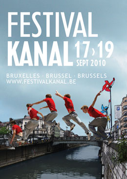
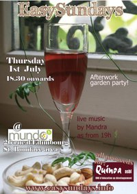
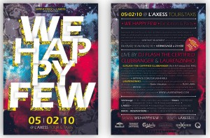

::: {#page .hfeed .site}
[Saltar al contenido](index.html#content){.skip-link
.screen-reader-text}

::: {#sidebar .sidebar}
::: {.site-branding}
[{.custom-logo
width="248" height="248" sizes="(max-width: 248px) 100vw, 248px"
srcset="../../../wp-content/uploads/2016/04/cropped-Manneken_Pis_Blog_Bruselas_Ricardo_Imbern-248.jpg 248w, ../../../wp-content/uploads/2016/04/cropped-Manneken_Pis_Blog_Bruselas_Ricardo_Imbern-248-150x150.jpg 150w"}](../../../index.html){.custom-logo-link}

[Blog Bruselas en español](../../../index.html)

El blog-guía escrito por españoles en Bruselas para los hispanoparlantes
que viven aquí y para los turistas que aprovechan los vuelos baratos
para descubrir el chocolate, la cerveza, la Grand Place y tantas otras
cosas buenas.

Menú y widgets
:::

::: {#secondary .secondary}
::: {#widget-area .widget-area role="complementary"}
Blog Bruselas es {#blog-bruselas-es .widget-title}
----------------

::: {.textwidget}
Un **blog en español escrito en Bruselas** por unos enamorados de la
capital de Bélgica, corazón mágico de Europa. Una ciudad pequeña y
grande, llena de gente, comida, eventos y rincones encantadores; para
descubrir y disfrutar sin dejarse aguar la fiesta por el tiempo (no es
tan malo).

Para quienes pasan por Bruselas, porque vienen de visita, de turismo o
tienen la suerte de vivir aquí. Sí quieres conocer más que los hoteles
en Bruselas, aprovecha los vuelos baratos y **vive la ciudad**.

Blog Bruselas es el bebé de [Ramón Suárez](http://www.ramonsuarez.com),
bruseleño convencido desde 2003.
:::

Espacios de trabajo compartido {#espacios-de-trabajo-compartido .widget-title}
------------------------------

::: {.textwidget}
[Betacowork Coworking Bruselas](http://www.betacowork.com) [Mapa de
espacios de coworking en Bélgica](http://coworkingbelgium.com)
:::

Último vídeo {#último-vídeo .widget-title}
------------

Asociados con Hispagenda, la guía digital de los españoles en Bélgica {#asociados-con-hispagenda-la-guía-digital-de-los-españoles-en-bélgica .widget-title}
---------------------------------------------------------------------

::: {.textwidget}
[{.attachment-medium
width="250" height="100"}](http://www.hispagenda.com)
:::

Más sobre Bruselas en otros idiomas {#más-sobre-bruselas-en-otros-idiomas .widget-title}
-----------------------------------

::: {.textwidget}
[Agenda.be](http://www.agenda.be) FR NL\
[Bruxelles Blog](http://www.bxlblog.be/) FR\
[Eventos para emprendedores y freelance en
Bruselas](http://www.betacowork.com/events/)\
[The Network
Brussels](http://groups.yahoo.com/group/TheNetworkBrussels/) EN\
[What\'s up in Belgium](http://www.whatsupin.be/) EN
:::

Más sobre Bélgica en Español {#más-sobre-bélgica-en-español .widget-title}
----------------------------

::: {.textwidget}
[Spaniards en Bélgica](http://www.spaniards.es/paises/belgica)
:::
:::
:::
:::

::: {#content .site-content}
::: {#primary .section .content-area}
::: {#main .site-main role="main"}
Etiqueta: fiesta {#etiqueta-fiesta .page-title}
================

[Festival Kanal: un nuevo festival en Bruselas](../../../index.html?p=3110) {#festival-kanal-un-nuevo-festival-en-bruselas .entry-title}
---------------------------------------------------------------------------

::: {.entry-content}
[{.aligncenter
.size-full .wp-image-3111 width="260" height="368"
sizes="(max-width: 260px) 100vw, 260px"
srcset="../../../wp-content/uploads/2010/09/festival2010.jpg 260w, ../../../wp-content/uploads/2010/09/festival2010-105x150.jpg 105w"}](http://www.blogbruselas.com/2010/09/festival-kanal-un-nuevo-festival-en-bruselas.html/festival2010)\
El [Festival Kanal](http://www.festivalkanal.be/Public/), que se celebra
por primera vez del 17 al 19 de septiembre de 2010, se plantea como
objetivo dinamizar la zona del canal de Bruselas. El canal se llama de
Charleroi-Bruxelles, y se creó en 1832 para conectar la zona industrial
del Henao con Bruselas y con el puerto de Amberes.\
Hoy es una frontera geográfica y social que corta la ciudad en dos de
norte a sur. A pocos escapa que de los *snobs* de la rue Dansaert a los
emigrantes de la Chaussée de Gand hay todo un mundo. Afortunadamente,
también hay un puente. Ahora este nuevo festival nos propone crear otros
nuevos, e incluso saltar de un muelle al otro, como parece sugerir el
cartel.\
Deseemos lo mejor para el nuevo festival.\
En cuanto al barrio del canal, nos preguntamos si Bruselas será capaz de
romper la barrera sin imponer una *boboización* o *gentrificación*
excluyentes. En mi opinión, la sucesión de "mundos", de una calle a otra
incluso, es uno de los mayores logros de la ciudad.
:::

[[Publicado el
]{.screen-reader-text}[16/09/201016/09/2010](../../../index.html?p=3110)]{.posted-on}[[[Autor
]{.screen-reader-text}[Eduardo Lamas
Delgado](../../author/eduardo/index.html){.url .fn .n}]{.author
.vcard}]{.byline}[[Categorías
]{.screen-reader-text}[Artes](../../category/artes/index.html), [Gran
Bruselas](../../category/gran-bruselas/index.html)]{.cat-links}[[Etiquetas
]{.screen-reader-text}[arte](../arte/index.html), [conciertos en
Bruselas](../conciertos-en-bruselas/index.html),
[exposicion](../exposicion/index.html),
[festival](../festival/index.html), [fiesta](index.html)]{.tags-links}

[Fiesta de la presidencia belga de la UE, este sábado](../../../index.html?p=2455) {#fiesta-de-la-presidencia-belga-de-la-ue-este-sábado .entry-title}
----------------------------------------------------------------------------------

::: {.entry-content}
Para los que osen no ver el partido España-Paraguay o los que después de
celebrar la victoria en la Bolsa quieran seguir con la fiesta, la
Presidencia belga de la UE organiza una movida delante del Parlamento
Europeo\
[{.aligncenter
.size-medium .wp-image-2474 width="337" height="450"
sizes="(max-width: 337px) 100vw, 337px"
srcset="../../../wp-content/uploads/2010/07/FiestaPresidUE-337x450.jpg 337w, ../../../wp-content/uploads/2010/07/FiestaPresidUE-112x150.jpg 112w, ../../../wp-content/uploads/2010/07/FiestaPresidUE.jpg 367w"}](http://www.blogbruselas.com/2010/07/fiesta-de-la-presidencia-belga-de-la-ue-este-sabado.html/fiestapresidue)\
La cosa comienza a las 8 de la tarde bajo el lema "I love EU" = "I love
you", y promete durar hasta altas horas de la madrugada.

Para abrir el apetito los espectadores serán invitados a convertirse en
actores de una coreografía (televisada) que será ejecutada en 12
ciudades belgas: [Anvers, Bruges, Bruxelles, Charleroi, Eupen, Gand,
Hasselt, Liège, Leuven, Louvain-la-Neuve, Namur et
Tournai.]{style="font-family: 'Trebuchet MS', sans-serif; font-size: small;"}

[Luego los edificios del Parlamento servirán de decorado de un
espectáculo de luz y
sonido.]{style="font-family: 'Trebuchet MS', sans-serif; font-size: small;"}

[A las 10 comienza el espectáculo
musical:]{style="font-family: 'Trebuchet MS', sans-serif; font-size: small;"}

[-- el jazzista belga Toots Thielemans, Marie Daulne, cantante congolesa
del grupo [Zap Mama](http://www.youtube.com/watch?v=VxkbipVwZv4), la
cantante Maurane, Sandra Kim la única belga que ha ganado un concurso de
Eurovisión (tenía entonces 13 años, la pobre), el cantante de heavy
metal alemán [U.D.O.](http://www.youtube.com/watch?v=HpB_5fRq730) y el
grupo belga independiente
[Daan](http://www.youtube.com/watch?v=WjNUJSuV42k); el cantante,
guitarrista y pianista [Jasper
Steverlink](http://www.youtube.com/watch?v=fNQahTd2IT8&feature=related).]{style="font-family: 'Trebuchet MS', sans-serif; font-size: small;"}

[ Y a partir de las 11:30 la fiesta se traslada a la plaza de
Luxemburgo. Además se asegura que acudirán el Rey Alberto y Paola y Van
Rompuy y Ives Leterme, aunque esto último no se si es un atractivo más
de la fiesta o justamente lo contrario.\
[{.aligncenter
.size-full .wp-image-2486 width="365" height="210"
sizes="(max-width: 365px) 100vw, 365px"
srcset="../../../wp-content/uploads/2010/07/MailPE.jpg 365w, ../../../wp-content/uploads/2010/07/MailPE-150x86.jpg 150w"}](http://www.blogbruselas.com/2010/07/fiesta-de-la-presidencia-belga-de-la-ue-este-sabado.html/mailpe)]{style="font-family: 'Trebuchet MS', sans-serif; font-size: small;"}

[ ]{style="font-family: 'Trebuchet MS', sans-serif; font-size: small;"}
:::

[[Publicado el
]{.screen-reader-text}[02/07/201013/07/2010](../../../index.html?p=2455)]{.posted-on}[[[Autor
]{.screen-reader-text}[Álvaro Marín](../../../index.html?author=4){.url
.fn .n}]{.author .vcard}]{.byline}[[Categorías
]{.screen-reader-text}[Artes](../../category/artes/index.html), [Gran
Bruselas](../../category/gran-bruselas/index.html)]{.cat-links}[[Etiquetas
]{.screen-reader-text}[belgica](../belgica/index.html), [concierto de
Daan en Bruselas](../concierto-de-daan-en-bruselas/index.html),
[concierto de Jasper Steverlink en
Bruselas](../concierto-de-jasper-steverlink-en-bruselas/index.html),
[concierto de Marie Daulne Zap Mama en
Bruselas](../concierto-de-marie-daulne-zap-mama-en-bruselas/index.html),
[concierto de Maurane en
Bruselas](../concierto-de-maurane-en-bruselas/index.html), [concierto de
Sandra Kim Eurovision en
Bruselas](../concierto-de-sandra-kim-eurovision-en-bruselas/index.html),
[concierto de Toots Thielemans en
Bruselas](../concierto-de-toots-thielemans-en-bruselas/index.html),
[concierto de U.D.O. en
Bruselas](../concierto-de-u-d-o-en-bruselas/index.html), [concierto
presidencia belga de la Unión Europea Parlamento
Europeo](../concierto-presidencia-belga-de-la-union-europea-parlamento-europeo/index.html),
[conciertos frente al Parlamento
Europeo](../conciertos-frente-al-parlamento-europeo/index.html), [danza
en Bruselas](../danza-en-bruselas/index.html), [espectáculo de luz y
sonido en
Bruselas](../espectaculo-de-luz-y-sonido-en-bruselas/index.html),
[fiesta](index.html), [I love EU/You](../i-love-euyou/index.html),
[musica](../musica/index.html)]{.tags-links}

[Hoy: concierto de Mandra en Bruselas](../../../index.html?p=2453) {#hoy-concierto-de-mandra-en-bruselas .entry-title}
------------------------------------------------------------------

::: {.entry-content}
Hace cuatro días os hablaba del grupo Mandra y prometía que os tendría
informados de la próxima actuación del grupo. Pues bien, esta misma
tarde, 1 de julio, a partir de las 18:30 los podréis oír y ver en el que
parece ser último evento de la temporada de EasySundays,

[{.aligncenter
.size-full .wp-image-2456 width="200" height="283"
sizes="(max-width: 200px) 100vw, 200px"
srcset="../../../wp-content/uploads/2010/07/41602_104155636302700_2952_n.jpg 200w, ../../../wp-content/uploads/2010/07/41602_104155636302700_2952_n-106x150.jpg 106w"}](http://www.blogbruselas.com/2010/07/concierto-mandra-bruselas-easy-sundays.html/41602_104155636302700_2952_n)

[EasySundays](http://www.easysundays.info/) es una iniciativa llevada a
cabo por un grupo de mujeres que viven en Bruselas que tiene como
objetivo reunir a la gente, para descubrir lugares en la ciudad y para
apoyar grandes causas.

Los ingresos serán destinados a la ayuda de
[Quinoa](http://www.quinoa.be/), una ONG que lleva proyectos de
educación como medio de desarrollo. El evento tendrá lugar en [Mundo
b](http://www.mundo-b.org/fr/objectifs.html), 26 rue d'Edimbourg y se
puede reservar en Facebook:  [EasySundays afterwork garden party with
live
music!](http://www.facebook.com/event.php?eid=104155636302700#!/event.php?eid=104155636302700&ref=ts)

Animo. Merece la pena
:::

[[Publicado el
]{.screen-reader-text}[01/07/201013/07/2010](../../../index.html?p=2453)]{.posted-on}[[[Autor
]{.screen-reader-text}[Álvaro Marín](../../../index.html?author=4){.url
.fn .n}]{.author .vcard}]{.byline}[[Categorías
]{.screen-reader-text}[Artes](../../category/artes/index.html), [Comer y
beber](../../category/comer-y-beber/index.html), [Gran
Bruselas](../../category/gran-bruselas/index.html)]{.cat-links}[[Etiquetas
]{.screen-reader-text}[arte](../arte/index.html),
[bruselas](../bruselas/index.html),
[concierto](../concierto/index.html), [concierto
Madra](../concierto-madra/index.html), [easy sundays
Bruselas](../easy-sundays-bruselas/index.html), [fiesta](index.html),
[mundo b](../mundo-b/index.html),
[musica](../musica/index.html)]{.tags-links}

[La "Anti-tapas", una fiesta para hincarle el diente](../../../index.html?p=1991) {#la-anti-tapas-una-fiesta-para-hincarle-el-diente .entry-title}
---------------------------------------------------------------------------------

::: {.entry-content}
Sí, sí, es que el nombre de la fiesta, Anti-tapas, mezcla del italiano
antipasto y de las castizas tapas, resulta muy apetecible. La mezcla
italo-ibérica se explica también porque es una asociación italiana la
que organiza el fiestorro en la sede del centro de Galicia (Ex-Cantina).

Pero bueno, vamos a lo importante, que es la fiesta en sí. Para los más
madrugadores, hubo comida italiana para picar, incluída en el precio de
la entrada. O sea, por 5 euros: picoteo+concierto+buen ambiente. Todos
los ingredientes para una buena noche. Y larga, porque la fiesta se
prolonga hasta bien tarde para los más *noctámbulos*.

En el caso del pasado viernes 14, los invitados eran ***Modena City
Ramblers***, un veterano grupo muy conocido en el país de la bota. Folk
y letras combativas. La gente se lo pasó (nos lo pasamos) en grande.
Tanta gente y tanto ambiente que casi no se podía respirar...Para
muestra, este vídeo:

De hecho, sobre las 10 de la noche la cola para entrar era considerable,
y hubo quien se tuvo que quedar sin entrar.

Los chicos de esta asociación italiana, que se llama Palais des
Sciences, no saben quedarse quietos y ya este sábado 22 de mayo, como ya
se ha dicho aquí en el blog, junto a la organización del Parcours
d´Artistes de Saint-Gilles, nos traen a Tonino Carotone en concierto en
Bruselas. Será en la fiesta de clausura al aire libre de este evento, en
la Place Marie Janson -- Parvis de St. Gilles, a las ocho de la noche.
Además se trata de la primera vez que el cantante actúa en Bruselas.
Actuaciones buenas, bonitas y baratas(por la patilla esta vez) en
nuestra querida ciudad, ¿quién da más?
:::

[[Publicado el
]{.screen-reader-text}[20/05/201021/05/2010](../../../index.html?p=1991)]{.posted-on}[[[Autor
]{.screen-reader-text}[Objetivo
Bruselas](../../author/objetivo-bruselas/index.html){.url .fn
.n}]{.author .vcard}]{.byline}[[Categorías ]{.screen-reader-text}[Gran
Bruselas](../../category/gran-bruselas/index.html)]{.cat-links}[[Etiquetas
]{.screen-reader-text}[anti-tapas](../anti-tapas/index.html),
[concierto](../concierto/index.html),
[fiesta](index.html)]{.tags-links}[[[3 comentarios[ en La "Anti-tapas",
una fiesta para hincarle el diente]{.screen-reader-text}]{.dsq-postid
dsqidentifier="1991 http://www.blogbruselas.com/?p=1991"}](../../../index.html?p=1991#comments)]{.comments-link}

[We happy few: fiesta y exposición](../../../index.html?p=1416) {#we-happy-few-fiesta-y-exposición .entry-title}
---------------------------------------------------------------

::: {.entry-content}
[{.aligncenter
.size-medium .wp-image-1418 width="300" height="198"
sizes="(max-width: 300px) 100vw, 300px"
srcset="../../../wp-content/uploads/2010/02/flyer_wehappy1-300x198.jpg 300w, ../../../wp-content/uploads/2010/02/flyer_wehappy1-150x99.jpg 150w, ../../../wp-content/uploads/2010/02/flyer_wehappy1.jpg 950w"}](http://www.blogbruselas.com/2010/02/we-happy-few-fiesta-y-exposicion.html/flyer_wehappy1)\
Esta noche se inaugura, se celebra y se clausura ['We happy
few'](http://wehappyfew.be/), una fiesta-exposición de diferentes
jóvenes talentos: fotógrafos, grafistas y pintores que presentan su
trabajo tan sólo durante una noche.\
De la parte fiesta se encargarán los pinchadiscos [DJ Flash the
certified clubbanger](http://www.myspace.com/djflashfable) et
[Laurenzinho](http://www.laurenzinho.com)

Será a partir de las nueve en
[L'axess](http://www.ready2move.be/liens/gotoframe.php?url=www.laxess.be),
un restaurante y bar de copas en el Entrepôt Royal de Tour et Taxis.
Para mayor información: ['We happy few'](http://wehappyfew.be/)
:::

[[Publicado el
]{.screen-reader-text}[05/02/201006/02/2010](../../../index.html?p=1416)]{.posted-on}[[[Autor
]{.screen-reader-text}[Eduardo Lamas
Delgado](../../author/eduardo/index.html){.url .fn .n}]{.author
.vcard}]{.byline}[[Categorías
]{.screen-reader-text}[Artes](../../category/artes/index.html), [Comer y
beber](../../category/comer-y-beber/index.html)]{.cat-links}[[Etiquetas
]{.screen-reader-text}[arte](../arte/index.html),
[bar](../bar/index.html), [beber](../beber/index.html),
[bruselas](../bruselas/index.html),
[exposicion](../exposicion/index.html), [fiesta](index.html),
[fotografia](../fotografia/index.html),
[grafismo](../grafismo/index.html), [música
electrónica](../musica-electronica/index.html),
[pintura](../pintura/index.html), [Tour et
Taxis](../tour-et-taxis/index.html),
[vernissage](../vernissage/index.html)]{.tags-links}

Navegación de entradas {#navegación-de-entradas .screen-reader-text}
----------------------

::: {.nav-links}
[[Página ]{.meta-nav .screen-reader-text}1]{.page-numbers .current}
[[Página ]{.meta-nav
.screen-reader-text}2](page/2/index.html){.page-numbers}
[...]{.page-numbers .dots} [[Página ]{.meta-nav
.screen-reader-text}4](page/4/index.html){.page-numbers} [Página
siguiente](page/2/index.html){.next .page-numbers}
:::
:::
:::
:::

::: {.site-info}
[Creado con WordPress](https://es.wordpress.org/)
:::
:::
