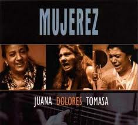
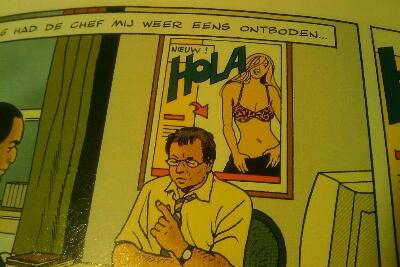

::: {#page .hfeed .site}
[Saltar al contenido](index.html#content){.skip-link
.screen-reader-text}

::: {#sidebar .sidebar}
::: {.site-branding}
[{.custom-logo
width="248" height="248" sizes="(max-width: 248px) 100vw, 248px"
srcset="../../../wp-content/uploads/2016/04/cropped-Manneken_Pis_Blog_Bruselas_Ricardo_Imbern-248.jpg 248w, ../../../wp-content/uploads/2016/04/cropped-Manneken_Pis_Blog_Bruselas_Ricardo_Imbern-248-150x150.jpg 150w"}](../../../index.html){.custom-logo-link}

[Blog Bruselas en español](../../../index.html)

El blog-guía escrito por españoles en Bruselas para los hispanoparlantes
que viven aquí y para los turistas que aprovechan los vuelos baratos
para descubrir el chocolate, la cerveza, la Grand Place y tantas otras
cosas buenas.

Menú y widgets
:::

::: {#secondary .secondary}
::: {#widget-area .widget-area role="complementary"}
Blog Bruselas es {#blog-bruselas-es .widget-title}
----------------

::: {.textwidget}
Un **blog en español escrito en Bruselas** por unos enamorados de la
capital de Bélgica, corazón mágico de Europa. Una ciudad pequeña y
grande, llena de gente, comida, eventos y rincones encantadores; para
descubrir y disfrutar sin dejarse aguar la fiesta por el tiempo (no es
tan malo).

Para quienes pasan por Bruselas, porque vienen de visita, de turismo o
tienen la suerte de vivir aquí. Sí quieres conocer más que los hoteles
en Bruselas, aprovecha los vuelos baratos y **vive la ciudad**.

Blog Bruselas es el bebé de [Ramón Suárez](http://www.ramonsuarez.com),
bruseleño convencido desde 2003.
:::

Espacios de trabajo compartido {#espacios-de-trabajo-compartido .widget-title}
------------------------------

::: {.textwidget}
[Betacowork Coworking Bruselas](http://www.betacowork.com) [Mapa de
espacios de coworking en Bélgica](http://coworkingbelgium.com)
:::

Último vídeo {#último-vídeo .widget-title}
------------

Asociados con Hispagenda, la guía digital de los españoles en Bélgica {#asociados-con-hispagenda-la-guía-digital-de-los-españoles-en-bélgica .widget-title}
---------------------------------------------------------------------

::: {.textwidget}
[{.attachment-medium
width="250" height="100"}](http://www.hispagenda.com)
:::

Más sobre Bruselas en otros idiomas {#más-sobre-bruselas-en-otros-idiomas .widget-title}
-----------------------------------

::: {.textwidget}
[Agenda.be](http://www.agenda.be) FR NL\
[Bruxelles Blog](http://www.bxlblog.be/) FR\
[Eventos para emprendedores y freelance en
Bruselas](http://www.betacowork.com/events/)\
[The Network
Brussels](http://groups.yahoo.com/group/TheNetworkBrussels/) EN\
[What\'s up in Belgium](http://www.whatsupin.be/) EN
:::

Más sobre Bélgica en Español {#más-sobre-bélgica-en-español .widget-title}
----------------------------

::: {.textwidget}
[Spaniards en Bélgica](http://www.spaniards.es/paises/belgica)
:::
:::
:::
:::

::: {#content .site-content}
::: {#primary .section .content-area}
::: {#main .site-main role="main"}
Etiqueta: flamenco {#etiqueta-flamenco .page-title}
==================

[Más flamenco en Bruselas](../../../index.html?p=3288) {#más-flamenco-en-bruselas .entry-title}
------------------------------------------------------

::: {.entry-content}
[{.size-full
.wp-image-3289 .aligncenter width="235" height="214"
sizes="(max-width: 235px) 100vw, 235px"
srcset="../../../wp-content/uploads/2011/03/índice.jpg 235w, ../../../wp-content/uploads/2011/03/índice-150x136.jpg 150w"}](../../../index.html?p=3289)

Los amantes del flamenco estamos de enhorabuena. Si hace unas semanas
nos visitó Estrella Morente -- con un espectáculo muy llamativo pero de
poca sustancia, dicho sea de paso -, el día 2 de mayo tendremos la
oportunidad de disfrutar en el Bozar del "Mujerez", la presentación del
disco del mismo nombre en el que tres artistas -- "La Macanita", Dolores
Agujetas y Juana la del Pipa -- reivindican el papel de la mujer en el
cante flamenco.

¿Qué podemos esperar? Autenticidad. Vuelta a las raíces. Cante flamenco
clásico y con guitarra, sin cajón, seco. Duende en estado puro. Tientos,
bulerías, soleás, siguiriyas en las voces de tres cantaoras jerezanas
muy experimentadas. Flamenco jondo con un protagonista absoluto: la
mujer.

Tomasa guerrero "La Macanita" cante -- Dolores Agujetas cante -- Juana
la del Pipa cante -- Moraito guitarra -- Dieguito Agujetas guitarra --
Luisa Terremoto palmas -- Luisa Soto palmas

BOZAR www.bozar.be 2 mayo 2011.
:::

[[Publicado el
]{.screen-reader-text}[31/03/201101/04/2011](../../../index.html?p=3288)]{.posted-on}[[[Autor
]{.screen-reader-text}[MSB](../../author/mariasanchez/index.html){.url
.fn .n}]{.author .vcard}]{.byline}[[Categorías
]{.screen-reader-text}[Artes](../../category/artes/index.html)]{.cat-links}[[Etiquetas
]{.screen-reader-text}[bozar](../bozar/index.html),
[flamenco](index.html), [flamenco en
Bruselas](../flamenco-en-bruselas/index.html),
[mujer](../mujer/index.html)]{.tags-links}

[Revista Hola en flamenco](../../../index.html?p=820) {#revista-hola-en-flamenco .entry-title}
-----------------------------------------------------

::: {.entry-content}

No parece qué sea la misma revista Hola que en España.\
Viñeta de apertura del tebeo *De val der blinden*. Yo acabo hablando
flamenco por narices.
:::

[[Publicado el
]{.screen-reader-text}[30/10/200928/10/2009](../../../index.html?p=820)]{.posted-on}[[[Autor
]{.screen-reader-text}[Ramón
Suárez](../../2010/04/30/index.html?author=2){.url .fn .n}]{.author
.vcard}]{.byline}[[Categorías
]{.screen-reader-text}[Humor](../../category/humor/index.html)]{.cat-links}[[Etiquetas
]{.screen-reader-text}[comic](../comic/index.html),
[flamenco](index.html), [hola](../hola/index.html),
[neerlandés](../neerlandes/index.html),
[tebeo](../tebeo/index.html)]{.tags-links}

[KVS: el Teatro Real Flamenco de Bruselas](../../../index.html?p=515) {#kvs-el-teatro-real-flamenco-de-bruselas .entry-title}
---------------------------------------------------------------------

::: {.entry-content}
El [KVS](http://www.kvs.be/) es el Koninklijke Vlaams Schouwburg, es
decir, el Teatro Real Flamenco de Bruselas.

 

 {width="320"
height="292"}

Pero no os mováis a engaño; este teatro nada tiene que ver con el *cante
jondo* ni con los *Pink Flamingos*. Se trata de uno de los más hermosos
teatros de Bruselas y lamentablemente, y como tantas cosas en esta
ciudad, es un absoluto desconocido para muchos.\
El [KVS](http://www.ebru.be/Architectuur/archkvs.html)  fue construido
en 1880-1887, y su fachada principal se debe al arquitecto Jean Baes
(1848-1914). Su estilo es el que aquí llaman "renaissance flamande". Se
trata de uno de los diferentes historicismos que se desarrollan en esos
años en cada país europeo para recrear un supuesto estilo "nacional"
reinterpretando la arquitectura de un período que se supone áulico. Un
ejemplo del equivalente en España son las fachadas del primer tramo de
la Gran Vía de Madrid, donde se pretende recrear la arquitectura bajo el
reinado de Carlos V.

 

Foto: [Mon Nikon et
moi](http://monnikonetmoi.skynetblogs.be/post/7069857/theatre-royal-flamand-de-bruxelles)

Las terrazas laterales son las escaleras de incendios, avanzadísimas
para la época.

El KVS sufrió una profunda remodelación hace poco tiempo (se empezó en
2001), y que le ha dado el magnífico interior de que hoy dispone, así
como el edificio anejo, el Box, con una sala suplementaria y donde
tienen lugar muy buenos saraos con ese gusto que sólo tienen los
flamencos.

foto: [KVS](http://www.ebru.be/Architectuur/archkvs.html)

La sala principal es el Bol, la bola, por oposición al Box, la caja. Y
es que el edificio antiguo se ha convertido en el envoltorio de una
enorme esfera de hormigón, en cuyo interior se encuentran los palcos y
el patio de butacas. El contraste entre la austeridad de las partes
nuevas con la decoración abigarrada de las antiguas tiene especial
encanto muy de Bruselas.

El teatro ocupa el lugar de un antiguo arsenal de artillería
(1780-1781), del que se ha conservado la fachada principal de estilo
neoclásico. Hoy es la fachada trasera del teatro, que da al Quai aux
Pierres de Taille/Arduinkaai.

{width="334"
height="249"}

 La
[programación](http://www.kvs.be/index2.php?page=program&discipline=1/)
del [KVS](http://www.kvs.be/) es de las más interesantes de
Bruselas. Casi todas las obras son en neerlandés, pero todas tienen
sobretítulos en francés y en inglés. También hay obras bilingües o en
inglés o en francés. Y no se reduce a teatro; también hay danza,
conciertos, conferencias, lecturas...

Tienen una declarada política de apertura al cosmopolitismo de Bruselas
y hacen verdaderos esfuerzos por hacer del teatro un lugar para todos.

Y finalmente, el bar del teatro, en el ***foyer,*** es la única zona que
conserva la decoración original, y es sencillamente genial. El box
cuenta con otro bar, el Café Congo, que tampoco está mal.

 \
Foto: [KVS](http://www.ebru.be/Architectuur/archkvs.html)\
** **

Por supuesto, no hay que olvidar tampoco el lado más lúdico, y es que el
KVS también organiza fiestas en el espacio del BOX, fiestas con mucha
clase y buena música electrónica. Se trata de los saraos [BAL IN DE
BOX](http://www.facebook.com/group.php?gid=58378236845&ref=ts/) , que se
organizan regularmente.

 \
foto: [Peter Forret](http://www.flickr.com/photos/pforret//)

Tomad nota de la próxima: **viernes 16 de octubre**

[Programa:]{style="text-decoration: underline"}

[\*gran sala\*]{style="text-decoration: underline"}\
**DJ NERO** (Free The Funk, Suite, Poplife)

23h30\
[MADENSUYU](http://www.madensuyu.be/) -- concierto en vivo (ver
[YouTube](http://www.youtube.com/watch?v=mWG-cOkXYwY))

1h00\
[THE GLIMMERS](http://www.myspace.com/theglimmers) presentan [DISKO
DRUNKARDS](http://www.myspace.com/diskodrunkards)\
\>\> los primeros 500 recibirán un CD gratis!!!
(ver [YouTube](http://www.youtube.com/watch?v=TdPAevsXUIo))

[DJ BLACKJACK aka RAKESH](http://www.myspace.com/blackjackmusicman)
(KVS, Charlatan,...)

[\*café congo\*]{style="text-decoration: underline"}\
[TLP all night long](http://www.myspace.com/tlptroubleman) (KVS,
StuBru,...)

Entrada: 10 euros

** **

**Un lugar que hay que descubrir.\
**

** **

Curiosidades:

Existe una curiosa anécdota en torno a la fundación del edificio en
1887. El teatro fue construido por iniciativa del Ayuntamiento de
Bruselas, y para invitar al rey Leopoldo II a la ceremonia de
inauguración el burgomaestre (alcalde) se dirigió a él en estos
términos: ***« J'aurai l'honneur, Sire, de vous souhaiter la bievenue en
Flamand, dans le temple érigé pour l'art dramatique flamand »*** (Tendré
el honor, Señor, de desearle la bienvenida en flamenco, en el templo
dedicado al arte dramático flamenco), a lo que el rey respondió: ***«
Mon cher bourgmestre, vous m'offrez là une bonne occasion pour vous
répondre dans cette même langue nationale, en Flamand »*** (Mi querido
alcalde, con ello me ofrece Vd. la ocasión de responderle en esa misma
lengua nacional, en flamenco). Y así lo hizo, y aquella ceremonia (un 13
de octubre, día de san Eduardo) se convirtió en algo así como en un
reconocimiento oficial de esta lengua, aunque todavía habría mucho
camino por hacer. De hecho, se trataba de la primera vez en que un rey
belga hablaba en neerlandés en una ceremonia oficial. El burgomaestre en
cuestión era Charles Buls, quien puso por primera vez los carteles
bilingües en las calles de Bruselas; los otros municipios lo hicieron
después.
:::

[[Publicado el
]{.screen-reader-text}[24/09/2009](../../../index.html?p=515)]{.posted-on}[[[Autor
]{.screen-reader-text}[Eduardo Lamas
Delgado](../../author/eduardo/index.html){.url .fn .n}]{.author
.vcard}]{.byline}[[Categorías
]{.screen-reader-text}[Artes](../../category/artes/index.html), [Gran
Bruselas](../../category/gran-bruselas/index.html)]{.cat-links}[[Etiquetas
]{.screen-reader-text}[arquitectura](../arquitectura/index.html),
[arte](../arte/index.html), [bar](../bar/index.html),
[beber](../beber/index.html), [belga](../belga/index.html),
[belgica](../belgica/index.html), [bruselas](../bruselas/index.html),
[fiesta](../fiesta/index.html), [flamenco](index.html),
[teatro](../teatro/index.html)]{.tags-links}[[[6 comentarios[ en KVS: el
Teatro Real Flamenco de Bruselas]{.screen-reader-text}]{.dsq-postid
dsqidentifier="515 http://www.blogbruselas.com/?p=515"}](../../../index.html?p=515#comments)]{.comments-link}

[El camino de Pablo el flamenco](../../../index.html?p=407) {#el-camino-de-pablo-el-flamenco .entry-title}
-----------------------------------------------------------

::: {.entry-content}
[{.alignleft
width="115" height="86"}](http://pabloelflamenco.blogspot.com)Nuestro
amigo Pablo el flamenco y *alei* se ha ido a dar una vuelta por España
para recorrer el camino de Santiago. Aprovechando la ocasión, ha lanzado
un blog para ir contándonos sus aventuras:
<http://pabloelflamenco.blogspot.com>. Doble reto por delante: ¡a darle
al calcetín y a la tecla!
:::

[[Publicado el
]{.screen-reader-text}[05/08/200907/08/2009](../../../index.html?p=407)]{.posted-on}[[[Autor
]{.screen-reader-text}[Ramón
Suárez](../../2010/04/30/index.html?author=2){.url .fn .n}]{.author
.vcard}]{.byline}[[Categorías
]{.screen-reader-text}[Blogs](../../category/blogs/index.html)]{.cat-links}[[Etiquetas
]{.screen-reader-text}[belga](../belga/index.html),
[blog](../blog/index.html), [blogger](../blogger/index.html),
[bloguer](../bloguer/index.html), [bruselas](../bruselas/index.html),
[camino](../camino/index.html), [español](../espanol/index.html),
[flamenco](index.html), [mexicano](../mexicano/index.html),
[pablo](../pablo/index.html), [santiago](../santiago/index.html),
[sombrero](../sombrero/index.html),
[vaquero](../vaquero/index.html)]{.tags-links}[[[5 comentarios[ en El
camino de Pablo el flamenco]{.screen-reader-text}]{.dsq-postid
dsqidentifier="407 http://www.blogbruselas.com/?p=407"}](../../../index.html?p=407#comments)]{.comments-link}

[Falos deportivos en Bruselas: no es sexo (al menos en este caso)](../../../index.html?p=375) {#falos-deportivos-en-bruselas-no-es-sexo-al-menos-en-este-caso .entry-title}
---------------------------------------------------------------------------------------------

::: {.entry-content}
Aunque podamos pensar lo contrario, cuando hablamos de
[falos](http://es.wikipedia.org/wiki/Falo) en Bruselas no nos referimos
a una multitud de órganos sexuales masculinos. En lugar de hablar de
sexo hablamos de una [federación deportiva
neerlandófona](http://www.falos.be/) sita en el centro de Bruselas,
cosas de la lengua.

[{#BLOGGER_PHOTO_ID_5358988288684467090}](http://1.bp.blogspot.com/_m9ESRqvSnjc/Sl7zdJaEI5I/AAAAAAAACqc/Ymt2QCbVwH4/s1600-h/Fachada+Falos+deportivos+bruselas.jpg)La
fachada que llamó mi atención (admito que a veces soy un poco
malpensado).

[{#BLOGGER_PHOTO_ID_5358988071551256642}](http://1.bp.blogspot.com/_m9ESRqvSnjc/Sl7zQgheSEI/AAAAAAAACqM/cp31fPULQzg/s1600-h/logo+falos+deportivos+bruselas.jpg)El
logo de falos.

[{#BLOGGER_PHOTO_ID_5358988184656872322}](http://2.bp.blogspot.com/_m9ESRqvSnjc/Sl7zXF39A4I/AAAAAAAACqU/Ahb3SEFEfys/s1600-h/Falos+deportivos+bruselas.jpg)Y
el listado de oficinas entre las que encontramos la explicación de
falos: es una federación deportiva.

::: {.blogger-post-footer}
Comer, hablar, amar. www.blogbruselas.com
:::
:::

[[Publicado el
]{.screen-reader-text}[16/07/200905/09/2009](../../../index.html?p=375)]{.posted-on}[[[Autor
]{.screen-reader-text}[Ramón
Suárez](../../2010/04/30/index.html?author=2){.url .fn .n}]{.author
.vcard}]{.byline}[[Categorías ]{.screen-reader-text}[Gran
Bruselas](../../category/gran-bruselas/index.html),
[Humor](../../category/humor/index.html)]{.cat-links}[[Etiquetas
]{.screen-reader-text}[asociacion](../asociacion/index.html),
[bruselas](../bruselas/index.html), [deporte](../deporte/index.html),
[falos](../falos/index.html), [flamenco](index.html),
[sexo](../sexo/index.html)]{.tags-links}[[[9 comentarios[ en Falos
deportivos en Bruselas: no es sexo (al menos en este
caso)]{.screen-reader-text}]{.dsq-postid
dsqidentifier="375 http://www.blogbruselas.com/2009/07/falos-deportivos-en-bruselas-no-es-sexo-al-menos-en-este-caso.html"}](../../../index.html?p=375#comments)]{.comments-link}
:::
:::
:::

::: {.site-info}
[Creado con WordPress](https://es.wordpress.org/)
:::
:::
