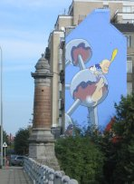

::: {#page .hfeed .site}
[Saltar al contenido](index.html#content){.skip-link
.screen-reader-text}

::: {#sidebar .sidebar}
::: {.site-branding}
[{.custom-logo
width="248" height="248" sizes="(max-width: 248px) 100vw, 248px"
srcset="../../../wp-content/uploads/2016/04/cropped-Manneken_Pis_Blog_Bruselas_Ricardo_Imbern-248.jpg 248w, ../../../wp-content/uploads/2016/04/cropped-Manneken_Pis_Blog_Bruselas_Ricardo_Imbern-248-150x150.jpg 150w"}](../../../index.html){.custom-logo-link}

[Blog Bruselas en español](../../../index.html)

El blog-guía escrito por españoles en Bruselas para los hispanoparlantes
que viven aquí y para los turistas que aprovechan los vuelos baratos
para descubrir el chocolate, la cerveza, la Grand Place y tantas otras
cosas buenas.

Menú y widgets
:::

::: {#secondary .secondary}
::: {#widget-area .widget-area role="complementary"}
Blog Bruselas es {#blog-bruselas-es .widget-title}
----------------

::: {.textwidget}
Un **blog en español escrito en Bruselas** por unos enamorados de la
capital de Bélgica, corazón mágico de Europa. Una ciudad pequeña y
grande, llena de gente, comida, eventos y rincones encantadores; para
descubrir y disfrutar sin dejarse aguar la fiesta por el tiempo (no es
tan malo).

Para quienes pasan por Bruselas, porque vienen de visita, de turismo o
tienen la suerte de vivir aquí. Sí quieres conocer más que los hoteles
en Bruselas, aprovecha los vuelos baratos y **vive la ciudad**.

Blog Bruselas es el bebé de [Ramón Suárez](http://www.ramonsuarez.com),
bruseleño convencido desde 2003.
:::

Espacios de trabajo compartido {#espacios-de-trabajo-compartido .widget-title}
------------------------------

::: {.textwidget}
[Betacowork Coworking Bruselas](http://www.betacowork.com) [Mapa de
espacios de coworking en Bélgica](http://coworkingbelgium.com)
:::

Último vídeo {#último-vídeo .widget-title}
------------

Asociados con Hispagenda, la guía digital de los españoles en Bélgica {#asociados-con-hispagenda-la-guía-digital-de-los-españoles-en-bélgica .widget-title}
---------------------------------------------------------------------

::: {.textwidget}
[{.attachment-medium
width="250" height="100"}](http://www.hispagenda.com)
:::

Más sobre Bruselas en otros idiomas {#más-sobre-bruselas-en-otros-idiomas .widget-title}
-----------------------------------

::: {.textwidget}
[Agenda.be](http://www.agenda.be) FR NL\
[Bruxelles Blog](http://www.bxlblog.be/) FR\
[Eventos para emprendedores y freelance en
Bruselas](http://www.betacowork.com/events/)\
[The Network
Brussels](http://groups.yahoo.com/group/TheNetworkBrussels/) EN\
[What\'s up in Belgium](http://www.whatsupin.be/) EN
:::

Más sobre Bélgica en Español {#más-sobre-bélgica-en-español .widget-title}
----------------------------

::: {.textwidget}
[Spaniards en Bélgica](http://www.spaniards.es/paises/belgica)
:::
:::
:::
:::

::: {#content .site-content}
::: {#primary .section .content-area}
::: {#main .site-main role="main"}
Etiqueta: jardines {#etiqueta-jardines .page-title}
==================

[La huerta colectiva de Tour et Taxis](../../../index.html?p=2022) {#la-huerta-colectiva-de-tour-et-taxis .entry-title}
------------------------------------------------------------------

::: {.entry-content}
La asociación [Le début des
haricots](http://www.haricots.org/presentation) creó en 2008 dos
jardines colectivos de barrio en Bruselas, uno a
[Ixelles](http://www.haricots.org/jardinscollectifs/ruegray), y otro a
[Tour et Taxis](http://www.haricots.org/jardinscollectifs/tt).\
Se trata de jardines autogestionados, cuidados por un grupo de vecinos
voluntarios. Los *hortelanos* comparten el terreno donde cultivan juntos
frutas y hortalizas, que también comparten.\
Además, la asociación mantiene zonas en las que se favorece el
desarrollo de la flora y la fauna locales, con el fin de favorecer la
biodiversidad en la ciudad, y mantiene una función de sensibilización a
la alimentación sostenible y al respeto a la naturaleza en general.\
El mismo tipo de iniciativas se organizan en otras ciudades europeas,
como París o
[Vitoria](http://www.vitoria-gasteiz.org/cea/documentos/2061es.pdf),
incluso en
[Madrid](http://ecosistemaurbano.org/urbanismo/%E2%80%9Cesta-es-una-plaza%E2%80%9D-un-jardin-compartido-en-el-barrio-de-lavapies/).\
He aquí un vídeo de Télé Bruxelles aparecido en abril de 2008:

Mañana sábado día 29 es una excelente ocasión para conocer este tipo de
proyectos. En efecto, la huerta de Tour et Taxis ha lanzado una llamada
de voluntarios para limpiar un terreno de escombros que se encuentra al
lado. La idea es de organizar una jornada festiva, pues incluso se ha
previsto trabajar al son de la música. A mediodía, los voluntarios serán
invitados a un pic-nic gratuito. Al final del día, el broche de oro lo
pondrá una barbacoa a la que sólo habrá que traer ensaladas y postres.\
Puede ser divertido, y se prevee buen tiempo.

Datos prácticos:\
La jornada de trabajo está prevista entre las 9 de la mañana y las 5 de
la tarde.

La huerta se encuentra en el número 1 del Bd. Bockstael, y se accede a
ella a través de la puerta situada junto a la pintura mural de Titeuf,
un personaje de tebeo, para quien no tenga el gusto.\
[{.alignleft
.size-full .wp-image-2024 width="148" height="203"
sizes="(max-width: 148px) 100vw, 148px"
srcset="../../../wp-content/uploads/2010/05/titeuf.jpg 148w, ../../../wp-content/uploads/2010/05/titeuf-109x150.jpg 109w"}](http://www.blogbruselas.com/2010/05/la-huerta-colectiva-de-tour-et-taxis.html/titeuf)
:::

[[Publicado el
]{.screen-reader-text}[28/05/201007/06/2010](../../../index.html?p=2022)]{.posted-on}[[[Autor
]{.screen-reader-text}[Eduardo Lamas
Delgado](../../author/eduardo/index.html){.url .fn .n}]{.author
.vcard}]{.byline}[[Categorías ]{.screen-reader-text}[Comer y
beber](../../category/comer-y-beber/index.html), [Gran
Bruselas](../../category/gran-bruselas/index.html),
[Ideas](../../category/ideas/index.html)]{.cat-links}[[Etiquetas
]{.screen-reader-text}[ecología](../ecologia/index.html), [economía
sostenible](../economia-sostenible/index.html), [jardines](index.html),
[jipi](../jipi/index.html),
[naturaleza](../naturaleza/index.html)]{.tags-links}
:::
:::
:::

::: {.site-info}
[Creado con WordPress](https://es.wordpress.org/)
:::
:::
