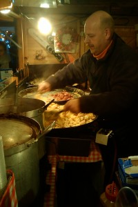

::: {#page .hfeed .site}
[Saltar al contenido](index.html#content){.skip-link
.screen-reader-text}

::: {#sidebar .sidebar}
::: {.site-branding}
[{.custom-logo
width="248" height="248" sizes="(max-width: 248px) 100vw, 248px"
srcset="../../../wp-content/uploads/2016/04/cropped-Manneken_Pis_Blog_Bruselas_Ricardo_Imbern-248.jpg 248w, ../../../wp-content/uploads/2016/04/cropped-Manneken_Pis_Blog_Bruselas_Ricardo_Imbern-248-150x150.jpg 150w"}](../../../index.html){.custom-logo-link}

[Blog Bruselas en español](../../../index.html)

El blog-guía escrito por españoles en Bruselas para los hispanoparlantes
que viven aquí y para los turistas que aprovechan los vuelos baratos
para descubrir el chocolate, la cerveza, la Grand Place y tantas otras
cosas buenas.

Menú y widgets
:::

::: {#secondary .secondary}
::: {#widget-area .widget-area role="complementary"}
Blog Bruselas es {#blog-bruselas-es .widget-title}
----------------

::: {.textwidget}
Un **blog en español escrito en Bruselas** por unos enamorados de la
capital de Bélgica, corazón mágico de Europa. Una ciudad pequeña y
grande, llena de gente, comida, eventos y rincones encantadores; para
descubrir y disfrutar sin dejarse aguar la fiesta por el tiempo (no es
tan malo).

Para quienes pasan por Bruselas, porque vienen de visita, de turismo o
tienen la suerte de vivir aquí. Sí quieres conocer más que los hoteles
en Bruselas, aprovecha los vuelos baratos y **vive la ciudad**.

Blog Bruselas es el bebé de [Ramón Suárez](http://www.ramonsuarez.com),
bruseleño convencido desde 2003.
:::

Espacios de trabajo compartido {#espacios-de-trabajo-compartido .widget-title}
------------------------------

::: {.textwidget}
[Betacowork Coworking Bruselas](http://www.betacowork.com) [Mapa de
espacios de coworking en Bélgica](http://coworkingbelgium.com)
:::

Último vídeo {#último-vídeo .widget-title}
------------

Asociados con Hispagenda, la guía digital de los españoles en Bélgica {#asociados-con-hispagenda-la-guía-digital-de-los-españoles-en-bélgica .widget-title}
---------------------------------------------------------------------

::: {.textwidget}
[{.attachment-medium
width="250" height="100"}](http://www.hispagenda.com)
:::

Más sobre Bruselas en otros idiomas {#más-sobre-bruselas-en-otros-idiomas .widget-title}
-----------------------------------

::: {.textwidget}
[Agenda.be](http://www.agenda.be) FR NL\
[Bruxelles Blog](http://www.bxlblog.be/) FR\
[Eventos para emprendedores y freelance en
Bruselas](http://www.betacowork.com/events/)\
[The Network
Brussels](http://groups.yahoo.com/group/TheNetworkBrussels/) EN\
[What\'s up in Belgium](http://www.whatsupin.be/) EN
:::

Más sobre Bélgica en Español {#más-sobre-bélgica-en-español .widget-title}
----------------------------

::: {.textwidget}
[Spaniards en Bélgica](http://www.spaniards.es/paises/belgica)
:::
:::
:::
:::

::: {#content .site-content}
::: {#primary .section .content-area}
::: {#main .site-main role="main"}
Etiqueta: mercado {#etiqueta-mercado .page-title}
=================

[Mercado de navidad de Bruselas: Plaisirs d'hiver](../../../index.html?p=922) {#mercado-de-navidad-de-bruselas-plaisirs-dhiver .entry-title}
-----------------------------------------------------------------------------

::: {.entry-content}
El 1 de diciembre llega a Bruselas todos los años el [***mercado de
navidad Plaisirs
d'hiver***](http://www.plaisirsdhiver.be/ "Cuidadín con el volumen que la música de Plaisirs d'hiver 2009 está a tope")
(placeres de invierno). En esta ocasión el invitado internacional es
[Mongolia](http://en.wikipedia.org/wiki/Mongolia "Mongolia en la Wikipedia"),
así que si queréis ver mongoles no tenéis más que dejaros caer por la
plaza de Sainte Catherine. El resto es básicamente lo mismo que todos
los años: vino caliente,
[*tartiflette*](http://es.wikipedia.org/wiki/Tartiflette "¿Qué es una tartiflette?"),
[peket](http://fr.wikipedia.org/wiki/Peket "El peket es un licor de ginebra"),
salchichones, ... todo caro y además con algún que otro mongolo bastante
puesto de puesto en puesto.

[{.aligncenter
.size-medium .wp-image-923 width="200" height="300"
sizes="(max-width: 200px) 100vw, 200px"
srcset="../../../wp-content/uploads/2009/12/Tartiflette_savoyarde_mercado_navidad_Bruselas-200x300.jpg 200w, ../../../wp-content/uploads/2009/12/Tartiflette_savoyarde_mercado_navidad_Bruselas-100x150.jpg 100w, ../../../wp-content/uploads/2009/12/Tartiflette_savoyarde_mercado_navidad_Bruselas-682x1024.jpg 682w, ../../../wp-content/uploads/2009/12/Tartiflette_savoyarde_mercado_navidad_Bruselas.jpg 1344w"}](../../../wp-content/uploads/2009/12/Tartiflette_savoyarde_mercado_navidad_Bruselas.jpg)Para
quemar las calorías y hacer un poco el ganso en [olor de
multitudes](http://www.wikilengua.org/index.php/en_olor_de_multitud "Sí, sí, lo correcto parece ser olor y no loor")
(y ya que estamos, por solidaridad, hacer un poco el mongolo) nada mejor
que calzarse unos patines y echarse a dar vueltas en la pista de hielo:

[{.aligncenter
.size-medium .wp-image-924 width="300" height="200"
sizes="(max-width: 300px) 100vw, 300px"
srcset="../../../wp-content/uploads/2009/12/Pista_hielo_Bruselas_patinar_mercado_navidad-300x200.jpg 300w, ../../../wp-content/uploads/2009/12/Pista_hielo_Bruselas_patinar_mercado_navidad-150x100.jpg 150w, ../../../wp-content/uploads/2009/12/Pista_hielo_Bruselas_patinar_mercado_navidad-1024x682.jpg 1024w"}](../../../wp-content/uploads/2009/12/Pista_hielo_Bruselas_patinar_mercado_navidad.jpg)

Y por supuesto, que no falten las [patatas
fritas](http://www.blogbruselas.com/2006/12/bruselas-y-las-patatas-fritas.html "Las mejores patatas fritas de Bruselas")
y los buñuelos:

[{.aligncenter
.size-medium .wp-image-940 width="300" height="200"
sizes="(max-width: 300px) 100vw, 300px"
srcset="../../../wp-content/uploads/2009/12/Patatas_fritas_mercado_navidad_Bruselas-300x200.jpg 300w, ../../../wp-content/uploads/2009/12/Patatas_fritas_mercado_navidad_Bruselas-150x100.jpg 150w, ../../../wp-content/uploads/2009/12/Patatas_fritas_mercado_navidad_Bruselas-1024x682.jpg 1024w"}](../../../wp-content/uploads/2009/12/Patatas_fritas_mercado_navidad_Bruselas.jpg)

En definitiva, y a pesar de los pesares, por lo menos una vuelta no
puedes dejar de darte.
:::

[[Publicado el
]{.screen-reader-text}[04/12/200931/12/2009](../../../index.html?p=922)]{.posted-on}[[[Autor
]{.screen-reader-text}[Ramón
Suárez](../../2010/04/30/index.html?author=2){.url .fn .n}]{.author
.vcard}]{.byline}[[Categorías ]{.screen-reader-text}[Comer y
beber](../../category/comer-y-beber/index.html), [Gran
Bruselas](../../category/gran-bruselas/index.html)]{.cat-links}[[Etiquetas
]{.screen-reader-text}[bruselas](../bruselas/index.html),
[mercado](index.html), [navidad](../navidad/index.html), [plaisirs
d\'hiver](../plaisirs-dhiver/index.html)]{.tags-links}[[[1 comentario[
en Mercado de navidad de Bruselas: Plaisirs
d'hiver]{.screen-reader-text}]{.dsq-postid
dsqidentifier="922 http://www.blogbruselas.com/?p=922"}](../../../index.html?p=922#comments)]{.comments-link}
:::
:::
:::

::: {.site-info}
[Creado con WordPress](https://es.wordpress.org/)
:::
:::
