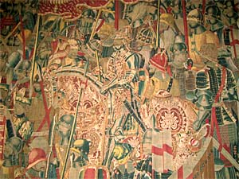

::: {#page .hfeed .site}
[Saltar al contenido](index.html#content){.skip-link
.screen-reader-text}

::: {#sidebar .sidebar}
::: {.site-branding}
[{.custom-logo
width="248" height="248" sizes="(max-width: 248px) 100vw, 248px"
srcset="../../../wp-content/uploads/2016/04/cropped-Manneken_Pis_Blog_Bruselas_Ricardo_Imbern-248.jpg 248w, ../../../wp-content/uploads/2016/04/cropped-Manneken_Pis_Blog_Bruselas_Ricardo_Imbern-248-150x150.jpg 150w"}](../../../index.html){.custom-logo-link}

[Blog Bruselas en español](../../../index.html)

El blog-guía escrito por españoles en Bruselas para los hispanoparlantes
que viven aquí y para los turistas que aprovechan los vuelos baratos
para descubrir el chocolate, la cerveza, la Grand Place y tantas otras
cosas buenas.

Menú y widgets
:::

::: {#secondary .secondary}
::: {#widget-area .widget-area role="complementary"}
Blog Bruselas es {#blog-bruselas-es .widget-title}
----------------

::: {.textwidget}
Un **blog en español escrito en Bruselas** por unos enamorados de la
capital de Bélgica, corazón mágico de Europa. Una ciudad pequeña y
grande, llena de gente, comida, eventos y rincones encantadores; para
descubrir y disfrutar sin dejarse aguar la fiesta por el tiempo (no es
tan malo).

Para quienes pasan por Bruselas, porque vienen de visita, de turismo o
tienen la suerte de vivir aquí. Sí quieres conocer más que los hoteles
en Bruselas, aprovecha los vuelos baratos y **vive la ciudad**.

Blog Bruselas es el bebé de [Ramón Suárez](http://www.ramonsuarez.com),
bruseleño convencido desde 2003.
:::

Espacios de trabajo compartido {#espacios-de-trabajo-compartido .widget-title}
------------------------------

::: {.textwidget}
[Betacowork Coworking Bruselas](http://www.betacowork.com) [Mapa de
espacios de coworking en Bélgica](http://coworkingbelgium.com)
:::

Último vídeo {#último-vídeo .widget-title}
------------

Asociados con Hispagenda, la guía digital de los españoles en Bélgica {#asociados-con-hispagenda-la-guía-digital-de-los-españoles-en-bélgica .widget-title}
---------------------------------------------------------------------

::: {.textwidget}
[{.attachment-medium
width="250" height="100"}](http://www.hispagenda.com)
:::

Más sobre Bruselas en otros idiomas {#más-sobre-bruselas-en-otros-idiomas .widget-title}
-----------------------------------

::: {.textwidget}
[Agenda.be](http://www.agenda.be) FR NL\
[Bruxelles Blog](http://www.bxlblog.be/) FR\
[Eventos para emprendedores y freelance en
Bruselas](http://www.betacowork.com/events/)\
[The Network
Brussels](http://groups.yahoo.com/group/TheNetworkBrussels/) EN\
[What\'s up in Belgium](http://www.whatsupin.be/) EN
:::

Más sobre Bélgica en Español {#más-sobre-bélgica-en-español .widget-title}
----------------------------

::: {.textwidget}
[Spaniards en Bélgica](http://www.spaniards.es/paises/belgica)
:::
:::
:::
:::

::: {#content .site-content}
::: {#primary .section .content-area}
::: {#main .site-main role="main"}
Etiqueta: museo {#etiqueta-museo .page-title}
===============

[Tournai en Pastrana y Pastrana en Bruselas: exposición de tapices flamencos](../../../index.html?p=1515) {#tournai-en-pastrana-y-pastrana-en-bruselas-exposición-de-tapices-flamencos .entry-title}
---------------------------------------------------------------------------------------------------------

::: {.entry-content}
[{.aligncenter
.size-full .wp-image-1517 width="300" height="225"
sizes="(max-width: 300px) 100vw, 300px"
srcset="../../../wp-content/uploads/2010/02/museo_TAPIZ.jpg 300w, ../../../wp-content/uploads/2010/02/museo_TAPIZ-150x112.jpg 150w"}](http://www.blogbruselas.com/2010/02/tournai-en-pastrana-y-pastrana-en-bruselas-exposicion-de-tapices-flamencos-de-la-alcarria-en-los-musees-royaux-dart-et-dhistoire.html/museo_tapiz)\
Hasta el 14 de marzo los [Musées royaux d'Art et
d'Histoire](http://www.kmkg-mrah.be/) de Bruselas exponen cuatro tapices
de la Colegiata de [Pastrana](http://www.pastrana.org/), en la Alcarria.
Se trata de las únicas piezas subsistentes de una serie elaborada en las
manufacturas de Tournai en el siglo XV, período del que se conservan
pocos ejemplos de series tan completas.\
Los tapices representan la campaña militar del rey Alfonso V de Portugal
en la costa magrebí en 1471: tres de ellos narran la toma de Asila y el
cuarto la de Tánger.\
Aunque fueron encargados por el rey de Portugal, los tapices se
encuentran en Castilla desde el siglo XVI, como otras muchas colecciones
de tapices flamencos repartidos por iglesias y museos de todo el país, y
que nos hablan de las estrechas relaciones hispano-belgas en el pasado.\
Los tapices llegaron a Bélgica en 2009 para ser restaurados en Malinas,
y la exposición aprovecha la ocasión de este regreso después de varios
siglos.\
La restauración y la exposición han sido organizadas por iniciativa de
la [Fundación Carlos de Amberes](http://www.fcamberes.org/) de Madrid,
dentro del marco de la presidencia española de la Unión.\
Con tan sólo cuatro magníficos tapices viajamos de Bruselas a Pastrana
pasando por Tournai, Marruecos y Portugal. Un viaje ideal para la pausa
del almuerzo, y un buen ejemplo de que las relaciones culturales entre
países han existido siempre.
:::

[[Publicado el
]{.screen-reader-text}[17/02/201013/11/2016](../../../index.html?p=1515)]{.posted-on}[[[Autor
]{.screen-reader-text}[Eduardo Lamas
Delgado](../../author/eduardo/index.html){.url .fn .n}]{.author
.vcard}]{.byline}[[Categorías
]{.screen-reader-text}[Artes](../../category/artes/index.html)]{.cat-links}[[Etiquetas
]{.screen-reader-text}[arte](../arte/index.html), [arte
flamenco](../arte-flamenco/index.html),
[belgica](../belgica/index.html), [bruselas](../bruselas/index.html),
[españa](../espana/index.html), [exposicion](../exposicion/index.html),
[museo](index.html)]{.tags-links}[[[2 comentarios[ en Tournai en
Pastrana y Pastrana en Bruselas: exposición de tapices
flamencos]{.screen-reader-text}]{.dsq-postid
dsqidentifier="1515 http://www.blogbruselas.com/?p=1515"}](../../../index.html?p=1515#comments)]{.comments-link}
:::
:::
:::

::: {.site-info}
[Creado con WordPress](https://es.wordpress.org/)
:::
:::
