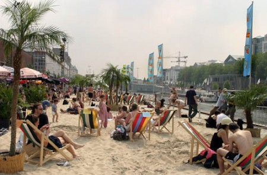

::: {#page .hfeed .site}
[Saltar al contenido](index.html#content){.skip-link
.screen-reader-text}

::: {#sidebar .sidebar}
::: {.site-branding}
[{.custom-logo
width="248" height="248" sizes="(max-width: 248px) 100vw, 248px"
srcset="../../../wp-content/uploads/2016/04/cropped-Manneken_Pis_Blog_Bruselas_Ricardo_Imbern-248.jpg 248w, ../../../wp-content/uploads/2016/04/cropped-Manneken_Pis_Blog_Bruselas_Ricardo_Imbern-248-150x150.jpg 150w"}](../../../index.html){.custom-logo-link}

[Blog Bruselas en español](../../../index.html)

El blog-guía escrito por españoles en Bruselas para los hispanoparlantes
que viven aquí y para los turistas que aprovechan los vuelos baratos
para descubrir el chocolate, la cerveza, la Grand Place y tantas otras
cosas buenas.

Menú y widgets
:::

::: {#secondary .secondary}
::: {#widget-area .widget-area role="complementary"}
Blog Bruselas es {#blog-bruselas-es .widget-title}
----------------

::: {.textwidget}
Un **blog en español escrito en Bruselas** por unos enamorados de la
capital de Bélgica, corazón mágico de Europa. Una ciudad pequeña y
grande, llena de gente, comida, eventos y rincones encantadores; para
descubrir y disfrutar sin dejarse aguar la fiesta por el tiempo (no es
tan malo).

Para quienes pasan por Bruselas, porque vienen de visita, de turismo o
tienen la suerte de vivir aquí. Sí quieres conocer más que los hoteles
en Bruselas, aprovecha los vuelos baratos y **vive la ciudad**.

Blog Bruselas es el bebé de [Ramón Suárez](http://www.ramonsuarez.com),
bruseleño convencido desde 2003.
:::

Espacios de trabajo compartido {#espacios-de-trabajo-compartido .widget-title}
------------------------------

::: {.textwidget}
[Betacowork Coworking Bruselas](http://www.betacowork.com) [Mapa de
espacios de coworking en Bélgica](http://coworkingbelgium.com)
:::

Último vídeo {#último-vídeo .widget-title}
------------

Asociados con Hispagenda, la guía digital de los españoles en Bélgica {#asociados-con-hispagenda-la-guía-digital-de-los-españoles-en-bélgica .widget-title}
---------------------------------------------------------------------

::: {.textwidget}
[{.attachment-medium
width="250" height="100"}](http://www.hispagenda.com)
:::

Más sobre Bruselas en otros idiomas {#más-sobre-bruselas-en-otros-idiomas .widget-title}
-----------------------------------

::: {.textwidget}
[Agenda.be](http://www.agenda.be) FR NL\
[Bruxelles Blog](http://www.bxlblog.be/) FR\
[Eventos para emprendedores y freelance en
Bruselas](http://www.betacowork.com/events/)\
[The Network
Brussels](http://groups.yahoo.com/group/TheNetworkBrussels/) EN\
[What\'s up in Belgium](http://www.whatsupin.be/) EN
:::

Más sobre Bélgica en Español {#más-sobre-bélgica-en-español .widget-title}
----------------------------

::: {.textwidget}
[Spaniards en Bélgica](http://www.spaniards.es/paises/belgica)
:::
:::
:::
:::

::: {#content .site-content}
::: {#primary .section .content-area}
::: {#main .site-main role="main"}
Etiqueta: Rap en Bruselas {#etiqueta-rap-en-bruselas .page-title}
=========================

[Ritmos exóticos en Bruselas Les Bains](../../../index.html?p=2635) {#ritmos-exóticos-en-bruselas-les-bains .entry-title}
-------------------------------------------------------------------

::: {.entry-content}
[{.alignleft
.size-medium .wp-image-2636 width="450" height="295"
sizes="(max-width: 450px) 100vw, 450px"
srcset="../../../wp-content/uploads/2010/07/Bruxelleslesbains-450x295.jpg 450w, ../../../wp-content/uploads/2010/07/Bruxelleslesbains-150x98.jpg 150w, ../../../wp-content/uploads/2010/07/Bruxelleslesbains.jpg 500w"}](http://www.blogbruselas.com/2010/07/ritmos-exoticos-bruselas-les-bains.html/bruxelleslesbains)La
nostalgia por el Mediterráneo pesa en los hombros, contemplar la
infancia en la playa como si fuese una especie de llave dorada, cuándo
los veranos eran largos y la imaginación eterna. Era como si el mar
fuera dar la respuesta a todas las malditas cosas que nos faltan ahora,
sentarse en la arena con mil planes inmediatos y ningún futuro, militar
en la contemplación, la lentitud,  esa sensación de conformar una
minoría de uno. Pero se ha esfumado la necesidad de  la redención para
sobrevivir en el infierno, para los que dicen que Bruselas no tiene
playa, dos tazas, [Bruselas](http://www.bruxelleslesbains.be/) *[Les
Bains](http://www.bruxelleslesbains.be/)*.

Mañana, en la playa, repito, de Bruselas, mientras te olvidas de la
oficina, de los lunes y hundes la agenda en el canal, tienes la
oportunidad de un curso de iniciación en danza oriental y africana,
empieza a las 16 h, un buen entrenamiento para coger el ritmo de la
noche del sábado, además de abrir los oídos con sesiones musicales
refrescantes de *Rap* y *Reggae*, y no parar de mover el cuello.

Os dejo un vídeo que suena a verano, y a sueños por cumplir: *Beach in
Hawaii* de *Ziggy Marley*.
:::

[[Publicado el
]{.screen-reader-text}[14/07/201014/07/2010](../../../index.html?p=2635)]{.posted-on}[[[Autor
]{.screen-reader-text}[Alberto Segarra
Ruíz](../../author/albertosegarraruiz/index.html){.url .fn .n}]{.author
.vcard}]{.byline}[[Categorías ]{.screen-reader-text}[Gran
Bruselas](../../category/gran-bruselas/index.html)]{.cat-links}[[Etiquetas
]{.screen-reader-text}[Bruselas les
Bains](../bruselas-les-bains/index.html), [playa en
Bruselas](../playa-en-bruselas/index.html), [Rap en
Bruselas](index.html), [Reggae en
Bruselas](../reggae-en-bruselas/index.html)]{.tags-links}[[[1
comentario[ en Ritmos exóticos en Bruselas Les
Bains]{.screen-reader-text}]{.dsq-postid
dsqidentifier="2635 http://www.blogbruselas.com/?p=2635"}](../../../index.html?p=2635#comments)]{.comments-link}
:::
:::
:::

::: {.site-info}
[Creado con WordPress](https://es.wordpress.org/)
:::
:::
