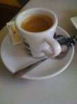
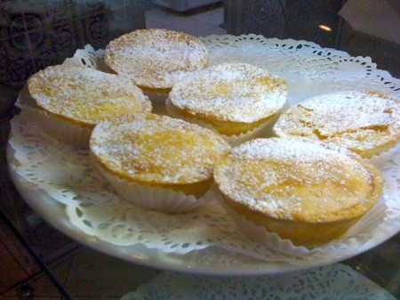
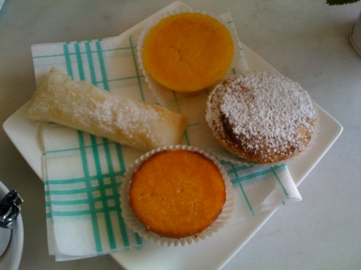

::: {#page .hfeed .site}
[Saltar al contenido](index.html#content){.skip-link
.screen-reader-text}

::: {#sidebar .sidebar}
::: {.site-branding}
[{.custom-logo
width="248" height="248" sizes="(max-width: 248px) 100vw, 248px"
srcset="../../../wp-content/uploads/2016/04/cropped-Manneken_Pis_Blog_Bruselas_Ricardo_Imbern-248.jpg 248w, ../../../wp-content/uploads/2016/04/cropped-Manneken_Pis_Blog_Bruselas_Ricardo_Imbern-248-150x150.jpg 150w"}](../../../index.html){.custom-logo-link}

[Blog Bruselas en español](../../../index.html)

El blog-guía escrito por españoles en Bruselas para los hispanoparlantes
que viven aquí y para los turistas que aprovechan los vuelos baratos
para descubrir el chocolate, la cerveza, la Grand Place y tantas otras
cosas buenas.

Menú y widgets
:::

::: {#secondary .secondary}
::: {#widget-area .widget-area role="complementary"}
Blog Bruselas es {#blog-bruselas-es .widget-title}
----------------

::: {.textwidget}
Un **blog en español escrito en Bruselas** por unos enamorados de la
capital de Bélgica, corazón mágico de Europa. Una ciudad pequeña y
grande, llena de gente, comida, eventos y rincones encantadores; para
descubrir y disfrutar sin dejarse aguar la fiesta por el tiempo (no es
tan malo).

Para quienes pasan por Bruselas, porque vienen de visita, de turismo o
tienen la suerte de vivir aquí. Sí quieres conocer más que los hoteles
en Bruselas, aprovecha los vuelos baratos y **vive la ciudad**.

Blog Bruselas es el bebé de [Ramón Suárez](http://www.ramonsuarez.com),
bruseleño convencido desde 2003.
:::

Espacios de trabajo compartido {#espacios-de-trabajo-compartido .widget-title}
------------------------------

::: {.textwidget}
[Betacowork Coworking Bruselas](http://www.betacowork.com) [Mapa de
espacios de coworking en Bélgica](http://coworkingbelgium.com)
:::

Último vídeo {#último-vídeo .widget-title}
------------

Asociados con Hispagenda, la guía digital de los españoles en Bélgica {#asociados-con-hispagenda-la-guía-digital-de-los-españoles-en-bélgica .widget-title}
---------------------------------------------------------------------

::: {.textwidget}
[{.attachment-medium
width="250" height="100"}](http://www.hispagenda.com)
:::

Más sobre Bruselas en otros idiomas {#más-sobre-bruselas-en-otros-idiomas .widget-title}
-----------------------------------

::: {.textwidget}
[Agenda.be](http://www.agenda.be) FR NL\
[Bruxelles Blog](http://www.bxlblog.be/) FR\
[Eventos para emprendedores y freelance en
Bruselas](http://www.betacowork.com/events/)\
[The Network
Brussels](http://groups.yahoo.com/group/TheNetworkBrussels/) EN\
[What\'s up in Belgium](http://www.whatsupin.be/) EN
:::

Más sobre Bélgica en Español {#más-sobre-bélgica-en-español .widget-title}
----------------------------

::: {.textwidget}
[Spaniards en Bélgica](http://www.spaniards.es/paises/belgica)
:::
:::
:::
:::

::: {#content .site-content}
::: {#primary .section .content-area}
::: {#main .site-main role="main"}
Etiqueta: tentación azucarada {#etiqueta-tentación-azucarada .page-title}
=============================

[Quizás la mejor pastelería portuguesa de Bruselas](../../../index.html?p=1571) {#quizás-la-mejor-pastelería-portuguesa-de-bruselas .entry-title}
-------------------------------------------------------------------------------

::: {.entry-content}
En la rue de la Brasserie 98, muy cerquita de Flagey, a mano derecha
según se sube y justito después de cruzar la rue de la Levure, nos
encontramos con **Queijinhos Doces**, quizás la mejor pastelería
portuguesa de Bruselas. Lo que equivale a decir, una de las mejores
pastelerías de nuestra capital.

Es un lugar pequeño con unas cuantas mesas que se ven desde la clalle a
través de la cristalera. El lugar es, a la vez, restaurante de, claro
está, especialidades portuguesas.

El material lo podemos dividir en dos clases: las tartas y los pasteles.
Hay tartas buenísimas y otras que sólo son buenas, según mis gustos
pasteleros, claro está. De pasteles sólo se puede escoger entre
buenísimos y los de desmayo.

[{.size-thumbnail
.wp-image-1573 .aligncenter width="112" height="150"
sizes="(max-width: 112px) 100vw, 112px"
srcset="../../../wp-content/uploads/2010/02/IMG_0242-112x150.jpg 112w, ../../../wp-content/uploads/2010/02/IMG_0242-337x450.jpg 337w, ../../../wp-content/uploads/2010/02/IMG_0242-768x1024.jpg 768w, ../../../wp-content/uploads/2010/02/IMG_0242.jpg 1200w"}](http://www.blogbruselas.com/2010/02/quizas-la-mejor-pasteleria-portuguesa-de-bruselas.html/img_0242)Es
propiedad de un matrimonio portugués. La responsable de las maravillas
pasteleras que podéis degustar, con un buen café de acompañamiento, si
os gusta el café portugués, es ella.

[{.size-medium
.wp-image-1572 .aligncenter width="450" height="337"
sizes="(max-width: 450px) 100vw, 450px"
srcset="../../../wp-content/uploads/2010/02/IMG_0552-450x337.jpg 450w, ../../../wp-content/uploads/2010/02/IMG_0552-150x112.jpg 150w, ../../../wp-content/uploads/2010/02/IMG_0552-1024x768.jpg 1024w, ../../../wp-content/uploads/2010/02/IMG_0552.jpg 1600w"}](http://www.blogbruselas.com/2010/02/quizas-la-mejor-pasteleria-portuguesa-de-bruselas.html/img_0552)

Hablando con los dueños me contaron un poco como se llaman y de que
están compuestos. Trataré de daros algunas pistas, aunque lo mejor es
ir, mirar, aplicar vuestros conocimientos en la materia y elegir
algunos. Por cierto, se pueden comer más de lo que pensáis. Están tan
bien hechos que no se hacen empalagosos.

Seguro que conoceréis más de uno nada más verlos. Pero quizás los
volváis a descubrir de tan bien hechos que están.

[{.aligncenter
.size-medium .wp-image-1586 width="450" height="337"
sizes="(max-width: 450px) 100vw, 450px"
srcset="../../../wp-content/uploads/2010/02/IMG_0241-450x337.jpg 450w, ../../../wp-content/uploads/2010/02/IMG_0241-150x112.jpg 150w, ../../../wp-content/uploads/2010/02/IMG_0241-1024x768.jpg 1024w, ../../../wp-content/uploads/2010/02/IMG_0241.jpg 1600w"}](http://www.blogbruselas.com/2010/02/quizas-la-mejor-pasteleria-portuguesa-de-bruselas.html/img_0241)

Entre lo que podréis degustar están las siguientes delicias:\
Tentugal: hojaldre con crema de yemas de huevo, que te hacen acordar de
los ovos moles,\
Papos de anjos, dicen que es el único sitio de Bruselas. Proceden de un
convento de Aroca, en el norte de Portugal. Estos son de desmayo.\
Queijadas de batata doce,\
Bolo de feijao: dulce de almendras y judías blancas,\
Queijada de laranja, que no contiene harina\
Pâo de ló, Tarta de amendoa e gila, tocinho de ceu, queijadinhas de
cenouva o de maça....

Seguramente me he equivocado en la descripción o en la ortografía. Pero
no me equivoco al recomendaros este sitio.

En fin, no sigo. Si no lo conocéis y os gustan los dulces tenéis que ir.
:::

[[Publicado el
]{.screen-reader-text}[25/02/201025/02/2010](../../../index.html?p=1571)]{.posted-on}[[[Autor
]{.screen-reader-text}[Álvaro Marín](../../../index.html?author=4){.url
.fn .n}]{.author .vcard}]{.byline}[[Categorías
]{.screen-reader-text}[Comer y
beber](../../category/comer-y-beber/index.html)]{.cat-links}[[Etiquetas
]{.screen-reader-text}[beber](../beber/index.html),
[comer](../comer/index.html), [pastelería](../pasteleria/index.html),
[pasteleria portuguesa](../pasteleria-portuguesa/index.html), [pasteles
portugueses](../pasteles-portugueses/index.html), [tentación
azucarada](index.html)]{.tags-links}[[[4 comentarios[ en Quizás la mejor
pastelería portuguesa de Bruselas]{.screen-reader-text}]{.dsq-postid
dsqidentifier="1571 http://www.blogbruselas.com/?p=1571"}](../../../index.html?p=1571#comments)]{.comments-link}
:::
:::
:::

::: {.site-info}
[Creado con WordPress](https://es.wordpress.org/)
:::
:::
