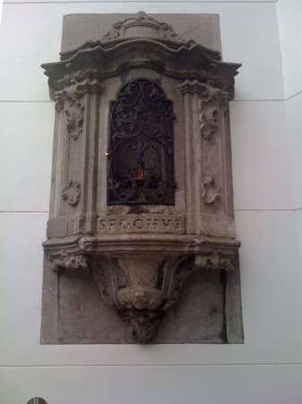
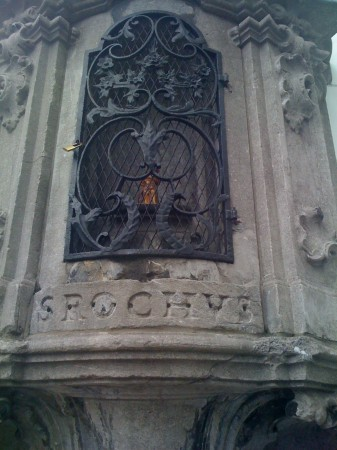

::: {#page .hfeed .site}
[Saltar al contenido](index.html#content){.skip-link
.screen-reader-text}

::: {#sidebar .sidebar}
::: {.site-branding}
[{.custom-logo
width="248" height="248" sizes="(max-width: 248px) 100vw, 248px"
srcset="../../wp-content/uploads/2016/04/cropped-Manneken_Pis_Blog_Bruselas_Ricardo_Imbern-248.jpg 248w, ../../wp-content/uploads/2016/04/cropped-Manneken_Pis_Blog_Bruselas_Ricardo_Imbern-248-150x150.jpg 150w"}](../../index.html){.custom-logo-link}

[Blog Bruselas en español](../../index.html) {#blog-bruselas-en-español .site-title}
============================================

El blog-guía escrito por españoles en Bruselas para los hispanoparlantes
que viven aquí y para los turistas que aprovechan los vuelos baratos
para descubrir el chocolate, la cerveza, la Grand Place y tantas otras
cosas buenas.

Menú y widgets
:::

::: {#secondary .secondary}
::: {#widget-area .widget-area role="complementary"}
Blog Bruselas es {#blog-bruselas-es .widget-title}
----------------

::: {.textwidget}
Un **blog en español escrito en Bruselas** por unos enamorados de la
capital de Bélgica, corazón mágico de Europa. Una ciudad pequeña y
grande, llena de gente, comida, eventos y rincones encantadores; para
descubrir y disfrutar sin dejarse aguar la fiesta por el tiempo (no es
tan malo).

Para quienes pasan por Bruselas, porque vienen de visita, de turismo o
tienen la suerte de vivir aquí. Sí quieres conocer más que los hoteles
en Bruselas, aprovecha los vuelos baratos y **vive la ciudad**.

Blog Bruselas es el bebé de [Ramón Suárez](http://www.ramonsuarez.com),
bruseleño convencido desde 2003.
:::

Espacios de trabajo compartido {#espacios-de-trabajo-compartido .widget-title}
------------------------------

::: {.textwidget}
[Betacowork Coworking Bruselas](http://www.betacowork.com) [Mapa de
espacios de coworking en Bélgica](http://coworkingbelgium.com)
:::

Último vídeo {#último-vídeo .widget-title}
------------

Asociados con Hispagenda, la guía digital de los españoles en Bélgica {#asociados-con-hispagenda-la-guía-digital-de-los-españoles-en-bélgica .widget-title}
---------------------------------------------------------------------

::: {.textwidget}
[{.attachment-medium
width="250" height="100"}](http://www.hispagenda.com)
:::

Más sobre Bruselas en otros idiomas {#más-sobre-bruselas-en-otros-idiomas .widget-title}
-----------------------------------

::: {.textwidget}
[Agenda.be](http://www.agenda.be) FR NL\
[Bruxelles Blog](http://www.bxlblog.be/) FR\
[Eventos para emprendedores y freelance en
Bruselas](http://www.betacowork.com/events/)\
[The Network
Brussels](http://groups.yahoo.com/group/TheNetworkBrussels/) EN\
[What\'s up in Belgium](http://www.whatsupin.be/) EN
:::

Más sobre Bélgica en Español {#más-sobre-bélgica-en-español .widget-title}
----------------------------

::: {.textwidget}
[Spaniards en Bélgica](http://www.spaniards.es/paises/belgica)
:::
:::
:::
:::

::: {#content .site-content}
::: {#primary .content-area}
::: {#main .site-main role="main"}
[Los tweets de Blog Bruselas: la semana en Twitter 2010-05-22](../../index.html?p=1997) {#los-tweets-de-blog-bruselas-la-semana-en-twitter-2010-05-22 .entry-title}
---------------------------------------------------------------------------------------

::: {.entry-content}
-   Los tweets de Blog Bruselas: la semana en Twitter 2010-05-15
    <http://ow.ly/17nZfP>
    [\#](http://twitter.com/blogbruselas/statuses/14061405260){.aktt_tweet_time}
-   My money is not good in San Francisco
    [\#](http://twitter.com/blogbruselas/statuses/14069887630){.aktt_tweet_time}
-   Marcador con retos humanos para el futuro <http://ow.ly/17prbp>
    [\#](http://twitter.com/blogbruselas/statuses/14213279118){.aktt_tweet_time}
-   XD ROFL RT
    @[eventoblog](http://twitter.com/eventoblog){.aktt_username} ¡Qué
    visión tuvimos en 2007 creando la EBE Store.Dónde estén las tazas y
    camisetas que se quiten las apps!
    \#[io2010](http://search.twitter.com/search?q=%23io2010){.aktt_hashtag}
    [\#](http://twitter.com/blogbruselas/statuses/14307144039){.aktt_tweet_time}
-   Orgullo gilipollas! <http://bit.ly/b1kJnB>
    \#[io2010](http://search.twitter.com/search?q=%23io2010){.aktt_hashtag}
    cc @[jabcomics](http://twitter.com/jabcomics){.aktt_username}
    [\#](http://twitter.com/blogbruselas/statuses/14311590884){.aktt_tweet_time}
-   Orgullo gilipollas! <http://twitgoo.com/wgwgm>
    \#[io2010](http://search.twitter.com/search?q=%23io2010){.aktt_hashtag}
    cc @[jabcomics](http://twitter.com/jabcomics){.aktt_username}
    [\#](http://twitter.com/blogbruselas/statuses/14313202853){.aktt_tweet_time}
-   La "Anti-tapas", una fiesta para hincarle el diente
    <http://ow.ly/17qJeu>
    [\#](http://twitter.com/blogbruselas/statuses/14322870918){.aktt_tweet_time}
-   Android y Google TV, las grandes noticias del Google IO Loogic.com
    <http://ow.ly/1NMzk>
    [\#](http://twitter.com/blogbruselas/statuses/14379079767){.aktt_tweet_time}
:::

[[Publicado el
]{.screen-reader-text}[22/05/2010](../../index.html?p=1997)]{.posted-on}[[[Autor
]{.screen-reader-text}[Ramón
Suárez](../../blog/2010/04/30/index.html?author=2){.url .fn .n}]{.author
.vcard}]{.byline}[[Categorías ]{.screen-reader-text}Sin
categoría]{.cat-links}[[Etiquetas ]{.screen-reader-text}[la semana de
Blog Bruselas en
Twitter](../../blog/tag/la-semana-de-blog-bruselas-en-twitter/index.html),
[twitter blog
bruselas](../../blog/tag/twitter-blog-bruselas/index.html)]{.tags-links}

[La "Anti-tapas", una fiesta para hincarle el diente](../../index.html?p=1991) {#la-anti-tapas-una-fiesta-para-hincarle-el-diente .entry-title}
------------------------------------------------------------------------------

::: {.entry-content}
Sí, sí, es que el nombre de la fiesta, Anti-tapas, mezcla del italiano
antipasto y de las castizas tapas, resulta muy apetecible. La mezcla
italo-ibérica se explica también porque es una asociación italiana la
que organiza el fiestorro en la sede del centro de Galicia (Ex-Cantina).

Pero bueno, vamos a lo importante, que es la fiesta en sí. Para los más
madrugadores, hubo comida italiana para picar, incluída en el precio de
la entrada. O sea, por 5 euros: picoteo+concierto+buen ambiente. Todos
los ingredientes para una buena noche. Y larga, porque la fiesta se
prolonga hasta bien tarde para los más *noctámbulos*.

En el caso del pasado viernes 14, los invitados eran ***Modena City
Ramblers***, un veterano grupo muy conocido en el país de la bota. Folk
y letras combativas. La gente se lo pasó (nos lo pasamos) en grande.
Tanta gente y tanto ambiente que casi no se podía respirar...Para
muestra, este vídeo:

De hecho, sobre las 10 de la noche la cola para entrar era considerable,
y hubo quien se tuvo que quedar sin entrar.

Los chicos de esta asociación italiana, que se llama Palais des
Sciences, no saben quedarse quietos y ya este sábado 22 de mayo, como ya
se ha dicho aquí en el blog, junto a la organización del Parcours
d´Artistes de Saint-Gilles, nos traen a Tonino Carotone en concierto en
Bruselas. Será en la fiesta de clausura al aire libre de este evento, en
la Place Marie Janson -- Parvis de St. Gilles, a las ocho de la noche.
Además se trata de la primera vez que el cantante actúa en Bruselas.
Actuaciones buenas, bonitas y baratas(por la patilla esta vez) en
nuestra querida ciudad, ¿quién da más?
:::

[[Publicado el
]{.screen-reader-text}[20/05/201021/05/2010](../../index.html?p=1991)]{.posted-on}[[[Autor
]{.screen-reader-text}[Objetivo
Bruselas](../../blog/author/objetivo-bruselas/index.html){.url .fn
.n}]{.author .vcard}]{.byline}[[Categorías ]{.screen-reader-text}[Gran
Bruselas](../../blog/category/gran-bruselas/index.html)]{.cat-links}[[Etiquetas
]{.screen-reader-text}[anti-tapas](../../blog/tag/anti-tapas/index.html),
[concierto](../../blog/tag/concierto/index.html),
[fiesta](../../blog/tag/fiesta/index.html)]{.tags-links}[[[3
comentarios[ en La "Anti-tapas", una fiesta para hincarle el
diente]{.screen-reader-text}]{.dsq-postid
dsqidentifier="1991 http://www.blogbruselas.com/?p=1991"}](../../index.html?p=1991#comments)]{.comments-link}

[Marcador con retos humanos para el futuro](../../index.html?p=1976) {#marcador-con-retos-humanos-para-el-futuro .entry-title}
--------------------------------------------------------------------

::: {.entry-content}
La [Fundación Española de Ciencia y
Tecnologia](http://www.fecyt.es/fecyt/home.do;jsessionid=B9D9A312C86B65591B07FC90C8B9F3E6)
ha colocado un marcador en el corazón del barrio europeo de Bruselas.
Catorce personalidades de la ciencia y la sociedad nos proponen catorce
retos que consideran que la creatividad y la innovación deben solucionar
en un futuro cercano. El proyecto es abierto y permite utilizar [redes
sociales](http://www.facebook.com/sharer.php?u=http://www.reto2030.eu:80/index.html#!/reto2030)
para que la gente pueda incorporar al marcador sus opiniones así como
una web donde realizar [votos](http://www.reto2030.eu/).

{.size-medium
.wp-image-1977 width="450" height="337"
sizes="(max-width: 450px) 100vw, 450px"
srcset="../../wp-content/uploads/2010/05/IMG_2625-450x337.jpg 450w, ../../wp-content/uploads/2010/05/IMG_2625-150x112.jpg 150w, ../../wp-content/uploads/2010/05/IMG_2625.jpg 800w"}
:::

[[Publicado el
]{.screen-reader-text}[18/05/201018/05/2010](../../index.html?p=1976)]{.posted-on}[[[Autor
]{.screen-reader-text}[Manuel
Pueyo](../../blog/author/easysun/index.html){.url .fn .n}]{.author
.vcard}]{.byline}[[Categorías ]{.screen-reader-text}[Comunicación y
marketing](../../blog/category/comunicacion-y-marketing/index.html),
[Gran
Bruselas](../../blog/category/gran-bruselas/index.html)]{.cat-links}[[Etiquetas
]{.screen-reader-text}[agenda
ciudadana](../../blog/tag/agenda-ciudadana/index.html),
[fecyt](../../blog/tag/fecyt/index.html), [marcador
bruselas](../../blog/tag/marcador-bruselas/index.html), [reto
2030](../../blog/tag/reto-2030/index.html)]{.tags-links}

[Los tweets de Blog Bruselas: la semana en Twitter 2010-05-15](../../index.html?p=1975) {#los-tweets-de-blog-bruselas-la-semana-en-twitter-2010-05-15 .entry-title}
---------------------------------------------------------------------------------------

::: {.entry-content}
-   Los tweets de Blog Bruselas: la semana en Twitter 2010-05-08
    <http://ow.ly/17jfJA>
    [\#](http://twitter.com/blogbruselas/statuses/13631909578){.aktt_tweet_time}
-   Que buena terraza tiene el parlamento de Bruselas
    \#[solecito](http://search.twitter.com/search?q=%23solecito){.aktt_hashtag}
    \#fetedeliris 🙂
    [\#](http://twitter.com/blogbruselas/statuses/13659664300){.aktt_tweet_time}
-   Para que se relajen despues de las sesionea de parlamento regional
    <http://bit.ly/aURiFW>
    \#[fetedeliris](http://search.twitter.com/search?q=%23fetedeliris){.aktt_hashtag}
    [\#](http://twitter.com/blogbruselas/statuses/13659825619){.aktt_tweet_time}
-   Alicia en el Mont des Arts <http://bit.ly/b8nBfI>
    \#[fetedeliris](http://search.twitter.com/search?q=%23fetedeliris){.aktt_hashtag}
    [\#](http://twitter.com/blogbruselas/statuses/13663400145){.aktt_tweet_time}
-   Bicis de segunda mano revisadas a partir de €75
    <http://bit.ly/96jJ1r>
    [\#](http://twitter.com/blogbruselas/statuses/13663554159){.aktt_tweet_time}
-   A ti! RT
    @[MacarenaRG](http://twitter.com/MacarenaRG){.aktt_username}
    \#[quedadabxl](http://search.twitter.com/search?q=%23quedadabxl){.aktt_hashtag}
    gracias a
    @[blogbruselas](http://twitter.com/blogbruselas){.aktt_username} que
    está en esta foto 🙂 <http://bit.ly/bEVzKd>
    [\#](http://twitter.com/blogbruselas/statuses/13671160219){.aktt_tweet_time}
-   ¡Gracias! RT @[sandel](http://twitter.com/sandel){.aktt_username}:
    Todas mis fotos de la
    \#[quedadabxl](http://search.twitter.com/search?q=%23quedadabxl){.aktt_hashtag}
    del 8.05 <http://bit.ly/a3EnIs>
    [\#](http://twitter.com/blogbruselas/statuses/13686110333){.aktt_tweet_time}
-   consejos para mantener limpio tu tweeter <http://bit.ly/cjcxnh>
    [\#](http://twitter.com/blogbruselas/statuses/13746127466){.aktt_tweet_time}
-   algon esposor para BB? 😉 RT
    @[David\_Bayon](http://twitter.com/David_Bayon){.aktt_username} Sony
    Nex 3 y Nex 5 -- compactas con lentes intercambiables y grabación de
    vídeo HD <http://bit.ly/>
    [\#](http://twitter.com/blogbruselas/statuses/13778644168){.aktt_tweet_time}
-   ¿Donde está? <http://ow.ly/1JyxC>
    \#[facilito](http://search.twitter.com/search?q=%23facilito){.aktt_hashtag}
    [\#](http://twitter.com/blogbruselas/statuses/13787931976){.aktt_tweet_time}
-   RT @[pepgomez](http://twitter.com/pepgomez){.aktt_username}:
    Grandísimo el post de
    @[edans](http://twitter.com/edans){.aktt_username} de hoy: \"Era un
    ROBO. Son unos LADRONES\" <http://bit.ly/9NQpcp>
    [\#](http://twitter.com/blogbruselas/statuses/13795516115){.aktt_tweet_time}
-   Pagaría a Facebook para poder cambiar el nombre de la página de fans
    de Blog Bruselas <http://ow.ly/1JL1n>
    [\#](http://twitter.com/blogbruselas/statuses/13804486157){.aktt_tweet_time}
-   Las fotos de la quedada <http://ow.ly/17l6tG>
    [\#](http://twitter.com/blogbruselas/statuses/13808626969){.aktt_tweet_time}
-   Conferencia de Ricardo Menendez Salmón el 28 de Mayo
    <http://ow.ly/17lwmE>
    [\#](http://twitter.com/blogbruselas/statuses/13841300311){.aktt_tweet_time}
-   XD RT @[ceslava](http://twitter.com/ceslava){.aktt_username}: Bajar
    la bolsa de basura, subir la bolsa del pan. Vaivenes búrsatiles
    [\#](http://twitter.com/blogbruselas/statuses/13847009998){.aktt_tweet_time}
-   ¿Quién se anima a cuidar el blog las próximas dos semanas? Me voy a
    San Francisco y ¡lo voy a tener crudo para escribir!
    [\#](http://twitter.com/blogbruselas/statuses/13865394002){.aktt_tweet_time}
-   Mooola: Aprende el ABC con Star Wars <http://ow.ly/1Ki5Y> By
    @[carlosrebato](http://twitter.com/carlosrebato){.aktt_username}
    [\#](http://twitter.com/blogbruselas/statuses/13868474221){.aktt_tweet_time}
-   Voluntarios para la Euroferia Andaluza de Bruselas 2010
    <http://ow.ly/17lUfg>
    [\#](http://twitter.com/blogbruselas/statuses/13870801743){.aktt_tweet_time}
-   socorroco! XD <http://bit.ly/bWhCMr>
    [\#](http://twitter.com/blogbruselas/statuses/13898632409){.aktt_tweet_time}
-   Hornacinas y santos pequeñitos <http://ow.ly/17nK9t>
    [\#](http://twitter.com/blogbruselas/statuses/14030076123){.aktt_tweet_time}
-   RT @[sfnewtech](http://twitter.com/sfnewtech){.aktt_username}:
    Wishing everyone a great weekend. Don\'t forget about the Belgians
    joining us on Tuesday -- <http://bit.ly/bjH4FO>
    [\#](http://twitter.com/blogbruselas/statuses/14050445475){.aktt_tweet_time}
:::

[[Publicado el
]{.screen-reader-text}[15/05/2010](../../index.html?p=1975)]{.posted-on}[[[Autor
]{.screen-reader-text}[Ramón
Suárez](../../blog/2010/04/30/index.html?author=2){.url .fn .n}]{.author
.vcard}]{.byline}[[Categorías ]{.screen-reader-text}Sin
categoría]{.cat-links}[[Etiquetas ]{.screen-reader-text}[la semana de
Blog Bruselas en
Twitter](../../blog/tag/la-semana-de-blog-bruselas-en-twitter/index.html),
[twitter blog
bruselas](../../blog/tag/twitter-blog-bruselas/index.html)]{.tags-links}

[Hornacinas y santos pequeñitos](../../index.html?p=1960) {#hornacinas-y-santos-pequeñitos .entry-title}
---------------------------------------------------------

::: {.entry-content}
Ayer tarde paseando por el Quaie aux Briques, cuando estaba a punto de
llegar a la iglesia de Sainte Catherine, descubrí una curiosa
hornacina.\
Está en la esquina del un callejón que va hasta la rue de Flandre y que
se llama rue du Chien Marin. Es una hornacina de tamaño normal. Ni muy
grande ni muy pequeña, con una reja con candado para que no se lleven el
santo: San Roche, según reza la inscripción.\
[{.aligncenter
.size-medium .wp-image-1959 width="337" height="450"
sizes="(max-width: 337px) 100vw, 337px"
srcset="../../wp-content/uploads/2010/05/IMG_0802-337x450.jpg 337w, ../../wp-content/uploads/2010/05/IMG_0802-112x150.jpg 112w, ../../wp-content/uploads/2010/05/IMG_0802-768x1024.jpg 768w, ../../wp-content/uploads/2010/05/IMG_0802.jpg 1200w"}](http://www.blogbruselas.com/2010/05/hornacinas-y-santos-pequenitos-2.html/img_0802)\
A primera vista, sin embargo, el santo parece que se lo han llevado ya,
a pesar de que el candado un tanto enmohecido no está forzado. Luego,
cuando se mira con un poco más de atención, se ve que San Roque está
allí.

No se si ha sido la humedad de Bruselas la que ha hecho encoger al santo
o si la tradición lo exige de este tamaño. Otra posibilidad es que lo
hubiesen sacrílegamente robado y para que no se olvidase tamaño pecado
lo hubiesen sustituido por uno en miniatura.

¿Alguien sabe la verdadera (o no) historia?

[{.aligncenter
.size-medium .wp-image-1966 width="337" height="450"
sizes="(max-width: 337px) 100vw, 337px"
srcset="../../wp-content/uploads/2010/05/IMG_0803-337x450.jpg 337w, ../../wp-content/uploads/2010/05/IMG_0803-112x150.jpg 112w, ../../wp-content/uploads/2010/05/IMG_0803-768x1024.jpg 768w, ../../wp-content/uploads/2010/05/IMG_0803.jpg 1200w"}](http://www.blogbruselas.com/2010/05/hornacinas-y-santos-pequenitos.html/img_0803)
:::

[[Publicado el
]{.screen-reader-text}[15/05/201031/05/2010](../../index.html?p=1960)]{.posted-on}[[[Autor
]{.screen-reader-text}[Álvaro Marín](../../index.html?author=4){.url .fn
.n}]{.author .vcard}]{.byline}[[Categorías ]{.screen-reader-text}[Gran
Bruselas](../../blog/category/gran-bruselas/index.html)]{.cat-links}[[Etiquetas
]{.screen-reader-text}[hornacina](../../blog/tag/hornacina/index.html),
[Sainte-Catherine](../../blog/tag/sainte-catherine/index.html),
[santo](../../blog/tag/santo/index.html)]{.tags-links}[[[2 comentarios[
en Hornacinas y santos pequeñitos]{.screen-reader-text}]{.dsq-postid
dsqidentifier="1960 http://www.blogbruselas.com/?p=1960"}](../../index.html?p=1960#comments)]{.comments-link}

Navegación de entradas {#navegación-de-entradas .screen-reader-text}
----------------------

::: {.nav-links}
[Página anterior](../28/index.html){.prev .page-numbers} [[Página
]{.meta-nav .screen-reader-text}1](../../index.html){.page-numbers}
[...]{.page-numbers .dots} [[Página ]{.meta-nav
.screen-reader-text}28](../28/index.html){.page-numbers} [[Página
]{.meta-nav .screen-reader-text}29]{.page-numbers .current} [[Página
]{.meta-nav .screen-reader-text}30](../30/index.html){.page-numbers}
[...]{.page-numbers .dots} [[Página ]{.meta-nav
.screen-reader-text}141](../141/index.html){.page-numbers} [Página
siguiente](../30/index.html){.next .page-numbers}
:::
:::
:::
:::

::: {.site-info}
[Creado con WordPress](https://es.wordpress.org/)
:::
:::
