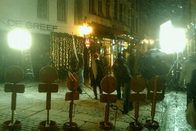

::: {#page .hfeed .site}
[Saltar al contenido](index.html#content){.skip-link
.screen-reader-text}

::: {#sidebar .sidebar}
::: {.site-branding}
[{.custom-logo
width="248" height="248" sizes="(max-width: 248px) 100vw, 248px"
srcset="../../wp-content/uploads/2016/04/cropped-Manneken_Pis_Blog_Bruselas_Ricardo_Imbern-248.jpg 248w, ../../wp-content/uploads/2016/04/cropped-Manneken_Pis_Blog_Bruselas_Ricardo_Imbern-248-150x150.jpg 150w"}](../../index.html){.custom-logo-link}

[Blog Bruselas en español](../../index.html) {#blog-bruselas-en-español .site-title}
============================================

El blog-guía escrito por españoles en Bruselas para los hispanoparlantes
que viven aquí y para los turistas que aprovechan los vuelos baratos
para descubrir el chocolate, la cerveza, la Grand Place y tantas otras
cosas buenas.

Menú y widgets
:::

::: {#secondary .secondary}
::: {#widget-area .widget-area role="complementary"}
Blog Bruselas es {#blog-bruselas-es .widget-title}
----------------

::: {.textwidget}
Un **blog en español escrito en Bruselas** por unos enamorados de la
capital de Bélgica, corazón mágico de Europa. Una ciudad pequeña y
grande, llena de gente, comida, eventos y rincones encantadores; para
descubrir y disfrutar sin dejarse aguar la fiesta por el tiempo (no es
tan malo).

Para quienes pasan por Bruselas, porque vienen de visita, de turismo o
tienen la suerte de vivir aquí. Sí quieres conocer más que los hoteles
en Bruselas, aprovecha los vuelos baratos y **vive la ciudad**.

Blog Bruselas es el bebé de [Ramón Suárez](http://www.ramonsuarez.com),
bruseleño convencido desde 2003.
:::

Espacios de trabajo compartido {#espacios-de-trabajo-compartido .widget-title}
------------------------------

::: {.textwidget}
[Betacowork Coworking Bruselas](http://www.betacowork.com) [Mapa de
espacios de coworking en Bélgica](http://coworkingbelgium.com)
:::

Último vídeo {#último-vídeo .widget-title}
------------

Asociados con Hispagenda, la guía digital de los españoles en Bélgica {#asociados-con-hispagenda-la-guía-digital-de-los-españoles-en-bélgica .widget-title}
---------------------------------------------------------------------

::: {.textwidget}
[{.attachment-medium
width="250" height="100"}](http://www.hispagenda.com)
:::

Más sobre Bruselas en otros idiomas {#más-sobre-bruselas-en-otros-idiomas .widget-title}
-----------------------------------

::: {.textwidget}
[Agenda.be](http://www.agenda.be) FR NL\
[Bruxelles Blog](http://www.bxlblog.be/) FR\
[Eventos para emprendedores y freelance en
Bruselas](http://www.betacowork.com/events/)\
[The Network
Brussels](http://groups.yahoo.com/group/TheNetworkBrussels/) EN\
[What\'s up in Belgium](http://www.whatsupin.be/) EN
:::

Más sobre Bélgica en Español {#más-sobre-bélgica-en-español .widget-title}
----------------------------

::: {.textwidget}
[Spaniards en Bélgica](http://www.spaniards.es/paises/belgica)
:::
:::
:::
:::

::: {#content .site-content}
::: {#primary .content-area}
::: {#main .site-main role="main"}
[Nuevos medios](../../index.html?p=868) {#nuevos-medios .entry-title}
---------------------------------------

::: {.entry-content}
Acabo de descargar una aplicación para publicar desde mi teléfono. Si
funciona posiblemente aumente mi productividad bloguera. Os envio una
foto de la noche de St-Gilles

[{.alignnone
.size-full .wp-image-364 width="300"
height="225"}](../../wp-content/uploads/2009/11/l_1600_1200_5D1F57E7-E354-46F5-AB86-36AC2B7C054D.jpeg)
:::

[[Publicado el
]{.screen-reader-text}[14/11/200903/12/2009](../../index.html?p=868)]{.posted-on}[[[Autor
]{.screen-reader-text}[Álvaro Marín](../../index.html?author=4){.url .fn
.n}]{.author .vcard}]{.byline}[[Categorías
]{.screen-reader-text}[Blogs](../../blog/category/blogs/index.html),
[Informática](../../blog/category/informatica/index.html)]{.cat-links}[[Etiquetas
]{.screen-reader-text}[iphone](../../blog/tag/iphone/index.html),
[Noche](../../blog/tag/noche/index.html),
[St-Gilles](../../blog/tag/st-gilles/index.html)]{.tags-links}[[[9
comentarios[ en Nuevos medios]{.screen-reader-text}]{.dsq-postid
dsqidentifier="868 http://www.blogbruselas.com/?p=868"}](../../index.html?p=868#comments)]{.comments-link}

[IV Ciclo de cortometrajes asturianos en Bruselas](../../index.html?p=856) {#iv-ciclo-de-cortometrajes-asturianos-en-bruselas .entry-title}
--------------------------------------------------------------------------

::: {.entry-content}
{.alignnone
width="320" height="152"}

[La muestra, realizada por [ASBRU](http://asbru.blogspot.com/) en
colaboración con el [FicXixón](http://www.gijonfilmfestival.com/), se
presentará ]{lang="fr-BE"}[en la capital belga los días 26 y 27 de
noviembre.]{lang="fr-BE"}

[ ]{lang="fr-BE"}[Organizada en un programa doble que tendrá lugar en
las instalaciones de la C[asa de Asturias de
Bruselas](http://maps.google.es/maps?f=q&hl=es&geocode=&q=casa+de+asturias,bruxelles&sll=43.333416,-5.934201&sspn=1.012865,2.471924&ie=UTF8&ll=50.851637,4.361658&spn=0.013086,0.038624&z=15&iwloc=A),
esta cuarta edición se clausurará con el estreno en Bélgica del
cortometraje ]{lang="fr-BE"}[*La vida de María de
Magdalá*]{lang="fr-BE"}[, dirigido por el asturiano afincado en Bruselas
]{lang="fr-BE"}[**Santos Hevia**]{lang="fr-BE"}[.]{lang="fr-BE"}

[El primer pase del día 26]{lang="fr-BE"}[ estará integrado por los
cortometrajes ]{lang="fr-BE"}[*5Pointz*]{lang="fr-BE"}[, de
]{lang="fr-BE"}[**Eliana Álvarez**]{lang="fr-BE"}[,
]{lang="fr-BE"}[*Casa*]{lang="fr-BE"}[, de ]{lang="fr-BE"}[**Diego
Llorente**]{lang="fr-BE"}[, ]{lang="fr-BE"}[*Carla*]{lang="fr-BE"}[, de
]{lang="fr-BE"}[**K. Prada y J. Prada**]{lang="fr-BE"}[,
]{lang="fr-BE"}[*Kassumay*]{lang="fr-BE"}[, de ]{lang="fr-BE"}[**Carlos
Navarro**]{lang="fr-BE"}[, y ]{lang="fr-BE"}[*La presa*]{lang="fr-BE"}[,
de ]{lang="fr-BE"}[**Jorge Rivero**]{lang="fr-BE"}[, quien estará
presente en la proyección y protagonizará posteriormente un encuentro
con el público asistente. Rivero, cuyo anterior corto,
]{lang="fr-BE"}[*Nenyure*]{lang="fr-BE"}[, fue candidato al Goya al
Mejor Cortometraje Documental en 2006, recrea en ]{lang="fr-BE"}[*La
presa,*]{lang="fr-BE"}[ de manera muy personal, la construcción en la
década de los 40 del embalse del Salto del Salime, la segunda presa
mayor de Europa en su momento.]{lang="fr-BE"}

[El viernes 27]{lang="fr-BE"}[ clausurará el ciclo el director asturiano
afincado en Bruselas ]{lang="fr-BE"}[**Santos Hevia**]{lang="fr-BE"}[,
quien presentará la trilogía ]{lang="fr-BE"}[*Hestoria d'un
vezu*]{lang="fr-BE"}[ (2000), ]{lang="fr-BE"}[*Matar el
tiempu*]{lang="fr-BE"}[ (2006) y
]{lang="fr-BE"}[*Vencíu*]{lang="fr-BE"}[ (2008), y protagonizará el
estreno en Bélgica de su útimo cortometraje, ]{lang="fr-BE"}[*La vida de
María de Magdalá*]{lang="fr-BE"}[. El tema de la identidad asturiana es
omnipresente en la obra de este cineasta que, a pesar de haber emigrado
de pequeño con su familia a Bélgica, regresa siempre a Asturias a filmar
sus cortos, realizados todos ellos en lengua asturiana y ganadores de
varios premios en diversos festivales internacionales.]{lang="fr-BE"}
:::

[[Publicado el
]{.screen-reader-text}[13/11/200903/12/2009](../../index.html?p=856)]{.posted-on}[[[Autor
]{.screen-reader-text}[Manuel
Pueyo](../../blog/author/easysun/index.html){.url .fn .n}]{.author
.vcard}]{.byline}[[Categorías
]{.screen-reader-text}[Artes](../../blog/category/artes/index.html),
[Gran
Bruselas](../../blog/category/gran-bruselas/index.html)]{.cat-links}[[Etiquetas
]{.screen-reader-text}[asturias](../../blog/tag/asturias/index.html),
[bruselas](../../blog/tag/bruselas/index.html),
[cine](../../blog/tag/cine/index.html)]{.tags-links}[[[2 comentarios[ en
IV Ciclo de cortometrajes asturianos en
Bruselas]{.screen-reader-text}]{.dsq-postid
dsqidentifier="856 http://www.blogbruselas.com/?p=856"}](../../index.html?p=856#comments)]{.comments-link}

[Camisetas de la Webmission para el EBE09](../../index.html?p=851) {#camisetas-de-la-webmission-para-el-ebe09 .entry-title}
------------------------------------------------------------------

::: {.entry-content}
[{.aligncenter
width="360"
height="480"}](http://www.lapatate.be/products/t-shirt-webmission)

Los chicos de [***La
patate***](http://www.lapatate.be/products/t-shirt-webmission "Camisteas cachondas y muy belgas La Patete")
nos han echado una mano de las buenas con la producción de las
**camisetas de la
[Webmission](http://wiki.webmission.be/ebe09 "La misión sagrada belga a la conversión del EBE09")**
para que lleguemos a tiempo con ellas al
**[EBE09](http://www.eventoblog.com "Evento Blog España")**. Podéis
imaginar por la foto, que tienen bastante humor, como sus camisetas. En
todo caso, un **¡GRACIAS!** enorme a Vincenzo y Michael por hacer más
fácil tender el [puente entre la internet belga y la
hispana](http://www.blogbruselas.com/2009/10/ebe09-el-enlace-espana-europa.html "EBE09: el enlace España Europa").

Gracias también a **[Grégoire
Hoin](http://www.gregone.com/ "Grègoire es un diseñador con talento y además bien majo")**
por donar su tiempo y talento para realizar un diseño con mucha más coña
de la que aparenta a primera vista. La frase en el ordenador dice ***The
Holly Google*** (el sagrado Google).
:::

[[Publicado el
]{.screen-reader-text}[10/11/200911/11/2009](../../index.html?p=851)]{.posted-on}[[[Autor
]{.screen-reader-text}[Ramón
Suárez](../../blog/2010/04/30/index.html?author=2){.url .fn .n}]{.author
.vcard}]{.byline}[[Categorías
]{.screen-reader-text}[Blogs](../../blog/category/blogs/index.html),
[Comunicación y
marketing](../../blog/category/comunicacion-y-marketing/index.html),
[Emprendedores
Internet](../../blog/category/emprendedores-internet/index.html)]{.cat-links}[[Etiquetas
]{.screen-reader-text}[camiseta](../../blog/tag/camiseta/index.html),
[diseño](../../blog/tag/diseno/index.html),
[ebe09](../../blog/tag/ebe09/index.html), [evento
blog](../../blog/tag/evento-blog/index.html), [evento blog
españa](../../blog/tag/evento-blog-espana/index.html),
[Humor](../../blog/tag/humor/index.html),
[webmission](../../blog/tag/webmission/index.html)]{.tags-links}[[[7
comentarios[ en Camisetas de la Webmission para el
EBE09]{.screen-reader-text}]{.dsq-postid
dsqidentifier="851 http://www.blogbruselas.com/?p=851"}](../../index.html?p=851#comments)]{.comments-link}

[Está nevando en Bruselas](../../index.html?p=849) {#está-nevando-en-bruselas .entry-title}
--------------------------------------------------

::: {.entry-content}

Al menos en este rodaje... Como están poniendo la Grand Place de jabón.
:::

[[Publicado el
]{.screen-reader-text}[07/11/200903/12/2009](../../index.html?p=849)]{.posted-on}[[[Autor
]{.screen-reader-text}[Ramón
Suárez](../../blog/2010/04/30/index.html?author=2){.url .fn .n}]{.author
.vcard}]{.byline}[[Categorías ]{.screen-reader-text}[Gran
Bruselas](../../blog/category/gran-bruselas/index.html),
[Humor](../../blog/category/humor/index.html)]{.cat-links}[[Etiquetas
]{.screen-reader-text}[bruselas](../../blog/tag/bruselas/index.html),
[grand place](../../blog/tag/grand-place/index.html),
[nieve](../../blog/tag/nieve/index.html),
[rodaje](../../blog/tag/rodaje/index.html)]{.tags-links}[[[5
comentarios[ en Está nevando en
Bruselas]{.screen-reader-text}]{.dsq-postid
dsqidentifier="849 http://www.blogbruselas.com/2009/11/est-nevando-en-bruselas.html"}](../../index.html?p=849#comments)]{.comments-link}

[El LABoral de Gijón en Bruselas: Post-Flux](../../index.html?p=835) {#el-laboral-de-gijón-en-bruselas-post-flux .entry-title}
--------------------------------------------------------------------

::: {.entry-content}
[{.alignnone
width="500" height="129"}](http://post-flux.architempo.net/)

Este fin de semana se celebra por primera vez
**[Post-Flux](http://www.post-flux.architempo.net/site/ "PostFlux creación digital, Bruselas")**,
un ciclo sobre la **innovación** y la **creación** **digital**,
organizado desde Bruselas por **[Alok
Nandi](http://www.aloknandi.net/ "Alok Nandi, conector Bruselense")** y
con las miras puestas en la cooperación transnacional. Tiene muy buena
pinta y tanto [Manuel
Pueyo](http://twitter.com/manuelpueyo "Manuel Pueyo en Twitter") como
[yo](http://twitter.com/ramonsuarez "Ramón Suárez en Twitter") vamos a
asistir.

Entre otros ponentes, contará con la participación de **[Rosina
Gómez-Baeza
Tinturé](http://www.vivirasturias.com/asturias/gijon/gomez-baeza-y-tinture,-rosina/es "Biografía de Rosina en Vivir Asturias")**,
directora del [centro de arte **LABoral de
Gijón**](http://www.laboralcentrodearte.org "LABoral centro de arte, Gijón, Asturias, España").
Su intervención es el sábado a las 16:30h, dentro de la conferencia
sobre  Dramaturgia Interactiva. Rosina ha sido anteriormente la
directora de la feria de arte
[ARCO](http://www.ifema.es/ferias/arco/default.html "ARCO, feria internacional de arte de Madrid")
y recientemente se le ha concedido [medalla de oro al mérito en las
bellas
artes](http://www.laboralcentrodearte.org/noticias/fichero/820 "Comunicado de prensa sobre la medalla de oro de Rosina Gómez-Baeza Tinturé").
Este verano estuve por Gijón y además de ver la exposición de
[Imbern](http://www.galeriamonticelli-imbern.com/ "Exposición de Imbern en la galería Monticelli de Gijón")
me pasé por el LABoral, que me sorprendió muy gratamente. No me lo
esperaba para nada, un gran espacio plagado de piezas e instalaciones
contemporáneas en un marco más bien rancio (el edificio en sí parece un
cuartel), pero que consigue romper el espíritu del lugar y conferirle un
aura moderna y encantadora.

Además de la intervención de Rosina, hay otra cosa en el [programa del
Post-Flux](http://www.post-flux.architempo.net/site/programme/ "Programa Post-Flux")
que no os podéis perder: [***Pecha
Kucha***](http://www.post-flux.architempo.net/site/programme/pecha-kucha-night-brussels-vol-10/ "Pecha Kucha, mucho bla bla en Bruselas"),
con sus presentaciones de 20 segundos por 20 diapositivas, siempre
variadas y algunas sorprendentemente creativas. Después del Pecha Kucha
(pronunciado *pechakcha*) darán invitaciones para un [fiestorro gordo en
el
Mirano](http://www.post-flux.architempo.net/site/2009/11/01/your-entrance-for-the-party-after/ "Fiesta Post-Flux Pecha Kucha").

¿Nos vemos por allí?
:::

[[Publicado el
]{.screen-reader-text}[05/11/200906/11/2009](../../index.html?p=835)]{.posted-on}[[[Autor
]{.screen-reader-text}[Ramón
Suárez](../../blog/2010/04/30/index.html?author=2){.url .fn .n}]{.author
.vcard}]{.byline}[[Categorías
]{.screen-reader-text}[Artes](../../blog/category/artes/index.html),
[Gran
Bruselas](../../blog/category/gran-bruselas/index.html)]{.cat-links}[[Etiquetas
]{.screen-reader-text}[alok
nandi](../../blog/tag/alok-nandi/index.html),
[arte](../../blog/tag/arte/index.html),
[bozar](../../blog/tag/bozar/index.html),
[bruselas](../../blog/tag/bruselas/index.html),
[conferencia](../../blog/tag/conferencia/index.html),
[creacion](../../blog/tag/creacion/index.html),
[digital](../../blog/tag/digital/index.html),
[innovacion](../../blog/tag/innovacion/index.html), [pecha
kucha](../../blog/tag/pecha-kucha/index.html),
[post-flux](../../blog/tag/post-flux/index.html),
[presentacion](../../blog/tag/presentacion/index.html),
[taller](../../blog/tag/taller/index.html)]{.tags-links}

Navegación de entradas {#navegación-de-entradas .screen-reader-text}
----------------------

::: {.nav-links}
[Página anterior](../54/index.html){.prev .page-numbers} [[Página
]{.meta-nav .screen-reader-text}1](../../index.html){.page-numbers}
[...]{.page-numbers .dots} [[Página ]{.meta-nav
.screen-reader-text}54](../54/index.html){.page-numbers} [[Página
]{.meta-nav .screen-reader-text}55]{.page-numbers .current} [[Página
]{.meta-nav .screen-reader-text}56](../56/index.html){.page-numbers}
[...]{.page-numbers .dots} [[Página ]{.meta-nav
.screen-reader-text}141](../141/index.html){.page-numbers} [Página
siguiente](../56/index.html){.next .page-numbers}
:::
:::
:::
:::

::: {.site-info}
[Creado con WordPress](https://es.wordpress.org/)
:::
:::
